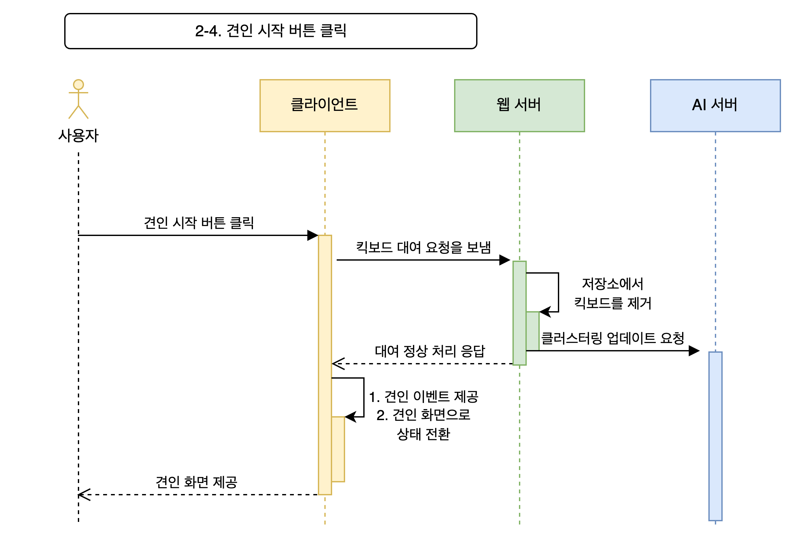

## 소프트웨어 아키텍처

### 소프트웨어 아키텍처 정의
- 높은 수준의 시스템 구조
    - 시스템을 이해하기 위한 중요한 구성 요소만 설계
    - 자세한 수행 과정은 정의하지 않는 추상화
    - 시스템을 수행하기 위한 기술, 프로그래밍 언어는 소프트웨어 아키텍처에 속하지 않음
        - 많은 엔지니어가 오해하는 부분
- 각기 다른 구성 요소와 그 요소들의 관계를 표현하는 것
    - 행위나 API를 정의하는 블랙 박스
- 시스템의 요구 사항과 제약을 만족시켜야 함
    - 모든 요소이 어떻게 결합해야 하는지, 제약 조건과 함께 표현되어야 함

### 추상화 단계는 다양함
- classes / structs
- modules / packages / libraries
- services (processes / groups of processes)

### Software Delevopment Cycle
- Design
    - 아키텍처 설계는 여기에 속함
- Implementation
- Testing
- Deployment 의 반복

### 기능 요구사항 use case와 user flow
- use case
    - situation, scenario를 전부 서술하는 행위
    - 이때 actor를 전부 체크할 것
- user flows
    - **시각화**
    - acter와 server 간 상호작용을 time domain으로 서술할 수 있음 (sequence diagram, UML로 표현)
    - 하나의 use case에 하나의 user flow를 대응시킴
- 우리 프로젝트에서는 : 1. use case를 전부 서술, 2. use case에 중요도를 맥임, 3. 중요도 순으로 user flow를 제작
- 이미지 예시
    