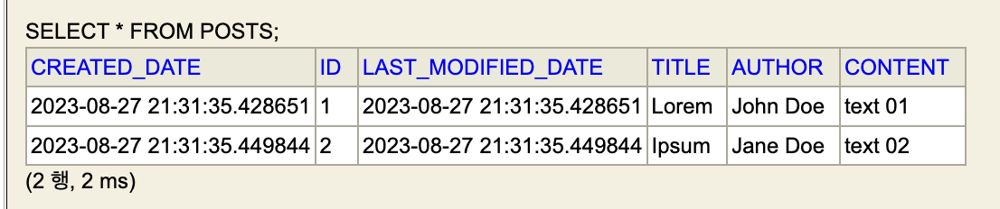

## 스프링 부트와 AWS로 혼자 구현하는 웹 서비스

### 패키지명 이름 규약
- 일반적으로 패키지명은 웹사이트 주소의 역순으로 함
    - 예시. 도메인 네임 `admin.jojoldu.com`
        - 패키지명 `com.jojoldu.admin`

### 클라이언트와 통신에서의 Entity 사용
- Entity 클래스를 Request/Response 클래스로 직접 사용하면 안 됨
    - 데이터베이스와 맞닿은 핵심 클래스기 때문
    - Entity의 스펙이 변경되었을 때 api 사용자, 공급자 양 쪽 모두 곤란함
- 대신에, Entity에 대응하는 **DTO**를 클라이언트와 주고 받도록 구조 변경
    - Dto로 request를 받아내고, dto 스펙에 맞는 json을 response body로 return하는 등 구조를 변경함

### DTO
- Data Transfer Object, **계층 간 데이터 교환을 위한 객체**
- Request와 Response만을 위한 클래스, Dto를 변경해도 Entity 스펙에 영향을 끼치지 않음
- 번외. Dtos
    - Dto들이 존재하는 영역을 의미함

### JPA Auditing
- Spring JPA의 Entity Listener 기본 기능
    - Entity Listener는 엔티티의 변화를 감지하고 테이블의 데이터를 조작하는 일을 수행함
- 엔티티의 Column에 `createdDate`, `lastModifiedDate`를 변경에 추가해 줌
    - `Audit` : 감시하다
- Auditing 적용 방법은 다음과 같음
    1. 메인 애플리케이션 위에 `@EnableJpaAuditing` 추가
        ```java
        @EnableJpaAuditing
        @SpringBootApplication
        public class WebserviceApplication  {
            // ...
        }
        ```
    2. `@CreatedDate`, `@LastModifiedDate`를 받고자 하는 엔티티의 상위 추상 클래스 추가
        ```java
        @Getter
        @MappedSuperclass
        @EntityListeners(AuditingEntityListener.class) 
        public abstract class BaseTimeEntity {
            @CreatedDate 
            private LocalDateTime createdDate;

            @LastModifiedDate 
            private LocalDateTime lastModifiedDate;
        }
        ```
        - `@Getter` 는 취향껏
    3. 사용할 엔티티에 추상 클래스 상속
        ```java
        @Entity
        public class Posts extends BaseTimeEntity {
            // ...
        }
        ```
- 엔티티에 대응하는 테이블에는 다음과 같이 Column이 추가됨
    - 

