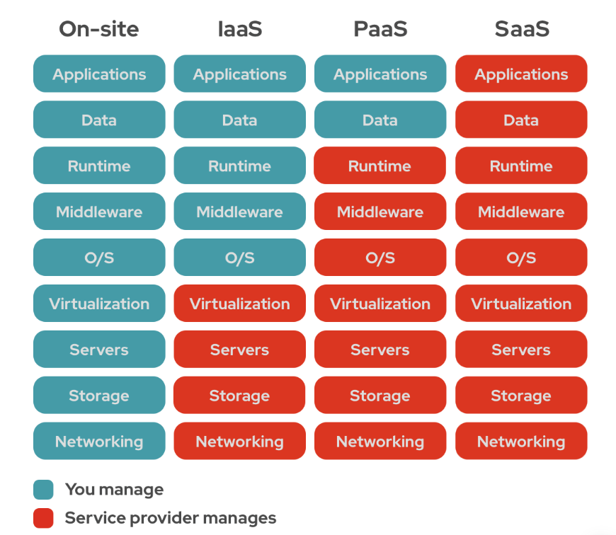

## 스프링 부트와 AWS로 혼자 구현하는 웹 서비스

### 패키지명 이름 규약
- 일반적으로 패키지명은 웹사이트 주소의 역순으로 함
    - 예시. 도메인 네임 `admin.jojoldu.com`
        - 패키지명 `com.jojoldu.admin`

### 클라이언트와 통신에서의 Entity 사용
- Entity 클래스를 Request/Response 클래스로 직접 사용하면 안 됨
    - 데이터베이스와 맞닿은 핵심 클래스기 때문
    - Entity의 스펙이 변경되었을 때 api 사용자, 공급자 양 쪽 모두 곤란함
- 대신에, Entity에 대응하는 **DTO**를 클라이언트와 주고 받도록 구조 변경
    - Dto로 request를 받아내고, dto 스펙에 맞는 json을 response body로 return하는 등 구조를 변경함

### DTO
- Data Transfer Object, **계층 간 데이터 교환을 위한 객체**
- Request와 Response만을 위한 클래스, Dto를 변경해도 Entity 스펙에 영향을 끼치지 않음
- 번외. Dtos
    - Dto들이 존재하는 영역을 의미함

### JPA Auditing
- Spring JPA의 Entity Listener 기본 기능
    - Entity Listener는 엔티티의 변화를 감지하고 테이블의 데이터를 조작하는 일을 수행함
- 엔티티의 Column에 `createdDate`, `lastModifiedDate`를 변경에 추가해 줌
    - `Audit` : 감시하다
- Auditing 적용 방법은 다음과 같음
    1. 메인 애플리케이션 위에 `@EnableJpaAuditing` 추가
        ```java
        @EnableJpaAuditing
        @SpringBootApplication
        public class WebserviceApplication  {
            // ...
        }
        ```
    2. `@CreatedDate`, `@LastModifiedDate`를 받고자 하는 엔티티의 상위 추상 클래스 추가
        ```java
        @Getter
        @MappedSuperclass
        @EntityListeners(AuditingEntityListener.class) 
        public abstract class BaseTimeEntity {
            @CreatedDate 
            private LocalDateTime createdDate;

            @LastModifiedDate 
            private LocalDateTime lastModifiedDate;
        }
        ```
        - `@Getter` 는 취향껏
    3. 사용할 엔티티에 추상 클래스 상속
        ```java
        @Entity
        public class Posts extends BaseTimeEntity {
            // ...
        }
        ```
- 엔티티에 대응하는 테이블에는 다음과 같이 Column이 추가됨
    - 

### fragment css, js 배치 전략
- HTML은 위에서부터 코드가 실행되므로 **header가 다 실행되고서야 body가 실행됨**
- fragment를 `header`와 `footer`로 구성했을 경우 `header`->`(body)`->`footer` 순으로 실행
- 이때, css를 `header`에, js를 `footer`두는 전략을 실행할 것
    - body를 그린 후에 css를 불러오면 깨진 화면을 사용자에게 보여주게 됨
        -> css를 `header`에 배치
    - body 이전에 용량이 큰 js를 불러오면 body 그려오는 게 늦어짐
        -> js를 `footer`에 배치

### Front-end with RestAPI
- Thymeleaf로 클라이언트를 구현한다고 해도, ajax를 통해 api를 받아오도록 설계함
- Model로 데이터를 넘기는 로직은 `findAll()` 만 사용
    - 프론트 분리했을 때를 생각할 것
    - 실무에서는 view all 페이지 별도 작성, get과 쿼리 페이지 넘버링으로 select (`Pageable`)


### 스프링 시큐리티와 OAuth 2.0으로 로그인 기능 구현
> 스프링 부트 2.x.x 기준으로 서술
- OAuth 2.0을 사용하여 다음 기능을 직접 구현하는 걸 생략할 수 있음
    - 로그인 시 보안
    - 회원가입 시 이메일 혹은 전화번호 인증
    - 비밀번호 찾기
    - 비밀번호 변경
    - 회원정보 변경
- 로그인 관련 기능을 SNS 서비스 회사에 맡기고, 주요 기능 개발에 집중할 수 있음
> spring-mvc-2를 듣고 주도적으로 리팩토링 해볼 것

### 세션 저장소로 데이터베이스 사용하기
> 서버를 재시작해도 세션이 풀리지 않도록 세션 저장소를 사용
- 우리가 만든 서비스는 **애플리케이션을 재실행**하면 로그인이 풀림
    - **세션이 내장 톰캣의 메모리에 저장**되어 있기 때문
        - 기본적으로 세션은 실행되는 WAS의 메모리에 저장되고 호출됨
        - 내장 톰캣과 동일하게, 애플리케이션 실행 시 실행되는 구조에선 항상 초기화되는 상황
- 2대 이상의 서버에서 서비스하는 상황에서는, **톰캣마다 세션 동기화** 설정을 해야만 함
- 그래서 실제 현업에서는 세션 저장소에 대해 3가지 솔루션 중 1개를 택함
    1. **톰캣 세션을 그대로** 사용
        - 별다른 설정을 하지 않았을 때 기본으로 선택되는 방식
        - 톰캣(WAS)에 세션이 저장됨, 2대 이상의 WAS가 구동되는 환경에는 톰캣 간 세션 공유 설정이 추가로 필요
    2. **MySQL과 같은 데이터베이스를 세션 저장소로** 사용
        - 여러 WAS 간의 공용 세션을 사용할 수 있는 가장 쉬운 방법
        - 설정이 간단하지만, 성능상 이슈가 발생할 수 있음
            - 로그인 요청마다 DB IO가 발생하기 때문
        - 로그인 요청이 많이 없는 백오피스, 사내 시스템 용도에 사용
    3. Redis, Memcached와 같은 **메모리 DB를 세션 저장소로** 사용
        - B2C 서비스에서 가장 많이 사용하는 방식
        - 실제 서비스로 사용하기 위해서는 Embedded Redis와 같은 방식이 아닌, 외부 메모리 서버가 필요
- `2. 데이터베이스 세션 저장소` 방식 채택
    1. **설정이 간단**하기 때문
    2. 사용자가 많은 서비스가 아니기 때문
        - 로그인 요청이 적음, DB IO 적게 발생
    3. 비용 절감을 위해서
        - `3. 메모리 DB 세션 저장소`를 사용하면 레디스와 같은 서비스(엘라스틱 캐시)에 별도 사용료를 지불해야 함
- 세션 저장소로 jdbc를 사용
    - `build.gradle`: `compileOnly 'org.springframework.session:spring-session-jdbc'`
    - `application.yml` : `spring: session: store-type: jdbc`

### Spring Security를 적용한 테스트 환경
- test는 별도의 `application.properties`가 없으면 main의 설정을 그대로 가져옴
    - 하지만, `application-oauth.properties`, ... 파일은 가져오지 않음
- `application-oauth.yml`에 대응하는 가짜 설정값을 테스트 환경에 적용함

### AWS 서버 환경을 사용한 배포     
- 외부에서 본인이 만든 서비스에 접근하려면 **24시간 작동하는 서버**가 필수임
- 24시간 서버를 작동하는 데에는 3가지 선택지가 있음
    1. 집 PC를 24시간 구동
    2. 호스팅 서비스(Cafe 24, 코리아호스팅 등)을 이용
    3. 클라우드 서비스(AWS, AZURE, GCP 등)을 이용
- 일반적으로는 `1. 집 PC`와 `2. 호스팅 서비스`가 비용이 저렴함
- 특정 시간에만 트래픽이 몰린다면, **유동적으로 사양을 늘릴 수 있는 `3. 클라우드 서비스`가 유리**함
- 이번 서비스에서는 **AWS를 선택**, 이유는 다음과 같음
    - 첫 가입 1년 대부분 서비스가 (제한적) 무료임
    - 클라우드의 기본 지원 기능(모니터링, 로그 관리, 백업, 복구, 클러스터링 등)이 많음
        - 개인, 소규모 팀일 때 개발에 좀 더 집중할 수 있음
    - 많은 기업이 AWS로 이전 중임, AWS 사용 경험이 이직에 도움이 됨
    - 사용자가 많아 국내 자료와 커뮤니티가 활성화됨

### 클라우드 서비스?
- **인터넷(클라우드)을 통해** 서버, 저장소, DB, NW, SW, 모니터링 등의 **컴퓨터 서비스를 제공**하는 것
- 단순히 물리 장비를 대여해주는 것이 아님
    - 예시. AWS EC2는 서버 장비를 대여해 줌
        - 실제로는 로그 관리, 모니터링, 하드웨어 교체, 네트워크 관리 등을 지원함
        - **개발자가 할 일을 AWS가 전부 지원**하는 셈
- 클라우드 서비스에는 3가지 형태가 있음
    - 
    1. **IaaS**, Infrastructure as a Service
        - `소프트웨어`, `애플리케이션, 데이터`, `런타임, 미들웨어, OS`
        - 기존 **물리장비를 미들웨어와 함께 묶어둔 추상화 서비스**
        - 가상머신, 스토리지, 네트워크, 운영체제 등의 IT 인프라를 대여해주는 서비스
        - 예시. AWS EC2, S3
    2. **PaaS**, Platform as a Service
        - `소프트웨어`, `애플리케이션, 데이터`
        - IaaS를 한 번 더 **추상화**한 서비스
        - 한 번 더 추상화했기 때문에 **더 많은 기능이 자동화** 되어있음
            - 런타임, 미들웨어, 운영체제 부분을 클라우드에 맡김
        - 예시. AWS Beanstalk, Heroku
    3. **SaaS**, Software as a Service
        - `소프트웨어`
        - 순수 소프트웨어 서비스를 의미
        - 예시. 구글 드라이브, 드랍박스, 와탭

