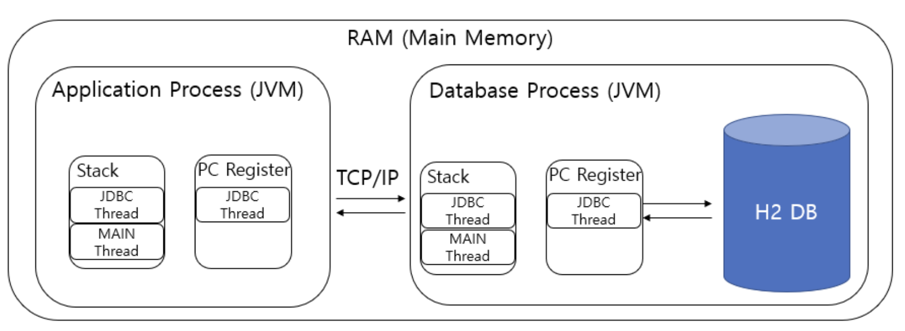
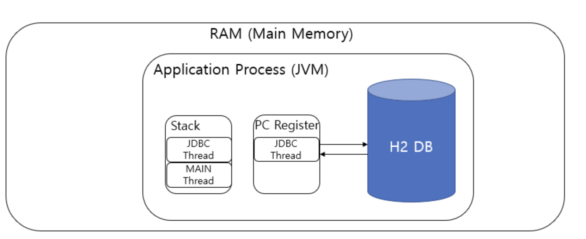

## H2 - 모드

- H2는 세 가지 모드가 존재함
    1. Server Mode
    2. Embedded Mode
    3. In-Memory Mode

|Mode|H2 다운로드 여부|실행 주체|DB 저장 위치|
|--|--|--|--|
|Server Mode|O|별도의 JVM(`java -cp "h2.jar"`)|파일 시스템
|Embedded Mode|X|동일 JVM(스프링)|파일 시스템
|Memory Mode|X|동일 JVM(스프링)|메모리

### Server Mode
- H2 실행 파일이 필요함 (`/bin/h2.sh`)
- **별도의 JVM**을 이용하여 구동함
    - 
- **파일 시스템**을 사용
    - = 영속적으로 사용할 수 있음
    - `test.mv.db`    
- 여러 Application이 H2에 **동시에 접근할 수 있음**
    - Application과는 **TCP/IP 통신**

#### DB 파일 생성
- TCP 접속 전에 먼저 DB 파일을 생성해야 함
    - 예시 파일 경로: `~/GIT-test.mv.db`
    - h2 웹페이지 `JDBC URL: jdbc:h2:~/test`로 접속하여 DB 파일 생성
    - 이후에 `JDBC URL: jdbc:h2:tcp://localhost/~/test`로 접속
        - TCP로 접속하면 성능이 소폭 개선됨

### Embedded Mode
- H2 실행 파일 불필요
- H2를 사용하는 **Application과 동일한 JVM에서 구동**함
    - 예시. 스프링 부트를 실행할 때 H2를 함께 띄움
    - 
- 기본적으로 휘발성 DB, 영속 사용 불가능
    - Embedded Persistence Mode가 별도로 존재
- 외부에서 접근 불가, 특정 Application만을 위한 DB

### In-Memory Mode
- H2 실행 파일 불필요
- H2 DB 데이터를 로컬에 저장하지 않고 **메모리**에만 가지고 있음
- Application이 종료되면 데이터가 모두 손실됨
    - = 영속 사용 불가능
    - One JVM, One DB
- h2 웹페이지 `JDBC URL: jdbs:h2:mem:test`로 접속
    - 사용자명, 비밀번호를 체크하지 않음
- 스프링 부트는 테스트 환경에서 별도 설정 없이 H2 In-Memory Mode로 설정해줌
    - JPA와 함께 빈 `application.*`이 있으면 H2 In-Memory Mode를 사용하도록 자동 설정

### 참고자료
- \[H2\] h2 설치 밎 사용하기, https://jjam89.tistory.com/221
- H2의 Local(In-Memory) 와 Server(TCP) 모드, https://lob-dev.tistory.com/13
- H2 DB의 3가지 모드와 사용법 - Server Mode, Embedded Mode, In-Memory Mode, https://velog.io/@jinny-l/H2-DB의-3가지-모드와-사용법-Server-Mode-Embedded-Mode-In-Memory-Mode

