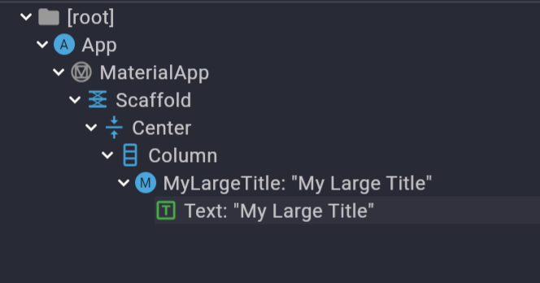

## 플러터 소개
- Dart 언어를 사용하는 크로스 플랫폼 프레임워크

### 플러터는 어떻게 작동하는가? 
- 플러터의 구조는 다음과 같음
    - 
- 플러터는 dart로 작성된 코드를 렌더링 엔진을 사용하여 화면을 그림
    - 작동 방식이 비디오 게임 엔진과 비슷함
        - 앱을 클릭하면 빈 캔버스 화면이 펼쳐짐, 운영체제는 아무것도 하지 않음
        - 운영체제 대신, 플러터 엔진이 UI를 그림
    - 엔진은 C/C++ 기반
    - 또 다른 하나의 가상 머신이라고 생각할 것 (=JVM, Java Virtual Machine)
- 플러터는 컴포넌트를 렌더링하기 위해 운영체제와 직접 소통하지 않음
    - 대신, **엔진을 통해 모든 컴포넌트를 렌더링**함 
- 예시. iOS-style widget을 사용하려면 iOS를 "흉내내야 함"
    - 운영체제와 소통하지 않기 때문에 네이티브를 사용하지 않음

### 플러터 vs React Native
- 안드로이드, iOS 앱 개발 상황을 가정
- 공통점: 크로스 플랫폼 프레임워크 
- 차이점: 
    1. 플러터
        - 세밀한 요구사항이 있고, 애니메이션을 모두 커스터마이징 해야 할 때 유리
        - 나만의 커스터마이징이 필요한 상황
    2. React Native
        - 운영체제의 Native Widget이 필요할 때 유리
        - 호스트 운영체제가 제공하는 UI를 사용하는 상황

## 플러터, Hello world
- dart와 동일하게, main 함수 내 코드를 read
-  main 함수에서 `runApp`함수를 실행, `Widget` 타입 argument가 필요함
    ```dart
    void main() {
        runApp(App()); // runApp function is on "flutter/material.dart"
        // needs argument "Widget"
    }
    class App extends StatelessWidget {
        @override 
        Widget build(BuildContext context) {
            // ... 
        }
    }
    ``` 
    - StatelessWidget을 상속받는 class App을 짜나가며 앱을 디자인해나감
        - `StatelessWidget`은 `Widget build` 메소드를 Override 해야 함
        - `build`는 **`MaterialApp` 또는 `CupertinoApp`을 반환함**
            - `MaterialApp`은 Google style
                - Flutter는 구글이 개발했으므로, Google Style을 선택하는 것은 합리적인 선택
            - `CupertinoApp`은 iOS style
        - `App`의 field를 채워나가며, **Widget block을 조립**해나가는 게 Flutter 설계의 핵심
- 모든 것이 `Widget` 블럭으로 구성되어 있음
    - 주요 Widget은 다음과 같음
        - `MaterialApp()`
            - main widget, should return at method `build`
            - has field `home`
        - `Scaffold()`
            - `MaterialApp()`의 home field Widget
            - **all screen in mobile application needs a scaffold**
            - 건축에서의 비계 역할
            - has field `appBar`, `body`
        - `AppBar()`  
            - `Scaffold()`의 appBar field Widget 
            - has field `title`
        - `Center()`
            - Widget in anywhere
            - aligns `child` Widget center, considering width and height
            - has field `child`
        - `Text()`
            - Widget in anywhere, 
            - prints plain text
        - `Container()`
            - HTML의 `<div>` 태그에 대응
### dart 언어의 특징 
- class를 만들 때마다 인스턴스화 해줌
    - new를 쓸 필요가 없음 `new Appbar()` -> `Appbar()` // okay
- class를 초기화할 때 field argument를 인수로 넘길 수 있음
    - **named parameter**
- 예제. 다음 코드를 일반화할 수 있음
    ```dart
    return MaterialApp(
      home: Scaffold(
        appBar: AppBar(),
      ),
    );
    ```
- 위 코드는 일반 언어에서 다음과 같음
    ```dart
    return new MaterialApp( // MaterialApp(home), this.home = new Scaffold();
        new Scaffold(   // Scaffold(appBar), this.appBar = new Appbar();
            new Appbar() // 
        )
    );
    ```
- named parameter
    - class를 선언할 때 nullable을 지정할 수 있음
        - nullable로 지정하면 parameter로 받지 않아도 됨
            `Clazz? clazz`
```dart
(new) Text Text(
  String data,
  Key? key,
  TextStyle? style,
  // ...
);
```
- 다음 코드에서 `String data`는 선언자에서 필수로 지정해야 할 parameter, `Key? key` 등은 nullable parameter


### 파란 줄(권장 코드 스타일)이 뜨는 이유
- 파란 줄의 설명 문구는 다음과 같음
    - `Prefer const with constant constructors.`
- `const`는 수정할 수 없고, compile 전에 value를 알 수 있는 변수임
- const가 붙은 변수는 컴파일 시점에서 재사용시 대체되어, 앱 동작에 성능 최적화가 이루어짐
    ```dart
    const a = 15;
    const b = 30;
    var c_before = a + b;
    // ->
    var c_after = 15 + 30;
    ```
- 자동으로 const를 달아주는 VSCode 기능을 사용
    - `settings.json`에 다음 문구를 추가
        ```json
            "editor.codeActionsOnSave": {
                "source.fixAll": true
            },
        ```
- 번외. Widget간 child 구분을 위해 다음 문구를 추가
    ```json
        "dart.previewFlutterUiGuides": true,
    ```
### Code Actions
- 예시. 
    - Padding을 감싸야 하는 상황
    - Container로 새 division을 만들고 싶은 상황
    - 최상위로 감싸는 widget을 제거하고픈 상황
    - Widget을 클래스로 추출하고 싶은 상황
- 노란 전구를 클릭해 Code Actions를 사용하면 간편함
    - 
- VSCode 단축키: `Command + .`
    - cf. Intellij `Option + .`

### Stateful Widget
- `Stateless Widget`은 build 메서드를 통해 단지 UI를 출력할 뿐임
- `Stateful Widget`은 상태를 가지고 있어서 Stateful이라고 불림
    - 상태에 따라 변하게 될 데이터를 생각할 수 있을 거임
    - 데이터가 변경될 때 변화를 UI로 확인하고 싶을 때 사용
- 용도는 다음과 같음
    1. `Stateful Widget`
        - 위젯에 데이터를 저장하고 싶을 때
        - 실시간으로 데이터의 변화를 보고싶을 때
    2. `Stateless Widget`
        - 아무런 데이터를 가지고 있지 않음
        - 그저 UI만을 가지고 있음
- `Stateful Widget`의 구조
    - 두 부분으로 나누어짐
        1. 상태가 없는 위젯 그 자체
            - 매우 작고, 곧 보게 될 것임
        2. 위젯의 상태
            - 위젯의 state는 위젯에 들어갈 데이터와 UI를 넣는 곳임
            - 데이터가 변경되면 해당 위젯의 UI도 변경된다는 점이 흥미로움
- `IconButton` Widget, `OnClicked` 메서드를 다음과 같이 추가함
    ```dart
    void onClicked() {
        setState(() {
            counter++;
        });
    }
        // ...
        IconButton(
            onPressed: onClicked,
            icon: const Icon(Icons.add_box_rounded),
        ),
        // ...
    ```
- **`setState` 함수를 사용**하여 데이터를 전달
    - = `State` 클래스에게 데이터가 변경되었다고 알리는 함수
    - 기본적으로, **build 메서드를 재실행**하는 기능을 가짐
        - `const` 키워드 요소들은 다시 렌더링되지 않음
    - 규약: 데이터 변경 코드는 setState 함수 안에 넣을 것
        - 변경된 데이터를 명확하게 파악하기 위해서임
        - 넣지 않아도, 렌더링을 위한 setState도 가능
- **`setState` 함수를 호출하지 않으면 build 메서드는 재실행되지 않을 것임**
    - Flutter는 **lazy** 하기 때문

### Buildcontext context
- context는 이전에 있는 모든 상위 요소들에 대한 정보임
- 예시. `MyLargeTitle` 메서드에 조상 `MaterialApp`이 있는 상황
    - 
    - MaterialApp theme 필드에 textTheme.titleLarge.color를 설정함
        ```dart
        return MaterialApp(
          theme: ThemeData(
            textTheme: const TextTheme(
              titleLarge: TextStyle(
                color: Colors.red,
              ),
            )
          ),
          home: Scaffold(
          // ...  
        ```
    - `MyLargetTitle` 에서 `MaterialApp`의 theme에 접근하려면 다음과 같이 필드를 작성
        - `Theme.of(context)`로 theme 필드의 `ThemeData`를 꺼내다 씀
        ```dart
        style: TextStyle(
          color: Theme.of(context).textTheme.titleLarge!.color,
          fontSize: 30,
        ),
        ```
        - `MaterialApp.theme` === `Theme.of(context)`
        - 이때, dart는 null-safe 언어기 때문에 titleLarge의 null 여부를 인지시킴
            - not null임을 확신시킴 -> `titleLarge!`
            - not null이면 값을 대입 -> `titleLarge?`

### Widget의 LifeCycle
1. `initState()`
    - **build 이전에 호출**되는 메서드
        - 부모 요소에 의존하는 데이터를 초기화하는 경우
        - api에서 업데이트를 구독하고자 하는 경우
    - LifeCycle에서 한 번만 실행됨
2. `build()`
    - UI를 만드는 메서드
    - state 변경점에 따라 여러 번 실행 될 수 있음
3. `dispose()`
    - UI가 스크린에서 **사라질 때 호출**되는 메서드
    - LifeCycle에서 한 번만 실행됨
