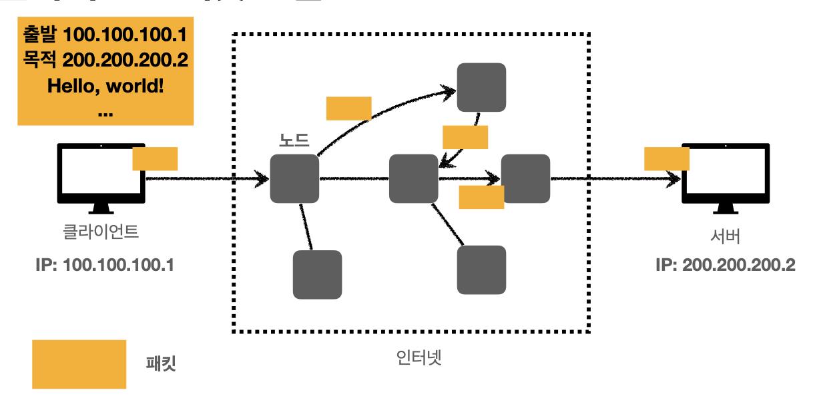

## 목차

1. 인터넷과 네트워크
2. URI와 웹 브라우저 요청 흐름
3. HTTP 기본
4. HTTP 메서드
5. HTTP 메서드 활용
6. HTTP 상태 코드
7. HTTP 헤더 - 자주 사용하는 헤더들
8. HTTP 헤더 - 캐시와 조건부 요청

---
## Sect01. 인터넷과 네트워크

- 웹이나 http도 인터넷, 네트워크 기반으로 동작하기 때문에 배움
- 두 대가 붙어있으면 선 하나로 통신함
- 만약 두 컴퓨터가 멀리 떨어져 있으면, 노드를 통해 메시지가 안전하게 가야 함
- 그렇다면, 이 복잡한 인터넷 노드를 어떻게 거쳐서 가는 걸까?

### IP, 인터넷 프로토콜
- 메시지를 보내기 위한 규칙, IP 주소를 부여받아 움직임
- 패킷(Packet)이라는 통신 단위로 데이터 전달



- 인터넷 프로토콜 만으로는 **세 가지 문제**를 해결할 수 없음
    - 비연결성
    - 비신뢰성
    - 프로그램 구분

### TCP
- **전송 제어 프로토콜**(Transmission Control Protocol)
- 인터넷 프로토콜의 한계를 해결하기 위해 만들어짐
- IP만으로 해결이 안 됐던 전송 제어, 순서, 검증 정보 등이 들어있음

- 연결 지향 > TCP 3 way handshake
    - 
- 데이터 전달을 보증함
    1. 데이터가 전송되었음을 보증
    2. 데이터 잘 받았음을 보증
- 패킷 순서를 보장함
    - 서버에서 패킷 순서에 맞게 다시 보내도록 클라이언트에 요청함
- 신뢰할 수 있는 프로토콜이고, 현재 대부분 TCP를 사용함

### UDP
- 사용자 데이터그램 프로토콜(User Datagram Protocol)
- 아무런 기능이 없음, 하얀 도화지에 많이 비유함
- IP와 기능이 거의 같고, PORT와 체크섬 정도만 추가됨
- 애플리케이션 레벨에서 추가 검증 작업이 필요함
    - 3 way handshake X -> 커스텀 가능
    - 데이터 전달 보증 X -> 커스텀 가능
    - 순서 보장 X -> 커스텀 가능

### PORT
- (영어 뜻: 항구)
- 한 서버에 게임, 화상통화, 웹 브라우저 요청 등의 **프로세스를 구분**하기 위해 PORT를 도입
- IP: 목적지 **서버를 찾는 것** in IP 패킷
- PORT: 서버 **안의 애플리케이션을 구분**하는 것 in TCP 세그먼트

- IP가 아파트라면, PORT는 n동 m호

### PORT 구현
- 0~65535 할당 가능
- 0~1023: 잘 알려진 포트, 사용하지 않는 것이 좋음

### DNS
- IP의 문제점
    - IPv4를 기억하기 어려움
    - IP는 변경 가능함
- Domain Name System
- 전화번호부에 비유, 도메인 명을 IP 주소로 변환
- **DNS 서버**에 기억하기 쉬운 도메인 명을 요청하고, IP 주소를 반환받음


--- 
## Sect02. URI와 웹 브라우저 요청 흐름

### URI
- Uniform Resource Identifier, 리소스를 식별하는 통합환경?
- URI, URL, URI의 차이는?

- URL: 리소스의 위치
- URN: 리소스의 이름, 거의 쓰지 않음


### URI의 단어 뜻
- Uniform: 리소스를 식별하는 통일된 방식
- Resource: 자원, URI를 식별할 수 있는 **모든** 것
- Identifier: 구분하기 위한 식별 정보

- URL > Locater : 리소스가 있는 위치를 지정
- URN > Name : 리소스에 이름을 부여
    - 예시. urn:isbn:8960777331
    - URN 이름만으로 실제 리소스를 찾을 수 있는 방법이 보편화 되지 않음

### URL 전체 문법

```
scheme://[userinfo@]host[:port][/path][?query][#fragment]

https://www.google.com:443/search?q=hello&hl=ko
```
- 프로토콜(https)
    - https는 http에 보안을 추가한 프로토콜
- 호스트명(www.google.com) 
    - 도메인명 또는 IP주소를 직접 사용 가능
- 포트 번호(443)
    - 접속 포트, 일반적으로 생략함, 생략시 http=80, https=443
- 패스(/search)
    - 리소스 경로(path), 계층적 구조로 설계
    - 예시. /members/iphone12
- 쿼리 파라미터(q=hello&hl=ko)
    - key=value 형태
    - ?로 시작, &로 추가 기능 
    - 예시. ?keyA=valueA&keyB=valueB
    - 쿼리 파라미터, 쿼리 스트링 등으로 부름
- fragment(#fragment)
    - html 내부 북마크 등에 사용함
    - 서버에 전송되지 않음

### 웹 브라우저 요청 흐름
- 클라이언트가 https://www.google.com/search?q=hello&hl=ko 를 주소창에 입력한 상황

1. HTTP 요청 메시지를 생성
    ```http
    GET /search?q=hello&hl=ko HTTP/1.1 
    Host: www.google.com
    ```
2. 해당 HTTP 메시지를 포함한 TCP/IP 패킷을 생성
    - TCP/IP 패킷은 출발지 IP&PORT, 목적지 IP&PORT, 전송 데이터를 포함

3. 요청 패킷을 구글 서버에 전달
4. 구글 서버는 HTTP 응답 메시지를 생성
    ```http
    HTTP/1.1 200 OK
    Content-Type: text/html;charset=UTF-8 
    Content-Length: 3423

    <html> 
        <body>...</body>
    </html>
    ```
5. 응답 패킷을 클라이언트에 전달
6.HTTP 응답 메시지를 받은 클라이언트는 웹 브라우저로 HTML 렌더링을 함


## Sect03. HTTP 기본

### HTTP로 할 수 있는 모든 것

- HyperText Transfer Protocol
- HTML, TEXT, Image, 음성, 영상 JSON, XML **모든 형태**의 데이터를 전송 가능
- 서버 간에 데이터를 주고 받을 때도 HTTP 프로토콜로 사용!
- **지금은 HTTP 시대!**
- HTTP/1.1 : 1997년 출시, 가장 많이 사용
- HTTP/2,/3 : 성능 개선

### 기반 프로토콜
- **TCP**: HTTP/1.1, HTTP/2
- **UDP**: HTTP/3
- 현재 HTTP/1.1을 주로 사용함, /2, /3도 증가하는 추세

### HTTP 특징
- 클라이언트 서버 구조로 동작
- 무상태(stateless) 프로토콜, 비연결성
- HTTP 메시지를 주고받음
- 굉장히 단순하며, 확장 가능함

### 특징 1. 클라이언트 서버 구조
- Request, Response 구조
- 클라이언트와 서버를 분리함
- 클라이언트는 서버에 **요청을 보내고**, 응답을 **대기**
    - 클라이언트는 UI/UX에만 집중
- 서버는 **요청에 대한 결과**를 만들어서 **응답**
    - 서버는 아키텍처, 트래픽 등만을 고민함

### 특징 2. 무상태 프로토콜 지향
- 서버가 클라이언트의 상태를 보존하지 않음

- stateful 예제, 점원이 교체되면 장애가 발생함
    - 고객 : 이 **노트북** 얼마인가요?
    - 점원A : 100만원 입니다. 몇개 구매하시나요? (A는 노트북 **상태를 유지**)
    - 고객 : **2개** 구매할게요.
    - 점원B : 무엇을 2개 구매하시나요? (서버 교체로 장애 발생, state 초기화)

- stateless 예제, 점원이 교체되어도 아무 문제가 없음
    - 고객 : 이 **노트북** 얼마인가요?
    - 점원A : 100만원 입니다. 몇개 구매하시나요? 
    - 고객 : **노트북 2개** 구매할게요. (**상태를 유지하지 않음을 가정**)
    - 점원B : 노트북 2개는 200만원입니다. 신용카드 쓰시겠어요? 
    - 고객 : **노트북 2개 신용카드**로 구매할게요.
    - 점원C: 200만원 결제 완료되었습니다. 

- 무상태 장점
    1. 중간에 다른 점원으로 바뀌어도 됨
    2. 응답 서버를 쉽게 바꿀 수 있음 -> **서버를 필요하다면 무한히 증설 가능**
        > 스케일 아웃 - 수평 확장에 유리함
- 무상태의 실무적 한계
    - 상태 유지해야 하는 로그인 기능은 어떻게 구현하는가?
    > 서버 세션, 쿠키를 사용

> 최대한 무상태로 설계, 어쩔 수 없을 때 상태를 유지하도록 구현

### 특징 3. 비 연결성(connectionless)
- 연결을 유지하는 모델은 서버 자원을 지속적으로 소모함

- 연결을 유지하지 않는 모델은 응답 이후로 연결을 종료, 최소한의 자원을 유지함


- 1시간 동안 수천명이 서비스를 사용해도 
- 실제 **서버에서 동시에 처리하는 요청**은 **수십개 이하**로 매우 작음
- 비 연결성으로 생기는 한계점
    - TCP/IP 연결을 새로 맺어야 함 - 3 way handshake 시간 추가
    - 사이트를 요청하면 자바스크립트, css, 추가 이미지 등등 수 많은 자원이 함께 다운로드
        - 지금은 HTTP 지속 연결(Persistent Connections)로 문제 해결

- 서버 개발자들이 어려워하는 업무는 정말 같은 시간에 딱 맞추어 발생하는 대용량 트래픽임
    - 예시. 저녁 6:00 선착순 1000명 치킨 할인 이벤트 -> 수만명 동시 요청
> 이런 서비스를 포트폴리오로 구현한다면?

### HTTP 메시지

- HTTP 요청/응답 메시지의 구조는 다음과 같음


- **공백 라인(CRLF)이 header와 body 사이에**이 있어야 함!

1. 시작 라인
    - 요청 메시지 `GET /search?q=hello&hl=ko HTTP/1.1`
        - HTTP 메서드 : GET, POST, PUT, DELETE
        - 요청 대상 : 절대경로[?쿼리]
        - HTTP Version
    - 응답 메시지 `HTTP/1.1 200 OK`
        - HTTP 버전
        - HTTP 상태 코드: 200:성공, 400:클라이언트 오류, 500:서버 오류
        - 이유 문구: 사람이 읽을 수 있는 짧은 설명 문구
 
2. HTTP 헤더
    - header-field = field-name ":" OWS field-value OWS 
    > OWS: 띄어쓰기 허용
    - HTTP 전송에 필요한 모든 부가정보(메타 데이터)가 들어 있음
        - 메시지 바디 내용, 바디 크기, 압축, 인증, 클라이언트 정보, 서버 앱 정보, 캐시 정보, ...
    - 필요하면 임의의 헤더를 추가할 수 있음

3. CRLF
    - 한 줄 띄어주기!

4. 메시지 바디
    - 실제 전송할 데이터
    - HTML 문서, 이미지, 영상, JSON 등등 byte로 표현할 수 있는 모든 데이터 전송 가능

## Sect04. HTTP 메서드

### HTTP API를 만들어보자
- 요구사항: 회원 정보를 관리하는 API를 만들어라

|기능|URI 설계|
|--|--|
|회원 목록 조회|
|회원 조회|
|회원 등록|
|회원 수정|
|회원 삭제|

### 첫 URI 설계

|기능|URI 설계|
|--|--|
|회원 **목록 조회**|/read-member-list
|회원 **조회**|/read-member-by-id
|회원 **등록**|/create-member
|회원 **수정**|/update-member
|회원 **삭제**|/delete-member

- 한계: **리소스를 식별**할 수 있게 URI를 설계해야 함
    - 리소스라는 의미가 무엇인가?
    - 회원을 등록하고 수정하는 기능이 리소스가 아님
    - **회원**이라는 **개념 자체**가 리소스임!
    - **회원이라는 리소스만 식별하면 됨 -> 회원 리소스를 URI에 매핑**

- 리소스로만 URI를 표현할 수 없을 때 컨트롤 URI를 사용하기도 함
- 예시. `POST /orders/{orderId}/start-delivery`

### Refactor: 리소스 식별, URI 계층 구조 활용

> 참고: 계층 구조상 상위를 컬렉션으로 보고 복수 단어 사용을 권장함(member -> members)

|기능|URI 설계|
|--|--|
|**회원** 목록 조회|/members
|**회원** 조회|/members/{id}
|**회원** 등록|/members/{id}
|**회원** 수정|/members/{id}
|**회원** 삭제|/members/{id}

- 리소스와 행위을 **분리**하자! 가장 중요한 것은 리소스를 식별하는 것
- 리소스는 명사, 행위는 동사
- 한계: 행위(메서드: 조회, 등록, 수정, 삭제)는 어떻게 구분할 것인가?
    - HTTP 메서드를 활용할 것!

### HTTP 메서드

|HTTP 메서드|사용처|
|--|--|
|**GET**| 리소스 조회
|**POST**| 요청 데이터 처리, 주로 등록에 사용 
|PUT| 리소스를 대체(주로 파일), 해당 리소스가 없으면 생성 
|PATCH| 리소스를 부분적으로 변경
|DELETE| 리소스 삭제
|HEAD| GET과 동일하지만 메시지 부분을 제외하고 상태줄과 헤더만 반환함
|...|...

### GET - HTTP 메서드 

- 리소스 조회
- 서버에 전달하고 싶은 데이터는 쿼리(쿼리 파라미터, 쿼리 스트링)를 통해서 전달
- 메시지 바디로 데이터를 보낼 수 있지만, 매우 권장하지 않음

1. **클라이언트**의 GET 메시지 전달 
    ```http
    GET /members/100 HTTP/1.1 
    Host: localhost:8080
    ```
2. **서버**에서의 내부 조회
    ```json
    {
        "username": "young",
        "age": 20 
    }
    ```
3. 서버로부터의 **response**
    ```http
    HTTP/1.1 200 OK 
    Content-Type: application/json 
    Content-Length: 34

    {
        "username": "young", 
        "age": 20
    }
    ```

### POST - HTTP 메서드

- 요청 데이터를 처리할 때 사용
    1. 새 리소스 생성(등록)
        - 서버가 아직 식별하지 않은 새 리소스 생성
    2. 요청 데이터 처리
        - 단순 데이터 생성, 변경이 아닌 서버에서 프로세스를 처리해야 하는 경우
        - 예시. 결제 완료 -> 배달 시작 -> 배달 완료 처럼 프로세스 상태가 변경될 때
        - 새 리소스가 생성되지 않을 수 있음
    3. 다른 메서드로 처리하기 애매한 경우
        - 예시. JSON으로 조회 데이터를 넘겨야 하는데 GET은 애매한 사용하기 힘들 때
        - 애매하면 POST

1. **클라이언트**의 POST 메시지 전달
    ```http
    POST /members HTTP/1.1 
    Content-Type: application/json

    {
        "username": "young", 
        "age": 20
    }
    ```
2. **서버**의 신규 리소스 생성
    > /members/100 신규 리소스 식별자 생성
    ```json
    {
        "username": "young",
        "age": 20 
    }
    ```
3. 서버로부터의 **response**
    ```http
    HTTP/1.1 201 Created 
    Content-Type: application/json 
    Content-Length: 34
    Location: /members/100

    {
        "username": "young", 
        "age": 20
    }
    ```

### PUT - HTTP 메서드

- 리소스를 갈아치움, overwrite
- 특징
    - **클라이언트가 리소스를 식별**함, POST와 구분되는 점
    - 리소스를 완전히 대체함, 부분 변경은 PATCH 사용
    ```http
    PUT /members/100 HTTP/1.1 
    Content-Type: application/json

    {
        "username": "hello", 
        "age": 20
    }
    ```
> client가 /members/100 리소스 식별자를 알고있음

1. 클라이언트의 PUT 메시지 전달
    ```http
    PUT /members/100 HTTP/1.1 
    Content-Type: application/json

    {
        "age": 50
    }
    ```
2. 서버의 리소스 식별
    > /members/100
    ```json
    {
        "username": "young", 
        "age": 20
    }
    ```
3. 서버의 리소스 **대체**
    > /members/100
    ```json
    {
        "age": 50
    }
    ```


### PATCH - HTTP 메서드

- 리소스의 부분적 데이터 수정
- 간혹 PATCH를 지원하지 않는 서버도 있음, 지원하지 않으면 POST 권장

1. 클라이언트의 PATCH 메시지 전달
    ```http
    PATCH /members/100 HTTP/1.1 
    Content-Type: application/json

    {
        "age": 50
    }
    ```
2. 서버의 리소스 식별
    > /members/100
    ```json
    {
        "username": "young", 
        "age": 20
    }
    ```
3. 서버의 리소스 **부분 변경**
> /members/100
    ```json
    {
        "username": "young", 
        "age": 50
    }
    ```
- 이외에도 DELETE HTTP 메서드는 리소스를 제거함

### HTTP 메서드의 속성
- HTTP 메서드별 특징 (안전, 멱등, 캐시 가능)


1. 안전(Safe Methods)
    - 호출해도 리소스를 변경하지 않는가?
    > 리소스에 대해서만 안전한지를 고려함, 로그가 쌓여서 생기는 장애 등은 고려하지 않음
2. 멱등(Idempotent Methods)
    - 몇 번을 호출하든 결과가 똑같아야 함

|HTTP 메서드|멱등인가?|
|--|--|   
|GET| 한 번 조회하든, 두 번 조회하든 같은 결과가 조회된다.
|PUT| 결과를 대체한다. 따라서 같은 요청을 여러번 해도 최종 결과는 같다. 
|DELETE| 결과를 삭제한다. 같은 요청을 여러번 해도 삭제된 결과는 똑같다. 
|**POST**| **멱등이 아니다!** 두 번 호출하면 같은 결제가 중복해서 발생할 수 있다.

- 메서드가 멱등해야만 자동 복구 메커니즘을 사용할 수 있음
    - 서버가 TIMEOUT 등으로 정상 응답을 못주었을 때, 클라이언트가 같은 요청을 다시 해도 되는가?

> 멱등은 외부 요인으로 중간에 리소스가 변경되는 것 까지는 고려하지는 않음

3. 캐시 가능(Cacheable)

- 응답 결과 리소스를 캐시해서 사용해도 되는가?
- 실무에서는 GET, HEAD정도만 캐시 가능
- POST, PATCH는 본문 내용까지 캐시 키로 고려해야 해서 구현이 쉽지 않음

--- 

## Sect05. HTTP 메서드 활용

- 클라이언트에서 서버로 데이터를 전달하는 방식은 2가지가 있음
    - 쿼리 파라미터를 통한 데이터 전송
        - METHOD: GET
        - 주로 정렬 필터
    - 메시지 바디를 통한 데이터 전송
        - METHOD: POST, PUT, PATCH
        - 회원 가입, 상품 주문, 리소스 등록, 리소스 변경

### 정적 데이터 조회
> 이미지, 정적 텍스트 문서
- **GET** 사용
-  일반적으로 쿼리 파라미터 없이 **리소스 경로**로 단순하게 조회 가능

1. 클라이언트
    ```http
    GET /static/star.jpg HTTP/1.1 
    Host: localhost:8080
    ```
2. 서버
    > /static/star.png
    ```http
    HTTP/1.1 200 OK 
    Content-Type: image/jpeg 
    Content-Length: 34012

    lkj123kljoiasudlkjaweioluywlnfdo912u34ljko98udjklaslkjdfl;qkawj9;o4ruawsldkal;skdjfa;ow9ejkl3123123
    ```

### 동적 데이터 조회
> 주로 검색, 게시판 목록에서 정렬 필터(검색어)
- **GET** 사용
- 조회 조건을 줄여주는 필터, 조회 결과를 정렬하는 정렬 조건에 주로 사용
- **쿼리 파라미터**를 사용하여 데이터를 전달

```http
GET /search?q=hello&hl=ko HTTP/1.1 
Host: www.google.com
```

### HTML Form 데이터 전송
> 회원 가입, 상품 주문, 데이터 변경

- GET, POST만 지원, Content-Type: application/x-www-form-urlencoded 사용

1. 클라이언트 웹 브라우저
    ```html
    <form action="/save" method="post"> 
        <input type="text" name="username" /> <input type="text" name="age" /> <button type="submit">전송</button>
    </form>
    ```
    > `<form method="get">` 으로 두면 시작 라인에 쿼리 파라미터를 두고 GET 메소드 제출
2. 클라이언트 HTTP 메서드
    - 쿼리 파라미터와 거의 동일한 방식으로 바디를 담아 서버에 전송함
    ```http
    POST /save HTTP/1.1
    Host: localhost:8080
    Content-Type: application/x-www-form-urlencoded

    username=kim&age=20
    ```

- 기본 형식은 `<form enctype="application/x-www-form-urlencoded">`
- 이미지, 파일 등 바이너리 데이터를 같이 전송하려면 `<form enctype="multipart/form-data">`
    ```http
    POST /save HTTP/1.1
    Host: localhost:8080
    Content-Type: multipart/form-data; boundary=-----XXX 
    Content-Length: 10457

    ------XXX
    Content-Disposition: form-data; name="username"

    kim
    ------XXX
    Content-Disposition: form-data; name="age"

    20
    ------XXX
    Content-Disposition: form-data; name="file1"; filename="intro.png" Content-Type: image/png

    s109238a9o0p3eqwokjasd09ou3oirjwoe9u34ouief... 
    ------XXX--
    ```

### HTTP API 데이터 전송
> 서버 to 서버, 앱 클라이언트, 웹 클라이언트(Ajax)에 사용

- `Content-Type: application/json`로 맞춘 후 데이터를 넘김 (**라이브러리** 사용)
- **백엔드 서버끼리 통신**하는 상황, 앱 클라이언트, ajax 통신에서 자주 사용
- POST, PUT, PATCH: 메시지 바디를 통해 데이터 전송
- GET: 조회, 쿼리 파라미터로 데이터 전달

### HTTP API 설계 예시

1. HTTP API - 컬렉션
    - **POST 기반 등록**
    - 예시. 회원 관리 API 제공 
2. HTTP API - 스토어
    - **PUT 기반 등록**
    - 예시. 정적 컨텐츠 관리, 원격 파일 관리
3. HTML FORM 사용
    - 웹 페이지 회원 관리
    - GET, POST만 지원

### POST 기반 등록과 컬렉션

> 회원 관리 시스템 API 설계

|기능|URI 설계|HTTP 메서드|
|--|--|--|
|**회원** 목록 조회|/members|GET
|**회원** 조회|/members/{id}|GET
|**회원** 등록|/members/{id}|POST
|**회원** 수정|/members/{id}|**PATCH**, PUT, **POST**
|**회원** 삭제|/members/{id}|DELETE


- 회원 등록: **POST** 기반 설계
    - 클라이언트는 등록될 리소스의 URI를 모름 `/members`
    - 서버가 신규 리소스 식별자를 결정, 생성함
    - 서버는 response로 Location을 돌려줌 `/memebers/100`

- 컬렉션(Collection)
    - 서버가 관리하는 리소스 디렉토리
    - 서버가 리소스의 URI를 생성하고 관리 // POST
    - 예제에서 컬렉션은 `/members`

### PUT 기반 등록과 스토어

> 파일 관리 시스템 API 설계 

|기능|URI 설계|HTTP 메서드|
|--|--|--|
|**파일** 목록|/files|GET
|**파일** 조회|/files/{filename}|GET
|**파일** 등록|/files/{filename}|**PUT**
|**파일** 삭제|/files/{filename}|DELETE
|**파일** 대량 등록|/files|POST

- 파일 등록: **PUT** 기반 설계
    - 클라이언트가 리소스 URI를 알고 있어야 함 // PUT
    - `PUT /files/star.jpg`
    - 클라이언트가 직접 리소스의 URI를 지정해야 함 

- 스토어(Store)
    - 클라이언트가 관리하는 리소스 저장소
    - 클라이언트가 리소스의 URI를 알고 관리
    - 예제에서 스토어는 `/files`
 
### Refactor: HTML FORM 사용
> 회원 관리 시스템 API 설계

- HTML FORM은 GET, POST만 지원함
- 따라서 모든 기능을 GET, POST 메소드만으로 구현해보자!

|기능|URI 설계|HTTP 메서드|
|--|--|--|
|**회원** 목록|/members|GET
|**회원** 등록 폼|/members/new|GET
|**회원** 등록 제출|/members/new|POST
|**회원** 조회|/members/{id}|GET
|**회원** 수정 폼|/members/{id}/edit|GET
|**회원** 수정 제출|/members/{id}/edit|POST
|**회원** 삭제|/members/{id}/delete|POST

- **컨트롤 URI**
    - GET, POST로만 사용하기에는 제약이 있음
    - 리소스로만 해결할 수 없는 피치 못한 상황에서 **동사로 된 리소스 경로**를 사용
    - POST의 `/new`, `/edit`, `/delete`가 컨트롤 URI

### URI 설계 개념 정리

- 문서(document)
    - 단일 개념(파일 하나, 객체 인스턴스, 데이터베이스 row)
    - `/members/100`, `/files/star.jpg`
- 컬렉션(collection)
    - **서버가 관리**하는 리소스 디렉터리
    - **서버가 리소스의 URI를 생성**하고 관리 
    - `/members`
- 스토어(store)
    - **클라이언트가 관리**하는 자원 저장소
    - 클라이언트가 리소스의 URI를 **알고** 관리 
    - `/files`
- 컨트롤러(controller), 컨트롤 URI
    - 문서, 컬렉션, 스토어로 해결하기 어려운 **추가 프로세스** 실행 
    - **동사**를 직접 사용
    - `/members/{id}/delete`

> 다양한 설계 예제: https://restfulapi.net/resource-naming

---

## Sect06. HTTP 상태 코드

> HTTP 응답 메시지 시작 라인 `HTTP/1.1 200 OK`

- response에서, request의 처리 상태를 알려주는 기능

|상태 코드|메시지|
|--|--|
|1xx (Informational)| 요청이 수신되어 처리중
|2xx (Successful)| 요청 정상 처리
|3xx (Redirection)| 요청을 완료하려면 추가 행동이 필요
|4xx (Client Error)| 클라이언트 오류, 잘못된 문법등으로 서버가 요청을 수행할 수 없음 
|5xx (Server Error)| 서버 오류, 서버가 정상 요청을 처리하지 못함

- 모르는 상태 코드가 나타나도 상위 상태코드(백의 자리)로 해석하여 처리함

### 2xx - 성공

- 팀 내부에서 클라이언트 코드 사용 가짓수를 정해놓고 쓰는 편 

- **200 OK**
    ```http
    HTTP/1.1 200 OK 
    Content-Type: application/json 
    Content-Length: 34

    {
        "username": "young", 
        "age": 20
    }
    ```

- **201 Created**
    - POST로 리소스를 생성할 때 사용
    - 생성된 리소스는 응답의 헤더 필드 Location: 으로 식별
    ```http
    HTTP/1.1 201 Created 
    Content-Type: application/json 
    Content-Length: 34
    Location: /members/100

    {
        "username": "young", 
        "age": 20
    }
    ```

- 202 Accepted
    - 요청이 접수되었으나 처리가 완료되지 않았음
    - 배치 처리같은 곳에 사용
    - 예시. 요청 접수 후 1시간 뒤에 배치 프로세스가 요청을 처리할 때

- 204 No Content
    - 요청을 성공적으로 수행했지만, 응답 본문에 보낼 데이터가 없을 때
    - 예시. 웹 문서 편집기에서 save 버튼을 눌렀을 때
        - save 버튼을 눌러도 같은 화면을 유지해야 함
        - 결과 내용이 없어도 204 메시지만으로 성공을 인식할 수 있음

### 3xx - 리다이렉션
- 요청을 완료하기 위해 클라이언트 프로그램의 추가 조치가 필요한 상황

- 웹 브라우저는 3xx 응답 결과에 Location 헤더가 있으면, Location 위치로 자동 이동함(리다이렉트)
- 예시. 예전 이벤트 페이지 URL에 접근했을 때 자동 리다이렉트 흐름

- redirection 종류에는 세 가지가 있음
    - 영구 리다이렉션
        - 특정 리소스의 URI가 영구적으로 이동하 ㄴ상황
    - 일시 리다이렉션
        - 잠깐 이동시킬 때, 주문 완료 후에 주문 내역 화면으로 이동
        - **PRG 패턴**: Post/Redirect/Get
    - 특수 리다이렉션
        - 캐시 기간을 검증하기 위한 통신

#### 301, 308 - 영구 리다이렉션
- 실무에서는 웬만하면 301, GET으로 돌려 리다이렉트함
- 원래 URL을 사용하지 않음, 검색 엔진 봇에서도 변경을 인지할 수 있음

- **301 Moved Permanently**(Default)
    - 요청 메서드가 GET으로 변하고, 본문이 제거될 수 있음
    
    - 1. **GET**으로 리다이렉트되고 2. **바디 부분이 지워짐**

- **308 Permanent Redirect**
    - 301과 기능은 같음
    - 요청 메서드와 본문을 유지함
    
    - 1. **메서드 유지** 2. **바디 유지**
    
    
#### 302, 307, 303 - 일시적인 리다이렉션
- 리소스의 URI가 일시적으로 변경되었을 때
- 검색 엔진 등에서 URL을 변경하면 안됨, 오던 대로 들어와야 함

- 302 Found (Default)
    - 요청 메서드가 GET으로 변하고, 본문이 제거될 수 있음
- 307 Temporary Redirect
    - 요청 메서드와 본문을 유지함
- 303 See Other
    - 요청 메서드가 GET으로 변경

- PRG 패턴 : Post/Redirect/Get
    - 예시. POST로 주문 후에 웹 브라우저를 새로고침하면?
    - 클라이언트 사이드에서 중복 주문을 방지하는 법
    - 새로고침은 다시 요청하는데, **중복 주문**이 될 수도 있음!!
- PRG 사용 전, 클라이언트가 새로고침을 누른 상황


- POST 주문 후에 주문 결과 화면을 GET 메서드로 리다이렉트함
- 새로고침을 해도 중복 주문이 아닌, 결과 화면을 GET으로 조회함

- 주문에 대한 응답으로 302 Found(Redirect)를 줌
    - /order-result/{itemId}로 리다이렉트함
- 새로고침을 해도 GET으로 된 주문 결과 화면만을 확인
- 사용자 입장: 사용성이 좋음
- 서버 입장: 오류가 줄어듦

- 기타 리다이렉션
    - 300 Multiple Choices: 안씀
    - **304 Not Modified**
        - 캐시를 목적으로 사용함
        - 로컬 PC에 저장된 캐시를 재사용하게끔 캐시로 리다이렉트 시킴

### 4xx - 클라이언트 오류
- 클라이언트의 요청에 잘못된 문법이 있을 때
- 멱등적임; 같은 req로는 몇 번을 호출하든 결과가 똑같음
- 400 Bad Request
    - 요청 구문, 메시지 등등 오류가 있을 때
    - 예시. 요청 파라미터가 잘못됐을 때, API 스펙이 맞지 않을 때
- 401 Unauthorized
    - 인증되지 않음
    - WWW-Authenticate 헤더와 함께 인증 방법을 설명함
    - 참고 용어
        - 인증(Authentication): 본인이 누구인지 확인(로그인)
        - 인가(Authorization): 권한 부여(인증이 있어야 인가가 있음)
    - Unauthorized는 인증(Authentication)에 대한 이야기임
- 403 Forbidden
    - 요청을 이해했지만 승인을 거부함
    - 인증 자격 증명은 있지만, 접근 권한이 불충분한 경우
    - 예시. 어드민 등급이 아닌 사용자가 로그인 했지만, 어드민 등급 리소스에 접근하는 경우
- 404 Not Found
    - 요청 리소스가 서버에 없는 경우
    - 클라이언트에게 어드민 등급 리소스를 숨기고 싶을 때

### 5xx - 서버 오류
- 서버 문제로 오류가 발생한 경우
- 멱등적이지 않음; 같은 req라도 서버 상태에 따라 결과가 달라질 수 있음
- **서버에 문제가 터졌을 때만 5xx 에러가 터지게끔 설계**해야 함
    - 비즈니스 로직에 의한 오류로 5xx 에러를 내면 안 됨 

- 500 Internal Server Error
    - 서버 내부에 문제가 발생했을 때
    - 애매하면 500 오류
- 503 Service Unavailable
    - 서버가 일시적인 과부하를 받았을 때
    - Retry-After 헤더 필드에 얼마 뒤에 복구되는지 보낼 수도 있음

---
## Sect07. HTTP 헤더 - 자주 사용하는 헤더들

- header-field: `field-name ":" OWS field-value OWS`

- 1999년 과거의 RFC2616 헤더
    - 엔티티 헤더는 엔티티 본문의 데이터를 해석할 수 있는 정보를 제공함
    

|헤더 분류|정보|예시|
|--|--|--|
|General 헤더|메시지 전체에 적용되는 정보|Connection: close
|Request 헤더|요청 정보|User-Agent: Mozilla/5.0 (Macintosh; ..)
|Response 헤더|응답 정보|Server: Apache
|Entity 헤더|엔티티 바디 정보|Content-Type: text/html, Content-Length: 3423

- **2014년 현재** RFC723x 헤더 사용
    - 엔티티(Entity) -> **표현**(Representation)
    - 표현 = 표현 메타데이터 + 표현 데이터
      
    - **표현**은 요청이나 응답에서 전달할 실제 데이터
    - **표현 헤더**는 **표현 데이터**를 해석할 수 있는 정보 제공
        - 데이터 유형(html, json), 데이터 길이, 압축 정보 등등

### 표현 = 표현 메타데이터 + 표현 데이터

- Content-Type 
    - 표현 데이터의 형식
    - 미디어 타입, 문자 인코딩 등
    - `text/html;charset=UTF-8`, `application/json`, `image/png`
- Content-Encoding
    - 표현 데이터의 압축 방식을 보내줌
    - 데이터를 읽는 쪽에서 인코딩 헤더 정보로 압축을 해제함
    - `gzip`, `deflate`, `identity`(압축 안 함)
- Content-Language 
    - 표현 데이터의 자연 언어를 표현
    - `ko`, `en`, `en-US`
- Content-Length
    - 표현 데이터의 길이(단위: byte)
    - Transfer-Encoding을 사용하면 Content-Length를 사용하면 안 됨

### 협상(Content Negotiation)
> 클라이언트가 선호하는 표현을 서버에게 요청하는 것
- 요청(request)에서만 사용함
- Accept: 클라이언트가 선호하는 미디어 타입 전달 
- Accept-Charset: 클라이언트가 선호하는 문자 인코딩 
- Accept-Encoding: 클라이언트가 선호하는 압축 인코딩 
- Accept-Language: 클라이언트가 선호하는 자연 언어

- Accept-Langauge 적용 전


- Accept-Language 적용 후
    - 다중 언어를 지원하는 서버면 클라이언트의 요청에 최대한 맞추어 보내줌


- 협상은 Quality Values와 구체적인 서술로 우선순위를 가름
   
#### 협상과 우선순위  

- 우선순위 1: **Quality Values(q)** 값 사용
- q in [0, 1], 1에 가까울 수록 높은 우선순위
- `Accept-Language: ko-KR,ko;q=0.9,en-US;q=0.8,en;q=0.7`
    1. `ko-KR;q=1` (q 생략)
    2. `ko;q=0.9` // 한국 공통어
    3. `en-US;q=0.8` // US에서 쓰는 영어
    4. `en;q=0.7` // 공통 영어


- 우선순위 2: 구체적인 서술을 우선함
- `Accept: text/*, text/plain, text/plain;format=flowed, */*`
    1. `text/plain;format=flowed`
    2. `text/plain`
    3. `text/*`
    4. `*/*`

- 우선순위 3: 구체적인 것을 기준으로 미디어 타입을 맞춤
- `Accept: text/*;q=0.3, text/html;q=0.7, text/html;level=1,text/html;level=2;q=0.4, */*;q=0.5`

|Medit Type|Quality|
|--|--|
|text/html;level=1|1|
|text/html|0.7|
|text/plain|0.3|
|image/jpeg|0.5|
|text/html;level=2|0.4|
|text/html;level=3|0.7|

### 전송 방식
- 단순 전송
    - `Content-Length: 3423`
- 압축 전송
    - `gzip`을 쓰면 절반 이상 줄어듦
    - `Content-Encoding: gzip`
    - `Content-Length:521`
- 분할 전송
    - `Transfer-Encoding: chunked`
    - 용량이 큰 파일을 byte 단위로 나누어 보냄
    - `Content-Length를 보내면 안 됨`
    ```http
    HTTP/1.1 200 OK 
    Content-Type: text/plain 
    Transfer-Encoding: chunked

    5 
    Hello 
    5 
    World
    0
    \r\n
    ```
- 범위 전송
    - 데이터 전송 중 끊겼을 때 클라이언트에서 나머지를 요청할 수 있음
    - request
        ```http
        GET /event
        Range: bytes=1001-2000
        ```
    - response
        ```http
        HTTP/1.1 200 OK
        Content-Type: text/plain 
        Content-Range: bytes 1001-2000 / 2000

        qweqwe1l2iu3019u2oehj1987askjh3q98y
        ```
### 쉽고 단순한 정보성 헤더들
- From (request)
    - 유저 에이전트의 이메일 정보
    - 잘 사용하지 않음
    - 검색 엔진 같은 곳에서 크롤링할 때 연락 수단으로 달아둠
- **Referer** (request)
    - 현재 요청된 페이지의 이전 웹 페이지 주소
    - A -> B로 이동하는 경우 B를 요청할 때 `Referer: A` 를 포함해서 요청
    - Referer를 사용해서 유입 경로를 분석할 수 있음
    - 지금 들어온 위키는 www.google.com 로부터 옴! 이라는 정보를 담음


- User-Agent (request)
    - 유저 에이전트 애플리케이션 정보  
        - 웹 브라우저 종류, 웹 버전, OS
    - 통계 정보, 서버 입장에서 장애가 발생했을 때 유용함
- Server (response)
    - 요청을 처리하는 ORIGIN 서버의 소프트웨어 정보
    -  `Server: Apache/2.2.22 (Debian)`
- Date (response)
    - 메시지가 발생한 날짜와 시간
    - `Date: Tue, 15 Nov 1994 08:12:31 GMT`

### 특별한 HTTP 헤더들
- **Host** (request)
    - **필수 헤더**
    - 요청할 호스트의 **도메인 정보**를 담음
    - 하나의 IP 주소에 여러 도메인이 적용되어 있을 때 접근하기 위함임

- Location (response)
    - `3xx` 응답 결과에 Location 헤더가 있으면 Location으로 자동 리다이렉트함
    - 응답코드 3xx에서 설명
- Allow (response)
    - 허용 가능한 HTTP 메서드를 제공함
    - `405 Method Not Allowed` 에서 응답에 포함해야 함
    - `Allow: GET, HEAD, PUT`
- Retry-After (response)
    - 유저 에이전트가 다음 요청을 하기까지 기다려야 하는 시간
    - `503 Service Unavailable`
    - `Retry-After: Fri, 31 Dec 1999 23:59:59 GMT` (날짜 표기)
    - `Retry-After: 120` (단위: 초)

### 인증 헤더
- Authorization 
    - 클라이언트 인증 정보를 서버에 전달
    - `Authorization: Basic xxxxxxxxxxxxxxxx`
- WWW-Authenticate 
    - 리소스 접근시 필요한 인증 방법을 정의함
    - `401 Unauthorized` 응답과 함께 사용
    - `WWW-Authenticate: Newauth realm="apps", type=1, title="Login to \"apps\"", Basic realm="simple"`

### 쿠키
- 쿠키를 사용할 때엔 두 가지 헤더를 사용함
    - Set-Cookie
        - 서버에서 클라이언트로 쿠키 전달(응답)
    - Cookie
        - 클라이언트가 서버에서 받은 쿠키를 저장하고, HTTP 요청시 서버로 전달
- 쿠키를 이용한 사용자 인증 구현
    1. HTTP는 무상태(Stateless) 프로토콜임, res->req 이후 연결이 끊어짐
        ```http
        POST /login HTTP/1.1 
        user=홍길동
        ```
    2. **서버가 state를 쿠키에 담아 브라우저에 던져줌**
        ```http
        HTTP/1.1 200 OK 
        Set-Cookie: user=홍길동

        안녕하세요. Anomymous
        ```
    3. 이후 브라우저는 저장된 **쿠키를 요청에 같이 보냄** 
        ```http
        GET /welcome HTTP/1.1 
        Cookie: user=홍길동
        ```
    4. stateful하게 구현 가능  
        ```http
        HTTP/1.1 200 OK 

        안녕하세요. 홍길동님
        ```
- 쿠키 사용처
    - 사용자 로그인 세션 관리, `SESSIONID`, `OATH`
    - 광고 정보 트래킹
- 쿠키는 항상 서버에 전송됨
    - 네트워크 트래픽을 추가로 유발함
    - 따라서 최소한의 정보만 사용할 것을 권장(세션 id, 인증 토큰)
    - 서버에 전송하지 않고 브라우저에 데이터를 저장하고 싶으면 `localStroage`, `sessionStorage` 참고
- 주의! 보안에 민감한 주민번호, 신용카드 번호 등은 저장하면 안 됨

- 쿠키의 생명 주기
    - 세션 쿠키: 만료 날짜를 생략하면 브라우저 종료 시에 사라짐
    - 영속 쿠키: 만료 일짜를 입력하면 해당 날짜까지 유지
        - `Set-Cookie: expires=Sat, 26-Dec-2020 04:39:21 GMT`
        - `Set-Cookie: max-age=3600`
- 쿠키의 도메인 지정
    - 도메인 명시
        - `domain=example.org` 지정하여 쿠키를 생성한 경우
        - `example.org`, `dev.example.org`에도 쿠키 접근
    - 도메인 생략
        - `example.org` 에서 쿠키를 생성하고 도메인은 지정하지 않은 경우
        - `dev.example.org`는 쿠키가 접근하지 않음
- 쿠키의 경로 지정
    - `path=/home` 지정한 경우 하위 경로는 모두 접근 가능
- 쿠키와 관련된 보안
    - `Secure`
        - https인 경우에만 전송함
    - `HttpOnly`
        - XSS 공격 방지
        - 자바스크립트 (document.cookie)에서 쿠키를 접근할 수 없음
        - HTTP 전송에서만 사용함
    - `SameSite`
        - XSRF 공격 방지
        - 요청 도메인과 쿠키에 설정된 도메인이 같은 경우만 쿠키를 전송함

--- 
## Sect08. HTTP 헤더 - 캐시와 조건부 요청

- 캐시 첫 요청
    - request
        ```http
        GET /star.jpg
        ```
    - response
        ```http
        HTTP/1.1 200 OK 
        Content-Type: image/jpeg
        cache-control: max-age=60
        Content-Length: 34012

        lkj123kljoiasudlkjaweioluywlnfdo912u34ljko98udjkla slkjdfl;qkawj9;o4ruawsldkal;skdjfa;ow9ejkl3123123
        ```
- 캐시 두 번째 요청
    - 캐시 유효 시간을 검증한 후, 캐시에서 조회하여 중복 다운로드를 막음
    

- 캐시 적용 장점
    - 캐시 덕분에 캐시 가능 시간동안 네트워크를 사용하지 않아도 됨
    - 비싼 네트워크 사용량을 줄일 수 있음
    - 브라우저 로딩 속도가 매우 빠름
    - 빠른 사용자 경험

- 캐시 유효 시간이 초과하면, 서버를 통해 데이터를 다시 조회하고 캐시를 갱신함
- 불필요한 캐시 갱신을 줄이기 위해 여러 종류의 **캐시 검증 헤더**를 사용함

### Last-Modified - 캐시 검증 헤더와 조건부 요청

> req -> res `Last-Modified` -> req `if-modified-since` -> 캐시 사용

- 캐시 유효 시간을 초과했을 때는 다음 두 가지 상황이 나타남
    1. 서버에서 기존 데이터를 변경함 `star.png?v=2304` -> `star.png?v=2307`
    2. 기존 데이터를 변경하지 않음

- 2번 상황에서는 로컬 캐시 데이터를 완전히 재사용 할 수 있음
    - 단 클라이언트 데이터와 서버 데이터가 같다는 사실을 확인할 방법이 필요함
- 검증 헤더와 조건부 요청 추가
    - 검증 헤더: `Last-Modified: 2020년 11월 10일 10:00:00` (res)
    - 조건부 요청: `if-modified-since: 2020년 11월 10일 10:00:00` (req)
    1. 첫 번째 req
        ```http
        GET /star.jpg
        ```
    2. 첫 번째 res
        ```http
        HTTP/1.1 200 OK
        Content-Type: image/jpeg
        cache-control: max-age=60 
        Last-Modified: 2020년 11월 10일 10:00:00 
        Content-Length: 34012

        lkj123kljoiasudlkjaweioluywlnfdo912u34ljko98udjklasl kjdfl;qkawj9;o4ruawsldkal;skdjfa;ow9ejkl3123123
        ```
    3. 두 번째 req
        - 클라이언트의 cache가 만료된 상황
        ```http
        GET /star.jpg
        if-modified-since: 2020년 11월 10일 10:00:00
        ```
    4. 두 번째 res `304 Not Modified`
        - **캐시 유효 시간이 초과해도**, 서버의 **데이터가 갱신되지 않으면 데이터를 재활용**
        ```http
        HTTP/1.1 304 Not Modified
        Content-Type: image/jpeg
        cache-control: max-age=60 
        Last-Modified: 2020년 11월 10일 10:00:00 
        Content-Length: 34012

        ```
        - 304 Not Modified + 헤더 메타 정보만 응답 (바디 생략)
        - 용량이 적은 헤더 정보만 네트워크로 다운로드
    5. 클라이언트
        - 응답 결과를 보고 재사용, 헤더 데이터를 `cache-control` 만큼 갱신
    
        

### ETag - 캐시 검증 헤더와 조건부 요청

> req -> res `ETag` -> req `If-None-Match` -> 캐시 사용

- Last-Modified 단점
    1. 1초 미만 단위로 캐시 조정이 불가능함
    2. 날짜 기반의 로직을 사용함
        - A->B->A로 수정한 상황에서도 새로 다운로드
    3. 서버에서 뱔도로 캐시 로직을 관리하고 싶은 경우

- ETag(Entity Tag)
    - 캐시용 데이터에 임의의 고유한 버전 이름을 달아둠
        - 예시. `Etag:"v1.0"`, `ETag: "a2jiowddfot3"`
    - 데이터가 변경되면 Hash를 다시 생성
        - 예시. `ETag: "aaa"` -> `ETag: "bbb"`

    1. 첫 번째 res
        ```http
        GET /star.jpg
        ```
    2. 첫 번째 req
        ```http
        HTTP/1.1 200 OK 
        Content-Type: image/jpeg 
        cache-control: max-age=60 
        ETag: "aaaaaaaaaa" 
        Content-Length: 34012

        lkj123kljoiasudlkjaweioluywlnfdo912u34ljko98udjklasl kjdfl;qkawj9;o4ruawsldkal;skdjfa;ow9ejkl3123123
        ```
    3. 두 번째 res
        - 클라이언트의 cache가 만료된 상황
        ```http
        GET /star.jpg
        If-None-Match: "aaaaaaaaaa"
        ```
    4. 두 번째 req
        - `If-None-Match` 결과 실패이므로 `304 Not Modified` 로 응답함
        ```http
        HTTP/1.1 304 Not Modified
        Content-Type: image/jpeg
        cache-control: max-age=60 
        ETag: "aaaaaaaaaa" 
        Content-Length: 34012

        ```
    5. 클라이언트
        - 응답 결과를 보고 재사용, 헤더 데이터를 `cache-control` 만큼 갱신
- **캐시 제어 로직을 서버에서 완전히 관리**함이 강점
- 예시.
    - 애플리케이션 배포 주기에 맞추어 ETag 모두 갱신
    - 서버는 베타 오픈 기간인 3일 동안 파일이 변경되어도 ETag를 동일하게 유지

### 캐시 헤더 정리
- Cache-Control
    - `Cache-Control: max-age`
        - 캐시 유효 시간, 초 단위
    - `Cache-Control: no-cache`
        - 데이터는 캐시해도 되지만, 항상 원 서버에 검증(Last-Modified, ETag)하고 사용
    - `Cache-Control: no-store`
        - **민감한 정보**이므로 **저장하면 안됨**
- Pragma
    - 하위 호환
- Expires
    - `expires: Mon, 01 Jan 1990 00:00:00 GMT`
    - 캐시 만료일 지정(하위 호환)
    - 지금은 더 유연한 Cache-Control: max-age 권장

### 검증 헤더, 조건부 요청 헤더 정리
- 검증 헤더(Validator)
    - `ETag: "v1.0"`, `ETag: "asid93jkrh2l"`
    - `Last-Modified: Thu, 04 Jun 2020 07:19:24 GMT`
- 조건부 요청 헤더
    - ETag 값 사용
        - `If-Match`
        - `If-None-Match`    
    - Last-Modified 값 사용
        - `If-Modified-Since` 
        - `If-Unmodified-Since`

### 프록시 캐시
> 글로벌 서비스 유튜브가 한국에서 빠르게 다운로드 되는 이유: 한국에 프록시 캐시 서버가 있기 때문

 
- 원(origin) 서버: 원래의 자연과 리소스가 있는 서버
    - 예시. 글로벌 서비스의 본사 서버
- **public 캐시**: **프록시 캐시 서버에 저장**되어 **공용**으로 사용하는 캐시
- private 캐시: 웹 브라우저를 통해 로컬에 저장되는 캐시
- **Cache-Control**
    - 캐시 지시어(directives)
    - `Cache-Control: public`
        - 응답이 public 캐시에 저장되어도 됨
    - `Cache-Control: private` (default)
        - 응답이 해당 사용자만을 위한 것임, private 캐시에 저장해야 함

### 캐시 무효화
- 웹브라우저는 캐시를 임의 설정 안 해도 휴리스틱하게 캐시를 적용함
    - 예시. GET 요청인 경우 임의로 캐시를 설정함
- 민감 정보 등을 다룰 때는 확실하게 캐시를 무효화해야 함

- `Cache-Control: no-cache, no-store, must-revalidate`
    - `Cache-Control: no-cache`
        - 데이터는 캐시해도 되지만, 항상 원 서버에 검증하고 사용(이름에 주의!)
        - 프록시 서버와 원 서버가 일시차단된 경우 클라이언트에게 프록시 서버에 남아있는 오래된 데이터를 보내줌
    - `Cache-Control: no-store`
        - 데이터에 민감한 정보가 있으므로 저장하면 안됨 
        - 메모리에서 사용하고 최대한 빨리 삭제
    - `Cache-Control: must-revalidate`
        - 캐시 만료후 최초 조회시 **원 서버에 검증**해야함
        - 원 서버 접근 실패시 반드시 오류가 발생해야함
            - `504(Gateway Timeout)`
        - 프록시 서버와 원 서버가 일시차단된 경우 클라이언트에게 `504 Gateway Timeout`을 보냄
- `Pragma: no-cache`
    - HTTP 1.0 하위 호환 용도

--- 