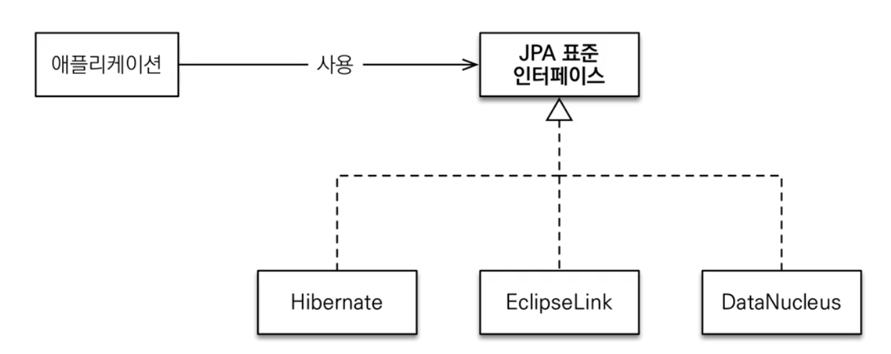

## 1. JPA 소개

- 두 가지 패러다임이 존재함
    1. **객체**(Object)
    2. **관계형 데이터베이스**(Relational DB)
- **ORM**은 객체와 RDB의 **중간 다리** 역할
    - **Object-Relational** Mapping
    - 객체와 RDB 관계에서 패러다임의 불일치를 해결해줌

### 관계형 데이터베이스
- 데이터베이스의 9할은 관계형 데이터베이스
    - 현실적인 이유로 RDB를 채택하고, NoSQL은 보조적인 수단으로 사용함
- 객체와 RDB 사용 시 1.`객체`를 2.`SQL`로 변환, 3.`RDB`로 SQL을 전달함
    - 이 과정에서 개발자는 마치, **SQL 매퍼** 같이 일을 하게 됨
        - 객체 중심이 아닌, SQL 중심 개발
- 데이터를 객체처럼 사용하고 싶음
    - 하지만 테이블을 객체처럼 다루기에는 쉽지 않음
        - INSERT를 부모 클래스, 자식 클래스 이중으로 해야 함
        - SELECT 하려면 JOIN 사용
- 객체와 테이블의 연관관계에서 패러다임이 어긋남
    - 객체는 **참조**를 사용함
        - `member.getTeam()`
    - 테이블은 **외래 키**를 사용함
        - `JOIN ON M.TEAM_ID = T.TEAM_ID`

### 테이블을 객체로써 모델링했을 때 문제
- 객체답게 모델링 할수록 매핑 작업이 늘어남
- 처음 실행하는 SQL에 따라 탐색 범위가 한정됨
    - 예시.
        ```sql
        SELECT M.*, T.*
            FROM MEMBER M
            JOIN TEAM T ON M.TEAM_ID = T.TEAM_ID
        ```
        - 에서 `member.getTeam()` 은 가능함
        - `member.getOrder()`는 불가능함
- 또한, 같은 데이터를 조회하더라도 **인스턴스가 달라짐**
    ```java
        String memberId = "100";
        Member member1 = list.get(memberId);
        Member member2 = list.get(memberId);
        member1 == member2 // False
    ```
    - 반면 자바 컬렉션은 `member1 == member2` 가 true로 반환됨
- 객체를 자바 컬렉션에 저장하듯이 DB에 저장하는 방법이 필요함

### JPA 소개
- JPA, Java Persistence API
    - 자바 **영속성** API
- Java 진영의 **ORM** 기술 표준 
    - ORM, **Object-Relational** Mapping(객체-관계 매핑)
        - 객체는 객체대로 설계, RDB는 RDB대로 설계
        - ORM 프레임워크가 **중간 다리로 패러다임의 불일치를 해결**해줌
            - 대중적인 기술(닷넷, node.js 등)에 모두 ORM 기술이 있음
- JPA는 애플리케이션과 JDBC 사이에서 동작함
    - 
    - 저장은 다음과 같이 JPA가 일함
        - 
        - Insert SQL 생성
        - 패러다임의 불일치를 해결함
    - 조회는 다음과 같이 동작함
        - 
        - Select SQL 생성
        - 마찬가지로 패러다임의 불일치를 해결함
- JPA는 **하이버네이트** 구현체를 포함하는 자바 ORM 표준 명세임
    - JPA 이전 자바 ORM 표준은 EJB
        - 너무 단점이 많아, 오픈소스 ORM 하이버네이트가 개발됨
    - JPA는 하이버네이트를 포함하는 구현체의 모음임
        - 

### JPA를 사용해야 하는 이유
1. SQL 중심 개발에서 **객체 중심 개발**로 이동
    - 자바 컬렉션을 사용하듯이 RDB를 다룰 수 있음
2. 생산성 증가
    - 저장: `jpa.persist(member)`
    - 조회: `Member member = jpa.find(memberId)`
    - 수정: `member.setName("modifiedName")`
        - **트랜잭션 안**에서 엔티티를 변경하면 알아서 update 해줌
    - 삭제: `jpa.remove(member)`
3. **유지보수**가 용이해짐
    - 필드를 추가하더라도 SQL문을 하나씩 바꾸지 않아도 됨
4. **패러다임의 불일치** 해결
    1. JPA의 **상속** 처리
        - 예시. `Item` 테이블을 상속(?)하는(슈퍼타입 관계) 세 테이블을 설계함
            - 
            1. 저장
                - 개발자: `jpa.persist(album)`
                - JPA: `INSERT INTO ITEM ...; INSERT INTO ALBUM ...;`
            2. 조회
                - 개발자: `Album album = jpa.find(Album.class, albumId);`
                - JPA: `SELECT I.*, A.* FROM ITEM I JOIN ALBUM A ON ...`
    2. JPA의 **연관관계** 처리
        - 예시. 객체같은 자연스러운 연관관계 사용 가능
            - 저장: `member.setTeam(team); jpa.persist(member);`
            - 탐색: `Team team = jpa.find(Member.class, memberId).getTeam();`
    3. 엔티티와 계층 구조를 신뢰할 수 있게 됨
        ```java
        class MemberService {
            // ...
            public void process() {
            Member member = memberDAO.find(memberId);
            member.getTeam(); //자유로운 객체 그래프 탐색
            member.getOrder().getDelivery();
            }
        }
        ```
    4. **인스턴스 비교**의 자유로움
        - **동일한 트랜잭션**에서 조회한 엔티티는 **같음을 보장**함
        ```java
            String memberId = "100";
            Member member1 = jpa.find(Member.class, memberId);
            Member member2 = jpa.find(Member.class, memberId);
            member1 == member2; // True
        ```
5. **성능 최적화**를 다양하게 지원
    1. 1차 **캐시와 동일성을 보장**함
        - 같은 트랜잭션 안에서 같은 엔티티를 반환함 - 메모리에서 가져옴, 조회 성능 향상
            ```java
                String memberId = "100";
                Member m1 = jpa.find(Member.class, memberId); // SQL 조회
                Member m2 = jpa.find(Member.class, memberId); // 캐시
            ```
    2. 트랜잭션을 지원하는 **쓰기 지연**(transactional write-behind)
        1. 트랜잭션 커밋 시점까지 INSERT SQL을 모음
        2. JDBC BATCH SQL 기능을 사용하여 한 번에 SQL을 전송함
            - 지저분한 JDBC BATCH 코드를 짜지 않아도 네트워크 성능 향상 가능
                ```java
                    transaction.begin(); // [트랜잭션] 시작

                    em.persist(memberA);
                    em.persist(memberB);
                    em.persist(memberC);
                    //여기까지 INSERT SQL을 데이터베이스에 보내지 않는다.

                    //커밋하는 순간 데이터베이스에 INSERT SQL을 모아서 보낸다.
                    transaction.commit(); // [트랜잭션] 커밋
                ```
            - UPDATE, DELETE로 인한 로우 락 시간을 최소화함
    3. **지연 로딩**(Lazy Loading) 지원
        - 객체가 실제 사용되는 시점에 로딩함
            - 
        - 성능 최적화에 용이
        - vs. **즉시 로딩**
            - JOIN SQL로 한번에 연관된 객체까지 미리 조회함

> 객체지향, 관계형 데이터베이스 둘 다 잘 알아야 JPA를 자유자재로 사용할 수 있음

---

## 다음 글 

### 2. [JPA 시작하기](2-JPA-시작하기.md)