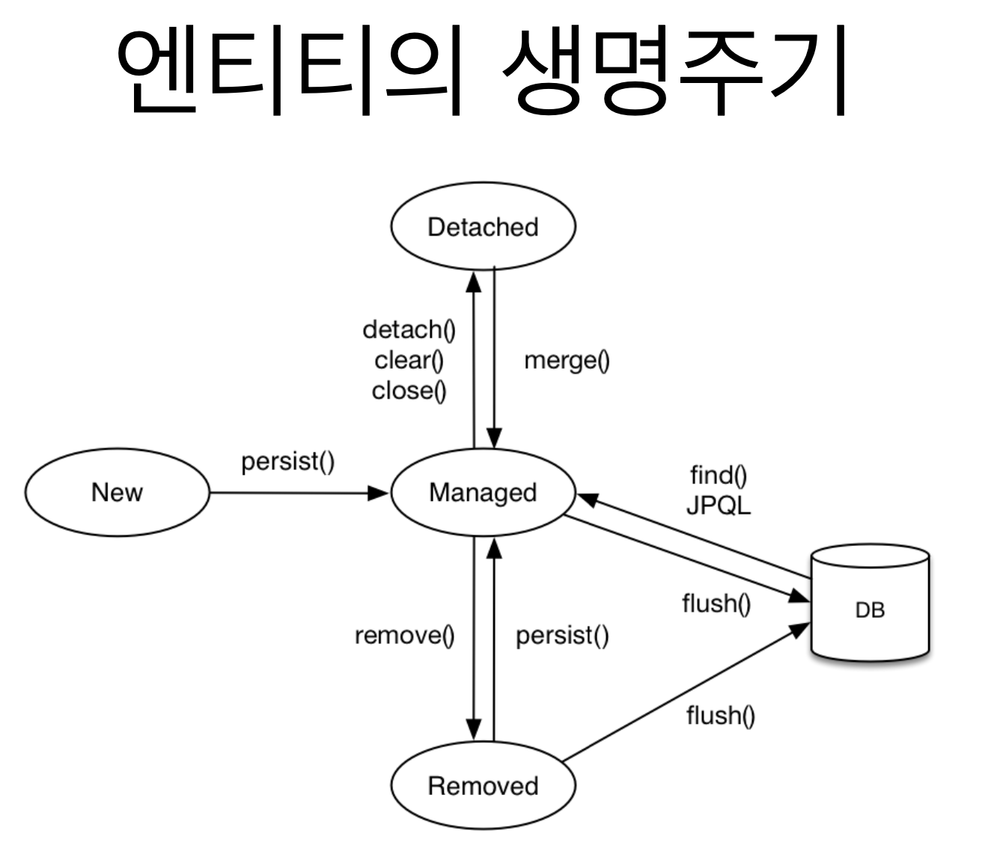
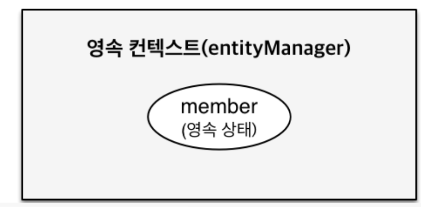
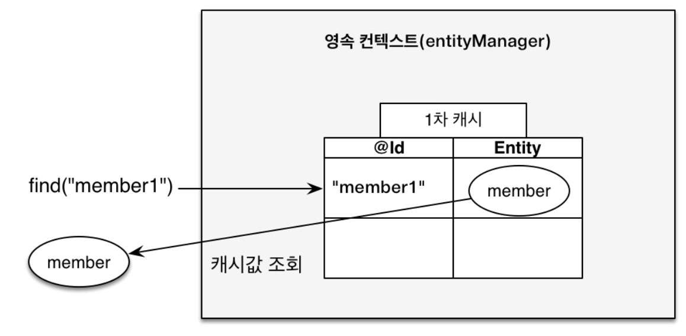
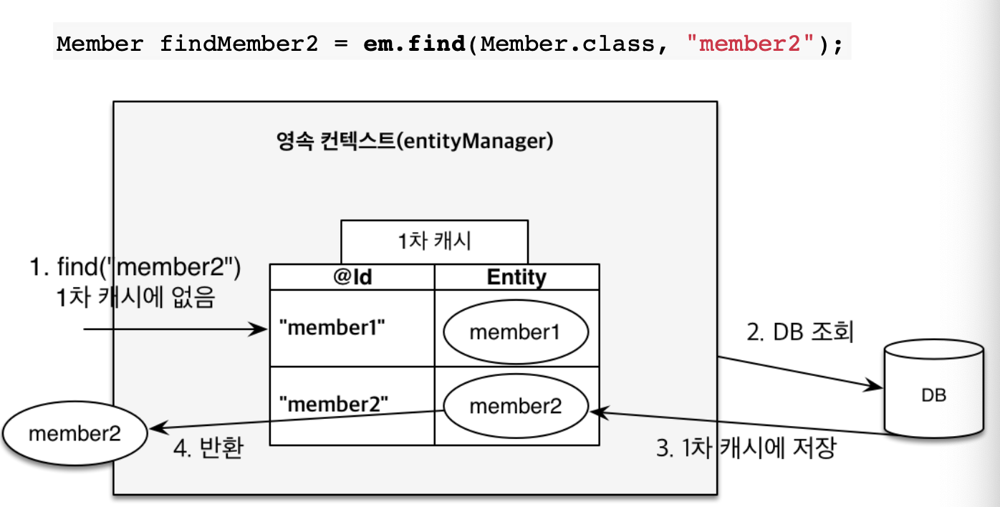
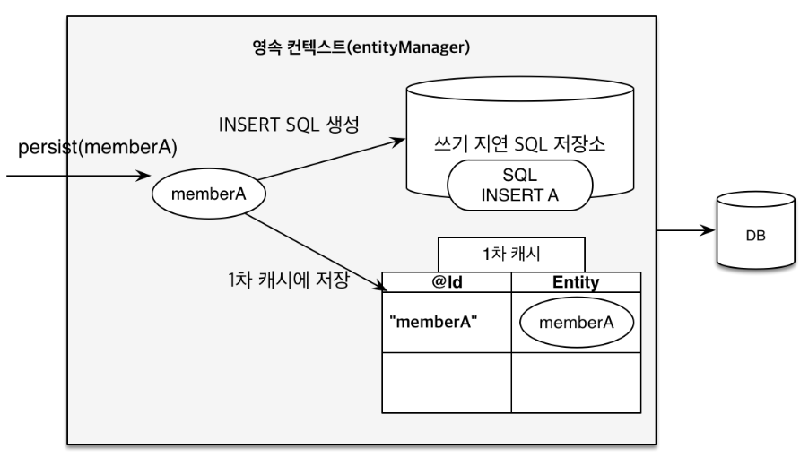
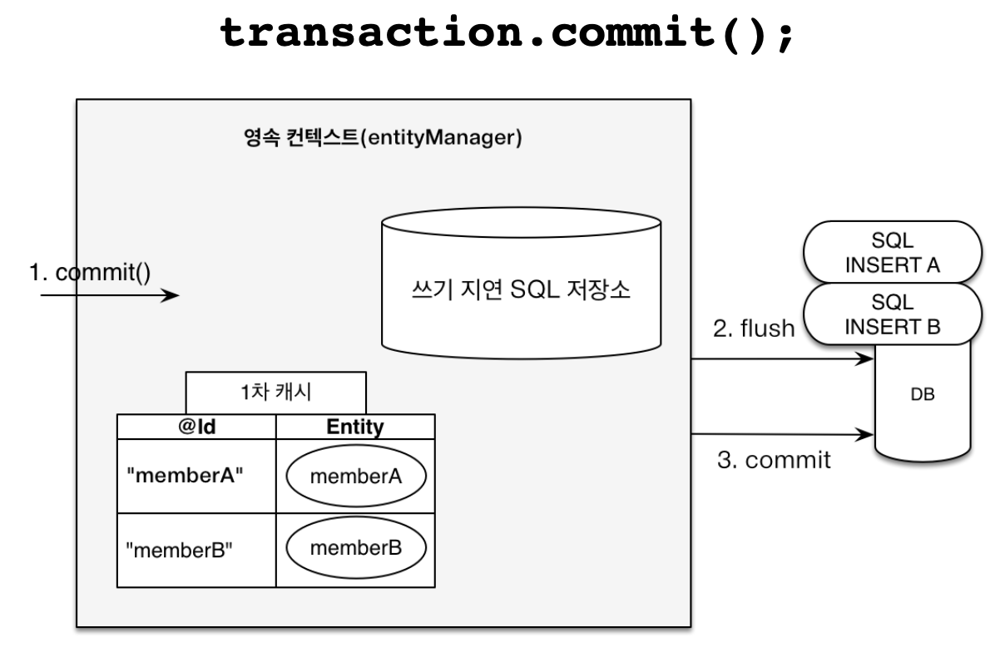
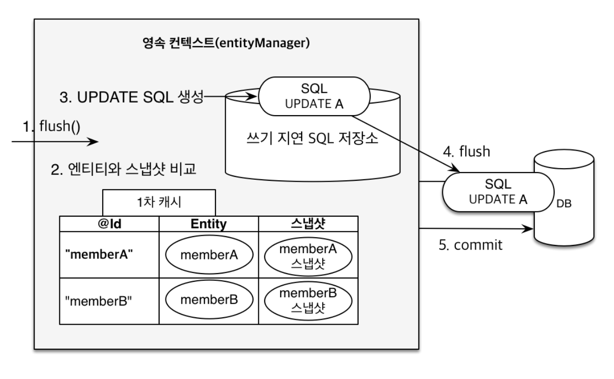

## 3. 영속성 관리 - 내부 동작 방식
- JPA에서 가장 중요한 2가지는 당므과 같음
    - 객체와 관계형 데이터베이스 매핑하기 (Object-Relational Mapping)
        - 설계와 관련된 부분
    - **영속성 컨텍스트**
### 영속성 컨텍스트
- 번역: 엔티티를 영구 저장하는 **환경**
    - 논리적인 개념
    - JPA를 이해하는 데에 가장 중요한 용어
    - `EntityManager.persist(entity)`
        - 엔티티 매니저를 통해 영속성 컨텍스트에 접근함
        - 엔티티를 영속성 컨테스트에 저장함

### 엔티티의 생명주기

|이름|영어|개념|
|--|--|--|
|비영속|new/transient|영속성 컨테스트와 전혀 관계가 없는 **새로운** 상태
|영속|managed|영속성 컨테스트에 **관리**되는 상태
|준영속|detached|영속성 컨텍스트에 저장되었다가 **분리**된 상태
|삭제|removed|**삭제**된 상태

- 
1. 비영속 (new)
    ```java
        //객체를 생성한 상태(비영속)
        Member member = new Member();
        member.setId("member1");
        member.setUsername("회원1");
    ```
2. 영속 (managed)
    - 
    ```java
        EntityManager em = emf.createEntityManager();
        em.getTransaction().begin();

        //객체를 저장한 상태(영속)
        em.persist(member);
    ```
    - 영속시키는 시점에는 DB에 저장되지 않음
        - 트랜잭션 시점에 SQL 쿼리를 날림
3. 준영속 (detached)
    - 회원 엔티티를 영속성 컨텍스트에서 분리한 상태
    ```java
        em.detach(member);
    ```
4. 삭제 (removed)
    - 객체를 삭제한 상태
    ```java
        em.remove(member);
    ```
### 영속성 컨텍스트 존재(Managed를 관리)로 얻는 이점
1. **1차 캐시**
    - 동일 트랜잭션에서 엔티티를 1차 캐시에 담음
    - **먼저 1차 캐시에 엔티티가 있는지 조회**함
    - 이후 DB에 select 문을 날려 찾음
    ```java
        Member member = new Member();
        member.setId("member1");
        member.setUsername("회원1");
        //1차 캐시에 저장됨
        em.persist(member);
        //1차 캐시에서 조회
        Member findMember = em.find(Member.class, "member1");
    ```
    - 
    - 한 번 DB에서 조회한 엔티티도 재사용할 때 1차 캐시에서 가져옴
        - 
2. 동일성 보장
    - 1차 캐시로 REPEATABLE READ 등급의 트랜잭션 격리 수준을 애플리케이션 차원에서 제공
    - 자바 컬렉션에서 꺼낸 똑같은 레퍼런스를 가진 객체를 다루듯이 사용 가능
    ```java
    Member a = em.find(Member.class, "member1");
    Member b = em.find(Member.class, "member1");
    System.out.println(a == b); //동일성 비교 true
    ```
3. **트랜잭션**을 지원하는 **쓰기 지연**
    ```java
        EntityTransaction tx = em.getTransaction();
        //엔티티 매니저는 데이터 변경시 트랜잭션을 시작해야 한다.
        tx.begin(); // [트랜잭션] 시작
        em.persist(memberA);
        em.persist(memberB);
        //여기까지 INSERT SQL을 데이터베이스에 보내지 않는다.
        //커밋하는 순간 데이터베이스에 INSERT SQL을 보낸다.
        tx.commit(); // [트랜잭션] 커밋
    ```
    - `em.persist(memberA)` 시점에는 **1차 캐시**와 **쓰기 지연 SQL 저장소**에 엔티티를 쌓음
        - 
    - `tx.commit()` 시점에 쓰기 지연 SQL 저장소에 있는 INSERT문을 모두 flush, commit함
        - 
4. 변경 감지, (= **더티 체킹**, Dirty Checking)
        - 
        1. 첫 조회 시점에 엔티티의 **스냅샷**을 떠둠
        2. 영속성 컨텍스트 **플러시 시점**에 **현 엔티티와 스냅샷을 비교**함
        3. 변경 지점이 있다면 **쓰기 지연 SQL 저장소**에 update문을 등록
        4. 커밋 때 SQL 저장소의 쿼리를 데이터베이스에 전송함
    - **플러시(flush)**
        - 영속성 컨텍스트의 **변경내용을 데이터베이스에 동기화**하는 행위
    - 영속성 컨텍스트를 플러시하는 법
        1. `em.flush()`
            - 직접 호출
        2. 트랜잭션 커밋
            - 플러시 자동 호출
        3. JPQL 쿼리 실행
            - 기본 모드: 플러시 자동 호출
            ```java
                em.persist(memberA);
                em.persist(memberB);
                em.persist(memberC);
                //중간에 JPQL 실행
                query = em.createQuery("select m from Member m", Member.class);
                List<Member> members= query.getResultList();
            ```
            - 이런 로직에서 문제가 생기기 않게
            - 기본: `em.setFlushMode(FlushModeType.AUTO)`
            - 커밋할 때만 플러시: `em.setFlushMode(FlushModeType.COMMIT)`
                - deprecated
5. 지연 로딩
### 준영속 상태(detached)
- 영속 상태의 엔티티가 영속성 컨텍스트에서 **분리된 상태**
- 영속성 컨텍스트가 제공하는 **기능을 사용 못 함**
    - 1차 캐시
    - 더티 체킹
- 준영속 상태로 만드는 방법
    1. `em.detach(entity)`
        - 특정 엔티티만 준영속 상태로 전환
    2. `em.clear()`
        - 영속성 컨텍스트를 완전히 초기화
    3. `em.close()`
        - 영속성 컨텍스트를 종료
---

## 다음 글 

### 4. [엔티티 매핑](4-엔티티-매핑.md)