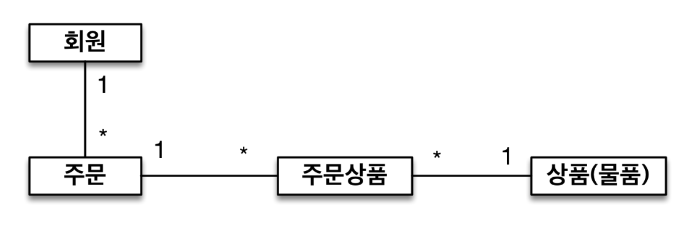
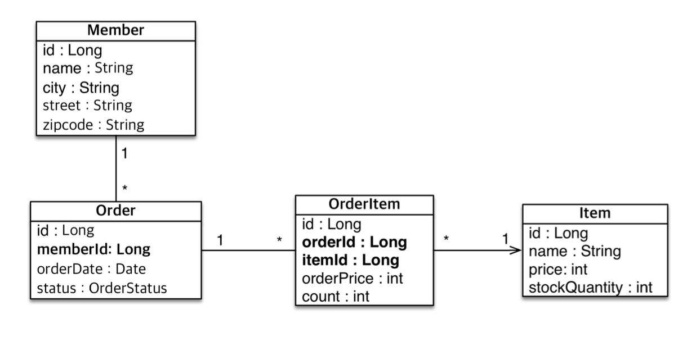

## 4. 엔티티 매핑

### 엔티티 매핑 소개
- 객체와 테이블을 매핑하는 법
    - `@Entity`, `@Table`
- 필드와 컬럼 매핑
    - `@Column`
- 기본 키 매핑
    - `@Id`
- 연관관계 매핑
    - `@ManyToOne`, `@JoinColumn`

### 객체와 테이블 매핑
1. `@Entity`
    - `@Entity`가 붙은 클래스는 JPA가 관리하는 엔티티임
    - JPA를 사용할 테이블과 매핑할 클래스는 `@Entity`가 필수임
    - 스펙
        1. 기본 생성자 필수(파라미터 없는 `public`, `protected`)
        2. final 클래스, enum, interface, inner 클래스 사용 불가
        3. 저장할 필드에 final 사용할 수 없음
    ```java
    
    ```
2. `@Table`
    - 엔티티와 매핑할 테이블을 지정함
        ```java
        @Entity
        @Table(name = "MBR")
        public class Member {
            @Id
            private Long id;
            // ...
        }
        ```
    - `em.find(Member.class, 1L)` == `Select * from MBR where id = 1`

### 데이터베이스 스키마 자동 생성(ddl-auto)
> hibernate.hbm2ddl.auto=create
- DDL을 애플리케이션 실행 시점에 처리해줌
    - DDL = { create, alter, drop, truncate }
- 데이터베이스 방언을 활용해서 데이터베이스에 맞는 적절한 DDL을 사용해줌
    - 이렇게 생성된 DDL은 **개발 장비에서만 사용할 것**
- ddl-auto에는 5가지 종류의 속성이 있음
    1. create
        - 기본 테이블 **삭제(drop)** 후 다시 생성(create)
    2. create-drop
        - create + 종료 시점에 drop
    3. update
        - 변경분만 반영함 
    4. validate
        - 엔티티와 테이블이 **정상 매핑되어있는지만 확인**
    5. none(default)
        - ddl-auto 사용하지 않음
- **운영 장비에는 절대 create, create-drop, update를 사용하지 말 것!!**
    - 이론상 권장사항은 다음과 같음
        1. 개발 초기에는 create 또는 update
        2. 테스트 서버에는 update 또는 validate
        3. 스테이징과 운영 서버는 validate 또는 none
    - 로컬 PC에서만 create를 쓸 것을 권장함
- DDL 생성 기능(create, create-drop)에 사용되는 애노테이션
    - DDL 생성 기능은 DDL을 자동 생성할 때만 사용, **테이블에만 영향을 줌**
    - JPA의 실행 로직에는 영향을 주지 않음
    - `@Column(nullable = false, length = 10)`
        - = 회원 이름은 **필수**, 10자 제한
    - 유니크 제약조건 추가 
        - `@Table(uniqueConstraints = {@UniqueConstraint( name = "NAME_AGE_UNIQUE", columnNames = {"NAME", "AGE"} )})`
    
### 필드와 컬럼 매핑
- 다음과 같이 매핑함
    ```java
    @Entity
    @Getter @Setter @ToString @NoArgsConstructor
    public class Member {
        @Id
        private Long id;
        private String name;

        @Column(name = "name")
        private String username;
        private Integer age;

        @Enumerated(EnumType.STRING)
        private RoleType roleType;

        @Temporal(TemporalType.TIMESTAMP)
        private Date createdDate;

        @Temporal(TemporalType.TIMESTAMP)
        private Date lastModifiedDate;

        @Lob
        private String description;
    }
    ```
- 매핑 애노테이션은 다음과 같음
|애노테이션|설명|
|--|--|
|@Column|컬럼 매핑
|@Temporal|날짜 타입 매핑
|@Enumerated|enum 타입 매핑
|@Lob|BLOB, CLOB 매핑
|@Transient|특정 필드를 컬럼에 매핑하지 않음(매핑 무시)

- `@Column` 속성은 다음과 같음
|속성|설명|기본값
|--|--|--|
|**name**|필드와 매핑할 테이블의 컬럼 이름|객체의 필드 이름
|insertable, updatable|등록, 변경 가능 여부|TRUE
|**nullable**(DDL)|null 값의 허용 여부를 설정한다. false로 설정하면 DDL 생성 시에 not null 제약조건이 붙는다.
|unique(DDL)|@Table의 uniqueConstraints와 같지만 한 컬럼에 간단히 유니크 제약조건을 걸 때 사용한다. 예외 처리 상황에서 컬럼 이름이 이상하게 나와 잘 사용하지 않음
|columnDefinition (DDL)|데이터베이스 컬럼 정보를 직접 줄 수 있다.<br/>예시. varchar(100) default ‘EMPTY' |필드의 자바 타입과 방언 정보를 사용해서 적절한 컬럼 타입
|**length**(DDL)|문자 길이 제약조건, String 타입에만 사용한다.|255
|precision, scale(DDL)|BigDecimal 타입에서 사용한다(BigInteger도 사용할 수 있다). precision은 소수점을 포함한 전체 자 릿수를, scale은 소수의 자릿수 다. 참고로 double, float 타입에는 적용되지 않는다. 아주 큰 숫자나 정 밀한 소수를 다루어야 할 때만 사용한다.|precision=19, scale=2

- `@Enumerated`은 `@Enumurated(value = EnumType.STRING)`로 설정할 것
    - Enum에 데이터를 추가하는 상황에 `EnumType.ORDINAL` 이면 enum 위치에 따라 데이터가 shift됨
- `@Temporal`은 `LocalDateTime`, `LocalDate` 데이터 타입 사용 시 생략 가능
- `@Lob`은 데이터베이스 `BLOB` 또는 `CLOB`에 매핑됨
    - 매핑 필드타입에 문자가 있으면 `CLOB`으로, 나머지면 BLOB 매핑

### 기본 키 매핑
- 내용이 어렵지는 않지만, 데이터베이스를 다루기 위해 알아둬야 함
1. 직접 ID를 할당하는 경우
    - `@Id` 단일 애노테이션을 추가
2. 자동 할당하는 경우
    - `@GeneratedValue(strategy = ?)`
        - 오라클: sequence
        - mySQL: null로 해두면 DB가 자동으로 할당함
- 속성 strategy의 종류는 다음과 같음
    1. `GenerationType.IDENTITY`
        - 기본 키 생성을 데이터베이스에 위임
        - MYSQL의 **AUTO_INCREMENT**
            - AUTO_INCREMENT는 데이터베이스에 INSERT 이후에서야 ID 값을 알 수 있음
    2. `GenerationType.SEQUENCE`
        - **데이터베이스 시퀀스 오브젝트** 사용
            - 유일한 값을 순서대로 생성하는 특별한 데이터베이스 오브젝트
            - Integer는 10억밖에 못 받으니 웬만하면 **`Long` 사용** 권장
        - **ORACLE** 
        - 테이블마다 sequence를 다르게 주고 싶으면 `@SequenceGenerator` 사용
            ```java
            @Entity
            @SequenceGenerator(
            name = “MEMBER_SEQ_GENERATOR",
            sequenceName = “MEMBER_SEQ", // 매핑할 데이터베이스 시퀀스 이름
            initialValue = 1, allocationSize = 1)
            public class Member {
                @Id
                @GeneratedValue(strategy = GenerationType.SEQUENCE,
                generator = "MEMBER_SEQ_GENERATOR")
                private Long id;
            }
            ```
            - `@SequenceGenerator` 필요
                - 클래스 부분에 `@SequenceGenerator(sequenceName = "?")`
                - ID 필드에 `@GeneratedValue(generator = "?")` 이름 일치시킴
                - `sequenceName =`, `initialValue = `, `allocationSize = `, ...
    3. `GenerationType.TABLE`
        - **키 생성 전용 테이블**을 하나 만듦(실제로 존재)
            -  데이터베이스 시퀀스를 흉내내는 전략
            - 성능이 살짝 떨어짐
        - 모든 DB에서 사용
        - `@TableGenerator` 필요
    4. `GenerationType.AUTO`
        - 방언에 따라 자동 지정
        - 기본값
- 권장하는 식별자 전략
    - 기본 키 제약 조건:
        1. **null**이 아니어야 함
        2. **유일**해야 함
        3. **불변**이어야 함
            - 주민등록번호도 기본 키로 적절하지 않음, 오래 쓰다 보면 전략이 바뀔 수 있으니까
    - **Long형 + 대체키 + 키 생성 전략** 사용 권장
- `GenerationType.IDENTITY`는 `em.persist(member)` 시점에 바로 INSERT 쿼리를 날림
    - `@Id` 값은 엔티티에서 필수 값이기 때문
    - `allocationSize = 50`으로 설정하여 동시성 이슈 해결, 잦은 네트워크 호출 방지
        - 미리 메모리에 충분한 양을 당겨옴 


### 실전 예제 - 요구사항 분석
- 회원은 상품을 주문할 수 있음
- 주문 시 여러 종류의 상품을 선택할 수 있음
- **회원과 주문**의 관계
    - 회원은 여러 번 주문할 수 있음 (1:N)
- **주문과 상품**의 관계
    - 주문할 때 여러 상품을 선택할 수 있음
    - 반대로, 같은 상품도 여러 번 주문될 수 있음 (N:N)
        - **주문상품** 이라는 모델을 만들어 다대다 관계를 일대다, 다대일 관계로 풀어냄
- 

### 실전 예제 - 기본 매핑

- 
- 연관 관계간 ID를 참조하는, 고전적인 **관계형 DB 맞춤 설계**임
- 테이블의 외래키를 객체에 그대로 가져옴
    - **객체 그래프 탐색이 불가능**함
        - (x) `order.getMember()` 
            - 객체지향적, 데이터 중심 설계
        - (o) `order.getMemberId()`
            - 관계형 DB 맞춤 설계
    - 참조가 없으므로 UML 다이어그램도 잘못됨

--- 
## 다음 글 

### 5. [연관관계 매핑 기초](5-연관관계-매핑-기초.md)
