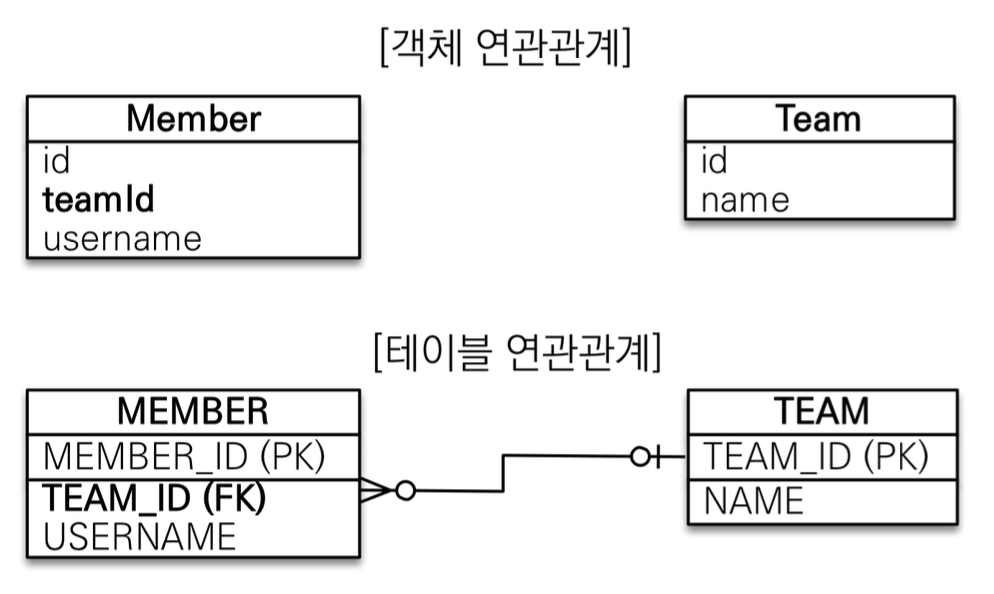
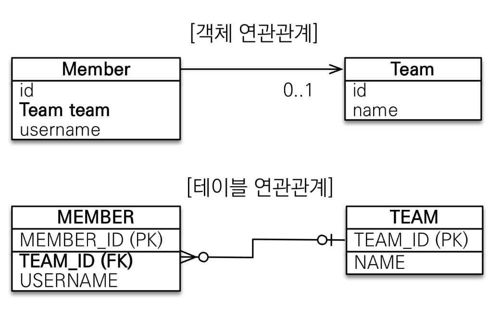
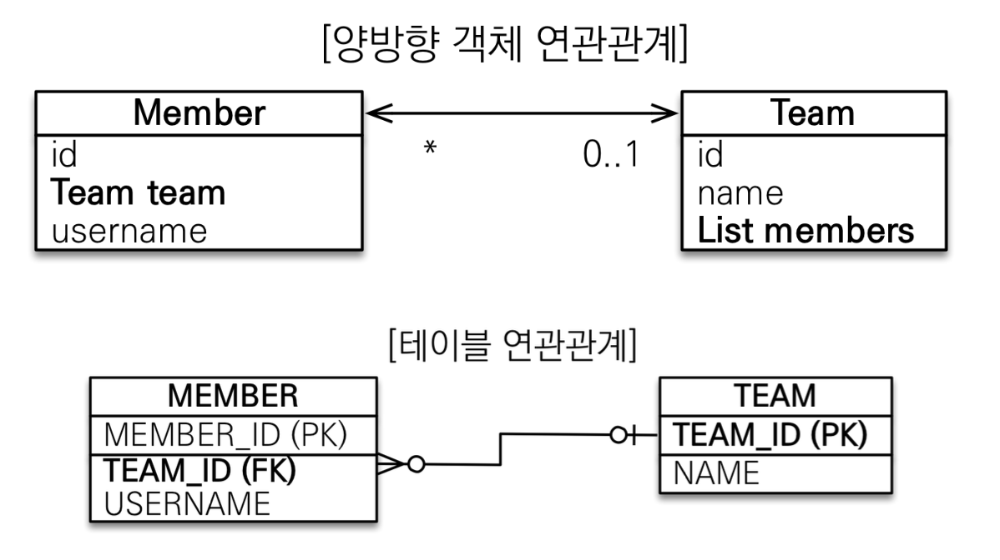
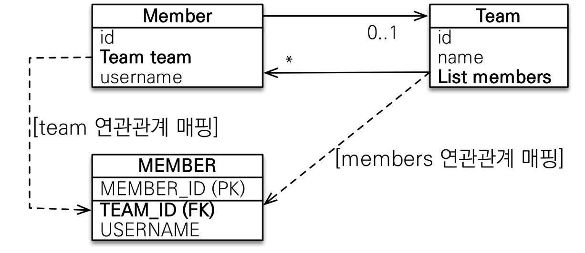
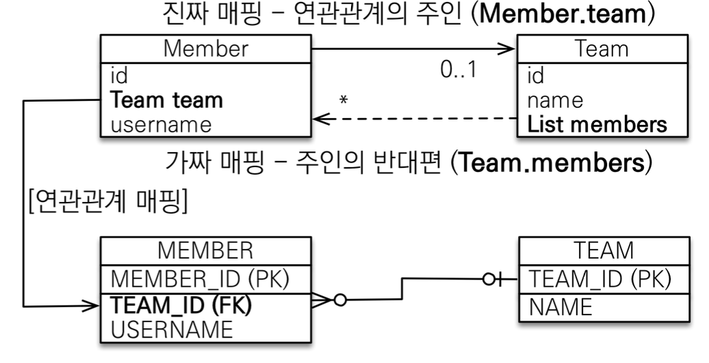
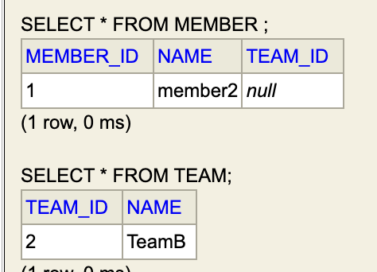
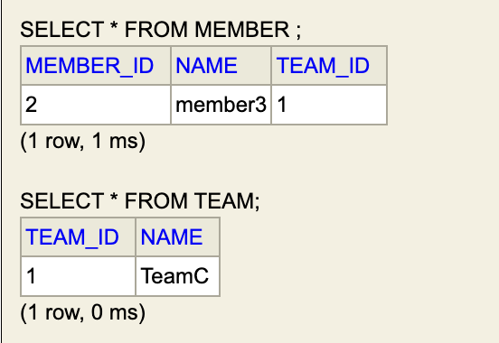

## 5. 연관관계 매핑 기초

- [4. 엔티티 매핑](4-엔티티-매핑.md) - **실전 예제** 를 예시로 코드를 확장해나감
    - 
### 목표
- **객체와 테이블 연관관계의 차이를 이해**
    - 객체지향으로 설계하는 방법을 알아가는 시간
        - 객체지향스럽게 설계하는 것이 무엇인지 아는 것도 중요함
            - <객체지향의 사실과 오해>
            - <오브젝트>
    - Object와 RDB가 지향하는 패러다임이 각각 다르므로 이를 매핑하는 데엔 이해가 필요함
- **객체의 참조**와 테이블의 **외래 키를 매핑**
- 용어 이해
    - 방향(Direction) 
        - 단방향, 양방향
    - 다중성(Multiplicity)
        - N:1, 1:N, 1:1, N:M
    - **연관관계의 주인**(Owner)
        - JPA계의 포인터
### 예제 시나리오
- 회원과 팀이 있음
- 회원은 하나의 팀에만 소속될 수 있음
    - 회원과 팀은 다대일 관계임

### 설계 1. 테이블에 맞추어 객체 모델링
- 
- 연관관계가 없는 객체임
- 참조 대신에 외래 키를 그대로 사용함
- 코드로는 다음과 같이 구현함
    - 엔티티 클래스 코드
        ```java
        @Entity
        public class Member {
            @Id @GeneratedValue
            @Column(name = "member_id")
            private Long id;
            private String name;
            @Column(name = "team_id")
            private Long teamId;

        }

        @Entity
        public class Team {
            @Id @GeneratedValue
            @Column(name = "team_id")
            private Long id;
            private String name;
        }
        ```
    -  저장 및 조회
        ```java
            // 팀 저장
            Team team = new Team();
            team.setName("TeamA"); 
            em.persist(team);

            // 회원 저장
            Member member = new Member();
            member.setName("member1"); 
            member.setTeamId(team.getId()); 
            em.persist(member);

            //조회
            Member findMember = em.find(Member.class, member.getId());

            //연관관계가 없음
            Team findTeam = em.find(Team.class, team.getId());
        ```
        - 각자의 식별자로 조회함
            1. **그래프 탐색이 불가능**하며 
            2. **객체지향**스럽지가 않음   
- 문제점
    - **테이블은 외래 키로 조인을 사용**하여 연관된 테이블을 찾음
        ```sql
        select * from member m
            join team t on m.team_id = t.team_id;
        ```
    - **객체는 참조를 사용**해서 연관된 객체를 찾음
        ```java
            Member findMember = em.find(Member.class, member.getId());
            Team findTeam = em.find(Team.class, findMember.getTeamId());
        ```
    - **협력 관계를 만들 수가 없음**

### 설계 2. 단방향 연관관계
- **객체 연관 관계**를 사용하는, 객체 지향 모델링임
- 
    - **멤버** 입장에서 **다대 일** 관계(N:1)
        - 하나의 팀에 여러 멤버가 소속됨
        - **멤버** 엔티티 필드에 `@ManyToOne` 사용
    - 객체의 `Team team`과 테이블의 `team_id(FK)` 를 매핑해야 함
        - `Team team` 필드에 `@JoinColumn(name = "team_id")` 추가
- 코드로는 다음과 같이 구현함
    - 엔티티 클래스 코드
        ```java
        @Entity
        public class Member {
            @Id @GeneratedValue
            @Column(name = "member_id")
            private Long id;
            private String name;

            @ManyToOne(fetch = FetchType.LAZY)
            @JoinColumn(name = "team_id")
            private Team team;
        }

        @Entity
        public class Team {
            @Id @GeneratedValue
            @Column(name = "team_id")
            private Long id;
            private String name;
        }
        ```
    - 저장 및 조회 (빌더 패턴 사용)
        ```java
            // 팀 저장
            Team team = Team.builder()
                    .name("TeamB")
                    .build();
            em.persist(team);
            // 멤버 저장
            Member member = Member.builder()
                    .name("member2")
                    .team(team)
                    .build();
            em.persist(member);
            // 조회
            Member findMember = em.find(Member.class, member.getId());
            Team findTeam = findMember.getTeam();
        ```
    - **객체 그래프 탐색**으로 FK쪽 객체를 가져옴 
    - 이때 조회 쿼리문 SELECT은 JOIN으로, member를 가져올 때 한 번에 team까지 가져옴
        - `@ManyToOne(fetch = FetchType.LAZY)`를 사용하면 FK를 분리함
            - FK인 team을 사용하는 시점(`member.getTeam()`)에서야 DB에 요청을 보냄 (LAZY)

### 설계 3-1. 양방향 연관관계

> **양방향 연관관계**와 **연관관계의 주인**

- JPA에서 이해가 어려운 부분은 2가지임
    1. **영속성 컨테스트**의 매커니즘 이해
    2. **연관관계의 주인**
        - 객체 관계: 참조 사용, 테이블 관계: 외래 키와 JOIN 사용
        - 이 **두 관계의 차이**와 차이에서 오는 주의점을 이해해야 함
- 
    - 테이블은 (이미) **외래 키(FK) 하나로 양방향 연관관계를 구현** 가능
        - `Member` 입장에서 team_id를 `Team` 테이블에 join하면 대응 정보를 알 수 있음
        - `Team` 입장에서 마찬가지로 team_id를 `Member` 테이블에 join하면 됨
    - 양방향 연관관계 구현을 위해 Team 엔티티에 `List<Member> members` 필드를 추가함
        - **역방향으로도 객체 그래프를 탐색** 가능
- 코드로는 다음과 같이 구현함
    - 엔티티 클래스 코드
        ```java
        @Entity
        public class Member {
            @Id @GeneratedValue
            @Column(name = "member_id")
            private Long id;
            private String name;

            @ManyToOne(fetch = FetchType.LAZY)
            @JoinColumn(name = "team_id")
            private Team team;
        }

        @Entity
        public class Team {
            @Id @GeneratedValue
            @Column(name = "team_id")
            private Long id;
            private String name;

            @OneToMany(mappedBy = "team") // 나의 반대편 필드를 문자열로 지정
            private List<Member> members = new ArrayList<>();
        }
        ```
        - 양방향으로 `Team` 엔티티에도 `List<Member> members` 필드를 추가함
        - `@OneToMany` 애노테이션을 `(mappedBy = "team")` 속성과 함께 추가
    - 조회 (빌더 패턴 사용)
        ```java
            // ...
            Member findMember = em.find(Member.class, member.getId());
            // 양방향 조회
            List<Member> members = findMember.getTeam().getMembers(); 
            // ...
        ```
- `(mappedBy = "team")`의 이해
    - 객체와 테이블간에 연관관계를 맺는 차이를 이해해야 함
        - **객체의 연관관계는 2줄임**
            - 회원 -> 팀 참조 연관관계 (단방향)
            - 팀 -> 회원 참조 연관관계 (단방향)
        - 테이블의 연관관계는 1줄임
            - 회원 <-> 팀 FK 연관관계 (앙방향)
    - **객체**의 양방향 관계를 정확히 서술하면 **서로를 가르키는 단방향 관계 2개**임
        ```java
        class A {
            B b;
        }
        class B {
            A a;
        }
        foo() {
            a.getB(); // A -> B
            b.getA(); // B -> A
        }
        ```
    - 테이블은 **외래 키 1개**로 두 테이블의 연관관계를 관리함
        ```sql
        select *
        from member m
        join team t on m.team_id = t.team_id;

        select *
        from team t
        join member m on t.team_id = m.team_id;
        ```
### 설계 3-2. 연관관계의 주인

- 그렇다면, 객체에서 **테이블의 외래 키**는 누가 관리해야 하는가?
    - 
    - **둘 중 하나가 외래키를 관리**해야 하는 제약을 만듦
        - **= 연관관계의 주인**
- **연관관계의 주인**
    - **연관관계의 주인만이 외래 키를 관리(등록, 수정)**
        - 주인은 mappedBy 속성 사용 X
    - **주인이 아닌 쪽은 읽기만 가능**
        - 주인이 아니면 **mappedBy 속성으로 주인을 지정**함
- 누구를 주인으로 지정해야 하는가?
    - **외래 키가 있는 테이블에 매핑된 엔티티를 주인**으로 정할 것
        - 
        - 많은 고민거리가 해결 됨
            1. DB 입장에서는 외래키가 있는 곳이 N, 없는 쪽이 1임
                - 매핑된 엔티티는 N:1, `@ManyToOne`
    - 여기서는 `Member.team` 필드가 연관관계의 주인
        - 값을 변경할 때에는 `Member` 쪽 필드를 수정해야 함
    - `Team.members` 필드는 가짜 매핑, mappedBy
- 양방향 매핑 시 가장 많이 하는 실수
    - 연관관계의 주인에 값을 입력하지 않은 경우
        ```java
        Member member = new Member(); 
        member.setName("member2");

        Team team = new Team(); 
        team.setName("TeamB"); 
        // 역방향(주인이 아닌 방향)만 연관관계 설정 
        team.getMembers().add(member);

        em.persist(team);
        em.persist(member);
        ```
        - 결과는 다음과 같음
            - 
        - JPA에 **역방향으로 이루어지는 UPDATE는 무시**함
    - JPA 입장에서는 **연관관계의 주인**의 필드를 **UPDATE** 해주어야 DB에 적용됨
        ```java
        Team team = new Team(); 
        team.setName("Team3"); 

        Member member = new Member(); 
        member.setName("member3");
        member.setTeam(team);

        em.persist(team);
        em.persist(member);
        ```
        - 결과는 다음과 같음
            - 
        - 하지만 `em.flush()` 하기 전까지는 1차 캐시에 연관관계가 **제대로 설정되지 않음**
            - `member.setTeam(team)`해도 `Team.members`는 update 되지 않음
- **엔티티 양쪽에 전부** 값을 넣어 주는 것이 권장 설계
    - 순수 객체 상태를 고려해서 항상 양쪽에 값을 설정할 것
    - **객체지향적 사고에 적합**함, 엔티티를 다룰 때 안전함
        - 단위 테스트에서도 안전함
- **(추천)'연관관계 편의 메서드'**를 만들 것!
    ```java
    public class Member {
        // ...
        void changeTeam(Team team) { 
            this.team = team;
            team.getMembers().add(this);
        }
    }
    ```
    - 또는 (xor, 둘 중 하나만 사용)
    ```java
    public class Team {
        // ...
        void addMember(Member member) { 
            member.setTeam(this);
            members.add(member);
        }
    }
    ```
    - **메서드를 원자적으로 사용**할 수 있음
        - 하나만 호출해도 양쪽으로 값이 걸림
    - 또, 메서드 이름에 기본 스펙인 `setXXX`을 쓰지 않을 것을 권장
        - 예시. `changeXXX`, `updateXXX`, ...
        - 단순 규약에 따른 setter가 아닌 **로직이 들어간 중요한 메서드임을 인지**할 수 있음
    - 연관관계 편의 메서드를 어디에 둘 지는 상황에 따라 다름
        - 협업 팀의 성격, 설계 편의에 따라 다를 수 있음
- 양방향 매핑시에 **무한 루프**를 조심할 것
    - lombok `@ToString`
        - 해결 방안: lombok `@ToString`은 되도록 쓰지 말 것
    - JSON 생성 라이브러리 등
        - member{team{member{team{...}}}}
        - 해결 방안: **컨트롤러에서 엔티티를 직접 반환하지 말 것**
            - 문제 1. 무한 루프 문제
            - 문제 2. 엔티티는 필드 추가 등 스펙 변경 가능, api 클라이언트 입장에서 매우 황당함
            - api는 값만 있는 dto로 컨트롤러에서 반환할 것을 권장

### 양방향 매핑 정리

- JPA 모델링 할 때, **처음에 단방향 매핑으로 설계를 끝낼 것**
    - 단방향 매핑만으로도 이미 연관관계 매핑은 완료
    - 설계 입장에서, 양방향 매핑은 고민거리만 많아짐
        - '연관관계 편의 메서드' 등
- **양방향 매핑**은 반대 방향으로 **조회 기능이 추가된 것 뿐**임(객체 그래프 탐색)
- 하지만, JPQL에서 역방향으로 탐색할 일이 많음
- 단방향->양방향 설계 변경은 테이블에 영향을 주지 않음 
- **단방향 매핑으로 설계를 초기에 끝내고 양방향은 필요할 때 추가**할 것
- **연관관계의 주인 선정 기준**
    - 비즈니스 로직을 기준으로 연관관계의 주인을 선택하면 안 됨
         - 예시. 자동차와 바퀴에서, 비즈니스 관점에서는 자동차가 주인이 되는 것이 그럴듯 함
    - **연관관계의 주인은 외래 키를 가지는 테이블을 기준**으로 정해야 함
        - `@ManyToOne`을 필드에 붙이는 쪽
        - 성능, 운영 관점에서도 이득이 있음
        - 예시. 자동차와 바퀴 관계에서는 바퀴가 외래키를 가지므로, 바퀴를 연관관계의 주인으로 설정

---  
## 다음 글 

### 6. [다양한 연관관계 매핑](6-다양한-연관관계-매핑.md)