## 6. 다양한 연관관계 매핑

### 연관관계 매핑시 고려사항
1. 다중성 (테이블 설계)
    - N:1인가, 1:N인가, 1:1인가, N:M인가?
    - 다대일을 가장 많이 사용, 일대다, 일대일은 가끔 씀
    - 다대다는 사용하지 말 것을 권장
        - N:1, 1:M으로 풀어서 설계
2. 단방향, 양방향 여부 (엔티티 설계)
    - **테이블**
        - 외래 키 하나로 양쪽을 join 가능
        - 방향이라는 개념이 없음
    - **객체**
        - 참조용 필드가 있는 쪽으로만 참조 가능
        - 한쪽만 참조하면 단방향
        - 양쪽이 서로 참조하면 양방향
3. 연관관계의 주인 (엔티티 설계)
    - Q. 누구를 연관관계의 주인으로 할 것인가? (엔티티 설계의 관점)
        - A. N:1 관계에서 N 엔티티 = 외래 키를 관리하는 참조
            - 주인의 반대편은 외래 키 접근 시 read-only
            - Q. N:1 등 테이블간 관계에서 다중성을 어떻게 설정할 것인가? (테이블 설계의 관점)
                - A. ...

### 다대일 (N:1)
- 가장 많이 사용하는 연관관계
- **다대일의 반대는 일대다**
- 다대일 단방향 매핑(ORM)은 다음과 같음
    - 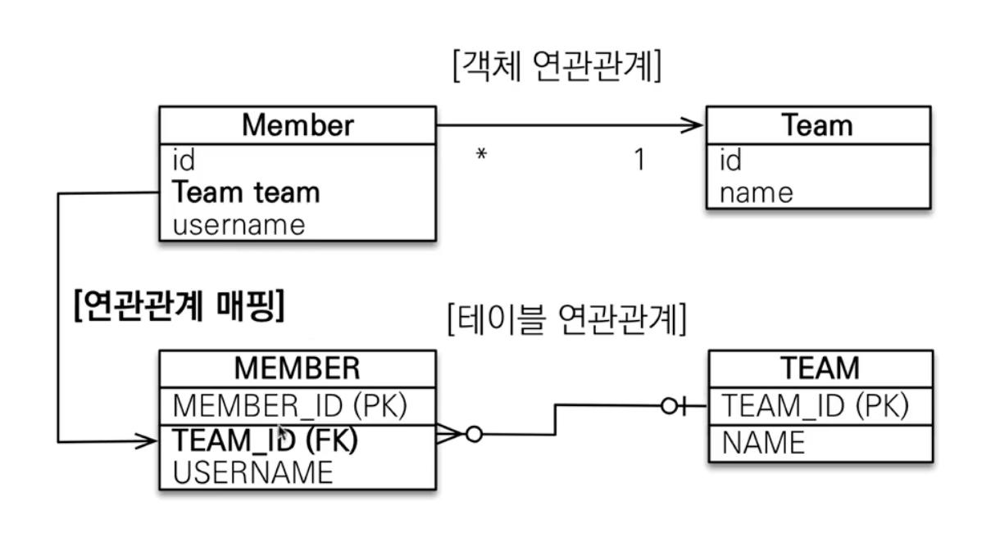
    - 테이블 설계의 관점에서, N:1에서 **N 테이블에 외래 키**가 가야 함
- 다대일 양방향 매핑(ORM)은 다음과 같음
    - 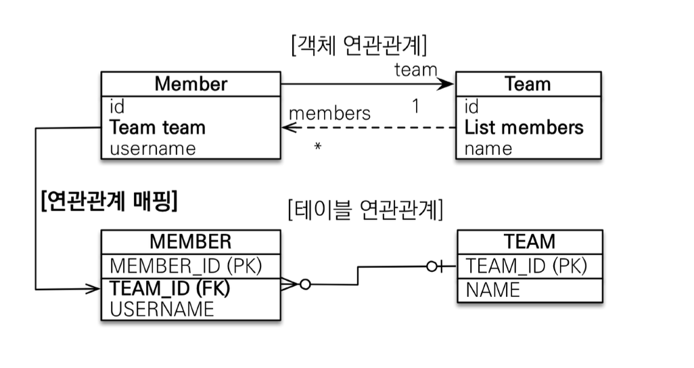
    - (테이블 설계에서) 외래 키가 있는 쪽이 엔티티에서 연관관계의 주인
    - 주인 반대쪽은 read-only `@OneToMany(mappedBy = "fieldName")`
    - 양쪽을 서로 참조하도록 개발

### ~~일대다 (1:N) 단방향~~
- 권장하지 않음
    - 1:N 단방향은 특수 케이스
- 객체 관점에서 **일(1)이 연관관계의 주인**
- 테이블 관점에서 **다(N) 쪽에 외래 키**가 있음 (N:1과 동일한 구조)
- 객체와 테이블의 차이 때문에, 반대편 테이블의 외래 키를 관리하는 특이한 구조
- 연관관계 주인 필드에 `@JoinColumn(name = "fieldName")`을 꼭 사용해야 함
- 일대다 단방향 매핑(ORM)은 다음과 같음
    - 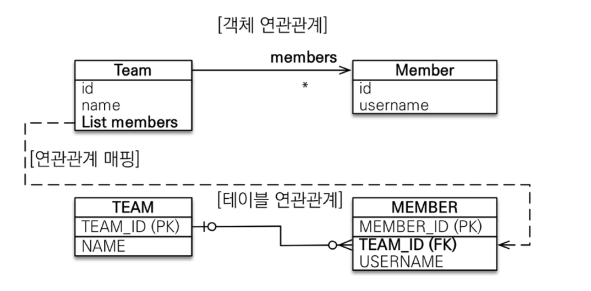
```java
@Entity
public class Member {
    // 단방향이므로 수정 사항 없음
}

@Entity
public class Team {
    // ...
    @OneToMany
    @JoinColumn(name = "team_id")
    private List<Member> members = new ArrayList<>();
    // ...
}
```

```java
    Member member = Member.builder()
                    .username("member1")
                    .build();
    em.persist(member);

    Team team = Team.builder()
                    .name("teamA")
                    .build();
    team.getMembers().add(member); // ?
    em.persist(team);
```
- 단점은 다음과 같음
    1. 엔티티가 관리하는 외래 키가 다른 테이블에 있음
    2. 연관관계 관리를 위해 매번 추가로 옆 테이블에 UPDATE SQL을 실행해야 함
        - 성능상 약간의 저하
        - 실무에서 로그 찍히는 게 꼬임
- 1:N 단방향 매핑하는 상황은 **N:1 양방향 매핑으로 충분히 대체 가능**

### 일대일 (1:1)
- 대칭적임, 일대일 관계는 그 반대도 일대일
- 주 테이블이나 대상 테이블 중에 **외래 키를 임의 선택** 가능
    - 주 테이블에 외래 키를 넣을 수 있음
    - 또한, 대상 테이블에 외래 키를 넣을 수 있음
    - 테이블 설계, 서비스 상황에 따라 둘 중 선택
- 외래 키에 데이터베이스 **유니크(UNI) 제약조건** 추가하면 좋음
    - 데이터베이스 외래키에 유니크가 추가되면 관리가 엄청 편해짐
    - 1:1 관계인게 명확해지고, 유용한 제약들을 추가해줌
- 예시. 주 테이블: `member`, 대상 테이블: `locker`
- 1:1 매핑은 다음 네가지 상황으로 분화함
    1. **주 테이블**에 외래키 **단방향** 매핑(ORM)
        - 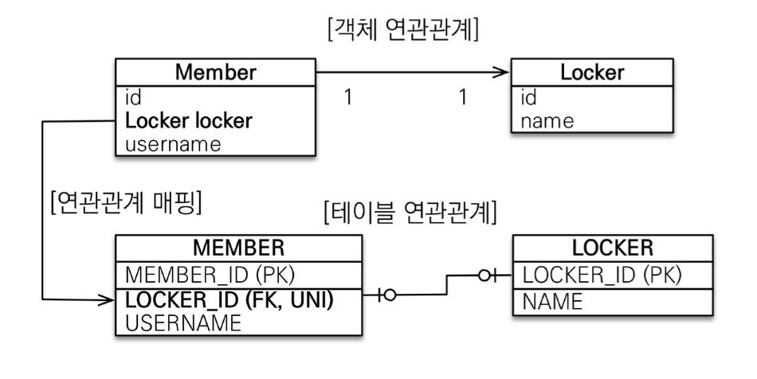
        - `member.locker_id(FK, UNI)` 추가
        - N:1 단방향 매핑과 유사함
    2. 주 테이블에 외래키 **양방향** 매핑(ORM)
        - 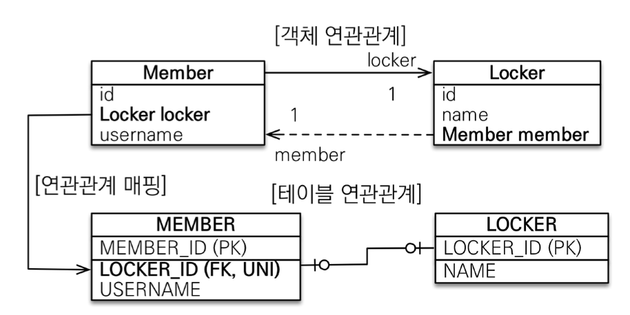
        - 실선은 매핑 주체
        - N:1 양방향 매핑처럼, 반대편에 `@OneToMany(mappedBy = "fieldName")` 추가
        - N:1 양방향 매핑과 유사하게, 외래 키가 있는 곳이 연관관계의 주인 
    3. ~~**대상 테이블**에 외래키 **단방향** 매핑(ORM)~~
        - 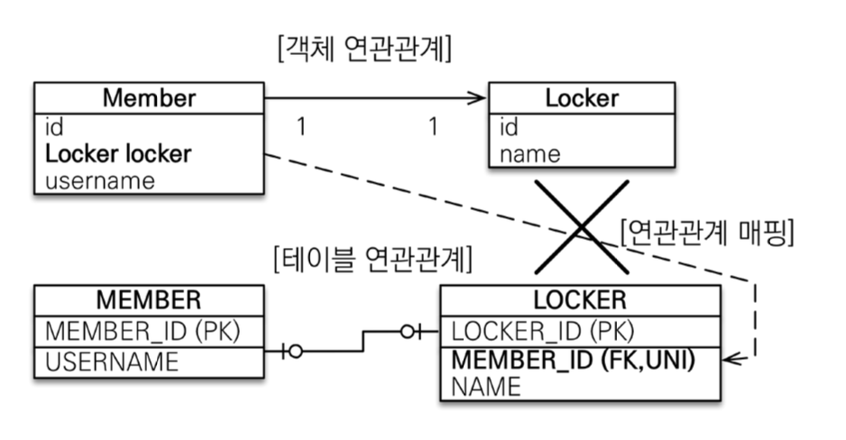
        - JPA에서 지원하지 않음
    4. **대상 테이블**에 외래키 **양방향** 매핑(ORM)
        - 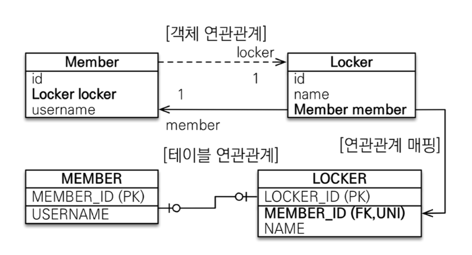
        - `locker.member_id(FK, UNI)` 추가
        - 주 테이블에 외래키 + 양방향 매핑과 방법이 같음
- 일대일 관계 정리
    1. **주 테이블에 FK(+UNI) 필드** 추가
        - JPA 매핑하기가 편리함, 객체지향 개발자가 선호하는 방식
        - 개인적으로 선호하는 방법
        - 장점: 주 테이블만 조회해도 대상 테이블에 데이터 유무를 확인할 수 있음
        - 단점: 값이 없으면 외래 키에 null을 허용하게 됨
    2. **대상 테이블에 FK(+UNI) 필드** 추가
        - 전통적인 DB 개발자가 선호하는 방식
        - 장점: 주 테이블과 대상 테이블을 1:1에서 1:N 관계로 변경해도 UNI만 빼면 테이블 구조 유지
        - 단점: 메인 테이블에 지연 로딩을 설정해도 항상 즉시 로딩됨
            - 프록시 객체 기능 구현부의 한계
            - 메인 테이블 `Member`를 조회할 때 `locker` 필드의 존재 여부를 확인해야 함
                - 이 때문에 항상 대상 테이블 `Locker`도 같이 조회 요청이 감
            - 뒤에서 자세히 설명, 해결 방법이 있음

### 다대다(N:M)
> 실무에서 N:M을 직접 쓰지 않는 것을 권장
- 관계형 DB
    - RDB는 정규화된 2개의 테이블을 N:M으로 직접 이을 수 없음
    - 대신, 연결 테이블 모델을 추가해 N:1 - 1:M 관계로 풀어야 함
    - 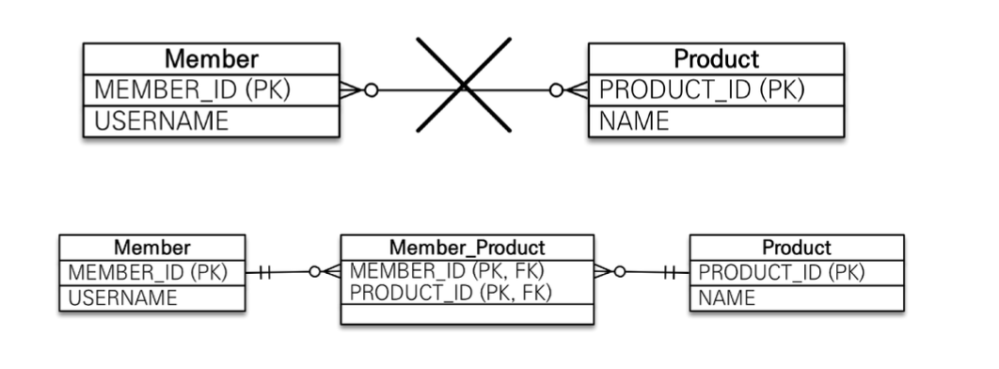
- 객체
    - 객체는 컬렉션을 사용해서 객체 2개로 다대다 관계가 가능함
    - `@ManyToMany` 사용, `@JoinTable`로 연결 테이블을 지정함
    - 다대다 단방향 예제
        ```java
        @Entity
        public class Member {
            // ...
            @ManyToMany
            @JoinTable(name = "member_product")
            private List<Product> products = new ArrayList<>();
        }
        ```
        ```java
        @Entity
        public class Product {
            // 별도 설정 X, 평범한 엔티티
        }
        ```
    - 양방향으로 만들고 싶으면 Product를 다음과 같이 변경함
        ```java
        @Entity
        public class Product {
            // ...
            @ManyToMany(mappedBy = "products")
            private List<Member> members = new ArrayList<>();
        }
        ```
- 편리해 보이지만 **실무에서 사용할 수 없는 구조**임
    1. 연결 테이블이 단순히 연결만 하고 끝나지 않음
        - 주문 시간, 수량 같은 데이터가 필요할 수 있음
            - 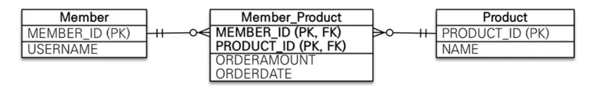
            - 하지만, 순수 다대다 관계면 중간 테이블에 추가 불가
    2. 쿼리가 이상하게 나감
- **N:M 한계 극복**
    - **연결 테이블을 엔티티로 승격**(= 연결 테이블용 엔티티 추가)
    - `@ManyToMany` -> `@ManyToOne`, `@OneToMany` 로 분리
    - 엔티티 관점에서, `단방향 N:M`를 `양방향 1:N` + `단방향 M:1` 로 만듦
        - 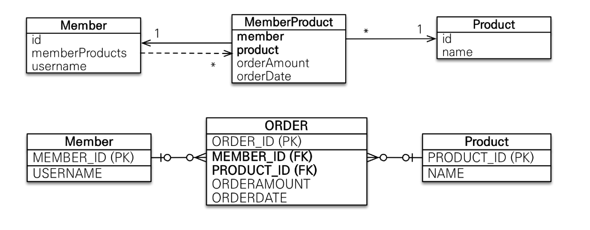


### 실전 예제 3. 더 다양한 연관관계 매핑

- 이번엔 엔티티 설계를 먼저 확장한 후, 이에 맞춰 RDB를 설계함
    - 엔티티를 먼저 다음과 같이 설정함
        - 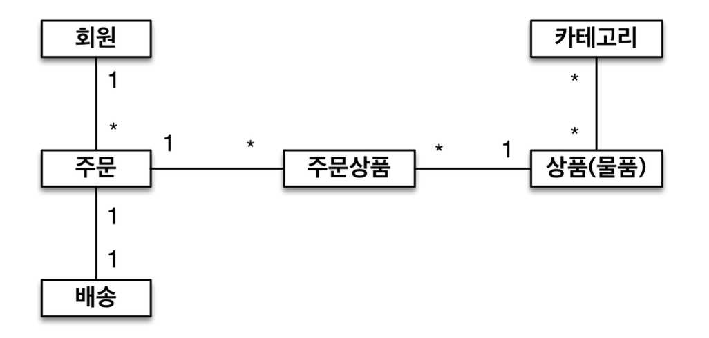
        - 주문과 배송은 1:1
        - 상품과 카테고리는 N:M
            - 일단 N:M으로 직접 설계, `@ManyToMany 사용`
    - ERD는 다음과 같음
        - 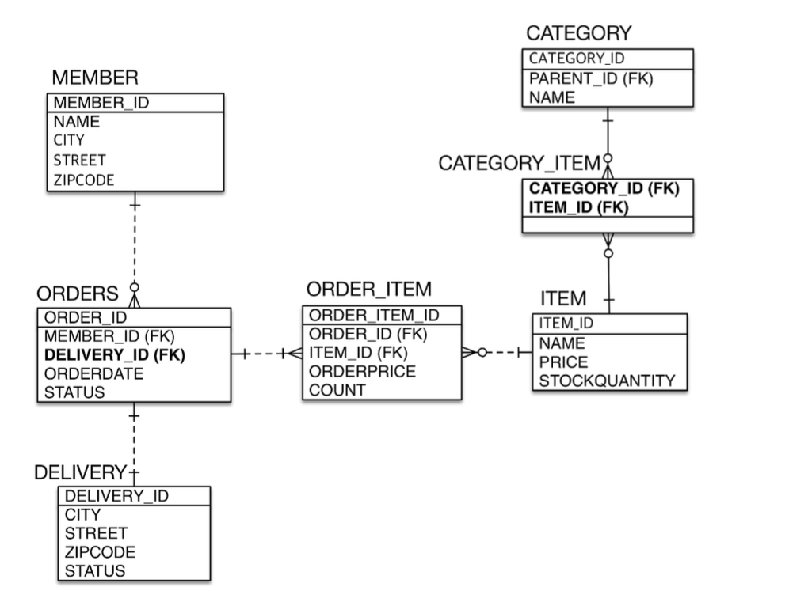
        - RDB는 N:M 관계를 사이에 테이블을 생성하여 resolve함

---  
## 다음 글 

### 7. [고급 매핑](7-고급-매핑.md)
