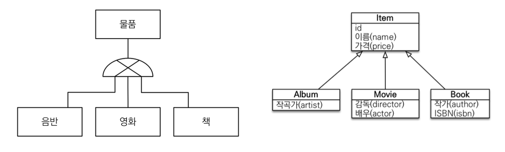
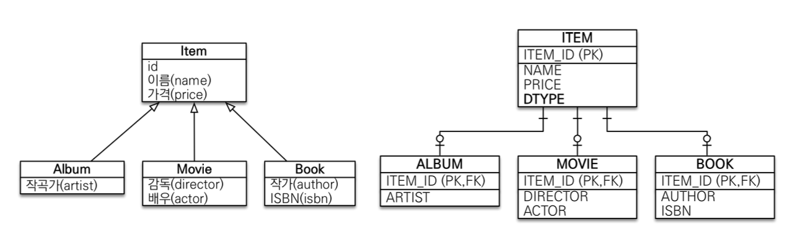
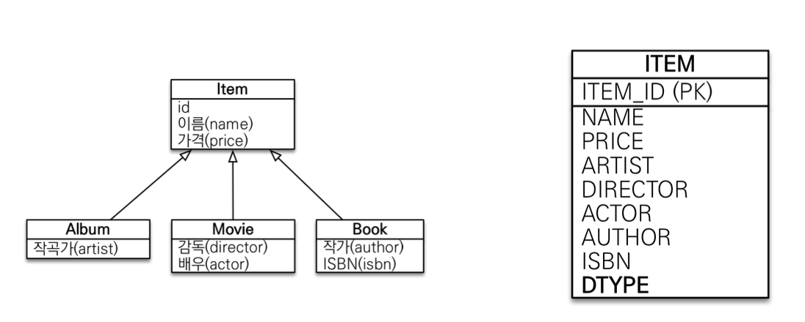
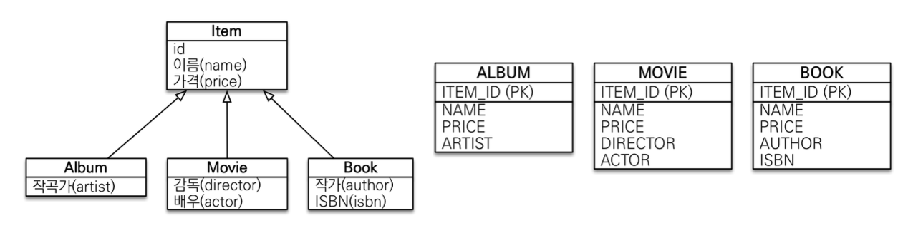

## 7. 고급 매핑

### 상속관계 매핑
- 관계형 데이터베이스에 상속관계라는 건 존재하지 않음
- 객체의 상속관계에 빗댈 수 있는 가장 비슷한 개념이 슈퍼타입-서브타입 관계
- **상속관계 매핑**: `객체`의 상속 구조와 `RDB`의 슈퍼타입-서브타입 관계를 매핑함
- 슈퍼타입-서브타입 논리 모델을 실제 물리 모델로 구현하는 방법은 세 가지가 있음
    1. 조인 전략
        - 각각 테이블로 변환
    2. 단일 테이블 전략
        - 통합 테이블로 변환
    3. ~~구현 클래스마다 테이블 전략~~
        - 서브타입 테이블로 변환
- 주요 애노테이션은 다음과 같음
    - `@Inheritance(strategy=InheritanceType.XXX)`
        - `InheritanceType.JOINED` : 조인 전략
        - `InheritanceType.SINGLE_TABLE` : 싱글 테이블 전략
        - `InheritanceType.TABLE_PER_CLASS` : 구현 클래스마다 테이블 전략
    - `@DiscriminatorColumn(name="DTYPE")`
    - `@DiscriminatorValue("XXX")`
- 예제는 다음과 같음
    - 
    - **객체 입장에서는 변할 게 없는 구조**
        - `parent:Item`, `child:{Album, Movie, Book}`

### 조인 전략
> 각각 테이블로 변환
- **정석**, 설계가 깔끔함
- 
- 아이템 테이블에 구분을 위한 속성 `DTYPE`을 둘 것을 권장
    - `@DiscriminatorColumn`
- `ITEM_ID(PK, FK)`에 맞추어 `JOIN`하여 가져옴
- 장점
    - 저장 공간을 생각했을 때 가장 효율적임
- 단점
    - 조회시 조인을 많이 사용하여 성능 저하될 수 있음
    - 조회 쿼리가 복잡해짐
    - 데이터 저장 시 INSERT 문 부모 엔티티, 자식 엔티티 둘 다 호출

### 단일 테이블 전략
> 논리 모델을 한 테이블로 변환
- **기본 전략**
- 
- 한 테이블에 모든 field들 둠, 사용하지 않는 속성은 null
    - JOIN을 사용하지 않음
- 동일하게 아이템 테이블에 구분하는 필드 `DTYPE`을 둘 수 있음
    - `@DiscriminatorColumn`
- 장점
    - JOIN이 없어 조회 성능이 빠름
    - 쿼리가 단순함
- 단점
    - 자식 엔티티의 필드에 대부분 null로 들어감
    - 단일 테이블이 너무 비대해져 오히려 조회 성능이 내려갈 수 있음

### ~~구현 클래스마다 테이블 전략~~
> 부모 엔티티를 abstract으로, 자식 클래스를 모두 담음
- 
- 서브타입 테이블로 변환
- **추천하지 않음**
- 부모 클래스는 abstract으로 구현하도록 변경
- 장점
    - not null을 확실하게 사용할 수 있음
- 단점
    - 부모 클래스 조회 상황(SELECT)에서 모든 테이블을 뒤져야 함
        - 조회에 무분별한 UNION 사용, 조회 성능 저하

---
### MappedSuperClass
- 상속관계 매핑하고는 별로 관계가 없음
- 엔티티가 아니므로 테이블과 매핑하지 않음
- 귀찮은 BaseEntity를 묶어두고 싶을 때 사용
    - 객체 입장에서 속성만 상속받아 사용하고 싶을 때
- 조회, 검색 불가 - `em.find()`
- 직접 사용할 일이 없으므로, **추상 클래스**로 다루는 것을 권장
- `@EnableJpaAuditing` - spring data jpa
    - `@LastModifiedDate`
    - `@CreatedDate`

---  
## 다음 글 

### 8. [프록시와 연관관계 관리](8-프록시와-연관관계-관리.md)
