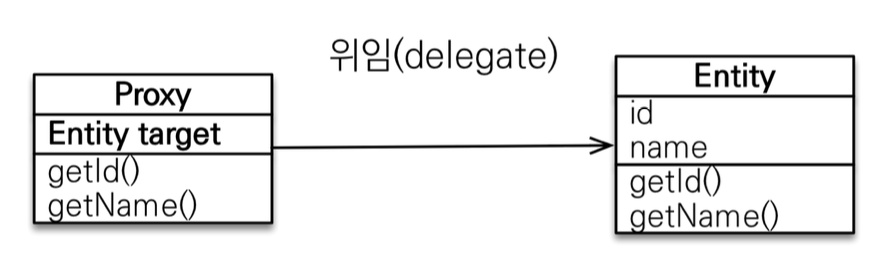
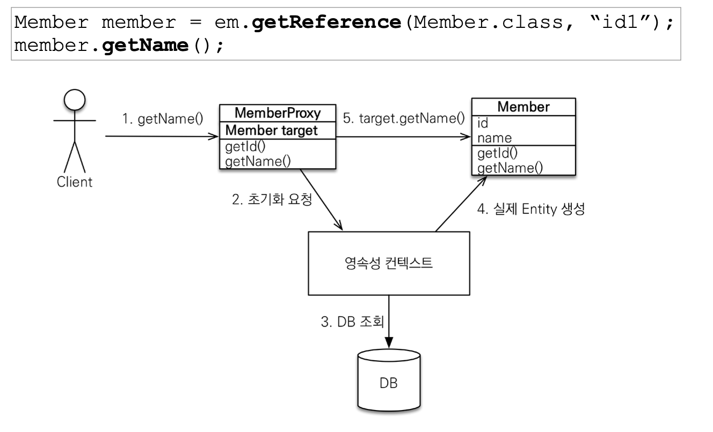
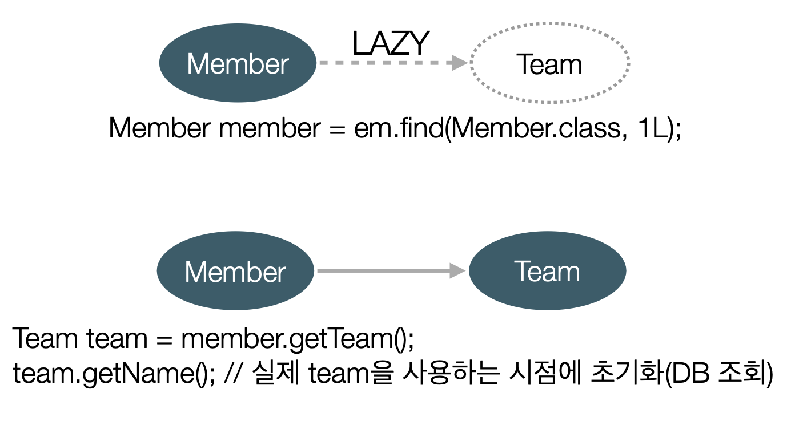
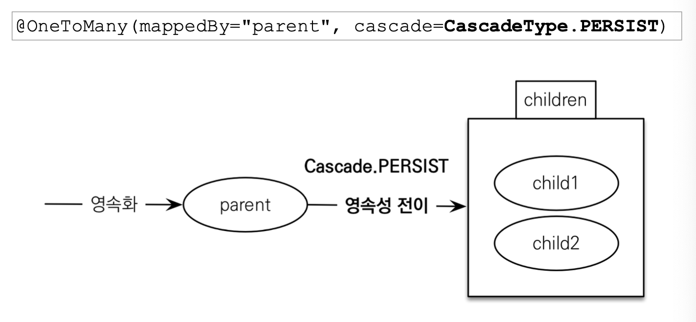

## 8. 프록시와 연관관계 관리
- 까다로운 부분, 이번 장에서 한 번에 정리함
- 목차
    - 프록시
    - 즉시 로딩과 지연 로딩
    - 지연 로딩 활용
    - 영속성 전이: CASCADE
    - 고아 객체
    - 영속성 전이 & 고아 객체, lifecycle
---
### 프록시 객체
- 실제 클래스를 상속 받아 만들어진, 실 클래스와 겉 모양이 같은 "가짜" 객체
    - 프록시 객체는 실제 객체의 참조(target)을 보관
    - 프록시 객체를 호출하면 프록시 객체는 실제 객체의 메소드를 호출
        - 
- JPA에서 Lazy Loading을 지원하기 위해 도입
- 사용하는 입장에서 프록시 객체와 실제 객체를 구분하지 않음
    - 이론상으로는 그렇지만, 실제로는 클래스 비교에 `instance of`를 사용하는 등 주의 필요
- 예시. 프록시 객체 초기화, 조회
    - 
- 프록시의 특징은 다음과 같음
    - 프록시 객체는 처음 사용할 때 한 번만 초기화
    - 초기화할 때, 프록시 객체를 통해 실제 엔티티에 접근 가능하게끔 이어짐
    - 영속성 컨텍스트에 찾는 엔티티가 이미 있으면 `em.getReference()`를 호출해도 실 엔티티 반환
    - 준영속 상태에서 프록시를 초기화하면 문제 발생
        - `org.hibernate.LazyInitialzationException`

### 지연 로딩(Lazy Loading)
> `@ManyToOne(fetch = FetchType.LAZY)`
- 지연 로딩(`FetchType.LAZY`)으로 설정하면
    - 초기화 시점에서는 **관계 엔티티**를 **프록시 객체**로 가지고 있음
        - 초기화에서 관계 엔티티를 DB에서 조회하지 않음
        - 실제로 사용하는 시점에서 DB에서 조회하여 프록시 객체에 연결
        - 
- 즉시 로딩(`FetchType.EAGER`)으로 설정하면
    - 초기화 시점에 관계 엔티티를 전부 DB에서 조회
    - JPQL에서 **N+1 Problem**를 일으킴
        - 1의 SQL를 사용할 때 예상하지 못한 추가 SQL이 N만큼 실행
            1. 모든 연관관계를 LAZY로 설정
            2. FETCH JOIN ... 
                - 직접 관계된 엔티티를 FETCH
- `@ManyToOne`, `@OneToOne`은 기본이 즉시 로딩
    - FetchType을 직접 LAZY로 설정
- `@OneToMany`, ~~@ManyToMany~~ 는 기본이 지연 로딩
- 지연 로딩 정리
    - **모든 연관관계에 지연 로딩을 사용할 것**
    - 실무에서는 즉시 로딩을 사용하지 말 것
        - **즉시 로딩이 필요한 상황**이면 JPQL **fetch join**이나 **entity graph** 기능을 사용
---

### 영속성 전이: CASCADE
- 영속화할 때 제공하는 편의 기능
- 특정 엔티티를 영속화할 때, 자식 엔티티도 같이 영속화하고 싶을 때 설정
- 예시. 부모 엔티티를 저장할 때 자식 엔티티도 함께 저장
    ```java
        Child child1 = new Child();
        Child child2 = new Child();
        Parent parent = new Parent();
        parent.addChild(child1, child2); // 양방향 연관관계 설정 메서드
    ```
    - `cascade = {}`
        ```
            em.persist(parent);
            em.persist(child1);
            em.persist(child2);
        ```     
    - `cascade = CascadeType.PERSIST`
        ```
            em.persist(parent); // child도 모두 em.persist() 날림
        ``` 
    - 
- cascade 옵션
    1. PERSIST
        - `em.persist(parent)`에서 child를 모두 영속화
    2. REMOVE
        - `em.remove(parent)`에서 child를 모두 영속 삭제
            - child가 parent에 의존적일 때 유용
    3. MERGE
    4. REFRESH
    5. DETACH
    6. **ALL**
        - PERSIST + REMOVE + ... 전부 적용
- CASCADE 주의점
    1. 영속성 전이는 연관관계 매핑과 아무 관련이 없음
    2. 부모 엔티티의 영속성을 다룰 때 **자식의 영속을 같이 다루는 편의 기능**일 뿐임

### 고아 객체
- 부모 엔티티와 연관관계가 끊어진 자식 엔티티
    - 자식 엔티티가 부모에 종속적이면 삭제해주는 게 좋음
        - 예시. employee가 가지는 부양가족
    - 고아 객체 삭제 관리 : `orphanRemoval`
        - 사용: `orphanRemoval = true`
        - `@OneToOne`, `@OneToMany`에만 설정 사용 가능
- 자식 엔티티가 부모 엔티티에 종속적인 상황이면 자식 엔티티에 다음 옵션 사용
    - `@OneToMany(cascade = CascadeType.ALL, orphanRemoval = true)`
    - -> 부모 엔티티가 자식 엔티티의 생명주기를 관리할 수 있음

---  
## 다음 글 

### 9. [값 타입](9-값-타입.md)
