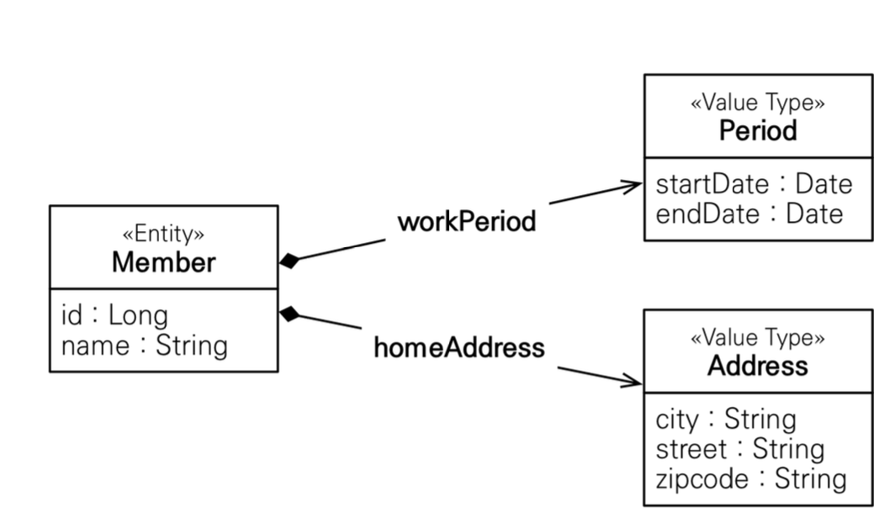
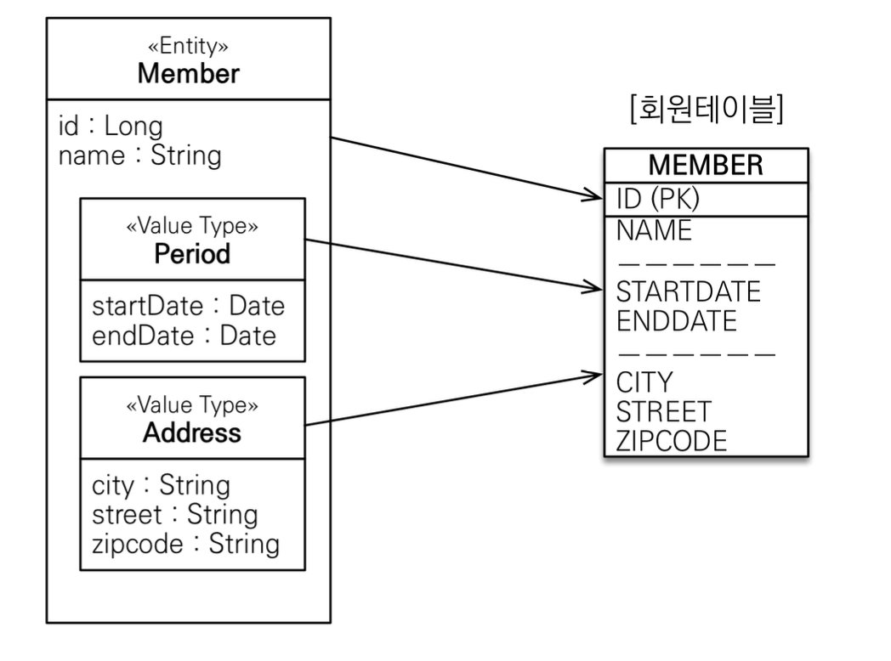
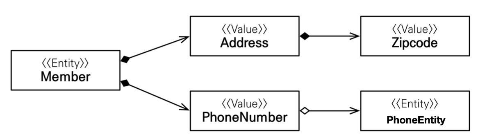
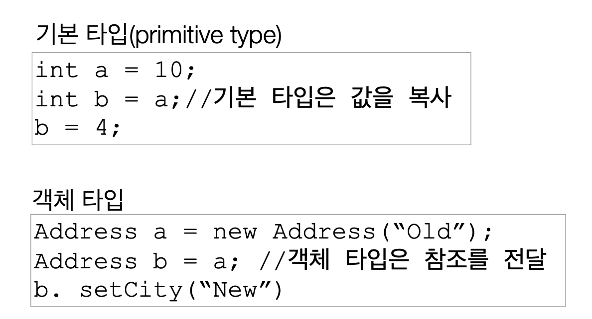
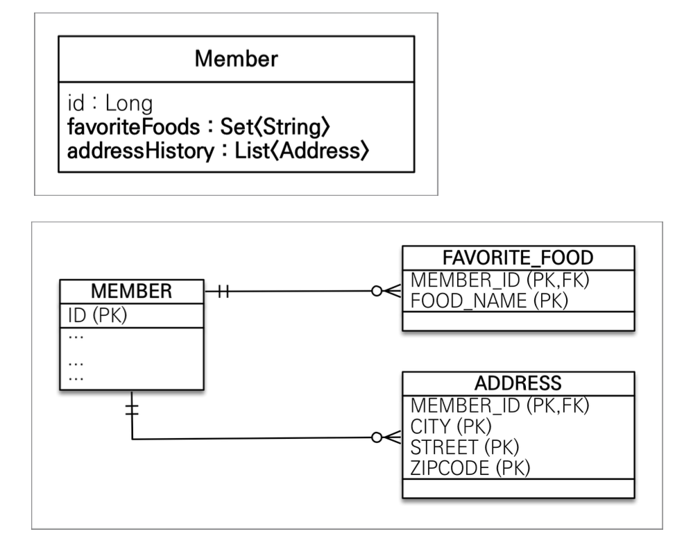

## 9. 값 타입
### 목차
- 기본값 타입
- **임베디드 타입**
    - = 복합 값 타입
- 값 타입과 불변 객체
- 값 타입의 비교
- 값 타입 **컬렉션**
    - deprecated, 1:N 엔티티로 풀어낼 것

### JPA의 데이터 타입
- 엔티티 타입
    - `@Entity`로 정의하는 객체
    - 데이터가 변해도, 대응하는 식별자(~PK)로 지속해서 추적 가능한 데이터
    - 예시. 회원 엔티티의 키, 나이를 변경해도 식별자로 인식 가능
- 값 타입
    - int, Long, String처럼 단순히 값으로 사용하는 자바 기본 타입이나 객체
    - 식별자가 따로 없고, 값만 있으므로 변경 시에 추적이 불가능함
    - 종류는 다음과 같음
        1. **기본값 타입**
            - `javax.*` Primitive type
            - 자바 기본 타입 - int, double
            - 래퍼 클래스 - Integer, Long
            - String
        2. 임베디드 타입(embedded type, 복합 값 타입)
        3. 컬렉션 값 타입(collection value type)

### 기본값 타입 
- 예시. `String name`, `int age`
- **생명주기를 엔티티에 의존**
    - 기본 타입은 항상 값을 복사함
- 값 타입을 공유해서는 안 됨
    > JPA에서는 어떤 점이 특별하길래 이런 내용을 강조할까?

### 임베디드 타입
- 새로운 값 타입을 **직접 정의**할 수 있음
- **ERD의 복합(composite) 애트리뷰트**에 대응함
- 예시. Member: id, name, startDate, endDate, city, street, zipcode
    - {startDate, endDate}, {city, street, zipCode}로 composite
        - -> workPeriod, homeAddress
    - 임베디드 타입을 이용해 엔티티의 필드를 다음 사진과 같이 정의
        - 
- 장점은 다음과 같음
    1. 재사용 가능
    2. 높은 응집도
        - Period.isWork()처럼 해당 값 타입만 사용하는 임베디드 메서드를 만들 수 있음
- 임베디드 타입과 테이블 매핑
    - 
    - 임베디드 타입을 어떻게 매핑하냐에 따라 테이블에 구조가 변하지는 않음
        - 고정된 테이블 구조를 보고 엔티티의 임베디드 타입을 설계
    - 임베디드 타입을 이용하여 객체와 테이블을 **세밀하게 매핑**할 수 있음
        - 잘 설계한 애플리케이션은 매핑한 테이블의 수보다 클래스의 수가 더 많음
    - 예시. PhoneNumber 임베디드 필드가 PhoneEntity를 필드로 가지고 있는 경우
        - 
        - 임베디드 타입이 엔티티를 필드로 가질 수 있음
- 예시. 한 엔티티에서 같은 임베디드 타입을 사용
    - 임베디드 타입 내 필드 이름이 같아 중복 문제가 생긴 상황
    - `@AttributeOverrides` 사용하여 이름 재정의
        ```
        @AttributeOverrides({
            @AttributeOverride(name="city", column=@Column("work_city")), 
            @AttributeOverride(name="street", column=@Column("work_street")),
            ...
        })
        ```

### 값 타입과 불변 객체
- 필드의 인스턴스를 공유하는 행위는 매우 위험
    - = 할당에서, 기본 타입은 값을 복사하지만 객체 타입은 레퍼런스를 전달함
        - 
- 레퍼런스 공유를 컴파일러 레벨에서 막을 방법은 없음
    - 값 타입을 **불변 객체로 설계**할 것
        - 불변 객체: 생성 시점 이후에는 값을 변경할 수 없는 객체
        - 생성자로만 값을 설정하고, Setter를 만들지 말 것
        - UPDATE: **객체를 새로 생성**하여 갈아 끼움
            ```
            Address oldAddress = new Address(10, "incheon");
            // address.setCity("New"); // compile error
            Address newAddress = new Address(20, "newCity");
            ```

### 값 타입의 비교
- 동일성 비교 : identity
    - 인스턴스의 참조 값을 비교
        - `a == b`
- 동등성 비교 : equaivalence
    - 인스턴스의 값을 비교
        - `a.equals(b)`
- 정의한 임베디드 타입에 `equals` 메서드를 사용하려면 `@override` 하여 정의
    - Generate - [Equals() and Hashcode()]
        - Check "use getters during code generation"

### ~~값 타입 컬렉션~~
- 예시 상황. `HashSet<>`, `ArrayList<>` 컬렉션을 사용하는 필드 추가
    
- 값 타입 컬렉션은 하나 이상의 **기본 값, 임베디드 값**을 저장할 때 사용
    - `@ElementCollection`
- 컬렉션을 저장하기 위한 별도의 테이블이 필요함
    - `@CollectionTable(name = "", joinColumns = {})`
- 생명주기를 엔티티에서 관리함
    1. 기본 설정: cascade = ALL, orphanRemoval = true
    2. 기본 설정: Lazy-Loading
### 값 타입 컬렉션의 한계
1. 기본 값, 임베디드 값은 엔티티와 다르게 **식별자 개념이 없음**
    - 값 변경 시에 추적이 어려움
2. (로직상)변경 사항이 발생하면 **모든 데이터를 삭제하고, 현재 값을 모두 다시 저장함**

- 실무 상황에서는 **값 타입 컬렉션 대신에 일대다 관계를 고려**할 것
    - 관계형 데이터는 PK, FK로 다루어야 관리하기 좋음
    - 일대다 관계를 위한 엔티티를 생성, 필드에 값 타입을 사용
    - `@OneToMany`에 `cascade = ALL, orphanRemoval = true` 설정

---  
## 다음 글

### 10. [객체지향 쿼리 언어1 - 기본 문법](10-객체지향-쿼리-언어1-기본-문법.md)