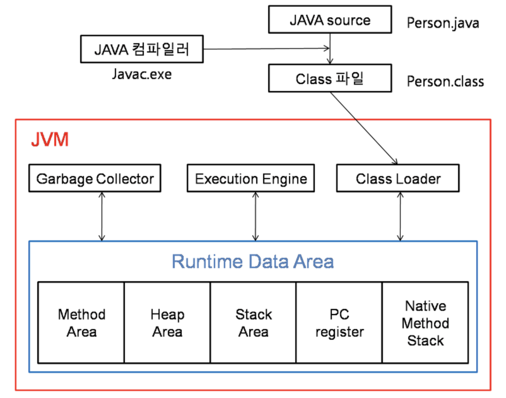

## 컴파일, 빌드, 런타임
- 자바 코드의 수행 과정은 다음과 같음
    - 
1. 컴파일
    - 개발자의 소스코드를 바이너리 코드로 변환하는 과정을 말함
    - 자바의 경우, 자바 가상머신(JVM)에서 실행가능한 바이트코드 형태의 `.class` 파일이 생성됨
        - `Main.java` -> `Main.class`
2. 빌드
    - 소스코드 파일을 **실행가능한 소프트웨어 산출물**로 만드는 일련의 과정
    - `JAR`, `WAR` 등의 실행 가능한 파일을 만드는 작업을 일컬음
        - `Main.java`, `HelloController.java`, ... -> `java-v1.0.0.jar`
    - **빌드 단계에 컴파일이 포함**, 컴파일은 빌드의 부분집합이라 할 수 있음
    - 빌드 과정을 도와주는 도구를 빌드 툴이라고 함
        - 전처리(preprocessing), 컴파일(Compile), 패키징(packaging), 테스팅(testing), 배포(distribution) 기능을 제공
        - 빌드 툴 예시. `Ant`, `Maven`, `Gradle`
3. 런타임
    - 빌드를 마친, 실행가능한 소프트웨어 산출물의 (JVM 위에서의) **동작 시점**을 말함

### 참고자료
- JVM Internal, https://d2.naver.com/helloworld/1230
- JVM 구조와 자바 런타임 메모리 구조, https://jeong-pro.tistory.com/148
