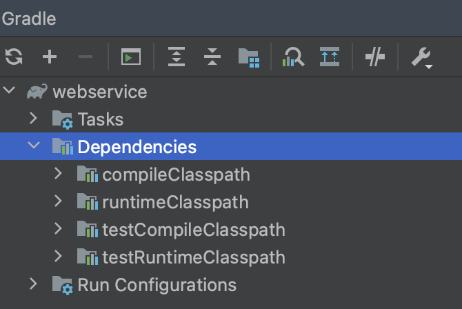
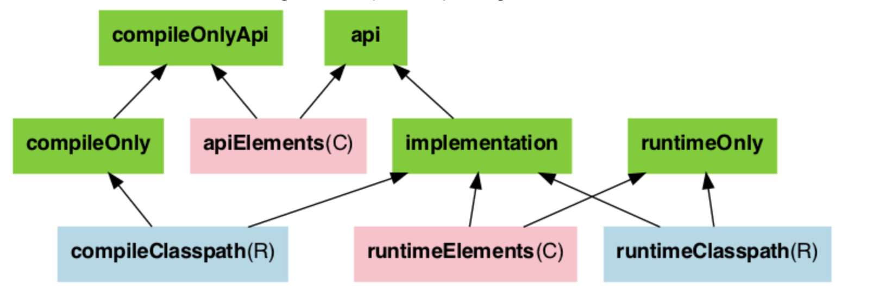

## gradle build 설정

> [컴파일, 빌드, 런타임](../java/컴파일-빌드-런타임.md)에 대한 사전지식이 필요함

### Classpath
- 클래스나 jar 파일이 존재하는 위치
- `Classpath`는 `Compile-time classpath`와 `Run-time classpath`로 나누어짐
    - 
    - `Compile-time classpath`는 에러없이 **컴파일을 하기위해 필요한 클래스**와 jar들의 위치를 나타냄
    - `Run-time classpath`는 애플리케이션을 정상적으로 실행하기 위해 필요한 클래스들과 jar들의 경로임

### dependencies
- dependency configurations는 다음과 같음
    - 
- 예시.
    ```gradle
    dependencies {
       implementation 'org.springframework.boot:spring-boot-starter-jdbc' //JDBC Driver 추가 
       runtimeOnly 'com.h2database:h2' 
       compileOnly 'org.projectlombok:lombok'
    }
    ```
- 의존성을 관리하기 위한 옵션은 다음과 같음
    1. `compileOnly`
        - `testCompileOnly`
    2. `runtimeOnly`
        - `testRuntimeOnly`
    3. `implementation`
        - `testImplementation`
    4. ~~`apiElements`~~

#### compileOnly
- 라이브러리가 컴파일 시점에만 필요하다는 것을 나타냄
- **프로젝트 빌드 시점에만 라이브러리를 사용**하고, 소프트웨어 산출물에는 포함시키지 않음
- 예시. lombok을 `compileOnly` 옵션으로 추가
    ```gradle
    dependencies {
        // ...
	    compileOnly 'org.projectlombok:lombok'
    }
    ```
    - 컴파일 시에 `getter`, `setter` 등 필요한 것만 생성시키고, 런타임에는 사용하지 않음

#### runtimeOnly
- 라이브러리가 런타임 시점에 필요하다는 것을 나타냄
- (빌드를 거친) *프트웨어 산출물의 **실행 시점에만 필요한 경우**에 라이브러리를 프로젝트에 포함시킴
    - 컴파일 타임에는 필요 없는데 런타임에는 의존하는 것들을 `runtimeOnly`로 설정함
- DB와 로그 관련 depencendy가 `runtimeOnly`에 포함됨
- 예시. h2 데이터베이스 depencency를 `runtimeOnly` 옵션으로 추가
    ```gradle
    dependencies {
        // ...
       runtimeOnly 'com.h2database:h2' 
    }
    ```
    - 빌드 시점에는 추가되지 않고, 런타임에 필요한 경우에만 프로젝트에 포함됨

#### implementation
- 컴파일 타임, 런타임 모두 필요로 하는 라이브러리를 지정함
- 애매한 경우에는 `implementation`으로 해결 가능
    - 하지만, 소프트웨어의 크기가 늘어남

#### ~~apiElements~~
- 추이 의존성(Transitive Dependency)을 허용하는 implementation
- implementation 대비 성능적으로 손해를 봄
- 최대한 `implementation`을 사용하고, `api`는 사용하지 않는 것이 좋음

### 참고자료
- \[Java\] 컴파일과 빌드의 차이점, https://wooono.tistory.com/70
- \[Spring\] Gradle 파일 implementation, api, runtimeOnly, compileOnly... 등에 대해, https://bepoz-study-diary.tistory.com/372
- \[Java\] 자바 컴파일 과정 & JVM 내부 구조, https://velog.io/@minseojo/Java-자바-컴파일-과정-JVM-내부-구조
