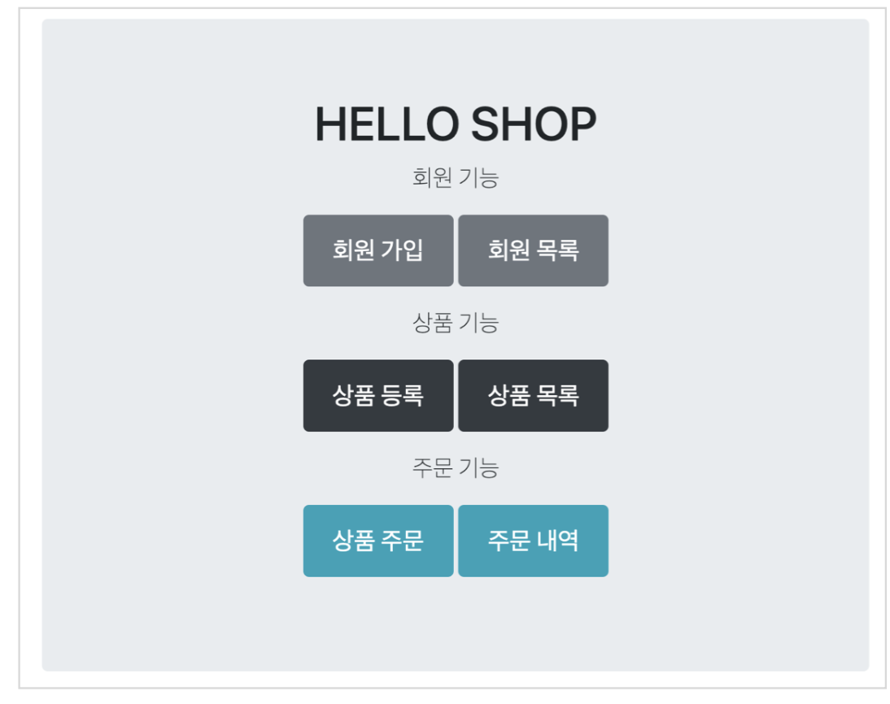
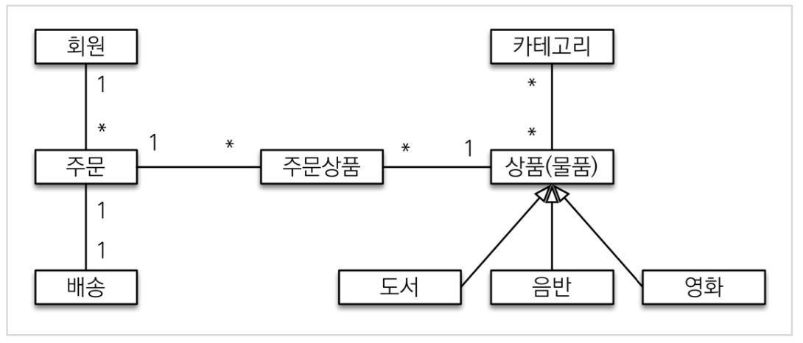
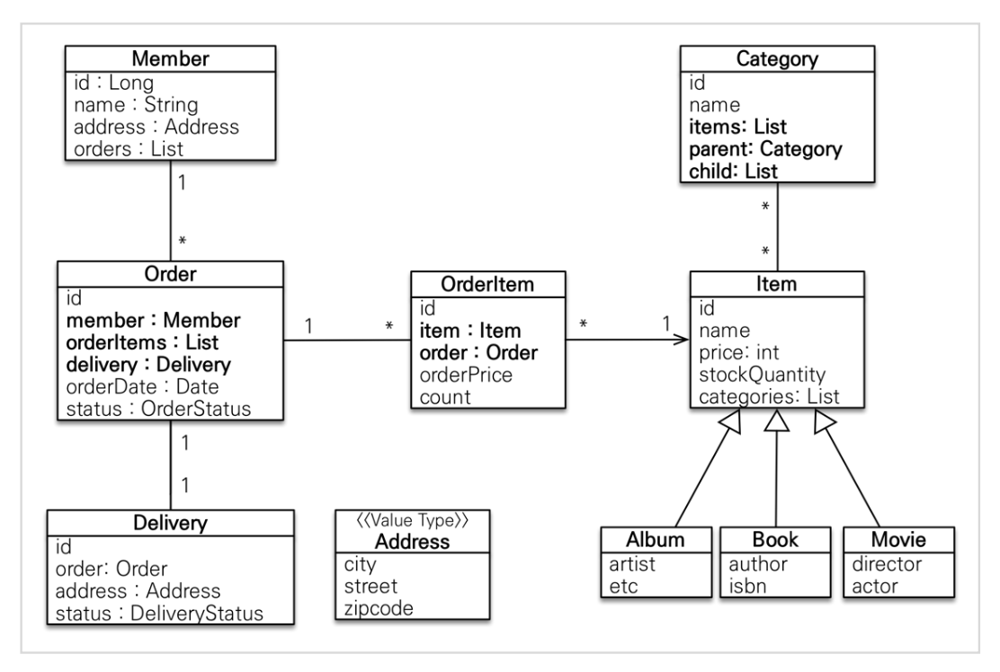
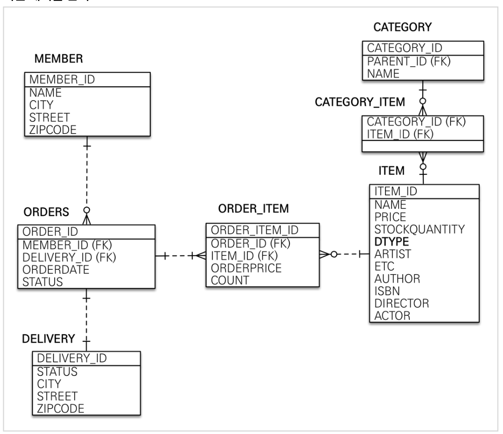

## 2. 도메인 분석 설계

### 도메인 분석 설계

- 요구사항은 다음과 같음
    - 
    - 회원 기능 
        - 회원 등록
        - 회원 조회 
    - 상품 기능
        - 상품 등록
        - 상품 수정
        - 상품 조회
    - 주문 기능 
        - 상품 주문
        - 주문 내역 조회
        - 주문 취소
    - 기타 요구사항
        1. 상품은 재고 관리가 필요하다.
        2. 상품의 종류는 도서, 음반, 영화가 있다. 
        3. 상품을 카테고리로 구분할 수 있다.
        4. 상품 주문시 배송 정보를 입력할 수 있다.
- 회원 도메인 모델은 다음과 같음
    - 
- 회원 엔티티는 다음과 같이 분석할 수 있음
    - 
        - JPA로 표현할 수 있는 모든 관계를 담은 내용임
        - 이때 1:1은 일대일, 1:* 일대다, \*:\* 는 다대다
            - 다대다는 실무에서 쓰면 안 됨, 기본편 참고
        - 양방향 관계 또한 권장하지 않음
    - 회원(Member)
        - 이름과 임베디드 타입인 주소(Address), 그리고 주문(`orders`) 리스트를 가짐
    - 주문(Order)
- 회원 테이블은 다음과 같이 분석할 수 있음
    - 
    - `CATEGORY`와 `ITEM`은 다대다 관계이므로 `CATEGORY_ITEM`을 중간에 끼어둠
        - 다대다 관계는 일대다 -> 매핑 테이블 -> 다대일로 풀어서 설계함
- 연관관계 매핑 분석
    - **회원과 주문**
        - 일대다, 다대일의 양방향 관계
        - 따라서 연관관계의 주인을 정해야 함
            - 외래 키가 있는 주문을 연관관계의 주인으로 정하는 것이 좋음
            > (기본편 내용) 외래키가 가까운 곳에 있는 거를 연관관계의 주인으로 정하는 것이 편함
        - 그러므로 `Order.member` 를 `ORDERS.MEMBER_ID` 외래 키와 매핑함
    - **주문상품과 주문**
        - 다대일 양방향 관계
    - **주문상품과 상품** 
        - 다대일 단방향 관계
    - **주문과 배송**
        - 일대일 양방향 관계
    - **카테고리와 상품**
        - `@ManyToMany`를 사용하여 매핑함
            - 실무에서는 `@ManyToMany`를 절대 사용하지 말 것
            - 사용하더라도, 미리 relation을 테이블 형태로 resolve 할 걳
>  참고: 외래 키가 있는 곳을 연관관계의 주인으로 정해라.

> 연관관계의 주인은 단순히 외래 키를 누가 관리하냐의 문제이지 비즈니스상 우위에 있다고 주인으로 정하면 안된다. <br/>예를 들어서 자동차와 바퀴가 있으면, 일대다 관계에서 항상 다쪽에 외래 키가 있으므로 외래 키가 있는 바퀴를 연관관계의 주인으로 정하면 된다. <br/>물론 자동차를 연관관계의 주인으로 정하는 것이 불가능 한 것은 아니지만, 자동차를 연관관계의 주인으로 정하면 자동차가 관리하지 않는 바퀴 테이블의 외래 키 값이 업데이트 되므로 관리와 유지보수가 어렵고, 추가적으로 별도의 업데이트 쿼리가 발생하는 성능 문제도 있다. <br/>자세한 내용은 JPA 기본편을 참고하자.

### 엔티티 클래스 개발

- RDB **다대다 관계** 풀어내기
    - 중간 테이블 매핑을 해줘야 함
    - **객체**는 컬렉션 관계가 있어서 다대다 관계가 가능함
    - 관계형 DB는 컬렉션 관계를 양쪽에 가질 수 없음
        - 따라서 **일대다, 다대일로 풀어내는 중간 테이블**을 가져야 함
    - 실전에서 쓰지 말라고 하는 이유
        - 딱 이 그림밖에 안 됨
            - 더 필드를 추가할 수가 없어서 실무에서 거의 못 씀
                - 실무에서는 단순하게 매핑하는 상황이 없기 때문에
- `ITEM` 테이블은 싱글테이블 전략을 사용했으므로 DTYPE이 만들어짐 
- JPA는 테이블을 만들 때 ALTER 해서 foreign key를 다 잡아줌
    - 유연함이 중요하면 foreign key를 빼도 됨
    - 돈과 관련된 거면 foreign key를 걸어주는 게 나을 수도 있음

> 참고: 엔티티의 식별자는 `id` 를 사용하고 PK 컬럼명은 `member_id` 를 사용했다. <br/>엔티티는 타입(여기서는 `Member`)이 있으므로 `id` 필드 만으로 쉽게 구분할 수 있다. <br/>테이블은 타입이 없으므로 구분이 어렵다. 그리고 테이블은 관례상 `테이블명 + id` 를 많이 사용한다. <br/>참고로 객체에서 `id` 대신에 `memberId`를 사용해도 된다. 중요한 것은 일관성이다.

- Address 와 같은 값 타입은 변경 불가능하게 설계해야 함
    - `@Setter`를 제거하고, 생성자에서 값을 모두 초기화해서 변경 불가능한 클래스로 만들 것
    - JPA 특성상 엔티티나 임베디드 타입(`@Embeddable`)은 자바 기본 생성자를 `public` or `protected` 로 설정해야 함
        - `public` 보다는 `protected`로 설정하는 것이 그나마 더 안전함
        - JPA 구현 라이브러리가 객체를 생성할 때 리플렉션 같은 기술을 사용할 수 있도록 지원해야 하기 때문임
            - `JAVA Reflection` : 구체적인 클래스 타입을 알지 못해도, 그 클래스의 메소드, 타입, 변수들에 접근할 수 있도록 해주는 자바 API

### 엔티티 설계시 주의점
1. 엔티티에는 가급적 Setter를 사용하지 말자
2. 모든 연관관계는 **지연(`LAZY`)로딩**으로 설정할 것
    - 실무에서 **매우 중요**, **성능 최적화** 문제
    - 즉시로딩(`EAGER`) 
        - 예시. Member를 조회할 때, Member에 필요한 연관된 Order를 한 번에 조회하는 것
        - 예측이 어렵고, 어떤 SQL이 실행될지 추적하기가 어려움
        - 최악의 경우, 엔티티가 전부 연관되었을 때 싹 다 호출이 됨
    - 연관된 엔티티를 함께 DB에서 조회해야 하면 fetch join 또는 엔티티 그래프를 사용해야 함
        - 예시. order 조회할 때 member도 같이 필요한 상황, 기본편에서 설명했음
    - `@OneToOne`, `@ManyToOne`은 **기본 전략이 즉시로딩**임
        - **직접 지연로딩으로 설정**해야 성능 최적화가 가능함
        - 반면에 `@OneToMany`는 기본 전략이 `Lazy`임
3. 컬렉션은 **필드**에서 초기화할 것
    - `private List<OrderItem> orderItems = new ArrayList<>()`
    - 빠른 초기화
    - `null` 문제에서 안전함, `NullPointerException`
    - hibernate가 entity를 persist 하는 순간 컬렉션을 한 번 감싸고 지지고 볶음
        - 이후 hibernate가 제공하는 내장 컬렉션으로 변경함
            ```java
              Member member = new Member();
              System.out.println(member.getOrders().getClass());
              em.persist(member);
              System.out.println(member.getOrders().getClass());
            ```
            ```log
            class java.util.ArrayList
            class org.hibernate.collection.internal.PersistentBag
            ```
        - 이후 컬렉션에 수정이 없어야 안전함
            - 수정하면 hibernate가 원하는 매커니즘대로 동작을 안할 수도 있음
4. 테이블과 컬럼명을 생성하는 전략
    - 하이버네이트 기존 구현: 
        - 엔티티의 필드명을 그대로 테이블의 컬럼명으로 사용 ( `SpringPhysicalNamingStrategy` )
    - 스프링 부트 신규 설정: 엔티티(필드) -> 테이블(컬럼)
        1. 카멜 케이스 -> 언더스코어
            - memberPoint -> member_point
        2. .(점) -> 언더스코어
        3. 대문자 -> 소문자

---
## 다음 글

### 3. [애플리케이션-구현-준비](3-애플리케이션-구현-준비.md)

---