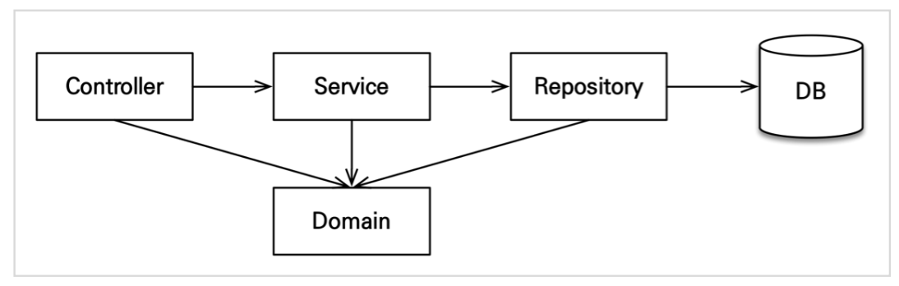

## 3. 애플리케이션 구현 준비

> 1회차는 빠르게 진행

### 구현 요구사항 

- 먼저 핵심 비즈니스 메서드를 구현할 예정
- 이후 화면을 구현할 것
- **예제를 단순화**하기 위해 다음 기능은 구현하지 않음
    - 로그인, 권한 관리
    - 파라미터 검증과 예외 처리 최소화
        - 스프링 MVC 강의 쪽에 많음
    - 상품은 도서만 사용
    - 카테고리는 사용하지 않음
        - 여러분들의 숙제로 남길 것
    - 배송 정보는 사용하지 않음

### 애플리케이션 아키텍처
- 다음 구조로 구현할 예정
    - 
- **계층형 구조** 사용
    - controller, web: 웹 계층
        - repository에 바로 접근할 수도 있는, 유연한 구조로 만듦
        - 단방향 구조는 지킴
    - service: 비즈니스 로직 및 트랜잭션 처리
    - repository: JPA를 직접 사용하는 계층, entitymanager 사용
    - domain: 엔티티가 모여있는 계층, 모든 계층에서 사용
- 패키지 구조는 다음과 같음
    - jpabook.jpashop 
        - domain
        - exception 
        - repository 
        - service  
        - web
- 다음 목차를 지켜 개발할 예정
    - 회원 도메인 개발
    - 상품 도메인 개발
    - 주문 도메인 개발
    - 웹 계층 개발
    - API 개발 기본
    - API 개발 고급

### 회원 도메인 개발

---
## 다음 글

### 4. [회원-도메인-개발](4-회원-도메인-개발.md)

---