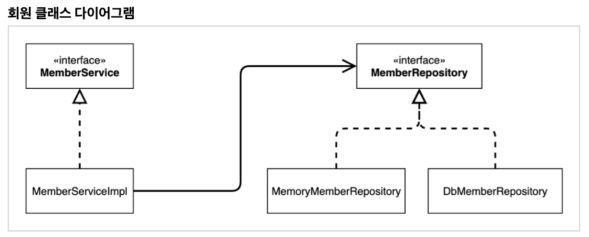

## 목차

1. 객체 지향 설계와 스프링
2. 스프링 핵심 원리 이해1 - 예제 만들기
3. 스프링 핵심 원리 이해2 - 객체 지향 원리 적용 
4. 스프링 컨테이너와 스프링 빈
5. 싱글톤 컨테이너
6. 컴포넌트 스캔
7. 의존관계 자동 주입
8. 빈 생명주기 콜백
9. 빈 스코프
10. 다음으로

---

## Sect01. 객체 지향 설계와 스프링

- 스프링은 좋은 **객체 지향 애플리케이션**을 개발할 수 있게 도와주는 프레임워크
- 객체 지향 원리 중 다형성을 살려 코드를 역할과 구현으로 구분하면 코드가 단순해지고, 유연해지며 변경도 용이해짐

### 좋은 객체 지향 설계를 위한 SOLID 원칙
> SRP(단일 책임), OCP(개방-폐쇄), LSP(리스코프 치환), ISP(인터페이스 분리), DIP(의존관계 역전)

1. SRP(Single responsibility principle, 단일 책임 원칙)
    - 하나의 클래스는 하나의 책임만 가져야 함, 코드 변경이 있을 때 파급 효과가 적으면 단일 책임 원칙을 잘 따른 것

2. OCP(Open/closed principle, 개방-폐쇄 원칙)
    - 소프트웨어 요소는 **확장에는 열려** 있으나 **변경에는 닫혀** 있어야 함. 아래 코드는 클라이언트 코드를 수정해야 사용 가능하므로 OCP 위반
    ```java
    public class MemberService {
        //  MemberRepository m = new MemoryMemberRepository();
        MemberRepository m = new JdbcMemberRepository();
    }
    ```

3. LSP(Liskov substitution principle, 리스코프 치환 원칙)
    - 하위 클래스는 인터페이스 규약을 전부 지켜야 함, 다형성을 활용할 때 인터페이스를 믿고 사용하게끔. `turnLeft()` 함수는 (어떤 방식이든 상관 없이) 규약에 맞게 왼쪽으로 돌아야 함

4. ISP(Interface segregation principle, 인터페이스 분리 원칙)
    - 특정 클라이언트를 위한 인터페이스 여러 개가 범용 인터페이스 하나보다 나음. 인터페이스를 분리할 수록 인터페이스가 명확해지고, 대체 가능성이 높아짐

5. DIP(Dependency inversion principle, 의존관계 역전 원칙)
    - 클라이언트는 구현 클래스에 의존하지 말고, 인터페이스에 의존하여 코드를 작성해야 함. DIP를 지켜야 유연하게 구현체를 변경할 수 있음

### SOLID 원칙을 지키기 위한 스프링 프레임워크

- 순수 자바로 OCP, DIP 원칙들을 지키면서 개발을 해보면, 결국 스프링 프레임워크를 만들게 됨 (더 정확히는 DI 컨테이너)

- 스프링은 다음 기술로 다형성 + OCP, DIP를 가능하게 지원
    - DI(Dependency Injection): 의존관계, 의존성 주입
    - DI 컨테이너 제공

### 추상화 비용, 실무적인 고민

- 인터페이스를 도입하면 **추상화라는 비용**이 발생함
- 따라서 기능을 확장할 가능성이 없다면 구체 클래스를 직접 사용하고, 향후 확장 때 **리팩터링**해서 인터페이스를 도입하는 것도 좋은 방법임
 
--- 

## Sect02. 스프링 핵심 원리 이해1

> 지금은 스프링 없는 순수한 자바로만 개발을 진행한다는 점을 꼭 기억하자! 스프링 관련은 한참 뒤에 등장한다.

- 회원 도메인 협력 관계

> 기획자도 볼 수 있는 그림


- 먼저, 간단한 자바 코드로 메모리 회원 저장소로 개발을 진행함
- 이후에 DB를 선택해, 교체하면 좋겠다!


- 회원 클래스 다이어그램

> 실제 서버를 실행하지 않고 클래스만 분석해서 볼 수 있는 그림



- 회원 객체 다이어그램?

> 실제 서버 실행 시 클라이언트가 사용하는 다이어그램


- 회원 서비스는 `MemberServiceImpl` 로 구현

- 단일 테스트는 스프링 컨테이너 도움 없이 자바 코드로만 구현하는 테스트를 의미함

- (하지만, 객체 지향 원리인 DIP, OCP는 지켜지지 않음)

--- 

## Sect03. 스프링 핵심 원리 이해2 - 객체 지향 원리(SOLID) 적용

### 순수 자바 코드의 한계

- 현재 코드는 기능을 확장하여 변경하면, 클라이언트 코드에 영향을 주어 OCP를 위반함

```java
public class OrderServiceImpl implements OrderService{
    // private final DiscountPolicy discountPolicy = new FixDiscountPolicy(); 
    private final DiscountPolicy discountPolicy = new RateDiscountPolicy(); 
} 
```

- 또한, 추상에만 의존하도록(DIP) 해야 하는데, 클라이언트 코드에 구체 클래스 또한 명시됨

- DIP를 지키기 위해, 추상 클래스에만 의존하도록 코드를 변경한다면? `NullPointerException`이 발생함
 
```java
public class OrderServiceImpl implements OrderService {
    private DiscountPolicy discountPolicy;  
} 
```

- 해결 방안: **누군가**가 클라이언트인 `OrderServiceImpl`에 DiscountPolicy의 **구현 객체를 대신 생성하고 주입**해준다면?

### AppConfig 도입

- 애플리케이션 운영의 전반적인 구성을 책임지는, 공연으로 따지면 공연 기획자 도입

- AppConfig는 생성한 객체 인스턴스의 참조(레퍼런스)를 생성자를 통해서 주입(연결) 해줌

- 클라이언트인 `OrderServiceImpl` 입장에서 보면 의존관계를 마치 외부에서 주입해주는 것 같다고 해서 DI(Dependency Injection)라고 함

- AppConfig를 분리 제작하여 사용 영역과 구성 영역을 다음 그림같이 분리할 수 있음


- DiscountPolicy를 Fix에서 Rate로 변경한다 하더라도 구성 영역만 코드를 수정하면 됨, 영향 범위가 엄청나게 작아짐

- 클라이언트 코드에서 DIP, OCP를 만족하게끔 리팩토링함

### IoC, DI Container

- 클라이언트 코드는 자신의 로직을 실행하는 역할만 담당했고, 제어 흐름은 AppConfig에서 관리했음

- 이처럼 프로그램의 제어 흐름을 직접 제어하는 것이 아니라 외부에서 관리하는 것을 **제어의 역전**(IoC, Inversion of Control)이라 함

- 정적인 클래스 의존관계 : 클래스가 사용하는 import 코드만 보고 쉽게 판단할 수 있는 의존관계
- 동적인 클래스 의존관계 : 애플리케이션 실행 시점에 실제 참조로 연결된 의존관계

- 애플리케이션 **실행 시점**(런타임)에 외부에서 실제 구현 객체를 생성하고 클라이언트에 전달해서 클라이언 트와 서버의 실제 의존관계가 연결 되는 것을 **의존관계 주입**(DI, Dependency Injection)이라 함

- **의존관계 주입**을 사용하면 **동적인 객체 인스턴스 의존관계**를 **쉽게 변경**할 수 있음

- AppConfig처럼 객체를 생성하고 관리하면서 의존관계를 연결해 주는 것을 DI 컨테이너(=IoC 컨테이너)라고 함
- Spring만 DI 컨테이너 역할을 하는 것이 아님. 여러 DI 컨테이너 오픈소스가 많음

### Spring Container 사용

- 기존에는 `AppConfig`로 직접 객체를 생성하고 DI를 했지만, 이제부터는 **스프링 컨테이너**를 통해 주입함

- Spring Container를 사용하기 위해 AppConfig, psvm을 다음과 같이 리팩토링함

```java
@Configuration
public class AppConfig {

    // 스프링 컨테이너에 스프링 빈으로 등록
    @Bean
    public MemberRepository memberRepository() {
        return new MemoryMemberRepository(); // use Memory Repository
    }
    // ... 
}
```

```java
public class MemberApp {
    public static void main(String[] args) {
        // Spring Container; Annotation 기반 Config
        ApplicationContext applicationContext = new AnnotationConfigApplicationContext(AppConfig.class);
        // ...
    }
}

```

- 코드가 약간 더 복잡해진 것 같은데, 스프링 컨테이너를 사용하면 어떤 장점이 있을까?

--- 

## Sect04. 스프링 컨테이너와 스프링 빈

```java
ApplicationContext applicationContext = 
new AnnotationConfigApplicationContext(AppConfig.class);
```

- 스프링 컨테이너는 애노테이션 기반(`@Configuration` , `@Bean`)의 자바 설정 클래스로 만들 수 있음 
    > 또는 xml 기반 AppConfig.xml (legacy)

- 스프링 빈은 스프링 컨테이너 안에 다음과 같이 저장됨


### 스프링 빈 조회법

> 번외: vscode의 템플릿 `forrange` = IntelliJ의 템플릿 `iter`

- 스프링 컨테이너에 실제 스프링 빈들이 잘 등록 되었는지 테스트 코드를 통해 확인함

- 컨테이너에 등록된 모든 빈 조회
    - 모든 빈 출력하기 
    - `if (beanDefinition.getRole() == BeanDefinition.ROLE_APPLICATION)` : 사용자가 정의한 애플리케이션 빈 출력하기
    - `if (beanDefinition.getRole() == BeanDefinition.ROLE_INFRASTRUCTURE)` :  스프링이 내부에서 사용하는 빈 출력하기


- 스프링 빈 조회 - 기본
    - 빈 이름으로 조회
    - 이름 없이 타입 만으로 조회 (다수 조회 가능)
    - 구체 타입으로 조회
    - 빈 이름으로 조회 실패 

```java
// 빈 이름으로 조회 실패
assertThrows(NoSuchBeanDefinitionException.class,
                () -> ac.getBean("notMatchBeanName", MemberService.class));
```

- 스프링 빈 조회 - 심화    
    - 타입 조회시 같은 타입이 둘 이상 있으면 중복 오류가 발생함
    - 타입으로 조회 시 같은 타입의 빈이 둘 이상 있으면, 이름을 지정해주어 해결
    - 특정 타입을 모두 조회하기
```java
// 같은 타입의 빈이 여러 개일 때 오류 발생
assertThrows(NoUniqueBeanDefinitionException.class,
    () -> ac.getBean(MemberRepository.class));
```

```java
// 특정 타입의 빈을 모두 조회
Map<String, MemberRepository> beansOfType = 
    ac.getBeansOfType(MemberRepository.class);
```

- 실제 개발에서, 빈 조회 기능은 쓸 일이 거의 없음

- 하지만, 가끔 순수 자바 애플리케이션에서 스프링 컨테이너를 생성해서 사용할 때 사용

---

### BeanFactory와 ApplicationContext

- ApplicationContext는 BeanFactory의 기능을 상속받음
- BeanFactory를 직접 사용할 일은 거의 없음. 부가기능이 포함된 ApplicationContext를 사용

####  <\<interface>>BeanFactory

- 스프링 컨테이너의 최상위 인터페이스
- 스프링 빈 관리, 조회하는 역할 담당
- `getBean()` 및 사용했던 대부분의 기능은 BeanFactory가 제공하는 기능이었음

#### <\<interface>>ApplicationContext

- 빈 조회 기능을 포함하여, 수많은 부가기능을 포함함


---
### BeanDefinition

- 스프링은 BeanDefinition 추상화를 통해 class, xml, 기타 다양한 설정 형식을 지원함 


--- 

## Sect05. 싱글톤 컨테이너

### 요약
1. `@Bean`만 사용해도 스프링 빈으로 등록되지만, 싱글톤을 보장하지 않음
2. `memberRepository()`처럼 의존관계 주입이 필요해서 메서드를 직접 호출할 때, `@Bean` 만으로는 싱글톤을 보장하지 않음
3. 크게 고민하지 말고, 스프링 설정 정보는 항상 `@Configuration` 을 사용하자!

### 싱글톤 패턴

- 웹 애플리케이션은 다수의 클라이언트가 서버에 동시다발적으로 요청을 보냄
- 클라이언트의 요청마다 객체를 만들면 메모리가 낭비됨
- **싱글톤 패턴**은 객체를 미리 1개 생성하고, 그 객체를 공유하도록 설계하여 매모리를 절약함

> `assertions(obj1).isSameAs(obj2)` : 객체까지 같은지, java의 ==

> `assertions(str1).isEqualTo(str2)` : 값이 같은지, java의 equals


#### 간단한 싱글톤 패턴 구현
1. static 영역에 `instance` 객체를 미리 올림
2. static `getInstance()` 메소드로 객체를 꺼내 사용함
3. 생성자를 private로 두어서 신규 인스턴스 생성을 막음

- 이때 싱글톤 패턴은 필드에 write하지 않는 **무상태**(stateless)로 설계되어야 함
    - 특정 클라이언트에 의존적인 필드가 있으면 안됨
    - 특정 클라이언트가 값을 변경할 수 있는 필드가 있으면 안됨
    - 가급적 read만 가능해야 함
    - 필드 대신에 자바에서 공유되지 않는, 지역변수, 파라미터, ThreadLocal 등을 사용해야 함
- 싱글톤 패턴을 구현하는 방법은 이외에도 굉장히 많음

### 싱글톤 패턴의 문제점

1. 싱글톤 패턴을 구현하는 코드 자체가 많이 들어감
2. 의존관계상 클라이언트가 구체 클래스에 의존하여 DIP, OCP 위반
3. 내부 속성을 변경하기 어렵고, 자식 클래스를 만들기 어려움
4. 유연성이 떨어짐

### 스프링 컨테이너(싱글톤 컨테이너)

- 스프링 컨테이너는 기본적으로 객체 인스턴스를 싱글톤으로 관리함
    - 싱글톤이 아닌 디자인 패턴도 지원하긴 함. "빈 스코프"에서 설명함
- 모든 단점을 해결하면서, 객체를 싱글톤으로 유지할 수 있음
    - 싱글톤 패턴을 위한 지저분한 코드가 들어가지 않음
    - DIP, OCP, 테스트, private 생성자로 부터 자유롭게 싱글톤을 사용할 수 있음

- 스프링 컨테이너는 싱글톤 레지스트리이므로 스브링 빈이 싱글톤이 되도록 보장해줌
- 공유필드는 정말정말 조심할 것. **스프링 빈**은 **항상 무상태로 설계**하자!!

#### @Configuration 어노테이션

- CGLIB 라이브러리는 스프링 컨테이너에 등록된 빈들을 싱글톤이 보장하게 바이트 코드를 조작함
- 스프링 컨테이너에 @Configuration을 붙여 CGLIB 라이브러리를 사용
- `AppConfig`를 상속받으며 싱글톤이 보장되는 새 클래스를 만들고, 그 클래스를 스프링 빈으로 등록함


- 동일하게, `@Configuration`를 달지 않으면 (싱글톤이 보장되지 않는) `AppConfig` 인스턴스가 스프링 컨테이너에 등록됨

---
## Sect06. 컴포넌트 스캔

> `AppConfig` = 설정 정보 클래스

- 설정 정보 클래스에 `@ComponentScan`을 붙임
- `@Component` 하위 Annotation가 붙은 클래스를 스캔해서 스프링 빈으로 등록함
> 기존 `@Configuration` 붙은 예제를 기록용으로 유지하기 위해서 여기선 exclude 함
- 생성자 자리에 `@Autowired` 를 붙여 DI 구현
> @Autowired <-> ac.getBean(MemberRepository.class)

- 테스트를 붙이면 다음과 같은 로그를 확인할 수 있음

```
21:16:17.965 [main] DEBUG org.springframework.context.annotation.ClassPathBeanDefinitionScanner - Identified candidate component class: file [.../packages/core/out/production/classes/hello/core/discount/RateDiscountPolicy.class]
21:16:17.966 [main] DEBUG org.springframework.context.annotation.ClassPathBeanDefinitionScanner - Identified candidate component class: file [.../packages/core/out/production/classes/hello/core/member/MemberServiceImpl.class]
21:16:17.967 [main] DEBUG org.springframework.context.annotation.ClassPathBeanDefinitionScanner - Identified candidate component class: file [.../packages/core/out/production/classes/hello/core/member/MemoryMemberRepository.class]
21:16:17.967 [main] DEBUG org.springframework.context.annotation.ClassPathBeanDefinitionScanner - Identified candidate component class: file [.../packages/core/out/production/classes/hello/core/order/OrderServiceImpl.class]
```
- 컴포넌트 `스캔`이 제대로 이루어짐!

### 스브링 빈 이름 규약

- `@ComponentScan` 은 `@Component` 가 붙은 모든 클래스를 스프링 빈으로 등록함
- 이때 스프링 빈의 기본 이름은 클래스명을 사용하되 맨 앞글자만 소문자를 사용함
    - 빈 이름 기본 전략: `MemberServiceImpl` 클래스 `memberServiceImpl`
    - 빈 이름 직접 지정: `@Component("memberService2")` 파라미터에 스트링을 넣어줌

### @Autowired 의존관계 자동 주입

- 생성자에 `@Autowired` 를 지정하면, 스프링 컨테이너가 자동으로 해당 스프링 빈을 찾아서 주입함


- 기본 조회 전략은 `getBean(MemberRepository.class)`를 끌고 오는 것과 동일

### @ComponentScan 탐색 위치
- default: 설정 정보 클래스의 위치 하위 클래스들을 스캔함
- 다음과 같이 직접 지정할 수도 있음
```java
  @ComponentScan(
          basePackages = {"hello.core", "hello.service"},
  )
```
- 모든 자바 클래스를 스캔하면 시간이 오래 걸리므로, 꼭 필요한 위치부터 탐색하도록 지정할 것
- 권장 사항: `설정 정보 클래스를 프로젝트 최상단에 위치시키고`, 별도의 basePackages 지정을 하지 않기

> 스프링 부트 사용 시 스프링 부트의 대표 시작 정보인 @SpringBootApplication 을 이 프로젝트 시작 루트 위치에 두는 것이 관례이다. (그리고 이 설정안에 바로 @ComponentScan 이 들어있다!)


### 컴포넌트 스캔 기본 대상
- @Component를 상속받는 (사실 애노테이션에 상속관계는 없음, 스프링의 기능) 주 애노테이션은 다음과 같음

|Annotation|설명|스프링이 수행하는 부가 기능|
|:--|:--|:--|
|@Component|일반 컴포넌트 스캔|-|
|@Controller|스프링 MVC 컨트롤러|스프링 MVC 컨트롤러로 인식|
|@Repository|스프링 데이터 접근 계층|데이터 계층의 예외를 스프링 예외로 변환|
|@Configuration|스프링 설정 정보|스프링 설정 정보로 인식 + 스프링 빈이 싱글톤을 유지하도록 추가 처리|
|@Service|스프링 비즈니스 로직|특별한 처리를 하지 않음, 개발자들이 핵심 비즈니스 로직을 인지하게 도와줌|


### @ComponentScan 필터

- `@ComponentScan` 에 옵션으로 includeFilters, excludeFilters를 넣을 수 있음
    - `includeFilters` : 컴포넌트 스캔 대상을 추가로 지정 (거의 사용하지 않음)
    - `excludeFilters` : 컴포넌트 스캔에서 제외할 대상을 지정

```java
@ComponentScan(
    includeFilters = {
        @Filter(type = FilterType.ANNOTATION, classes = MyIncludeComponent.class),
    },
    excludeFilters = {
        @Filter(type = FilterType.ANNOTATION, classes = MyExcludeComponent.class),
        @Filter(type = FilterType.ASSIGNABLE_TYPE, classes = BeanA.class),
    }
)
```

- 이때 `FilterType`에는 5가지 종류가 있으며, 기본값은 `FilterType.ANNOTATION`

### 빈 중복 등록

> 중복 등록 상황에서는 로그를 참조, 굉장히 친절하게 로그가 남음

1. 자동 빈 등록 on 자동 빈 등록
- `ConflictingBeanDefinitionException` 예외 발생

2. 수동 빈 등록 on 자동 빈 등록
- 수동 등록한 빈이 오버라이딩 됨
- **버그를 잡기 굉장히 어려움**, 충돌이 일어나지 않도록 신경쓸 것

>  최근 **스프링 부트**에서는 수동 빈 등록과 자동 빈 등록이 충돌나면 **오류가 발생**하도록 기본 값을 바꾸었음

--- 


## Sect07. 의존관계 자동 주입

### 다양한 의존관계 주입 방법

- **스프링 빈으로 등록한 클래스**에 의존관계를 주입하는 방법은 크게 4가지 있음

1. 생성자 주입
- 우리가 지금까지 했던 방법, 생성자를 통해 DI 구현
- 생성자 호출 시점에 딱 1번만 호출되는 것이 보장됨
- 스프링 빈에서 **생성자가 딱 1개**면 `@Autowired` 생략 가능
- **불변, 필수** 의존관계에 사용함 (final 키워드와 함께!)

> 불변인 의존관계에는 getter and setter를 만들지 말자!


2. 수정자 주입(setter 주입)
- public setter에 `@Autowired` 붙여 의존관계를 주입함
- 스프링의 특수 기능, `@Autowired` 생략 불가
- 자바 빈 프로퍼티 규약 만족하는 getter, setter
- **선택**적인, **변경 가능성**이 있는 의존관계에 사용함

> 주입 대상이 없어도 동작하게 하려면 `@Autowired(required = false)` 지정

3. 필드 주입
- 심플하다! 변수 앞에 `@Autowired`를 붙임
- **외부에서 변경이 불가능**하기 때문에 애플리케이션 코드를 주입할 수 없어 테스트하기 난해함
- 실제 코드와 독립적인 테스트나 `@SpringBootTest` 통합 테스트에 사용하거나
- 스프링 설정 내 `@Configuration` 같은 제한적인, **특별한 용도로만** 사용
- 이외 상황은 **비추천**
```java
@Component
public class OrderServiceImpl implements OrderService {
    @Autowired private MemberRepository memberRepository; // private도 가능
    @Autowired private DiscountPolicy discountPolicy;
}
```

4. (비주류) 일반 메서드 주입
- 일반 메서드에 `@Autowired` 붙임
- 거의 사용하지 않음
```java
@Component
    public class OrderServiceImpl implements OrderService {
        private MemberRepository memberRepository;
        private DiscountPolicy discountPolicy;
        @Autowired
        public void init(MemberRepository memberRepository, DiscountPolicy
    discountPolicy) {
            this.memberRepository = memberRepository;
            this.discountPolicy = discountPolicy;
        }
}
```

- 프로그램에서 대부분의 의존관계는 주입 이후, 종료 시점까지 변경될 일이 없음
- 결론: final 키워드와 함께 **생성자 주입**을 쓰자!

### 옵션 처리

- **@Autowired(required = false)** 로 지정되어 있으면 주입 대상이 없을 때 메서드를 호출하지 않음

- 이외에도 @Nullable로 인수를 받는 방법, Optional로 감싸서 받는 법으로 null 처리 가능

- 테스트 코드
```java
    @Test
    void AutowiredOption() {
        ApplicationContext ac = new AnnotationConfigApplicationContext(TestBean.class);
    }

    static class TestBean {
        @Autowired(required = false) // 아예 불러오지 않음
        public void setNoBean1(Member member){
            System.out.println("member1 = " + member);
        }
        @Autowired // null로 호출이 옴
        public void setNoBean2(@Nullable Member member){
            System.out.println("member2 = " + member);
        }
        @Autowired // Optional로 감싸서 null이 옴
        public void setNoBean3(Optional<Member> member){
            System.out.println("member3 = " + member);
        }
    }
```

출력 결과 :

```
member2 = null
member3 = Optional.empty
```

### Lombok 라이브러리

- 생성자 주입을 편하게 해주는 애노테이션 프로세서 라이브러리 
- spring boot dependency에서 추가하거나 직접 추가 가능
- 롬복 라이브러리를 적용한 후에 스프링 빈 클래스에 `@RequiredArgsConstructor`를 붙임 생성자를 자동으로 만들어 줌

```java
@Component
@RequiredArgsConstructor // annotation by Lombok library
public class OrderServiceImpl implements OrderService {
    private final MemberRepository memberRepository;
    private final DiscountPolicy discountPolicy;
    ...
}
```
- 즉, 실무 스프링 빈 의존관계 자동 주입 99% 상황에서는 생성자 주입을 사용하고,
- 이를 Lombok 라이브러리의 `@RequiredArgsConstructor`로 생성자를 생략하고 스프링 빈 등록 가능

### Interface 구현 클래스 빈 충돌 상황

- DiscountPolicy의 구현 클래스를 두 개 이상 만들고

```java
  @Autowired
  private DiscountPolicy discountPolicy;
```

- 해당 코드와 같이 의존관계 자동 주입을 실행하면 `NoUniqueBeanDefinitionException` 오류가 발생함

- `@Autowired`의 경우 매칭 결과가 2개 이상이면 파라미터 이름으로 일치하는 빈 이름을 매칭
- `@Qualifier("text")`는 양방향으로 구분자를 달은 `@Qualifier("text")`를 추가, 구분자끼리 매칭
- `@Primary` 여러 빈이 매칭되면 해당 빈이 우선권을 가짐 (자주 사용)

### @Primary, @Qualifier 활용 예시

- 코드에서 자주 사용하는 메인 데이터베이스의 커넥션을 획득하는 스프링 빈이 있고, 코드에서 특별한 기능으로 가끔 사용하는 서브 데이터베이스의 커넥션을 획득하는 스프링 빈이 있다고 생각해보자. 
- 메인 데이터 베이스의 커넥션을 획득하는 스프링 빈은 `@Primary` 를 적용해서 조회하는 곳에서 `@Qualifier` 지정 없이 편리하게 조회하고, 서브 데이터베이스 커넥션 빈을 획득할 때는 `@Qualifier` 를 지정해서 명시적으로 획득 하는 방식으로 사용하면 코드를 깔끔하게 유지할 수 있다. 
- 물론 이때 메인 데이터베이스의 스프링 빈을 등록할 때 `@Qualifier` 를 지정해주는 것은 상관없다.

### Annotation 직접 만들기

- `@Qualifier("mainDiscountPolicy")` 와 같은 방법은 컴파일 상황에서 타입 체크가 되지 않음
- 타입의 안정성을 위해 명시적인 커스텀 애노테이션을 제작함

```java
package hello.core.annotation;

import org.springframework.beans.factory.annotation.Qualifier;

import java.lang.annotation.*;

@Target({ElementType.FIELD, ElementType.METHOD, ElementType.PARAMETER, ElementType.TYPE, ElementType.ANNOTATION_TYPE})
@Retention(RetentionPolicy.RUNTIME)
@Inherited
@Qualifier("mainDiscountPolicy")
public @interface MainDiscountPolicy {

}
```
- 이후 `@Qualifier("mainDiscountPolicy")` 자리에 커스텀 애노테이션 `@MainDiscountPolicy` 을 적용하면 안정적으로 운용 가능

### 자동, 수동의 올바른 실무 운영 기준

- 편리한 **자동 주입 기능을 기본으로 사용**하자
- 애플리케이션에 광범위하게 영향을 미치는 **기술 지원 객체**는 **수동 등록**
- 다형성을 적극 활용하는 비즈니스 로직은 수동 등록을 고민해보자
- 설정 정보에 바로 나타나게 하는 것이 유지보수 하기에 좋음


    - 애플리케이션을 **업무 로직**과 **기술 지원 로직**으로 나누었을 때, **기술 지원 빈**은 **수동 빈으로 등록**

    - **업무 로직 빈**: 웹을 지원하는 컨트롤러, 핵심 비즈니스 로직이 있는 서비스, 데이터 계층의 로직을 처리하는 리포지토리 등이 모두 업무 로직. 보통 비즈니스 요구사항을 개발할 때 추가되거나 변경됨

    - **기술 지원 빈**: 기술적인 문제나 공통 관심사(AOP)를 처리할 때 주로 사용. 데이터베이스 연결이나, 공통 로그 처리 처럼 업무 로직을 지원하기 위한 하부 기술이나 공통 기술들임

> 기술 지원 로직은 업무 로직과 비교해서 그 수가 매우 적고, 보통 애플리케이션 전반에 걸쳐서 광범위하게 영향을 미친다. 

> 그리고 업무 로직은 문제가 발생했을 때 어디가 문제인지 명확하게 잘 드러나지만, 기술 지원 로직은 적용이 잘 되고 있는지 아닌지 조차 파악하기 어려운 경우가 많다. 

> 그래서 이런 기술 지원 로직들은 유지보수에 용이하도록 가급적 수동 빈 등록을 사용해서 명확하게 드러내는 것이 좋다.

--- 

## Sect08. 빈 생명주기(life-cycle) 콜백

### 요약


- 싱글톤 스프링 빈의 정확한 이벤트 라이프사이클은 다음과 같음
    1. 스프링 컨테이너 생성 
    2. 스프링 빈 생성 // 생성자 주입은 DI 포함
    3. **의존관계 주입** -> **초기화 콜백**
    4. 사용 
    5. **소멸 전 콜백** -> 스프링 종료
- 초기화 콜백에는 `@PostConstruct`, 소멸 전 콜백에는 `@PreDestroy`를 붙인 메소드를 실행
- 코드를 고칠 수 없는 외부 라이브러리를 다룰 땐 `@Bean(initMethod="", destroyMethod="")` 사용

### 예시: 외부 네트워크 미리 연결하는 NetworkClient
- 외부 네트워크에 미리 연결하는 `NetworkClient` 객체를 하나 생성한다고 가정함
- `NetworkClient` 는 애플리케이션 시작 시점에 `connect()` 를 호출해서 연결을 맺어두어야 하고, 
- 애플리케이션이 종료되면 `disConnect()` 를 호출해서 연결을 끊어야 함

- 테스트 코드에 따른 실행 결과는 다음과 같음
    - 테스트 코드
    ```java
    @Test
    public void lifeCycleTest() {
        ConfigurableApplicationContext ac = new AnnotationConfigApplicationContext(LifeCycleConfig.class);
        NetworkClient bean = ac.getBean(NetworkClient.class);
        ac.close();
    }

    @Configuration
    static class LifeCycleConfig {
        @Bean
        public NetworkClient networkClient() {
            NetworkClient networkClient = new NetworkClient(); // 객체 생성자 호출
            networkClient.setUrl("http://hello-spring.dev"); // DI, 수정자 주입
            return networkClient;
        }
    }
    ...
    // NetworkClient 생성자
    public NetworkClient() {
        System.out.println("생성자 호출, url = " + url);
        connect();
        call("초기화 연결 메시지");
    }
    ```
    - 실행 결과
    ```
    생성자 호출, url = null
    connect: null
    call: null message = 초기화 연결 메시지
    ```


- 생성자가 의존관계 주입 이전에 실행되었기 때문에 url 부분에서 null로 출력됨
- 이는 코드에서 스프링 빈이 **객체 생성 후에 의존관계를 주입** 하는 라이플사이클을 가지기 때문임 


### 스프링 빈의 생명주기 콜백

- 스프링은 의존관계 주입이 완료되면 스프링 빈에게 콜백 메서드를 통해서 초기화 시점을 알려주는 다양한 기능을 제공함
- 초기화 콜백과 동일하게, 스프링 종료 직전에도 소멸 전 콜백 메소드를 제공함

- 싱글톤 스프링 빈의 정확한 이벤트 라이프사이클은 다음과 같음

    1. 스프링 컨테이너 생성 
    2. 스프링 빈 생성 // 생성자 주입은 DI 포함
    3. **의존관계 주입** -> **초기화 콜백**
    4. 사용 
    5. **소멸 전 콜백** -> 스프링 종료

### 객체 생성과 초기화 콜백 분리

- 생성자는 가벼운 작업, **초기화 콜백**은 **무거운 작업**을 담당하게 분리하여 설계할 것
    - 단일 책임 원칙, 생성자는 객체를 생성하는 데에 집중해야 함
    - 반면 초기화 콜백은 생성 값을 활용하여 외부 커넥션 연결하는 등 무거운 작업을 담당
    - 객체 생성만 해놓고 기다리다가, DI에 맞추어 초기화하는 **지연 작업** 또한 가능


### 1. 인터페이스 활용 빈 생명주기 콜백
- implements InitializingBean, DisposableBean
- 단점
    - 스프링 전용 인터페이스이며, org.springframework. 에 의존적임
    - 초기화, 소멸 메서드의 이름을 바꿀 수 없음
    - 내가 코드를 고칠 수 없는 외부 라이브러리에 적용할 수 없음
- 2003년 출시, 지금은 더 나은 방법이 많아 사용하지 않음

### 2. @Bean 설정 활용 빈 생명주기 콜백
- `@Bean(initMethod = "initMethodName", destroyMethod = "destroyMethodName")`
- 장점
    - 메서드 이름이 자유로움
    - 스프링 코드에 의존하지 않음
    - 외부 라이브러리에도 초기화, 종료 메서드를 적용할 수 있음
- `@Bean`으로 등록할 때 `destroyMethod`의 기본값이 `(inferred)`로 되어있음
    - `close` , `shutdown` 메서드가 있으면 종료 메서드로 **추론**하여 호출함
    - 자동 추론이 마음에 안 들면 `destroyMethod = ""` 로 둘 것

### 3. @PostConstruct, @PreDestroy 애노테이션 활용 빈 생명주기 콜백

> 추천하는 방법

- 메서드 위에 `@PostConstruct` 또는 `@PreDestroy` 을 붙여 콜백에 맞춰 실행시킴
- `javax.annotation.*` 에 붙어있음. 스프링에 종속적이지 않은, 자바 표준 기술임
- 스프링 매뉴얼에서도 권장하는 방법! 
- 단점
    - 외부 라이브러리에는 적용하지 못함   
- 외부 라이브러리를 초기화, 종료할 때는 `@Bean(initMethod="", destroyMethod="")` 사용 권장

---
## Sect09. 빈 스코프

- 빈 스코프는 스프링이 존재할 수 있는 범위를 뜻함
- 빈 스코프는 다음과 같은 종류가 존재함

||스코프 이름|기능|
|:--|:--|:--|
||싱글톤|기본 스코프, 스프링 컨테이너의 시작과 종료까지 유지되는 가장 넓은 범위의 스코프|
||프로토타입|매우 짧은 범위의 스코프, 스프링 컨테이너는 프로토타입 빈의 생성과 의존관계 주입까지만 관여하고 더는 관리하지 않음|
|웹| request|웹 요청이 들어오고 나갈때 까지 유지되는 스코프|
|웹| session|웹 세션이 생성되고 종료될 때 까지 유지되는 스코프|
|웹| application|웹의 서블릿 컨텍스트와 같은 범위로 유지되는 스코프|

### 프로토타입 빈

- 싱글톤 빈과 구분됨, 초기화 콜백 이후 클라이언트에 빈이 넘어감
- 프로토타입 빈은 클라이언트가 **요청하는 순간**에 새 빈이 **생성**되고, DI됨


- 생성된 빈을 **클라이언트에게 반환**한 후에는 더이상 컨테이너에서 **관리하지 않음**


- 클라이언트에 빈을 넘기면 프로토타입을 관리하는 책임까지 넘어감, 즉 `@PreDestroy` **종료 메서드가 호출되지 않음**

- 즉, 스프링 컨테이너는 프로토타입 빈에 관련하여 다음 과정만 관리함
    1. 프로토타입 빈 생성 
    2. 의존관계 주입
    3. 초기화 콜백 호출

- 싱글톤 빈은 스프링 컨테이너 생성 시점 `ac = new AnnotationConfigApplicationContext(SingletonBean.class)`에 초기화 메서드가 실행됨
- 반면 프로토타입 스코프의 빈은 스프링 컨테이너에서 빈을 조회할 때 생성되고, 초기화 메서드도 실행됨


### 프로토타입 스코프 - 싱글톤 빈과 함께 사용시 문제점

- 싱글톤 빈은 컴포넌트 스캔 시점에 한 번 주입을 받음
- 이 주입 시점에서 싱글톤 빈 내부의 프로토타입 빈 한 번만 제공됨, 이후 빈을 싱글톤으로 사용함
- 이는 프로토타입 설계 의도와 엇나감, stateful할 때 치명적임

### 해결 1. 스프링 컨테이너 조회 (DL)

- 싱글톤 빈이 프로토타입을 사용할 때마다 스프링 컨테이너에 새로 요청하여 받아내는 방법
```java
    @Component
    static class ClientBean {
        @Autowired
        private ApplicationContext ac;
        public int logic() {
            PrototypeBean prototypeBean = ac.getBean(PrototypeBean.class);
            prototypeBean.addCount();
            return prototypeBean.getCount();
        }
    }
```
- 의존관계를 외부에서 주입(DI)받는 게 아니라 직접 필요한 의존관계를 찾는 행위를 `DL(의존관계 조회, Dependency Lookup)` 이라 함
- 하지만, 스프링 컨테이너에 종속적인 코드가 되고 단위 테스트도 어려워짐


### 해결 2. ObjectProvider

- `ObjectProvider` 는 지정한 빈을 컨테이너에서 대신 찾아주는 DL 서비스를 제공함
- 구 코드인 `ObjectFactory` 를 상속받아 편의 기능을 추가한 서비스

```java
@Component
    static class ClientBean {
        @Autowired ObjectProvider<PrototypeBean> prototypeBeanProvider;
        public int logic() {
            PrototypeBean prototypeBean = prototypeBeanProvider.getObject();
            prototypeBean.addCount();
            return prototypeBean.getCount();
        }
    }
```
- 스프링 컨테이너에 **의존적**이지만, **기능이 단순**하기 때문에 단위 테스트나 mock 코드를 만들기에 좋음

### 해결 3. JSR-330 Provider

- 스프링에 의존적이지 않은 자바 표준 방법
- 사용하려면 **라이브러리를 gradle에 추가**해야 함
- 주의: `javax.inject` 클래스임

```java
@Component
    static class ClientBean {
        @Autowired
        Provider<PrototypeBean> prototypeBeanProvider; // JSR-330 Provider
        public int logic() {
            PrototypeBean prototypeBean = prototypeBeanProvider.get();
            prototypeBean.addCount();
            return prototypeBean.getCount();
        }
    }
```

- `get()` 메서드 하나로 매우 단순함
- 별도의 라이브러리가 필요함
- 자바 표준이므로 스프링이 아닌 다른 컨테이너에서도 사용 가능

### 정리: 프로토타입 빈을 언제 사용할까? 

- 실무에서 **프로토타입 빈은 거의 사용하지 않음**, 싱글톤 빈으로 대부분의 문제를 해결함
- 매번 사용할 때마다 **DI가 끝난 새 객체**가 필요할 때 사용
- 외부 코드 분석할 때에 가끔 필요할 수 있음
- `ObjectProvider`, `JSR330 Provider` 등은 프로토타입 뿐만 아니라 DL이 필요한 경우는 언제든지 사용 할 수 있음

### 웹 스코프의 특징

- 웹 환경에서만 동작함
- 종료 메서드가 호출됨, 스프링이 스코프의 종료 시점까지 관리함

### 종류에 따른 스코프

- **request**: HTTP 요청 하나가 들어오고 나갈 때 까지 유지되는 스코프, 각각의 HTTP 요청마다 별도의 빈 인스턴스가 생성되고, 관리된다
- **session**: HTTP Session과 동일한 생명주기를 가지는 스코프
- **application**: 서블릿 컨텍스트( `ServletContext` )와 동일한 생명주기를 가지는 스코프
- **websocket**: 웹 소켓과 동일한 생명주기를 가지는 스코프

### 예시: Request 스코프

- 객체가 HTTP request에 맞추어 **클라이언트 전용** 으로 생성되어 운영됨


`implementation 'org.springframework.boot:spring-boot-starter-web'`
> `spring-boot-starter-web` 라이브러리를 추가하면 스프링 실행 시 톰캣이 웹 서버를 실행함

- 목표: 여러 HTTP에서의 요청을 구분하기 위해 다음과 같이 로그를 남기는 것
```
  ...
  [d06b992f...] request scope bean create
  [d06b992f...][http://localhost:8080/log-demo] controller test
  [d06b992f...][http://localhost:8080/log-demo] service id = testId
  [d06b992f...] request scope bean close
  ...
```
- 기대하는 공통 포맷: `[UUID][requestURL]{message}`

- @PostConstruct: `[d06b992f...] request scope bean create`
- controller: `[d06b992f...][http://localhost:8080/log-demo] controller test` 
- service: `[d06b992f...][http://localhost:8080/log-demo] service id = testId`
- @PreDestroy: `[d06b992f...] request scope bean close`

```java

```

### 구현에서의 순환 참조 문제

- 스프링 애플리케이션을 실행하는 시점에 싱글톤 빈은 생성해서 주입이 가능하지만, request 스코프 빈은 아직 생성되지 않았기 때문에 단순 DI로는 구현할 수 없음 (순환 참조)
- 핵심 아이디어는 **진짜 객체 조회**를 꼭 필요한 시점까지 **지연 처리** 한다는 점임

### 리팩토링: Provider 

- 순환 참조 문제를 해결하기 위해 Provider로 지연 처리를 해줌

```java
    private final LogDemoService logDemoService;
    private final ObjectProvider<MyLogger> myLoggerProvider;

    @RequestMapping("log-demo")
    @ResponseBody
    public String logDemo(HttpServletRequest request) throws InterruptedException {
        String requestURL = request.getRequestURL().toString();

        MyLogger myLogger = myLoggerProvider.getObject(); // @PostConstruct 실행
        myLogger.setRequestURL(requestURL);
        myLogger.log("controller test"); //  controller log
        logDemoService.logic("testId"); // service log
        return "OK"; // @PreDestroy 실행
    }
```

### 리팩토링: 가짜 프록시 객체, ScopedProxyMode 옵션 활용

```java
@Component
@Scope(value = "request", proxyMode = ScopedProxyMode.TARGET_CLASS)
public class MyLogger {
    // ...
}
```
- CGLIB 라이브러리로 내 클래스를 상속 받은 **가짜 프록시 객체를 만들어서 주입** 
- 가짜 프록시 객체는 **요청이 오면** 그때 내부에서 **진짜 빈을 요청**하는 위임 로직으로 빈을 불러옴
- 가짜 프록시 객체는 내부에 단순한 위임 로직만 있고, 싱글톤 처럼 동작함

> 스프링 AOP도 유사하게, 가짜 객체가 진짜 빈을 요청하는 로직으로 동작함

### 프록시 객체 사용 주의점

- 가짜 프록시 객체는 싱글톤같이 생겼지만 다르게 동작하기 때문에 주의하여 사용할 것
- 이런 특별한 scope는 꼭 필요한 곳에만 **최소화해서 사용**하자, 무분별하게 사용하면 유지보수하기 어려워짐

---