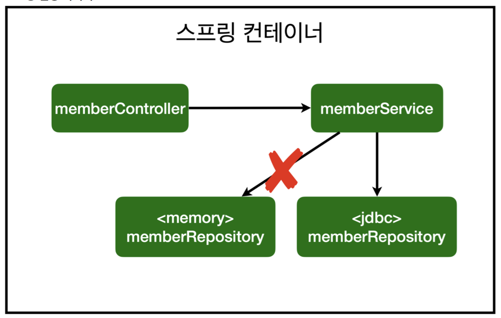
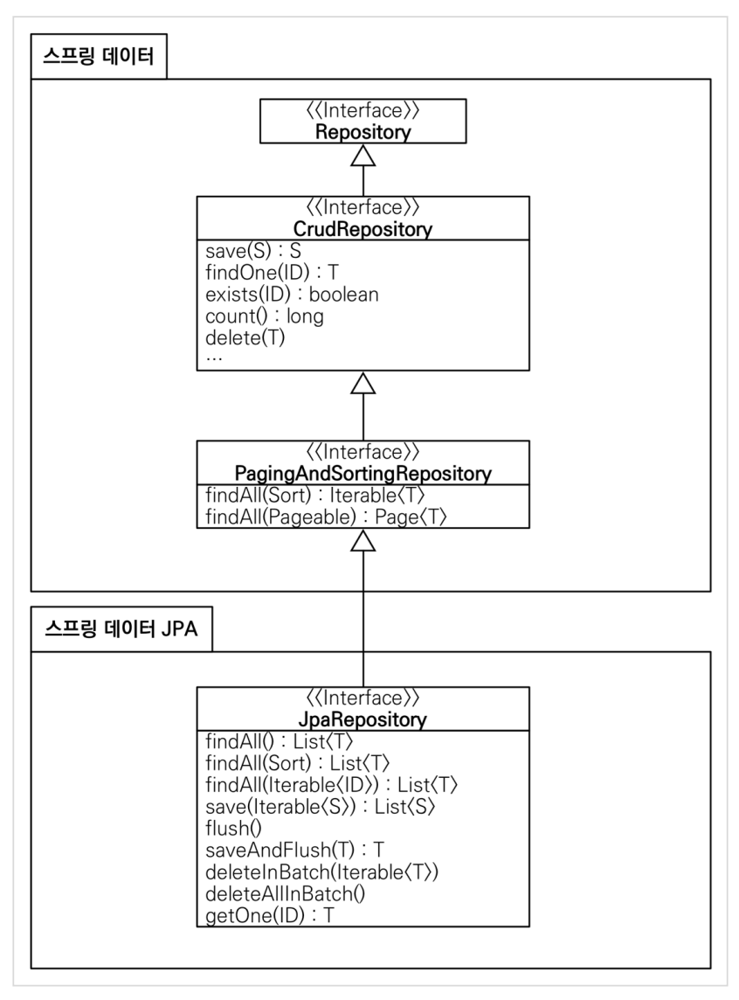
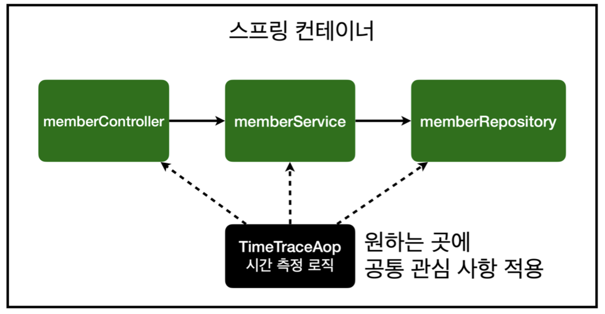

## 목차

1. 프로젝트 환경설정 
2. 스프링 웹 개발 기초 
3. 회원 관리 예제 - 백엔드 개발
4. 스프링 빈과 의존관계
5. 회원 관리 예제 - 웹 MVC 개발 
6. 스프링 DB 접근 기술
7. AOP
8. 다음으로

---

## 스프링 웹 개발

스프링 웹 페이지는 크게 세 종류로 나뉘어짐

- 정적 컨텐츠
- MVC와 템플릿 엔진
- api

### 정적 컨텐츠

- 기본적으로 Spring Boot는 정적 컨텐츠를 제공함
- 컨트롤러를 먼저 훑고, 없으면 이후 resources: static/* 폴더를 찾음.
- static 디렉토리 안에 uri와 일치하는 요소가 있으면 바로 반환! 
- 아무런 프로그래밍도 할 수 없음.

### MVC와 템플릿 엔진

- **MVC**는 Model-View-Controller의 집합
- **View**는 화면을 그리는 데에 집중함
- **Model과 Controller**는 비즈니스 로직, 내부적인 처리에 집중함
- 특히 **Model**은 화면에 필요한 요소들을 담아 넘기는 역할을 함

--- 

### API

- @ResponseBody가 붙어있으면 데이터를 그대로 body로 return함
- `HttpMessageConverter` 작동, return 타입을 검사, `StringHttpMessageConverter` 또는 `MappingJackson2HttpMessageConverter` 호출
- return 타입이 string이면 StringConverter 호출, raw string이 body가 됨
- return 타입이 Object면 JsonConverter 호출, 객체를 Json style로 변경하여 body로 만듦
- Converter는 내용을 웹 브라우저에 http 형식으로 반환해줌

--- 

## 회원 관리 예제

- 가장 간단한 꼴로 비즈니스 요구사항을 정리함
- 복잡한 비즈니스 로직은 활용 1편 강의를 들어볼 것


### 비즈니스 요구사항 정리

- 데이터: 회원 ID와 name
- 기능: 회원 등록, 회원 조회
- 또한 아직 DB가 선정되지 않은 상황 (RDB, NoSQL 등등)
- 초기 개발 단계에서는 가벼운 메모리 기반의 DB를 구현체로 사용


#### 일반적인 웹 애플리케이션 계층 구조

- 컨트롤러 : 웹 MVC의 C를 담당, api를 만들거나 할 때 사용
- 서비스 : 서비스 클래스의 핵심 비즈니스 로직이 들어가 있음. 예를 들어 중복 가입을 막는다거나 하는 로직. DB를 사용
- 리포지토리 : DB에 접근함
- 도메인 객체 : 회원, 주문 쿠폰처럼 DB에 저장하고 관리되는 비즈니스 도메인 객체


 
#### 테스트 케이스 작성

테스트 할 때는 보통

1. main 메서드에서 돌려보거나
2. 웹 애플리케이션의 컨트롤러를 통해 해당 기능을 실행함

이런 방법은 준비하고 실행하는 데에 너무 오래 걸리고, 반복 실행하기에 어렵다는 단점이 있음.

이러한 단점을 극복하기 위해 JUnit이라는 프레임워크로 테스트 케이스를 검증함.

전체 테스트 케이스는 `./gradlew test` 로 검증 가능

---

## 스프링 빈과 의존관계

- 화면을 붙이려면 뷰 템플릿, 컨트롤러가 필요함

- 먼저, 의존 관계가 있는 멤버 컨트롤러를 만들자!


- @Controller를 붙이면 Spring 초기에 생성되는 Spring Container에 @Controller가 붙은 컨트롤러 객체를 생성해서 넣어 둠
- 이후 컨트롤러 객체를 Spring이 bin으로써 관리함

### 컴포넌트 스캔과 자동 의존관계 설정
> @Autowired에 대응되는 @Component

- HelloController 또한 @GetMapping 등등 동작할 수 있던 이유도 컨트롤러 객체에 HelloController를 넣었기 때문임

- 의존관계 주입; @Autowired와 @Component을 연결함
- @Service , @Repository 는 @Component의 specialization
- 그래서 이러한 의존관계 주입 과정을 Component Scan이라고 함


### 자바 코드로 직접 스프링 빈 등록
- 컴포넌트 스캔과 비교했을 때 AOP 등에서 장점이 있음(추후 설명)

- SpringConfig.java 파일 생성, 클래스에 @Configuration을 붙임
- 이후 메소드마다 @Bean을 덧붙임


### DI (Dependency Injection)

- 변수의 조립 시점에서 DI를 해줌, 
- 특징 : 의존 관계가 실행 중에 동적으로 변하는 일은 없음
- DI에는 생성자 주입, 필드 주입, setter 주입 세 가지 방법이 있음
- 필드 주입 (변수 앞에 @Autowired)은 비권장사항
- setter 주입(public T setXX(T t))은 바꿀 일이 없기 때문에, public 메소드로 노출시키면 다른 개발자가 호출하여 문제가 생김

> 스프링 빈을 직접 등록하는 방식은 상황에 따라 구현 클래스를 변경해야 하는 상황에서 의존 관계를 간단하게 관리할 수 있기 때문에 유리함

---
## 회원 관리 예제 - 웹 MVC 개발

### 회원 웹 기능 홈 화면 추가

- @GetMapping("/")을 추가함
- "templates/home" 생성, 이는 "static/hello-static"보다 우선순위가 높음
- 


--- 
## 스프링 DB 접근 기술

- 구시대 기술부터 단계를 거쳐 나아가 학습함

|번호|기술|클래스 이름|
|--|--|--|
|1|메모리|MemoryRepository
|2|순수 Jdbc|JdbcRepository
|3|스프링 JdbcTemplate|JdbcRepository
|4|JPA|JpaRepository
|5|스프링 데이터 JPA|JpaRepository

--- 

## 순수 JDBC로 구축

(중요하지 않음, 편안하게 쭉 볼 것)

 - SpringConfig.java 변경점

 ```java
// before::Memory 
return new MemoryMemberRepository(); 

// after::Jdbc 
return new JdbcMemberRepository(dataSource); 
 ```       



- 스프링의 DI를 사용하면 **기존 코드를 전혀 손대지 않고, 설정만으로 구현 클래스를 변경**할 수 있음

- 이렇게 JAVA의 다형성을 살리는 것이 스프링의 특징!!

### 스프링 통합 테스트

- `@SpringBootTest`, `@Transactional` Annotation 덧붙임
- `@SpringBootTest` : 스프링 컨테이너와 테스트를 함께 실행함
- `@Transactional` : 테스트에서 쓰는 DB 변경사항을 테스트마다 rollback 해줌. afterEach() 구현할 필요가 없음

### 단위 테스트 vs 통합 테스트

- 단위 테스트는 속도가 굉장히 빠름, 좋은 테스트는 잘 만든 단위 테스트
- 통합 테스트는 스프링 컨테이너를 포함함. 느리고 무거움, 추천하지 않는 테스트 환경
- 하지만, SpringConfig가 자주 바뀔 때는 통합 테스트로 돌림(경향?)

> 현업에서는 테스트 코드를 짜는 데에 6~7할의 시간을 소모함

--- 

## 스프링 JdbcTemplate

- Jdbc api에서의 **반복적인 코드를 제거**해줌
- 하지만, sql 쿼리는 기존처럼 작성해야 함
- 실무에서도 많이 씀

- 이름이 JdbcTemplate인 이유는 구현에 디자인 패턴 중 Template Method Pattern이 많이 들어갔기 때문

--- 

## JPA

- 반복 코드도 제거해주고, **SQL 쿼리문도 직접 만들어 실행**해줌
- JPA를 통해 SQL, 데이터 중심 설계에서 **객체 중심 설계**로 패러다임을 전환할 수 있음
- 이러한 방식을 통해 개발 생산성을 높임

### JPA의 특징

1. 객체
2. ORM : Object & Relational - Mapping(by Annotation)

### 구현

- JPA의 모든 기능은 EntityManager를 통해 동작함
- build.gradle에서 data-jpa 라이브러리를 받으면 Spring Boot가 자동으로 Entity Manager를 생성함
- 우리는 만들어진 EntityManager를 Injection 받으면 됨
- `em.createQuery( JPQLString, 조회할 type ).getResultList();`
- 이때 JPQL은 테이블을 대상으로 하는 SQL이 아닌, 멤버 entity를 대상으로 쿼리문을 날리는 언어

```sql
select m from Member m;

``` 
> 멤버 entity "m" 자체를 select하여 조회함

---

## 스프링 데이터 JPA

> JPA를 편리하게 사용할 수 있게 해주는 기술, **깊은** JPA 선행 학습 필요

- 기본적인 CRUD도 마법처럼 인터페이스만 사용하여 구현 가능
- 실무에서 관계형 데이터베이스를 쓸 때 스프링 데이터 JPA는, 선택이 아닌 필수
- JpaRepository 인터페이스는 기본적인 CRUD, 조회 메소드가 제공됨


    
-  JpaRepository는 기본적인 CRUD, 단순 조회 메소드가 제공됨!!

### 인터페이스만을 이용한 스프링 데이터 JPA 개발

- `findBy##(T ##)` 메소드는 JPQL로 `select m from Member m where m.## = ?` 을 넘김
- `findByNameAndId(String name, Long id)` 는
`select m from Member m where m.name = ? and m.id = ?`을 넘김
- 인터페이스 이름만으로 개발이 끝남. 마법같은 기술!

> 참고: 실무에서는 JPA와 스프링 데이터 JPA를 기본으로 사용하고, 복잡한 동적 쿼리는 Querydsl이라는 라이브러리를 사용하면 된다. 
Querydsl을 사용하면 쿼리도 자바 코드로 안전하게 작성할 수 있고, 동적 쿼리도 편리하게 작성할 수 있다. 
이 조합으로 해결하기 어려운 쿼리는 JPA가 제공하는 네이티브 쿼리를 사용하거나, 앞서 학습한 스프링 JdbcTemplate를 사용하면 된다.

--- 

## AOP

> Aspect Oriented Programming, 관점 지향 프로그래밍

- 공통 관심 사항(cross-cutting concern)과 핵심 관심 사항(core concern)을 분리하는 관점


---


