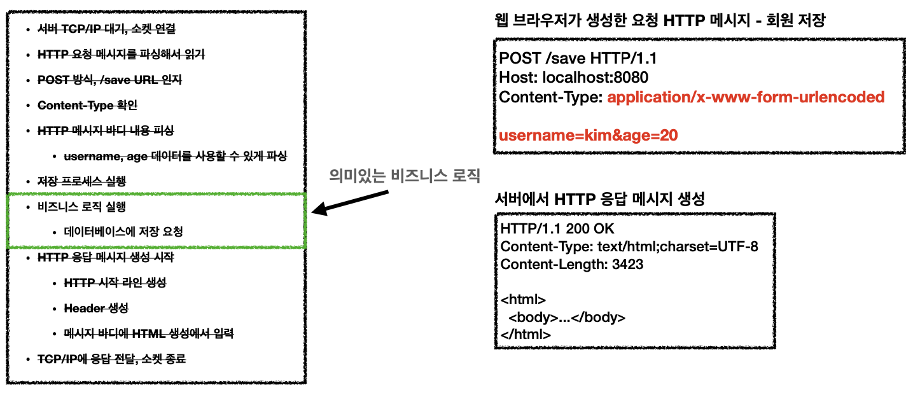
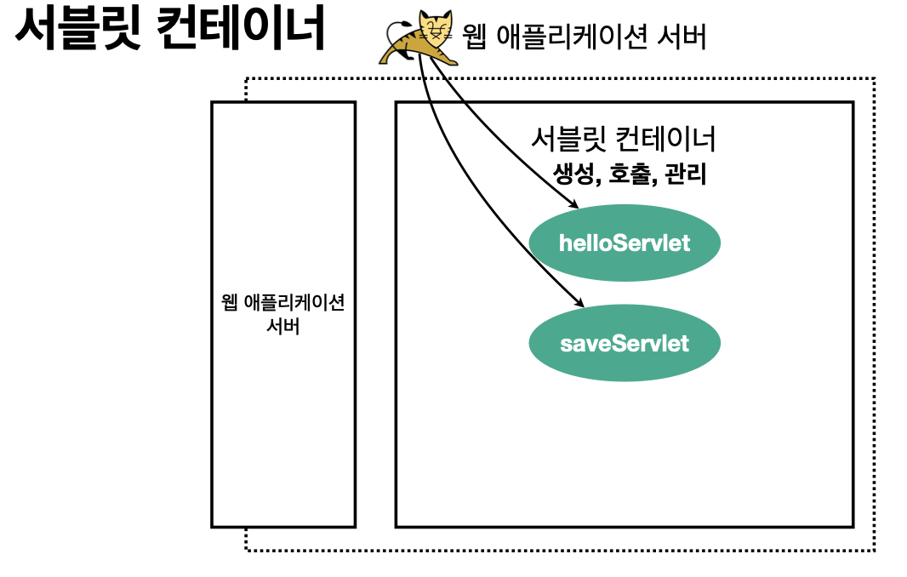
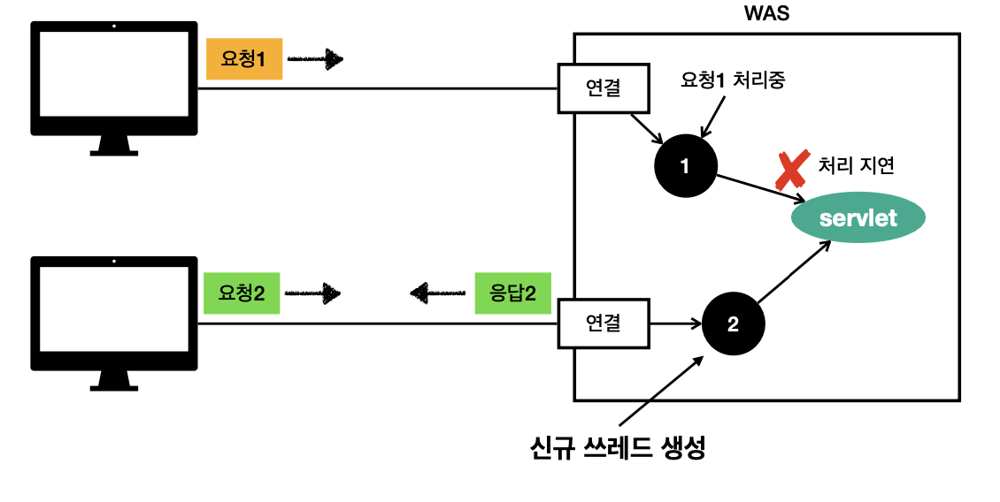

## Sect01. 웹 애플리케이션 이해

### 웹 서버와 웹 애플리케이션 서버
- 웹 서버
    - HTTP 기반으로 동작
    - 정적 리소스 제공, 기타 부가기능을 가짐
    - 정적(파일) HTML, CSS, JS, 이미지, 영상
    - 예시. `NGINX`, `APACHE`
- 웹 애플리케이션 서버(WAS, Web Application Server)
    - HTTP 기반으로 동작(동일)
    - 웹 서버 기능을 포함함(정적 리소스 제공)
    - **프로그램 코드**를 실행해서 애플리케이션 로직을 수행함
        - 동적 HTML, RestAPI(JSON)
        - 서블릿, JSP, 스프링 MVP
    - 예시. `Tomcat`, `Jetty`, `Undertow`
- 두 용어의 경계는 모호함
    - 웹 서버도 프로그램을 실행하는 기능을 포함하기도 함
    - WAS도 웹 서버 기능을 제공함
- **WAS**는 **애플리케이션 코드를 실행**하는 데에 특화되어 있음

### 웹 시스템 구성
- WAS, DB만으로 시스템을 구성할 수 있음
    - WAS는 정적 리소스, 애플리케이션 로직을 모두 제공하기 때문
- 예상되는 문제
    - 하지만, WAS가 너무 많은 역할을 하면 **서버 과부하**가 우려됨
        1. **애플리케이션 로직**은 정적 리소스에 비해 **cost가 높음** 
        2. WAS에 장애가 나면 오류 화면도 노출할 수 없음
- 해결 방안
    - 따라서, 웹 서버와 WAS를 리소스에 따라 분리함
        - **웹 서버**는 **정적 리소스**를 처리
        - **WAS**는 **애플리케이션 로직**을 처리 
        - 정적 리소스, 애플리케이션 로직 요구량에 따라 분리 증설도 가능
    - 클라이언트 쪽에서 동적인 처리를 요구받으면 WAS로 요청을 위임
    - 웹 서버는 안정적이므로 WAS, DB 오류 화면 HTML을 제공할 수 있음

### 서블릿

- 서블릿은 **비즈니스 로직을 제외한 모든 WAS 로직**을 담당해줌

```java
@WebServlet(name = "helloServlet", urlPatterns = "/hello")
public class HelloServlet extends HttpServlet {
    @Override
    protected void service(HttpServletRequest request, HttpServletResponse response){
        //애플리케이션 로직
    } 
}
```
- urlPatterns(/hello)의 URL이 호출되면 서블릿 코드가 실행
- request.get parameter username 을 하면 해당 쿼리 값을 뽑아주는 등 기능을 가짐
- 서블릿 덕분에 개발자는 HTTP 스펙을 매우 편리하게 사용함

### 서블릿 컨테이너

- 톰캣처럼 서블릿을 지원하는 WAS를 서블릿 컨테이너라고 함
- 서블릿 컨테이너는 서블릿 객체를 생성, 호출, 생명주기를 관리해줌
- **서블릿 객체**는 **싱글톤**으로 관리됨
    - 객체를 하나 생성해놓고 static으로 공유, 재사용하는 디자인 패턴
    - 싱글톤이기 때문에 **공유 변수 사용을 주의**해야 함
- JSP도 서블릿으로 변환되어서 사용
- 제일 큰 특징: 동시 요청을 위한 **멀티쓰레드 처리를 지원**함

### 동시 요청과 멀티 쓰레드
> 백엔드 개발자는 해당 개념이 매우 중요함, 트래픽 관리를 해야 하기 때문
- 쓰레드
    - 애플리케이션 코드를 하나하나 순차적으로 실행하는 것은 쓰레드
    - 예시. 자바 메인 메서드는 main이라는 이름의 쓰레드를 실행하는 것임
    - 쓰레드는 한 번에 하나의 코드 라인만을 수행함
    - 동시 처리가 필요한 상황에는 쓰레드를 추가로 생성함

### 요청 마다 쓰레드를 생성하는 방법

- 쓰레드 생성
    - 요청이 오면 쓰레드를 할당하고, 쓰레드로 서블릿 코드를 호출함
    - 요청이 올 때마다 신규 쓰레드를 생성해서 서블릿 호출, 응답을 넘기고 쓰레드를 날림
- 장점
    - 동시 요청을 처리할 수 있음
    - 리소스가 허용할 때 까지는 처리 가능
- 단점
    - 쓰레드는 **생성 비용**이 굉장히 비쌈
    - 쓰레드가 많아지면 컨텍스트 스위칭 비용이 발생함
    - 쓰레드 생성에 제한이 없어 과부하로 서버가 죽을 수 있음
### 해결: 쓰레드 풀 도입
- 쓰레드 풀 작동 원리
    - 클라이언트의 요청은 서블릿이 아닌, 쓰레드 풀로 감
    - 사용이 끝나면 쓰레드 풀에 반납함
    - 쓰레드의 최대치를 개수를 넘었을 때 요청이 오는 상황에는 
        1. 일정 연결까지 대기하도록 지시하거나
        2. 연결을 거절할 수 있음
- 쓰레드 풀(Thread **Pool**)
    - 요청마다 쓰레드를 생성하는 방법의 단점을 보완함
    - 필요한 쓰레드를 쓰레드 풀에 보관하고 관리함
    - 쓰레드 풀은 생성 가능한 쓰레드의 최대치를 관리함, 톰캣의 경우 기본 최대치 설정이 200개
    - 장점
        - 쓰레드가 미리 생성되어 있어, 쓰레드를 생성하고 종료하는 비용이 절약됨
        - 쓰레드 생성 최대치가 있어, 진행 중인 요청은 안전하게 처리할 수 있음
- 쓰레드 풀 **튜닝** 실무 팁
    - WAS의 주요 튜닝 포인트는 최대 쓰레드(max thread) 수임
    - max thread가 너무 낮은 경우
        - 동시 요청이 많으면 **서버 리소스는 여유롭지만**, 클라이언트는 **금방 응답 지연**
    - max thread가 너무 높은 경우
        - 동시 요청이 많으면 CPU, 메모리 **리소스 임계점 초과로 서버 다운**
- 쓰레드 풀 튜닝 최적해를 찾는 법
    - 적정 숫자는 리소스 상황에 따라 모두 다름
        - 애플리케이션 로직의 복잡도
        - CPU, 메모리, IO 리소스
    - **성능 테스트**를 해야 함
        - 최대한 실제 서비스와 유사하게 성능 테스트 시도해야 함
        - 아파치 ab, 제이미터, **nGrinder**

#### 멀티 쓰레드 부분은 WAS가 처리해줌 
- **개발자는 멀티 쓰레드 코드를 신경쓰지 않아도 됨**
- WAS 덕분에 싱글 쓰레드 프로그래밍을 하듯이 편하게 개발할 수 있음
- 단, 멀티 쓰레드 환경임을 인지할 것
    - 싱글톤 객체(서블릿, 스프링 빈)는 주의해서 사용해야 함

### HTML, HTTP API
> 백엔드 개발을 위해 어떤 점들을 알아야 할까?
- 정적 리소스
    - 웹 서버 관할, 그냥 뿌리면 됨
- HTML 동적 페이지
    - WAS 관할, 주문 정보를 DB에서 조회한 후 
    - 동적으로 HTML을 생성함
    - 웹 브라우저는 동적으로 생성된 HTML을 받아 출력함
- HTTP API
    - WAS 관할, 주문 정보를 DB에서 조회한 후 
    - 주로 JSON 형태로 데이터를 통신
    - 기본적으로 HTTP API는 데이터만 주고 받음 
    - UI 화면이 필요하면 클라이언트가 별도 처리해야 함
    - `서버 to 서버`, `웹 클라이언트 to 서버`, `앱 클라이언트 to 서버` 등등에 사용
        - 앱 클라이언트(아이폰, 안드로이드, PC 앱)
        - 웹 브라우저에 JS를 통한 HTTP API 호출
        - React Vue.js 같은 웹 클라이언트
        - 주문 서버 -> 결제 서버
        - 기업간 데이터 통신
- **서버 개발자가 고려해야 할 세 가지 부분**
    1. **정적 리소스**를 어떻게 제공할 것인가?
    2. 동적 HTML 페이지를 어떻게 제공할 것인가?
    3. HTTP API를 어떻게 제공할 것인가?

### 서버 사이드 렌더링, 클라이언트 사이트 렌더링
- **SSR**: **서버 사이드** 렌더링
    - 동적으로 **HTML을 완전히 생성하**여 웹 브라우저에 **보냄**
    - **정적인 화면**에 주로 사용함
    - 기술: JSP, Thymeleaf -> 백엔드 개발자
- **CSR**: **클라이언트 사이드** 렌더링
    - HTML 결과를 JS를 이용하여 **웹 브라우저에서 동적으로 생성함**
    - **웹 환경을 마치 앱 처럼 부분부분 변경**할 수 있음
    - 기술: React, Vue.js -> 프론트엔드 개발자
    - 구현
        1. HTML 요청
            - 내용 없음
        2. 자바스크립트 요청
            - 클라이언트 로직, HTML 렌더링 코드 포함함
        3. HTTP API - 데이터 요청
            - json을 받아 동적으로 화면을 변경함
- 참고: React, Vue.js를 CSR + SSR 동시에 지원하는 웹 프레임워크도 있음

### UI 기술, 어디까지 알아야 하는가?

- 백엔드 개발자의 웹 프론트엔드 기술 학습은 **옵션**
- 백엔드 개발자는 서버, DB, 인프라 등등 수 많은 백엔드 기술을 공부해야 함
- 백엔드: 서버 사이드 렌더링 기술
    - **백엔드 개발자는 서버 사이드 렌더링 기술 학습 필수**
- 웹 프론트엔드: 클라이언트 사이드 렌더링 기술
    - 복잡하고 동적인 UI를 사용함
    - 웹 프론트엔드 개발자의 전문 분야

### 자바 웹 기술의 역사
- 과거 기술
    - 서블릿 (1997)
        - HTML 생성이 어려움
    - JSP (1999)
        - HTML 생성은 편리하지만, 비즈니스 로직까지 담당해서 너무 역할이 많았음
    - 서블릿, JSP 조합 MVC 패턴 사용
        - 모델, 뷰, 컨트롤러로 역할을 나누어 개발
    - MVC 프레임워크 춘추 전국 시대 (2000s~2010s)
        - MVC 패턴 자동화, 복잡한 웹 기술을 편리하게 사용하게 함
        - 스트럿츠, 웹어크, 스프링 MVC(과거 버전)
- **애노테이션 기반의 스프링 MVC 등장**
    - `@Controller`
    - MVC 프레임워크의 춘추 전국 시대를 마무리함 
        - 단점이 없었음
- **스프링 부트의 등장**
    - 스프링 부트는 톰캣 등 서버를 내장함
    - 과거에는 서버에 WAS를 직접 설치하고, 소스는 War 파일로 WAS에 배포했었는데,
    - **스프링 부트**는 **빌드 결과 Jar 파일에 WAS 서버를 포함**시킴
        - 빌드 배포 단순화
- 스프링 웹 최신 기술
- **Web Reactive - Spring WebFlux**
    - 특징
        - **비동기 non-blocking** 처리
        - **최소 쓰레드**로 최대 성능
            - 쓰레드 컨텍스트 스위칭 비용 효율화
        - **함수형 스타일**로 개발함
            - 동시처리 코드 효율화
        - 서블릿 기술이 아닌, Netty 등을 사용
    - 한계점
        - WebFlux는 너무 어려움
            - 비동기 non-blocking 이해
            - 함수형 프로그래밍
        - 관계형 데이터베이스 지원이 미흡함
        - 일반 MVC도 충분히 빠름
        - 실무에서는 점유율 1% 미만
- 자바 뷰 템플릿의 역사
    1. JSP
        - 속도가 느림, 기능이 부족함
    2. 프리마커, 벨로시티
        - 속도가 빠르고 기능이 다양함
    3. **타임리프(Thymeleaf)**
        - 네추럴 템플릿: HTML 모양을 유지하면서 뷰 템플릿을 적용 가능
        - **스프링 MVC와 강력한 기능을 통합함**
        - **최선의 선택**, 단 성능은 프리마커, 벨로시티가 빠름

--- 
## 다음 글

### 2. [서블릿](2-서블릿.md)

---