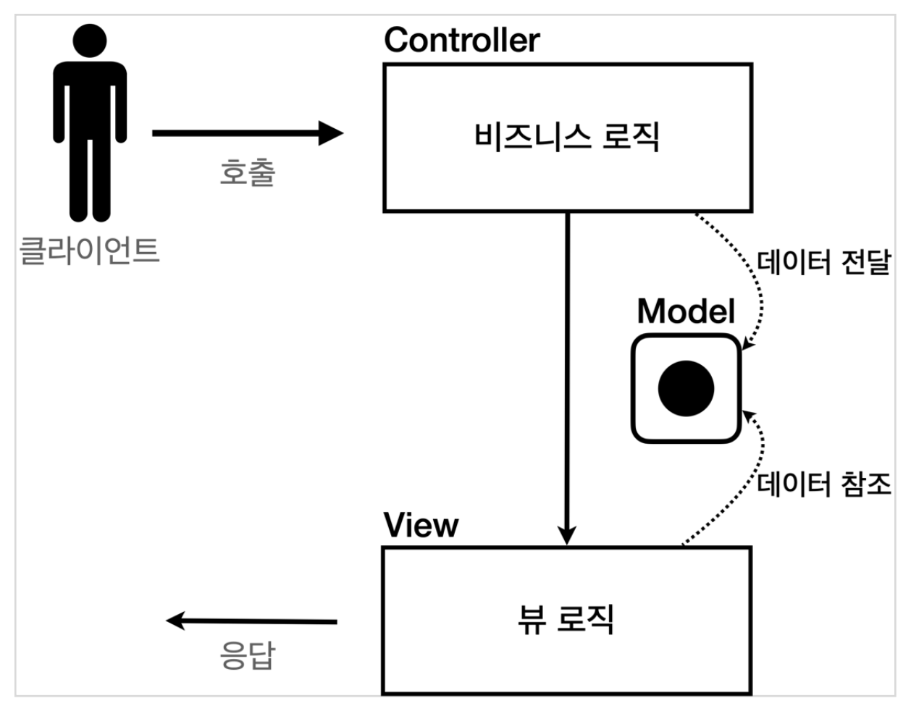
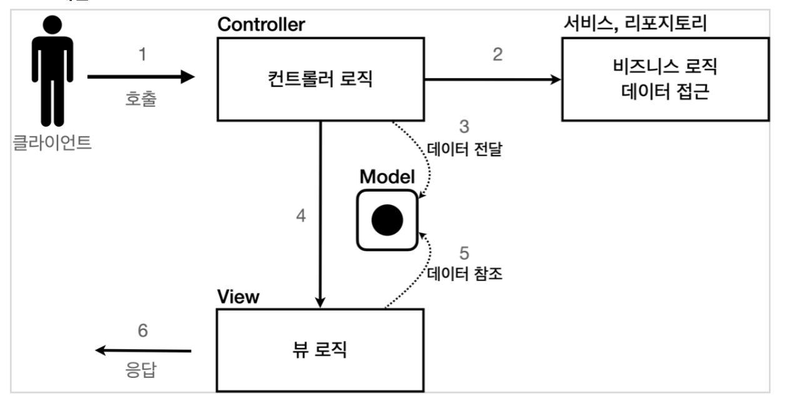

## Sect03. 서블릿, JSP, MVC 패턴
- 간단한 **회원 관리 웹 애플리케이션**을 만들어보면서 내용을 배울 것임
- 다음 순서로 진행
    1. **서블릿**으로 제작
    2. 서블릿의 불편한 점을 개선하여 템플릿 엔진, **JSP**로 제작
    3. JSP의 한계점을 보완한 **MVC 패턴** 도입
- 기능 요구사항


### 서블릿을 이용한 req.getWriter()
- 자바 코드에 HTML을 넣어, 매우 폼이 조작해 보임
- 반면 템플릿 엔진은 HTML에 자바 코드를 삽입하는 방식
    - 템플릿 엔진을 사용하면 HTML 문서에서 필요한 곳만 코드를 적용해서 동적으로 변경할 수 있음
    - 템플릿 엔진에는 JSP, Thymeleaf, Freemarker, Velocity 등이 있음

### JSP, 고전적인 템플릿 엔진
- HTML 폼에 자바 코드를 삽입하는 방식의 템플릿 엔진임
- `<%@ page contentType="text/html;charset=UTF-8" language="java" %>` 붙여야 JSP로 인식
- `request`, `response` 예약어를 `HttpServletRequest/Response` 에서와 동일하게 사용할 수 있음
    ```html
    <%@ page contentType="text/html;charset=UTF-8" language="java" %>
    <%@ page import="hello.servlet.domain.member.MemberRepository" %>
    <%@ page import="hello.servlet.domain.member.Member" %>
    <%
        // request, response 사용 가능
        MemberRepository memberRepository = MemberRepository.getInstance();
        Member member = new Member(
                request.getParameter("username"),
                Integer.parseInt(request.getParameter("age")
                )
        );
        memberRepository.save(member);
    %>
    <html>
    <head>
        <meta charset="UTF-8">
        <title>JSP Save</title>
    </head>
    <body> 
    <h2>성공</h2>
    <ul>
        <li>id=<%=member.getId()%></li>
        <li>username=<%=member.getUsername()%></li>
        <li>age=<%=member.getAge()%></li>
    </ul>
    <a href="/index.html">메인</a>
    </body>
    </html>

    ```
- 한계점이 있음
    - 비즈니스 로직을 처리하는 부분과, 뷰 렌더링을 하는 부분이 한 페이지에 모여 있음
        - 개발실에서는 `head.jsp`를 분리해서 세션을 따로 처리했음
    - 즉, JSP가 너무 많은 역할을 하고, 데이터를 조회하는 리포지토리 등등 다양한 코드가 모두 JSP에 노출되어 있음
    - 수백 수천줄이 넘어가는 JSP는 유지보수가 지옥임
- **MVC 패턴**은 **화면(View)**, **조종(Controller)** 을 분리하여 유지보수에 용이하게 도와줌

### MVC 패턴 with 서비스 계층
- **비즈니스 로직과 뷰 렌더링을 분리**하기 위해 패턴을 도입함
    1. 하나의 파일에 수천 줄의 자바 코드가 있으면 유지보수가 힘듦
    2. 비즈니스 로직 수정과 UI 수정의 라이프사이클이 다름
- **Model View Controller**
    - 웹 애플리케이션은 보통 이 MVC 패턴을 사용함
        - **컨트롤러**(req)
            1. HTTP 요청을 받아서 **파라미터를 검증**하고, **비즈니스 로직을 실행**함 
            2. 이후 뷰에 **전달할 결과 데이터를 조회해서 모델에 담음**
        - **모델**
            - **뷰에 출력할 데이터**를 담음
            - 모델 덕분에 뷰는 비즈니스 로직, 데이터 접근을 몰라도 됨
        - **뷰**(res)
            - **모델**에 담겨있는 **데이터를 사용해서 화면을 그리는 일**에 집중 
            - 여기서는 HTML을 생성하는 부분을 말함
        
    - 하지만, 컨트롤러에 비즈니스 로직을 두면 너무 역할이 많아짐
        - 컨트롤러는 데이터를 조종하는 역할에 집중하게 함
        - 일반적으로 **비즈니스 로직은 서비스(Service) 계층에 분리**하여 처리함
        

### MVC 패턴 적용
- **서블릿을 컨트롤러**로, **JSP를 뷰**로 사용할 것
- **모델은 HttpServletRequest 객체 request**를 사용함
    - 저장소에 `request.setAttribute(String)`로 등록, `request.getAttribute(String)`로 조회 가능
- Dispatcher `forward(req, res)`로 서버 내에서 **JSP 뷰를 호출**함
    ```java
        protected void service(HttpServletRequest req, HttpServletResponse res) throws ServletException, IOException {
            // go to JSP
            String viewPath = "/WEB-INF/views/new-form.jsp";
            RequestDispatcher dispatcher = req.getRequestDispatcher(viewPath);
            dispatcher.forward(req, res); // 다른 서블릿이나 JSP 로 이동할 수 있는 기능
            // 서버 내부에서 다시 호출이 발생함, 클라이언트 redirect 가 아님
        }
    ```
- **redirect vs forward**
    - **리다이렉트**는 클라이언트에 응답이 나갔다가, **클라이언트가 경로로 다시 요청**하는 기능
        - 클라이언트가 인지할 수 있고, URL 경로도 실제로 변경됨
    - **forward**는 **서버 내부에서 일어나는 호출**임
        - `RequestDispatcher.forward(req, res)`
        - 클라이언트가 전혀 인지할 수 없음
- **WEB-INF 경로**
    - 직접 부르지 않고, 컨트롤을 거쳐서 부르고 싶을 때 `WEB-INF` 경로를 활용함 
    - WAS 룰, 디자인 패턴

- 또한, JSP에서는 모델 데이터를 **프로퍼티 접근법**으로 간단히 다룰 수 있음
    ```html
    <ul>
        <li>id=${member.id}</li>
        <li>username=${member.username}</li>
        <li>age=${member.age}</li>
    </ul>
    ```
    - 코드는 다음과 동일함
    ```html
    <ul>
        <li>id=<%(Member)request.getAttribute("member").getId()%></li>
        <li>username=<%(Member)request.getAttribute("member").getUsername()%><</li>
        <li>age=<%(Member)request.getAttribute("member").getAge()%></li>
    </ul>
    ```
### 정리: 모델, 뷰, 컨트롤러
1. 모델 by **request** in `HttpServletRequest`
2. 뷰 by **JSP 페이지**
    - 표출에만 집중함, 모델에 프로퍼티 접근법 사용, 굉장히 깔끔해짐
    ```html
    <%@ page contentType="text/html;charset=UTF-8" language="java" %>
    <html>
    <head>
        <meta charset="UTF-8">
        <title>MVC View(JSP) Save</title>
    </head>
    <body>
    <h2>성공</h2>
    <ul>
        <li>id=${member.id}</li>
        <li>username=${member.username}</li>
        <li>age=${member.age}</li>
    </ul>
    <a href="/index.html">메인</a>
    </body>
    </html>
    ```
3. 컨트롤러 by **Servlet**
    - 비즈니스 로직에만 집중함
    ```java
        protected void service(HttpServletRequest req, HttpServletResponse res) throws ServletException, IOException {
            Member member = new Member(
                    req.getParameter("username"),
                    Integer.parseInt(req.getParameter("age"))
            );
            req.setAttribute("member", memberRepository.save(member));
            String viewPath = "/WEB-INF/views/save-result.jsp";
            RequestDispatcher dispatcher = req.getRequestDispatcher(viewPath);
            dispatcher.forward(req, res);
        }
    ```

### MVC 패턴 한계
- 컨트롤러에 필요하지 않은 코드가 많아 보임
    1. view로 이동하는 코드가 항상 중복 호출됨
        ```java      
        RequestDispatcher dispatcher = request.getRequestDispatcher(viewPath);
        dispatcher.forward(request, response);
        ```
    2. viewPath에 중복이 있음
        - prefix: `/WEB-INF/views/`
        - suffix: `.jsp`
    3. 공통 처리가 어려움
        - 공통 기능을 메서드로 뽑는다 하더라도, 실수로 호출하지 않으면 문제가 됨
        - 호출 자체도 중복임

-  문제를 해결하려면 컨트롤러 호출 전에 먼저 공통 기능을 처리해야 함, 즉 수문장 역할이 필요함
- **프론트 컨트롤러(Front Controller) 패턴**을 도입하면 이런 문제를 깔끔하게 해결할 수 있음
- **스프링 MVC의 핵심도 프론트 컨트롤러**임

---

## 다음 글

### 4. [MVC-프레임워크-만들기](4-MVC-프레임워크-만들기.md)

---