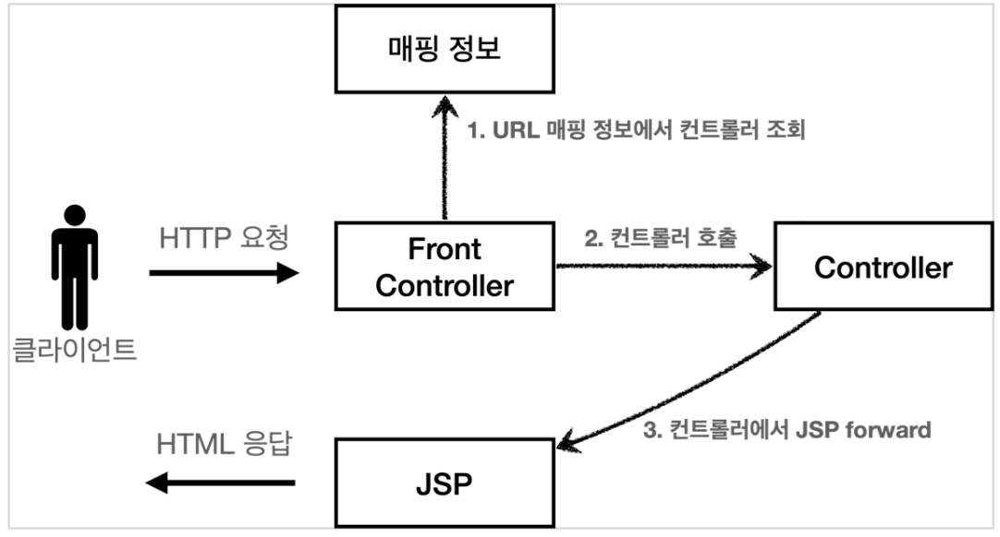
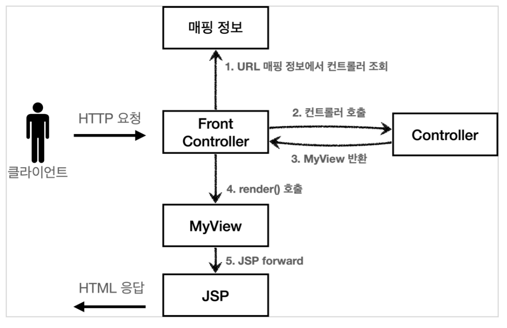
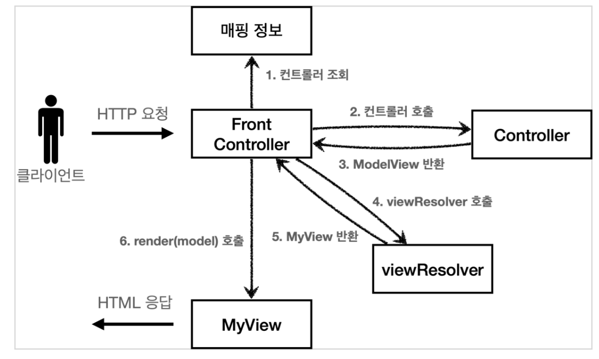
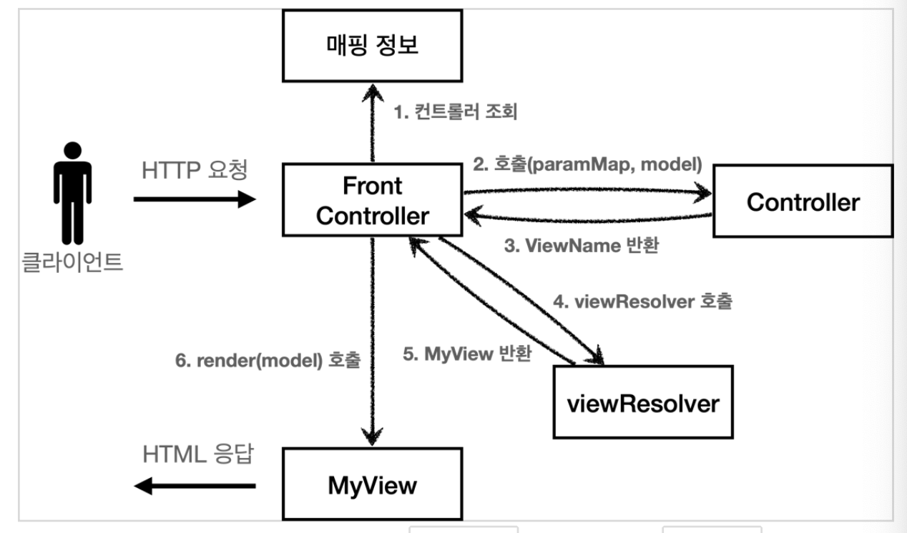
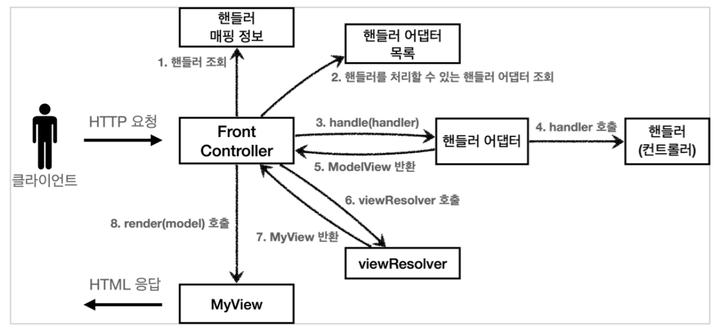

## Sect04. MVC 프레임워크 만들기
- 강의에서는 V1 -> V2 -> V3 -> V4 -> V5 단계별로 프레임워크를 만들어 갈 것임
    - V5는 스프링 MVC 프레임워크의 구조와 유사함

### 프론트 컨트롤러 패턴

- 특징
    - **프론트 컨트롤러 서블릿** 하나로 **클라이언트의 요청**을 받음
        - 입구를 하나로!
    - 프론트 컨트롤러가 **요청에 맞는 컨트롤러를 찾아서 호출**
        - 공통 처리 가능
    - 프론트 컨트롤러를 제외한 **나머지 컨트롤러는 서블릿을 사용하지 않아도 됨**
- 스프링 웹 MVC와 프론트 컨트롤러
    - **스프링 웹 MVC의 핵심**도 바로 FrontController
    - 스프링 웹 MVC의 `DispatcherServlet`이 **FrontController 패턴**으로 구현되어 있음

### 프론트 컨트롤러 도입 - v1
- 구조를 다음과 같이 변경할 예정
    
        1. 프론트 컨트롤러가 클라이언트의 요청을 받음
        2. 프론트 컨트롤러는 매핑 정보를 보고 컨트롤러를 호출함
        3. 컨트롤러에서 JSP forward로 JSP 뷰를 호출
        4. 뷰로 HTML 응답을 보냄
- 다형성 활용함 
    - 인터페이스 `ControllerV1`
- 하위를 전부 매핑하는, **서블릿을 사용**하는 **프론트 컨트롤러를 도입**함
    ```java
    @WebServlet(name = "frontControllerServletV1", urlPatterns = "/front-controller/v1/*") // 하위 전부 매핑
    public class FrontControllerServletV1 extends HttpServlet {
        private Map<String, ControllerV1> controllerMap = new HashMap<>();
        // 서블릿 생성 시점에 uri에 Controller를 대응시킴
        public FrontControllerServletV1() { 
            controllerMap.put("/front-controller/v1/members/new-form", new MemberFormControllerV1());
            controllerMap.put("/front-controller/v1/members/save", new MemberSaveControllerV1());
            controllerMap.put("/front-controller/v1/members", new MemberListControllerV1());
        }

        @Override
        protected void service(HttpServletRequest req, HttpServletResponse res) throws ServletException, IOException {

            ControllerV1 controller = controllerMap.get(req.getRequestURI());
            if (controller == null) {
                res.setStatus(HttpServletResponse.SC_NOT_FOUND); // 404 not found
                return;
            } // if exists
            controller.process(req, res);
        }
    }
    ```
- V1 리팩토링 핵심
    1. **프론트 컨트롤러**
        - 서블릿은 프론트 컨트롤러만 다룸, 나머지 컨트롤러는 서블릿을 몰라도 됨
    2. **인터페이스 도입**
        - uri에 대응하여 유연하게 컨트롤러를 호출하기 위해 인터페이스, Map 사용
        ```java
        public interface ControllerV1 {
            void process(HttpServletRequest req, HttpServletResponse res) throws ServletException, IOException;
        }
        ```

> 리팩토링 중 다른 문제점이 눈에 밟혀도, 한 번에 비슷한 레벨끼리만 개선해야 함 (큰 그림, 작은 그림끼리)

### View 처리부 분리 - V2
- 컨트롤러의 다음 코드가 중복이었음
    ```java
      String viewPath = "/WEB-INF/views/new-form.jsp";
      RequestDispatcher dispatcher = request.getRequestDispatcher(viewPath);
      dispatcher.forward(request, response);
    ```
- 중복 부분을 분리하기 위해 **별도의 뷰 처리부 클래스 MyView**를 만듦
    - **컨트롤러**는 MyView를 반환
    - `MyView.render()`를 호출하여 JSP 뷰로 넘어감
- 구조는 다음과 같음
    
- **V2 구현**
    - **render를 담당**하는 `MyView` 클래스를 생성
        ```java
        public class MyView {
            private final String viewPath;
            public MyView(String viewPath) {
                this.viewPath = viewPath;
            }
            public void render(HttpServletRequest req, HttpServletResponse res) throws ServletException, IOException {
                RequestDispatcher dispatcher = req.getRequestDispatcher(viewPath);
                dispatcher.forward(req, res);
            }
        }
        ```
    - `FrontController`에서 render 부분을 `MyView`가 담당하게 함
        ```java
           protected void service(HttpServletRequest req, HttpServletResponse res) throws ServletException, IOException {
              System.out.println("FrontControllerServletV2.service: " + req.getRequestURI());
              String requestURI = req.getRequestURI();
              ControllerV2 controller = controllerMap.get(requestURI);
              if (controller == null) {
                  res.setStatus(HttpServletResponse.SC_NOT_FOUND); // 404 not found
                  return;
              } // if exists
              MyView view = controller.process(req, res);
              view.render(req, res);
          }
        ```

### Model 추가 - V3

> 이번 내용은 변화가 많음, 완전 체화하면 스프링 웹 MVC도 쉽게 이해 가능

- 두 가지 요소를 개선할 예정
    1. **HttpServlet 종속성 제거**
        - 컨트롤러가 HttpServlet 파라미터를 필요로 하지 않음
        - **\{ username, age \}**와 **모델**이 필요할 뿐, HttpServlet은 필요하지 않음
            ```java
                @Override
                public MyView process(HttpServletRequest req, HttpServletResponse res) throws ServletException, IOException {
                    Member member = new Member(
                            req.getParameter("username"),
                            Integer.parseInt(req.getParameter("age"))
                    );
                    req.setAttribute("member", memberRepository.save(member));
                    return new MyView("/WEB-INF/views/save-result.jsp");
                }
            ```
            - 모델을 `ModelView`로 받아와 `MyView`에서 `HttpServletRequest` 통합 처리
        - 파라미터를 분리하면 서블릿 기술을 몰라도 동작할 수 있음
            - 컨트롤러가 서블릿 기술을 전혀 사용하지 않도록 리팩토링하면 테스트 코드 작성이 쉬워짐
    2. **뷰 이름 중복 제거**
        - **컨트롤러는 뷰의 논리 이름만을 반환**함 
        - **프론트 컨트롤러**는 논리 이름을 받아 **실제 물리 위치를 처리**함
            - **핵심 로직 컨트롤러는 간단하게 분리**, 프론트 컨트롤러는 지저분한 일을 담당
            - 논리 이름을 받아 물리 위치로 처리해주는 `viewResolver` 도입
        - 리팩토링 덕분에, 뷰 폴더 위치가 함께 이동해도 프론트 컨트롤러만 고치면 됨
            - 구조 변경을 코드 한 군데를 수정하여 처리할 수 있다면, 이는 좋은 설계
- V3 구조는 다음과 같음
    
- **V3 구현**
    - **ModelView**
        - 모델을 `ModelView`로 받아와 `MyView`에서 `HttpServletRequest` 통합 처리
        - ModelView는 modelMap과 viewName을 모두 담음
            ```java
            @Getter @Setter // Lombok
            public class ModelView {
                private Map<String, Object> model = new HashMap<>();
                private String viewName;

                public ModelView(String viewName) {
                    this.viewName = viewName;
                }
            }
            ```

### 단순하고 실용적인 컨트롤러 - V4
- 개발자가 **단순하고 편리하게 사용**할 수 있게 리팩토링
    - **컨트롤러**에서, 모델을 외부에서 받아오게 함
- V4 구조는 다음과 같음
    
    - **컨트롤러의 parameter, return 구조를 변경**함
        1. param을 `Map<String, String> paramMap`에서 `Map<String, Object> model`을 추가 
        2. return을 `ModelView("new-form")` 대신, ViewName `"new-form"` 타입을 사용


```java
public class MemberSaveControllerV4 implements ControllerV4 {
    MemberRepository memberRepository = MemberRepository.getInstance();
    @Override
    public String process(Map<String, String> paramMap, Map<String, Object> model) {
        Member member = new Member(paramMap.get("username"), Integer.parseInt(paramMap.get("age")));
        memberRepository.save(member);

        model.put("member", member);
        return "save-result";
    }
}
```

```java
    Map<String, String> paramMap = createParamMap(req); // gets all parameter
    Map<String, Object> model = new HashMap<>();
    String viewName = controller.process(paramMap, model);
    MyView view = viewResolver(viewName); // param: 논리 이름, returns: 실제 주소와 Dispatcher 처리 로직
    view.render(model, req, res); // ModelView에 넘어온 모델을 HttpServletRequest에 attribute함

```

### 유연한 컨트롤러 - V5

- 하나의 프로젝트 안에서 다양한 컨트롤러 인터페이스를 사용하고 싶은 상황
    - V4 말고 V3 컨트롤러를 사용하고 싶으면?
    - **어댑터 패턴**을 사용해서 프론트 컨트롤러가 다양한 방식의 컨트롤러를 처리할 수 있도록 변경
        - **핸들러 어댑터** 도입
- **어댑터 패턴**
    - 두 타입이 맞지 않을 때, 중간에 **핸들러 어댑터를 끼워 호환시키는 패턴**
    - **핸들러 어댑터**
        - 중간에 어댑터 역할을 하는 어댑터
        - 여기서 어댑터 역할을 해주는 덕분에 다양한 종류의 컨트롤러를 호출할 수 있음
    - 이름: **컨트롤러 -> 핸들러**
        - 컨트롤러의 이름을 더 넓은 범위인 핸들러로 변경함
        - 이제 **어댑터가 있기 때문에** 꼭 컨트롤러의 개념 뿐만 아니라 어떠한 것이든 해당하는 종류의 어댑터만 있으면 다 처리할 수 있기 때문
- 구조는 다음과 같음
    

- 코드를 확장하는 상황이 오더라도, Adapter만 양식 맞춰 추가하면 될 정도로 유연해짐
- `ControllerV4` 는 원래 뷰의 이름을 반환했지만, 어댑터는 이것을 ModelView로 만들어서 형식을 맞추어 반환함
    - 마치 110v 전기 콘센트를 220v 전기 콘센트로 변경하듯이!

- **역할과 구현이 인터페이스 기반으로 잘 분리된, MVC 컨트롤러를 설계함!**

--- 

## 다음 글

###  5. [스프링-MVC-구조-이해](5-스프링-MVC-구조-이해.md)

--- 