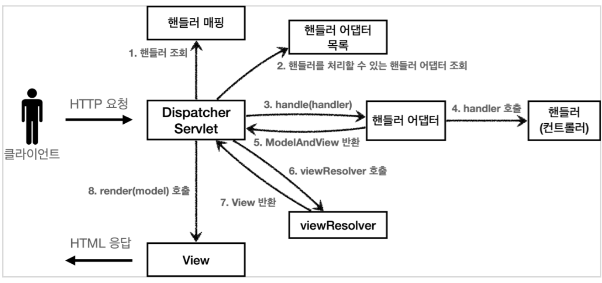
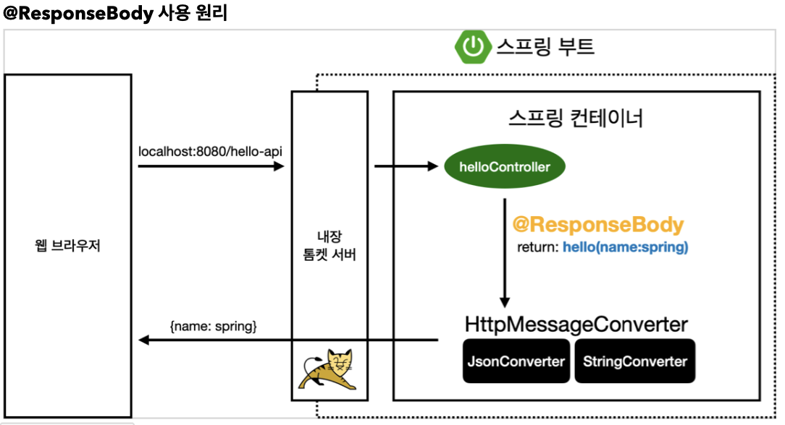

## Sect05. 스프링 MVC - 구조 이해

- SpringMVC의 구조는 다음과 같음
    
    - FrontController는 스프링 MVC에서 `DispatcherServlet`이라는 이름의 서블릿으로 다루어짐


- 직접 만든 프레임워크와 스프링 MVC 비교 

|직접 만든 프레임워크|스프링 MVC|
|--|--|
|FrontController|**DispatcherServlet**|
|handlerMappingMap|HandlerMapping|
|MyHandlerAdapter|HandlerAdapter|
|ModelView|ModelAndView|
|viewResolver|ViewResolver|
|MyView|View|

### DispatcherServlet, 스프링 MVC의 핵심
- 스프링 MVC에서의 프론트 컨트롤러가 `DispatcherServlet`임
- `DispatcherServlet` 도 부모 클래스에서 `HttpServlet` 을 상속 받아서 사용하고, 서블릿으로 동작함
- 스프링 부트는 `DispatcherServlet` 을 서블릿으로 **자동으로 등록**함
    - 서블릿은 **모든 경로**`(urlPatterns="/")`에 대해서 매핑함
- 서블릿이 호출되면 `HttpServlet` 이 제공하는 `service()` 가 호출됨
    - 스프링 MVC는 `DispatcherServlet` 의 부모인 `FrameworkServlet` 에서 `service()` 를 override 해둠
    - `FrameworkServlet.service()` 를 시작으로 여러 메서드가 호출되며 `DispacherServlet.doDispatch()`도 호출됨
        ```java
        public class DispatcherServlet extends FrameworkServlet {
            // ...
	        @Override
            protected void doService(HttpServletRequest request, HttpServletResponse response) throws Exception {
                // ...
			    doDispatch(request, response);
                // ...
            }
            
        }
        // ...
        ```
- **doDispatch(req, res) 분석**
    - doDispatch 코드를 간략화하면 다음과 같음
        ```java
        protected void doDispatch(HttpServletRequest request, HttpServletResponse response) throws Exception {
            HttpServletRequest processedRequest = request;
            HandlerExecutionChain mappedHandler = null;
            ModelAndView mv = null;

            // 1. 핸들러 조회
            mappedHandler = getHandler(processedRequest); 
            if (mappedHandler == null) {
                noHandlerFound(processedRequest, response);
                return; 
            }

            // 2. 핸들러 어댑터 조회 - 핸들러를 처리할 수 있는 어댑터
            HandlerAdapter ha = getHandlerAdapter(mappedHandler.getHandler());

            // 3. 핸들러 어댑터 실행 -> 4. 핸들러 어댑터를 통해 핸들러 실행 -> 5. ModelAndView 반환 
            mv = ha.handle(processedRequest, response, mappedHandler.getHandler());

            processDispatchResult(processedRequest, response, mappedHandler, mv, dispatchException);
        }

        private void processDispatchResult(HttpServletRequest request, HttpServletResponse response, HandlerExecutionChain mappedHandler, ModelAndView mv, Exception exception) throws Exception {
            // 뷰 렌더링 호출
            render(mv, request, response); 
        }

        protected void render(ModelAndView mv, HttpServletRequest request,HttpServletResponse response) throws Exception {
            View view;
            String viewName = mv.getViewName(); 
            
            // 6. 뷰 리졸버를 통해서 뷰 찾기, 7. View 반환
            view = resolveViewName(viewName, mv.getModelInternal(), locale, request);

            // 8. 뷰 렌더링
            view.render(mv.getModelInternal(), request, response);
        }
        ```
    - 참고: SpringMVC 구조 순서도
        
- 스프링 MVC는 코드 분량도 매우 많고, 복잡해서 내부 구조를 다 파악하는 것은 쉽지 않음
- 또한, 웹 애플리케이션을 만들 때 필요로 하는 대부분의 기능이 이미 다 구현되어 있음
- 따라서, 핵심 동작방식을 알아두어야 향후 문제가 발생했을 때 어떤 부분에서 문제가 발생했는지 쉽게 파악하고, 문제를 해결할 수 있음


### 핸들러 매핑과 핸들러 어댑터

- 목표: **핸들러 매핑**과 **핸들러 어댑터**의 이해
    - 과거에 주로 사용했던 스프링이 제공하는 간단한 **컨트롤러**(=핸들러)를 통해 이해해 봄
- Controller 인터페이스 `org.springframework.web.servlet.mvc.Controller`
    - 과거 버전 스프링 컨트롤러
    ```java
      public interface Controller {
          ModelAndView handleRequest(HttpServletRequest request, HttpServletResponse
        response) throws Exception;
    }
    ```
    > 참고: @Controller 애노테이션과는 전혀 다름


- 이 컨트롤러가 호출되려면 다음 2가지가 필요함
    - **HandlerMapping(핸들러 매핑)**
        - 핸들러 매핑에서 이 컨트롤러를 찾을 수 있어야 함
        - 예시. 스프링 빈의 이름으로 핸들러를 찾을 수 있는 핸들러 매핑이 필요함
    - **HandlerAdapter(핸들러 어댑터)**
        - 핸들러 매핑을 통해서 찾은 핸들러를 실행할 수 있는 핸들러 어댑터가 필요함
        - 예시. `Controller` 인터페이스를 실행할 수 있는 핸들러 어댑터를 찾고 실행해야 함
- 스프링은 이미 핸들러 매핑과 핸들러 어댑터를 대부분 구현해두었음
    - 따라서 개발자가 직접 핸들러 매핑, 핸들러 어댑터를 만들 일은 거의 없음
- 스프링 부트가 자동 등록하는 핸들러 매핑과 핸들러 어댑터는 다음과 같음
    - 현대 SpringMVC 에서는 99% **@RequestMapping** 관련 애노테이션 사용
- **HandlerMapping**

|우선 순위|이름|기능|
|--|--|--|
|0|RequestMappingHandlerMapping|**@RequestMapping**에서 사용 (애노테이션 기반의 컨트롤러)
|1|BeanNameUrlHandlerMapping|**스프링 빈의 이름**으로 핸들러를 찾음

- **HandlerAdapter**

|우선 순위|이름|기능|
|--|--|--|
|0|RequestMappingHandlerAdapter|**@RequestMapping**에서 사용 (애노테이션 기반의 컨트롤러)
|1|HttpRequestHandlerAdapter|HttpRequestHandler 처리
|2|SimpleControllerHandlerAdapter| Controller 인터페이스(**애노테이션 X**, 과거에 사용) 처리

- **@RequestMapping**
    - 조금 뒤에서 설명하겠지만, 가장 우선순위가 높은 핸들러 매핑과 핸들러 어댑터는 @RequestMapping 기반임
    - 지금 스프링에서 주로 사용하는 애노테이션 기반의 컨트롤러를 지원하는 매핑과 어댑터임
    - 실무에서는 99.9% 이 방식의 컨트롤러를 사용함

### 뷰 리졸버
- `viewResolver`는 논리 이름을 실제 경로로 바꾸어주는 역할을 함
    ```java
    @Component("/springmvc/old-controller") // bin 이름을 urlPatterns로 맞추었음
    public class OldController implements Controller {

        @Override
        public ModelAndView handleRequest(HttpServletRequest request, HttpServletResponse response) throws Exception {

            return new ModelAndView("new-form");
        }
    }
    ```
- 다음과 같이 핸들러(컨트롤러)가 `ModelAndView`를 반환하면 스프링 부트의 `viewResolver`는 prefix와 suffix를 맞추어 줌
    - `application.properties`
        ```properties
        # viewResolver properties 추가
        spring.mvc.view.prefix=/WEB-INF/views/
        spring.mvc.view.suffix=.jsp
        ```
- 스프링 부트가 자동 등록하는 뷰 리졸버는 다음과 같음
    - 실제로는 더 많지만, 중요한 부분 위주로 설명

|우선순위|이름|기능|
|--|--|--|
|1|BeanNameViewResolver|빈 이름으로 뷰를 찾아서 반환함 (예: 엑셀 파일 생성 기능에 사용)|
|2|**InternalResourceViewResolver**|JSP를 처리할 수 있는 뷰를 반환함|
- 뷰 리졸버 로직의 실행 순서는 다음과 같음
    1. 핸들러 어댑터 호출
        - 핸들러 어댑터로 `new-form` 논리 이름을 받아냄
    2. ViewResolver 호출
        - `new-form` 뷰 이름을 가지고 `viewResolver`를 순서대로 호출함
        - `BeanNameViewResolver`는 `new-form` 이름의 스프링 빈을 찾음
            - 없으므로 2순위 `InternalResourceViewResolver`로 넘어감
        - `InternalResourceViewResolver` 호출
    3. InternalResourceViewResolver 호출
        - `InternalResourceView`를 반환함
    4. InternalResourceView 호출
        - `InternalResourceView` 는 JSP처럼 `forward()` 를 호출해서 처리할 수 있는 경우에 사용
    5. view.render() 호출
        - `InternalResourceView` 는  `forward()`를 사용해서 JSP를 실행함
- **여기까지가 스프링 MVC의 핵심 구조의 서술임**

### 스프링 MVC 시작하기
- 스프링이 제공하는 **컨트롤러**는 **애노테이션 기반**으로 동작함 
    - 매우 유연하고 실용적
- **@RequestMapping**
    - 최신 스프링 프레임워크 MVC의 모든 것
    - 핸들러 매핑: `RequestMappingHandlerMapping`
    - 핸들러 어댑터: `RequestMappingHandlerAdapter`

### 스프링 MVC 전환 - SpringMemberXXXControllerV1
- `@Controller`
    - 스프링이 자동으로 스프린 빈으로 등록함
        - 내부에 `@Component` 애노테이션이 있어서 컴포넌트 스캔의 대상이 됨
    - 스프링 MVC에서 애노테이션 기반 컨트롤러로 인식함
        - `RequestMappingHandlerMapping`의 대상이 된다는 의미
    - **스프링 3.0 이상**: 스프링 컨트롤러로 인식시키기 위해선 **필수**로 붙여야 함
- `@RequestMapping`
    - 요청 정보를 매핑함, 파라미터의 URL이 호출되면 해당 메서드가 호출됨
    - 애노테이션 기반 동작이기 때문에, **메서드 이름을 임의로 지어도 OK**
        - 그래도, `process()`가 관례인듯?
- return `ModelAndView`
    - 모델과 뷰 정보를 담아서 반환함
        - 모델: `mv.addObject("members", members)`
        - 뷰: `new ModelAndView("members")`
- `ModelAndView`에서 Model을 넘기지 않는 경우
    - 모델을 받지 않는 뷰: `new-form` 페이지
    ```java
    @Controller
    public class SpringMemberFormControllerV1 {

        @RequestMapping("/springmvc/v1/members/new-form")
        public ModelAndView processWhat() { // 애노테이션 기반이기 때문에 이름 무작위
            return new ModelAndView("new-form"); // 1. 뷰 논리 이름 세팅, 2. 넘길 모델이 없으니 생략, 반환
        }
    }
    ```
- `Model`과 `View` 모두 설정해주는 경우 
    - 뷰: `members`, 모델: `members` 인 페이지
    ```java
    @Controller
    public class SpringMemberListControllerV1 {

        MemberRepository memberRepository = MemberRepository.getInstance();

        @RequestMapping("/springmvc/v1/members")
        public ModelAndView process() {
            List<Member> members = memberRepository.findAll();
            ModelAndView mv = new ModelAndView("members"); // 1. 뷰 논리 이름 설정
            mv.addObject("members", members); // 2. 넘길 모델 세팅
            // mv.getModel().put("members", members); // 와 동일
            return mv; // 뷰 & 모델 세팅한 대로 반환
        }
    }
    ```
- `HttpServletRequest`가 필요한 경우
    - 파라미터로 `req`, `res`를 받고, 뷰:`member`, 모델:`member`인 페이지
    ```java
    @Controller
    public class SpringMemberSaveControllerV1 {
        MemberRepository memberRepository = MemberRepository.getInstance();

        @RequestMapping("/springmvc/v1/members/save")
        public ModelAndView process(HttpServletRequest req, HttpServletResponse res) {
            String username = req.getParameter("username");
            int age = Integer.parseInt(req.getParameter("age"));
            Member member = new Member(username, age);
            memberRepository.save(member);

            ModelAndView mv = new ModelAndView("save-result"); // 1. 뷰 논리 이름 설정
            mv.addObject("member", member); // 2. 넘길 모델 세팅
            return mv; // 뷰 & 모델 세팅한 대로 반환
        }
    }
    ```
- 다음 시간에는, 컨트롤러에 **분리된 클래스들을 통합**하여 MVC 컨트롤러를 꾸려볼 예정!

### 클래스 단위 컨트롤러 통합 - SpringMemberControllerV2
- `@RequestMapping`을 메서드 단위가 아닌, 클래스 단위로도 추가로 묶어볼 것
- 메서드 이름은 뷰 논리 이름을 따르는 게 관례인듯
    ```java
    @Controller
    @RequestMapping("springmvc/v2/members")
    public class SpringMemberControllerV2 {
        MemberRepository memberRepository = MemberRepository.getInstance();

        @RequestMapping("/new-form")
        ModelAndView newForm() {
            return new ModelAndView("new-form"); // set view
        }

        @RequestMapping("")
        ModelAndView members() {
            List<Member> members = memberRepository.findAll();
            ModelAndView mv = new ModelAndView("members"); // set view
            mv.addObject("members", members); // set model
            return mv;
        }

        @RequestMapping("/save")
        ModelAndView save(HttpServletRequest req, HttpServletResponse res) {
            Member member = new Member(req.getParameter("username"), Integer.parseInt(req.getParameter("age")));
            memberRepository.save(member);

            ModelAndView mv = new ModelAndView("save-result"); // set view
            mv.addObject("member", member); // set model
            return mv;

        }
    }
    ```
- 개선해보고 나니, 개발자가 직접 `ModelAndView`를 생성하여 반환하는 방식이 불편함임
    - `ModelAndView` 부분만 개선하면 실무에서 사용하는 방식까지 현대화가 끝남
### 실용적인 방식 - SpringMemberControllerV3

1. `@RequestMapping` 를 `@GetMapping`, `@PostMapping` 등으로 분리
    - `@RequestMapping`은 모든 method를 받음 
        - `GET`, `POST`, `PUT`, `PATCH`, ... 
    - `@GetMapping`은 GET인 경우에만 호출, 이외의 요청에는 `405 Method Not Allowed` 내보냄
        - `@GetMapping("save")`는 `@RequestMapping(value = "save", method = RequestMethod.GET)`과 동일
        - `@GetMapping` 애노테이션의 구조는 다음과 같이 투명함
            ```java
            @Target(ElementType.METHOD)
            @Retention(RetentionPolicy.RUNTIME)
            @Documented
            @RequestMapping(method = RequestMethod.GET)
            public @interface GetMapping {
                // ...
            }
            ```
2. **모델을 파라미터**로, **리턴 스트링을 뷰**로 분리
    - `String process(Model model)`
        - `model.addAttribute("members", members)` : 모델 설정
        - `return "members"` : 뷰 논리 이름 반환
3. Request로 넘어온 쿼리 파라미터를 `@RequestParam`으로 처리
    - `String process (@RequestParam("username") String username, @RequestParam("age") int age)`
- 구현 코드는 다음과 같음
    ```java
    @Controller
    @RequestMapping("springmvc/v3/members")
    public class SpringMemberControllerV3 {
        MemberRepository memberRepository = MemberRepository.getInstance();

        @GetMapping("/new-form")
        String newForm() {
            return "new-form"; // return view
        }

        @GetMapping
        String members(Model model) {
            List<Member> members = memberRepository.findAll();
            model.addAttribute("members", members); // set model
            return "members"; // return view
        }

        @PostMapping("/save")
        String save(@RequestParam("username") String username, @RequestParam("age") int age, Model model) {
            Member member = new Member(username, age);
            memberRepository.save(member);

            model.addAttribute("member", member); // set model
            return "save-result"; // return view
        }
    }
    ```
- **알 수 있는 사실**
    - `@RequestMapping`이 붙은 메서드의 반환 타입 String은 뷰 논리 이름의 반환을 의미했음
    - 메서드의 파라미터 `Model model`은 뷰를 렌더할 때 같이 넘기는 모델이었음
    - 메서드의 파라미터 `@RequestParam("age") int age`는 `req.getParameter("age")`의 `Integer` 변환이었음

---
## 다음 글

### 6. [스프링-MVC-기본-기능](6-스프링-MVC-기본-기능.md)

---