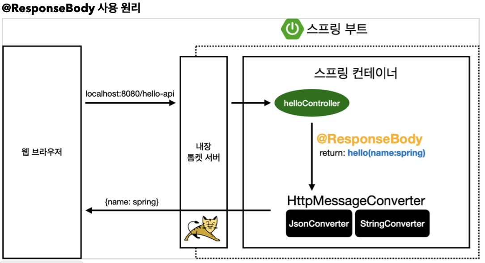

## Sect06. 스프링 MVC - 기본 기능

### 로깅 알아보기 - slf4j
- 운영 시스템에서는 `System.out.println()` 같은 시스템 콘솔을 사용해서 필요한 정보를 출력하지 않고, 별도의 로깅 라이브러리를 사용해서 로그를 출력함
- 스프링 부트 라이브러리를 사용하면 스프링 부트 로깅 라이브러리 `spring-boot-starter-logging` 가 함께 포함됨
    - 스프링 부트 로깅 라이브러리는 기본으로 다음 로깅 라이브러리를 사용함
        - SLF4J
        - Logback
    - 로그 라이브러리는 Logback, Log4J, Log4J2 등등 수 많은 라이브러리가 있는데, 그것을 통합해서 인터페이스로 제공하는 것이 바로 SLF4J 라이브러리임
    - 쉽게 이야기해서 SLF4J는 인터페이스이고, 그 구현체로 Logback 같은 로그 라이브러리를 선택하면 됨
    - 실무에서는 스프링 부트가 기본으로 제공하는 Logback을 대부분 사용함
- 로그 테스트 코드는 다음과 같음
    ```java
    @RestController
    public class LogTestController {

        private final Logger log = LoggerFactory.getLogger(getClass());

        @RequestMapping("/log-test")
        public String logTest() {
            String name = "Spring";
            log.trace("trace log={}", name);
            log.debug("debug log={}", name);
            log.info(" info log={}", name);
            log.warn(" warn log={}", name);
            log.error("error log={}", name);
            return "ok";
        }
    }
    ```
    - 또한 컨트롤러에 **Lombok 라이브러리** `@Slf4j`를 붙이면 `Logger log`를 가져오지 않아도 `log` 메시지 사용 가능
    - `@RestController` vs `@Controller`
        - 두 컨트롤러의 매핑 메서드는 **모두 반환 타입이 String**
            - `@Restcontroller`는 **반환된 문자열을 원본 그대로 클라이언트에 전달**함
                - RestAPI 만들 때 핵심이 됨, 나중에 설명
            - `@Controller`는 **반환된 문자열에 맞는 뷰 이름를 탐색**함 ~ `ViewResolver`
                - 찾은 뷰는 렌더링됨
- `http://localhost:8080/log-test` 접속시 다음과 같이 로그가 찍힘
    ```log
    2023-08-04 19:53:58.470  INFO 7755 --- [nio-8080-exec-1] hello.springmvc.basic.LogTestController  :  info log=Spring
    2023-08-04 19:53:58.471  WARN 7755 --- [nio-8080-exec-1] hello.springmvc.basic.LogTestController  :  warn log=Spring
    2023-08-04 19:53:58.471 ERROR 7755 --- [nio-8080-exec-1] hello.springmvc.basic.LogTestController  : error log=Spring
    ```
    - [시간] [로그 레벨] [프로세스 ID] --- [쓰레드 이름] [클래스 이름] : **[입력한 로그 메시지]** 
- 왜 하위 `TRACE`, `DEBUG` 로그는 찍히지 않는가?
    - 로그 표시 레벨 기본 설정값이 `INFO`이기 때문
    - `application.properties`를 에서 로그 레벨을 최하위인 `TRACE` 로 설정해주면 모든 레벨 확인 가능
    ```properties
    # 전체 로그 레벨 설정(기본 info) 
    logging.level.root=info

    # hello.springmvc 패키지와 그 하위 로그 레벨 설정
    logging.level.hello.springmvc=trace
    ```
    ```log
    2023-08-04 20:04:39.395 TRACE 8385 --- [nio-8080-exec-1] hello.springmvc.basic.LogTestController  : trace log=Spring
    2023-08-04 20:04:39.396 DEBUG 8385 --- [nio-8080-exec-1] hello.springmvc.basic.LogTestController  : debug log=Spring
    2023-08-04 20:04:39.396  INFO 8385 --- [nio-8080-exec-1] hello.springmvc.basic.LogTestController  :  info log=Spring
    2023-08-04 20:04:39.396  WARN 8385 --- [nio-8080-exec-1] hello.springmvc.basic.LogTestController  :  warn log=Spring
    2023-08-04 20:04:39.396 ERROR 8385 --- [nio-8080-exec-1] hello.springmvc.basic.LogTestController  : error log=Spring
    ```
- 개발 서버는 `DEBUG`, 운영 서버는 `INFO` 레벨로 많이 설정함
    - 배포하여 실제 서비스하는 서버는, 중요한 정보만 붙게끔
- 또한, 로그 메시지에서 **문자열에 덧셈 연산을 붙이지 말 것**
    - **사용하지 않은 레벨의 로그**도 **연산이 생겨 메모리 누수, 속도 저하**가 생김
    ```java
    log.trace("trace log with operator=" + name); // X
    log.trace("trace log={}", name); // O
    ```
- **로그의 장점**
    - 쓰레드 정보, 클래스 이름 같은 **부가 정보를 함께 볼 수 있고**, 출력 모양을 조정할 수 있음
    - **로그 레벨을 상황에 맞게 조절**할 수 있음
        - 개발 서버에서는 모든 로그를 출력하고, 운영 서버에서는 `INFO` 미만은 출력하지 않게 조정
    - 로그를 별도의 위치에 남길 수 있음
        - 시스템 아웃 콘솔에만 출력하는 것이 아니라, 파일이나 네트워크 등에도 가능
        - 특히 **파일로 남길 때는 일별, 특정 용량에 따라 로그를 분할**하는 것도 가능함
    - **성능**도 `sout`보다 수십 배 좋음 (내부 버퍼링, 멀티 쓰레드 등등 최적화) 
        - 그래서 실무에서는 꼭 로그를 사용해야 함

### Request Mapping
- `/hello`, `/hello/` 매핑 구분
    - `@RequestMapping("/hello-basic")`
        - **스프링 3.0 이후**로는 `/hello-basic`, `/hello-basic/` 를 구분하여 매핑해줘야 함
            - 3.0 이전은 `/hello-basic` 로 매핑해도 `/hello-basic/` 요청까지 받아옴
- `@PathVariable`
    - 요새 RestAPI에서 많이 사용하는 PathVariable(경로 변수) 방식 매핑임
     - 최근 HTTP API는 리소스 경로에 식별자를 넣는 스타일을 선호함
        ```java
            @GetMapping("/mapping/{userId}")
            public String mappingPath(@PathVariable("userId") String data) {
                log.info("mappingPath userId={}", data);
                return "ok";
            }
        ```
        - `/mapping/userA`
        - `/users/143`
    - 식별자와 파라미터 이름이 같으면 `@PathVariable` 이름을 생략할 수 있음
        ```java
            @GetMapping("/mapping/{userId}")
            public String mappingPath(@PathVariable String userId) {
                log.info("mappingPath userId={}", userId);
                return "ok";
            }
        ```
    - **`PathVariable` 식별자 다중 사용**
        - 식별자를 여러 개 쓸 수도 있음
            ```java
                @GetMapping("/mapping/users/{userId}/orders/{orderId}")
                public String mappingPath(@PathVariable String userId, @PathVariable Long orderId) {
                    log.info("mappingPath userId={}, orderId={}", userId, orderId);
                    return "ok";
                }
            ```
        - **요새 자주 사용함**
    - 쿼리 파라미터 조건 제한
        - 잘 사용하지 않음
        - 파라미터가 특정 조건을 만족해야 매핑되어 200 HTTP 정상 응답을 보냄
        ```java
            @GetMapping(value = "/mapping-param", params = "mode=debug")
            public String mappingParam() {
                log.info("mappingParam");
                return "ok";
            }
        ```
    - `content-type` 제한
        - consume 파라미터를 사용함, 맞지 않으면 `HTTP 415 Unsupported Media Type` 반환
        ```java
            @PostMapping(value = "/mapping-consume", consumes = "application/json")
            public String mappingConsumes() {
                log.info("mappingConsumes");
                return "ok";
            }
        ```
    - 미디어 타입 제한
        - Http 요청 Accept에 대응
        - produces 파라미터를 사용함, 맞지 않으면 `HTTP 406 Not Acceptable` 반환
        ```java
            @PostMapping(value = "/mapping-produce", produces = "text/html")
            public String mappingProduces() {
                log.info("mappingProduces");
                return "ok";
            }
        ```
### HTTP 요청 - 기본, 헤더 조회
- 아주 다양한 HTTP 요청 정보를 받을 수 있음
    - **기본 HTTP 요청 정보**
        - `HttpServletRequest` req
        - `HttpServletResponse` res
        - `HttpMethod`: 메소드, 예시. GET, PUT, PATCH, ...
        - `Locale`: 지역 정보
        - `@RequestHeader MultiValueMap<String, String>`
            - 같은 키에 여러 밸류가 있을 때 출력시키는 방법임  
                - `?keyA=3&keyB=4&keyA=6`
                - 키에 여러 밸류를 넣는 방법은 권장하지 않음
        - `@RequestHeader("host") String`
            - 헤더 key name을 인수로 넣어 value를 조회할 수 있음
        - `@CookieValue(value = "myCookie", required = false) String`
- 코드는 다음과 같음
    ```java
    @Slf4j
    @RestController
    public class RequestHeaderController {

        @RequestMapping("/headers")
        public String headers(
                HttpServletRequest request,
                HttpServletResponse response,
                HttpMethod httpMethod,
                Locale locale,
                @RequestHeader MultiValueMap<String, String> headerMap,
                @RequestHeader("host") String host,
                @CookieValue(value = "myCookie", required = false) String cookie
        ) {
            log.info("request={}", request);
            log.info("response={}", response);
            log.info("httpMethod={}", httpMethod);
            log.info("locale={}", locale);
            log.info("headerMap={}", headerMap);
            log.info("header host={}", host);
            log.info("myCookie={}", cookie);
            return "OK";
        }
    }
    ```
- 로그는 다음과 같이 출력됨
    ```log
    2023-08-05 16:16:02.374  INFO 14667 --- [nio-8080-exec-3] h.s.b.request.RequestHeaderController    : httpMethod=GET
    2023-08-05 16:16:02.375  INFO 14667 --- [nio-8080-exec-3] h.s.b.request.RequestHeaderController    : locale=ko
    2023-08-05 16:16:02.375  INFO 14667 --- [nio-8080-exec-3] h.s.b.request.RequestHeaderController    : headerMap={host=[localhost:8080], connection=[keep-alive], sec-ch-ua=["Not.A/Brand";v="8", "Chromium";v="114", "Google Chrome";v="114"], sec-ch-ua-mobile=[?0], sec-ch-ua-platform=["macOS"], upgrade-insecure-requests=[1], user-agent=[Mozilla/5.0 (Macintosh; Intel Mac OS X 10_15_7) AppleWebKit/537.36 (KHTML, like Gecko) Chrome/114.0.0.0 Safari/537.36], accept=[text/html,application/xhtml+xml,application/xml;q=0.9,image/avif,image/webp,image/apng,*/*;q=0.8,application/signed-exchange;v=b3;q=0.7], sec-fetch-site=[none], sec-fetch-mode=[navigate], sec-fetch-user=[?1], sec-fetch-dest=[document], accept-encoding=[gzip, deflate, br], accept-language=[ko,en-US;q=0.9,en;q=0.8]}
    2023-08-05 16:16:02.375  INFO 14667 --- [nio-8080-exec-3] h.s.b.request.RequestHeaderController    : header host=localhost:8080
    2023-08-05 16:16:02.375  INFO 14667 --- [nio-8080-exec-3] h.s.b.request.RequestHeaderController    : myCookie=null
    ```
### HTTP 요청 파라미터 - 쿼리 파라미터, HTML Form
- Recall. 클라이언트에서 서버로 **요청 데이터를 전달**하는 3가지 방법
    1. **GET & 쿼리 파라미터**
        - `/url?username=hello&age=20`
        - 예시. 검색, 필터, 페이징
    2. **POST & HTML Form**
        - `content-type: application/x-www-form-urlencoded`
        - **메시지 바디**에 쿼리 파리미터 형식으로 전달 `username=hello&age=20`
        - 예시. 회원 가입, 상품 주문,
    3. **HTTP message body**에 데이터를 직접 담아 요청
        - **HTTP API**에서 주로 사용
        - 타입: JSON, XML, TEXT

### HTTP 요청 파라미터 - @RequestParam
- 스프링이 제공하는 `@RequestParam` 을 사용하면 요청 파라미터를 매우 편리하게 사용할 수 있음
- `@RequestMapping("request-param-v1")` 메서드 개선
    ```java
        @ResponseBody
        @RequestMapping("/request-param-v2")
        public String requestParamV2(@RequestParam("username") String username, @RequestParam("age") int age) {
            log.info("username={}, age={}", username, age);
            return "OK";
        }
    ```
- 메서드에 `@ResponseBody`를 붙이면 return String이 뷰 리졸버를 호출하지 않음
    - 동시에 응답 바디에 문자열을 그대로 넣어 응답을 보냄
    - 마치, `@Controller`를 `@RestController`로 변환한 느낌
- `@RequestMapping("/request-param-v2")` 개선
    - 변수 이름을 HTTP 파라미터 이름과 일치시키고, `@RequestParam` 인수 제거
    ```java
        @ResponseBody
        @RequestMapping("/request-param-v3")
        public String requestParamV3(@RequestParam String username, @RequestParam int age) {
            log.info("username={}, age={}", username, age);
            return "OK";
        }
    ```
- `@RequestMapping("/request-param-v3")` 개선
    - 변수가 단순 타입이면, `@RequestParam` 애노테이션 마저도 생략 가능
        - 단순 타입: `String`, `int`, `Integer` 등등
            - `int`는 기본형, `Integer`는 Object를 상속받음, null 받을 수 있음
        - 이렇게 애노테이션을 완전히 생략해도 되는데, 너무 없는 것도 약간 과하다는 의견도 있음
        - `@RequestParam` 이 있으면 명확하게 요청 파리미터에서 데이터를 읽는다는 것을 알 수 있음
    ```java
        @ResponseBody
        @RequestMapping("/request-param-v4")
        public String requestParamV4(String username, int age) {
            log.info("username={}, age={}", username, age);
            return "OK";
        }
    ```
- 파라미터 필수 여부 체크 : `@RequestParam(required = true)`
    - 파라미터 필수 여부를 설정할 수 있음
        - 클라이언트와의 약속으로 필수 여부를 협약지음
        - 만약 필수 파라미터를 보내지 않으면 `400 Bad Request`를 내보냄
        - `int age = null`이 들어가면 `500 Internal Server Error`를 내보냄
            - int의 객체형인 `Integer age = null`로 처리할 것
            - 아니면 `Optional<Integer> age; age.orElse(99);`
    ```java
        @ResponseBody
        @RequestMapping("/request-param-required")
        public String requestParamRequired(
                @RequestParam(required = true) String username,
                @RequestParam(required = false) Integer age) {
            log.info("username={}, age={}", username, age);
            return "OK";
        }
    ```
- `@RequestParam(defaultValue = "guest")`
    - `defaultValue`를 설정해주면 `""`, `null`인 상황에서 **기본 값**을 설정해줄 수 있음
    -**빈 문자 `""`도 defaultValue로 치환**됨을 주의
    - `defaultValue` 인수가 들어가면 required의 참/거짓 여부가 상관 없어짐
    ```java
        @ResponseBody
        @RequestMapping("/request-param-default")
        public String requestParamDefault(
                @RequestParam(required = true, defaultValue = "guest") String username,
                @RequestParam(required = false, defaultValue = "-1") int age) {

            log.info("username={}, age={}", username, age);
            return "OK";

        }
    ```
- `@RequestParam Map<String, Object> paramMap`
    - `Map<String, Object>`단일 파라미터로 모든 쿼리를 꺼낼 수도 있음
        - 쿼리 key에 대응하는 값이 여러 개면 `MultiValueMap`으로 사용 가능
            - 파라미터 값이 1개인 것이 확실하면 `Map` 사용(주류)
    ```java
        @ResponseBody
        @RequestMapping("/request-param-map")
        public String requestParamMap(@RequestParam Map<String, Object> paramMap) {
            log.info("username={}, age={}", 
            paramMap.get("username"), paramMap.get("age"));
            return "ok";
        }
    ```
### HTTP 요청 파라미터 - @ModelAttribute
- @RequestParam을 받아 모델로 바꾸려면 다음과 같은 과정이 필요함
    ```java
    // ...
        @RequestParam String username;
        @RequestParam int age;
        HelloData data = new HelloData(username, age);
    // ...
    ```
- 스프링의 기능인 `@ModelAttribute`는 이 과정을 완전히 자동화해줌
    1. 모델에 Getter, Setter, toString 등을 제작
        - Lombok `@Data`를 모델 클래스에 추가하면, 필수 메서드 생략 가능(**자동 제작**)
            - `@Getter`, `@Setter`, `@ToString`, `@EqualsAndHashCode`, `@RequiredArgsConstructor`를 만들어줌
            ```java
            @Data
            public class HelloData {
                private String username;
                private int age;
            }
            ```
    2. **메서드**에 모델을 직접 파라미터로 설정, `@ModelAttribute Hellodata helloData`
        - 파라미터에 `@ModelAttribute HelloData helloData` 모델을 받게 함
        ```java
            @ResponseBody
            @RequestMapping("/model-attribute-v1")
            public String modelAttributeV1(@ModelAttribute HelloData helloData) {
                log.info("username={}, age={}", helloData.getUsername(), helloData.getAge());
                log.info("helloData={}", helloData); // helloData.toString() 호출
                return "OK";
            }
        ```
- 스프링 MVC는 `@ModelAttribute`가 있으면 다음을 실행함
    1. `HelloData` 객체를 생성
    2. **요청 파라미터의 이름**으로 `HelloData` 객체의 **프로퍼티를 탐색**함
    3. 이후 해당 **프로퍼티의 setter를 호출**해서 파라미터의 **값을 입력(바인딩)**함
        - 예시. 파라미터 이름이 `username` 이면 Model의 `setUsername()` 메서드를 찾아 호출하여 값을 입력함
- **바인딩 오류 처리**
    - `age=XYZ` 처럼 숫자가 들어가야 할 곳에 문자를 넣으면 `BindException` 이 발생함
        > 이런 바인딩 오류를 처리하는 방법은 **검증 부분**에서 다룰 예정
- **@ModelAttribute 생략 - modelAttributeV2**
    - `@RequestParam` 처럼, `@ModelAttribute` 또한 생략 가능함
        - `@RequestParam` 생략 시의 단점도 공유함
    ```java
        @ResponseBody
        @RequestMapping("/model-attribute-v2")
        public String modelAttributeV2(HelloData helloData) {
            log.info("username={}, age={}", helloData.getUsername(), helloData.getAge());
            return "ok";
        }
    ```
    - 생략 시 `@RequestParam`과의 충돌 해결
        - 스프링은 생략 시에 다음과 같은 규칙을 적용함
            1. `String` , `int` , `Integer` 같은 단순 타입 -> `@RequestParam` 처리
            2. 나머지 -> `@ModelAttribute` 처리
                - 단, `argument resolver`로 지정해둔 타입은 예외
                    - argument resolver 지정 예시. `HttpServletRequest`, ...
                    - 직접 지정도 가능

### HTTP 요청 메시지 - 단순 텍스트
- HTTP 메시지 바디의 텍스트 데이터를 읽어보자
    - 스프링의 `HttpMessageConverter`가 요청, 응답 메시지의 변환을 도와줌
        - 뒤에서 자세히 설명 
- 스트링은 바이트코드이기 때문에, 어떤 **인코딩**으로 문자를 받을 지를 설정해줘야 함
    - `StreamUtils.copyToString(inputStream, StandardCharsets.UTF_8)`
    - 설정하지 않으면 OS나 Java의 기본값을 따름
- 기본 코드 - V1
    - 코드는 다음과 같음
        ```java
            @PostMapping("/request-body-string-v1")
            public void requestBodyString(HttpServletRequest req, HttpServletResponse res) throws IOException {
                ServletInputStream inputStream = req.getInputStream();
                String messageBody = StreamUtils.copyToString(inputStream, StandardCharsets.UTF_8);
                log.info("messageBody = {}", messageBody);
                res.getWriter().write("OK");
            }
        ```
- **필요한 부분만 호출** - requestBodyStringV2
    - 우리는 지금 `HttpServletRequest`의 `InputStream`과 `HttpServletResponse`의 `Writer`만 필요로 함
    - 필요한 부분만 메서드의 인수로 들어오도록 코드를 수정
    - 코드는 다음과 같음
        ```java
            @PostMapping("/request-body-string-v2")
            public void requestBodyStringV2(InputStream inputStream, Writer resWriter) throws IOException {
                String messageBody = StreamUtils.copyToString(inputStream, StandardCharsets.UTF_8);
                log.info("messageBody = {}", messageBody);
                resWriter.write("OK");
            }
        ```
- `HttpEntity` - requestBodyStringV3
    - `HttpEntity<String>`으로 request, response 모두 다룸
        - `httpEntity.getBody()` : 바디 조회, `httpEntity.getHeaders()` : 헤더 조회
            - 유의. GET, POST의 요청 쿼리 파라미터는 `@RequestParam` or `@ModelAttribute` 사용
        - 반환 또한 `HttpEntity<>`로 다룸
            - `new HttpEntity<>("messageBody")`
    - 코드는 다음과 같음
        ```java
            @PostMapping("/request-body-string-v3")
            public HttpEntity<String> requestBodyStringV3(HttpEntity<String> httpEntity) {
                String messageBody = httpEntity.getBody();
                log.info("messageBody = {}", messageBody);
                return new HttpEntity<>("OK");
            }
        ```
    - `HttpEntity`를 상속받은 다음 객체들도 같은 기능을 제공함
        - `RequestEntity`
            - HttpMethod, url 정보가 추가됨
        - `ResponseEntity`
            - HTTP 상태 코드 설정 가능
- 애노테이션 `@RequestBody`, `@ResponseBody` - requestBodyStringV4
    - 파라미터에서 `@RequestBody String messageBody`로 받아옴
        - 헤더 정보가 필요하면 `HttpEntity`나 `@RequestHeader`를 사용
            `@RequestHeader String requestHeader`
    - 메서드에 `@ResponseBody`를 붙여 반환 스트링을 그대로 응답 바디로 보냄
        - 우리가 자주 쓰던 그것
    - 코드는 다음과 같음
        ```java
            @ResponseBody
            @PostMapping("/request-body-string-v4")
            public String requestBodyStringV4(@RequestBody String messageBody) {
                log.info("messageBody = {}", messageBody);
                return "OK";
            }
        ```

### HTTP 요청 메시지 - JSON
- HTTP 메시지 바디의 데이터를 `JSON`으로 변환하여 읽어보자
- 요청 메시지와 요청의 content-type은 다음과 같음
    - `{"username":"hello", "age":20}`
    - `content-type: application/json`
- `ObjectMapper`를 이용한 기본적인 JSON -> 모델 변환 - V1
    - 서블릿에서 다루어보았던 내용
    - 코드는 다음과 같음
        ```java
            @RequestMapping("/request-body-json-v1")
            public void requestBodyJsonV1(HttpServletRequest req, HttpServletResponse res) throws IOException {
                ServletInputStream inputStream = req.getInputStream();
                String messageBody = StreamUtils.copyToString(inputStream, StandardCharsets.UTF_8);
                log.info("messageBody={}", messageBody);
                HelloData data = objectMapper.readValue(messageBody, HelloData.class);
                log.info("username={}, age={}", data.getUsername(), data.getAge());
            }
        ```
    - V2: `@ResponseBody`추가
- `@RequestBody` 사용 - **V3**
    - `@RequestBody` 를 사용하면 `HTTP 메시지 컨버터`가 HTTP 메시지 바디의 내용을 우리가 원하는 문자나 객체 등으로 변환해줌
    - HTTP 메시지 컨버터는 문자 뿐만 아니라 JSON도 객체로 변환해줌
        - 이때 우리가 방금 V2에서 `ObjectMapper`로 다루었던 작업을 처리
    - `@ModelAttribute`로 쿼리를 받는 것과 유사하게 동작함
        - **애노테이션 생략 불가!!** 생략하면 모델을 `@ModelAttribute`으로 간주하려 처리됨
            - 생략하면 HTTP 메시지 바디가 아니라 요청 파라미터를 처리하게 됨
    - 코드는 다음과 같음
        ```java
            @ResponseBody
            @RequestMapping("/request-body-json-v3")
            public String requestBodyJsonV3(@RequestBody HelloData helloData) {
                log.info("username={}, age={}", helloData.getUsername(), helloData.getAge());
                return "OK";
            }
        ```
    > 주의. HTTP 요청시에 content-type이 application/json인지 꼭! 확인해야 한다. 
    > 그래야 JSON을 처리할 수 있는 HTTP 메시지 컨버터가 실행된다.

- `HttpEntity<>`로 처리 - V4
    - V3의 상위호환은 아님
    - `HttpEntity<>`, `httpEntity.getBody()`로 꺼내 쓸 수 있음
    - 코드는 다음과 같음
        ```java
            @ResponseBody
            @RequestMapping("/request-body-json-v4")
            public String requestBodyJsonV4(HttpEntity<HelloData> httpEntity) {
                HelloData helloData = httpEntity.getBody();
                log.info("username={}, age={}", helloData.getUsername(), helloData.getAge());
                return "OK";
            }
        ```
- **response를 JSON으로 처리** - V5
    - **반환 타입**을 String이 아닌, Model로 설정 가능
    - 응답 바디도 `text`가 아닌, `applicaton/json`으로 옴
    - 코드는 다음과 같음
        ```java
            @ResponseBody
            @RequestMapping("/request-body-json-v5")
            public HelloData requestBodyJsonV5(@RequestBody HelloData data) {
                log.info("username={}, age={}", data.getUsername(), data.getAge());
                return data;
            }
        ```
### HTTP 응답 메시지 - 정적 리소스, 뷰 템플릿
- 응답 부분에 초점을 맞추어 다룰 예정
- 스프링 서버에서 응답 데이터를 만드는 방법은 크게 3가지임
    1. 정적 리소스
        - 예시. 정적 HTML, css, js
    2. 뷰 템플릿 사용
        - 예시. 사용자마다 이름이 달라지는, 동적인 HTML
    3. HTTP 메시지 사용
        - HTML이 아닌, response message body에 JSON같은 형식으로 전달하는 경우
    4. (번외) 메시지 바디에 직접 입력

1. 정적 리소스
    - 스프링 부트는 웹앱 경로를 따로 제공하지 않음
    - 대신, 클래스패스의 다음 디렉토리에 있는 정적 리소스를 제공함
        - `/resources`, `/static`, `/public`, `/META-INF/resources`
    - `src/main/resources/static/basic/hello-form.html` 경로는
        - `/basic/hello-form.html`로 호출 가능
    - 정적 리소스는 해당 파일을 **변경 없이 그대로 서비스**하는 것임
2. **뷰 템플릿**
    - 뷰 템플릿을 거쳐 HTML이 생성되고, 뷰가 응답을 만들어 전달함
    - 일반적으로 동적 HTML을 만드는 용도로 사용하지만, 이외에도 다양한 것를 만들 수 있음
    - 모던 스프링에서는 타임리프를 뷰 템플릿에서 활용함
    - `ModelAndView` 활용 기본 뷰 템플릿 - V1
        - 코드는 다음과 같음
            ```java
                @RequestMapping("/response-view-v1")
                public ModelAndView responseViewV1() {
                    ModelAndView mv = new ModelAndView("response/hello")
                            .addObject("data", "hello!v1");
                    return mv;
                }
            ```
    - 모델 분리, 뷰 논리 이름 `String` 반환 - V2
        - `Model`을 파라미터 쪽으로 분리함
        - 또한 `View` 논리 이름을 반환하여 렌더링을 준비함
        - 코드는 다음과 같음
            ```java
                @RequestMapping("/response-view-v2")
                public String responseViewV2(Model model) {
                    model.addAttribute("data", "hello!!v2");
                    return "response/hello";
                }
            ```
    - `void`를 반환하는 경우 - V3
        - `RequestMapping` 파라미터와 논리 이름이 동일하면 생략 가능
        - 권장하지 않음
- 왜 `prefix=classpath:/templates/` 자동으로 들어가는가?
    - 스프링 부트가 `Thymeleaf`를 확인하면 `application.properties`에 다음과 같이 등록함
        ```properties    
        spring.thymeleaf.prefix=classpath:/templates/
        spring.thymeleaf.suffix=.html
        ```
        -또한, `ThymeleafViewResolver`와 필요한 스프링 빈들을 등록함

### HTTP 응답 - HTTP API, 메시지 바디에 직접 입력
- 코드를 정리하면 다음과 같음
    ```java
        @GetMapping("/response-body-string-v1")
        public void responseBodyV1(HttpServletResponse res) throws IOException {
            res.getWriter().write("ok");
        }

        @GetMapping("/response-body-string-v2")
        public ResponseEntity<String> responseBodyV2() {
            return new ResponseEntity<>("ok", HttpStatus.OK);
        }

        @ResponseBody
        @GetMapping("/response-body-string-v3")
        public String responseBodyV3() {
            return "OK";
        }

        @GetMapping("/response-body-json-v1")
        public ResponseEntity<HelloData> responseBodyJsonV1() {
            HelloData helloData = new HelloData();
            helloData.setUsername("userA");
            helloData.setAge(20);
            return new ResponseEntity<>(helloData, HttpStatus.OK);
        }

        @ResponseStatus(HttpStatus.OK)
        @ResponseBody
        @GetMapping("/response-body-json-v2")
        public HelloData responseBodyJsonV2() {
            HelloData helloData = new HelloData();
            helloData.setUsername("userA");
            helloData.setAge(20);
            return helloData;
        }
    ```
- 또한, 클래스 레벨에 `@ResponseBody`를 붙이면 클래스 내부 메서드들이 붙인 셈 적용됨
    - 참고: `@RestController` = `@ResponseBody` + `@Controller`
        - `application/json`으로 응답하는 RestAPI는 body를 직접 입력할 필요가 있기 때문
    
### HTTP 메시지 컨버터

- 기본적으로 `@Controller` 내부 메서드는 스트링을 반환할 때 `viewResolver`를 호출함
- `@ResponseBody`를 사용하는 경우 동작이 달라짐
    - 
    - 기본 동작: Http body에 문자 내용을 직접 반환함
    - `viewResolver` 대신에 `HttpMessageConverter` **인터페이스**가 동작함
        - 기본 문자 처리: `StringHttpMessageConverter`
        - 기본 객체 처리: `MappingJackson2HttpMessageConverter`
        - 바이트 등 기타 처리도 컨버터에 내장되어 있음
    - `Http Accept` 헤더
- `HttpMessageConverter`는 **스프링 MVC**에서 다음의 경우 호출됨
    - HTTP req: `@RequestBody`, `HttpEntity(RequestEntity)`
    - HTTP res: `@ResponseBody`, `HttpEntity(ResponseEntity)`
- `HttpMessageConverter` 인터페이스의 코드는 다음과 같음
    ```java
    public interface HttpMessageConverter<T> {
          boolean canRead(Class<?> clazz, @Nullable MediaType mediaType);
          boolean canWrite(Class<?> clazz, @Nullable MediaType mediaType);

          List<MediaType> getSupportedMediaTypes();

          T read(Class<? extends T> clazz, HttpInputMessage inputMessage) throws IOException, HttpMessageNotReadableException;

          void write(T t, @Nullable MediaType contentType, HttpOutputMessage
        outputMessage) throws IOException, HttpMessageNotWritableException;
    }
    ```
    - `bool canRead()`, `bool canWrite()`: 메시지 컨버터가 해당 클래스, 미디어타입을 지원하는지 체크
        - 클래스 타입: `bool canRead()`
        - 미디어 타입: `bool canWrite()`
    - `T read()`, `void write()`: 메시지 컨버터를 통해서 메시지를 읽고 쓰는 기능
- 스프링 부트는 대상 **클래스 타입**과 **미디어 타입** 을 모두 만족하는지를 체크해서 사용여부를 결정함
    - 만약 만족하지 않으면 다음 메시지 컨버터로 우선순위가 넘어감
    - 우선순위는 다음과 같음

|우선순위|implement HttpMessageConverter|클래스 타입|미디어 타입|
|--|--|--|--|
|0순위|ByteArrayHttpMessageConverter|`byte[]`| `*/*` |
|1순위|StringHttpMessageConverter|`String`|`*/*`|
|2순위|MappingJackson2HttpMessageConverter|`Object` 또는 `HashMap<>`|`application/json`|

- 예시. `content-type:application/json`, `@RequestBody String data`
    - 0순위, `byte[]`가 아니므로 1순위로 넘어감
    - 1순위, `String` 만족함, `*/*`이므로 `StringHttpMessageConverter`로 다룸
- 예시. `content-type: text/html`, `@RequestBody HelloData data`
    - 0순위, `byte[]`가 아니므로 1순위로 넘어감
    - 1순위, `String`이 아니므로 2순위로 넘어감
    - 2순위, `Object` 만족, `application/json`이 아니므로 **탈락**

### 요청 매핑 핸들러 어댑터

- 위와 같은 SpringMVC 구조에서, `@RequestMapping`을 처리하는 핸들러 어댑터

1. ArgumentResolver

2. ReturnValueHandler

--- 
## 다음 글

### 7. [스프링-MVC-웹-페이지-만들기](7-스프링-MVC-웹-페이지-만들기.md)

---