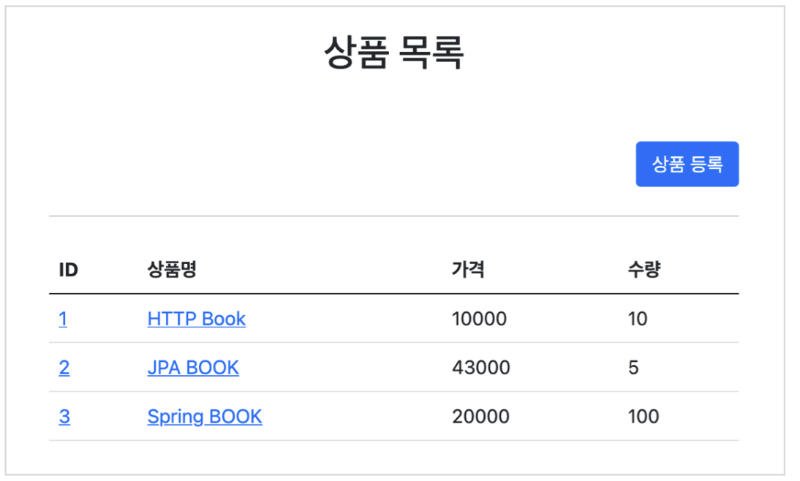
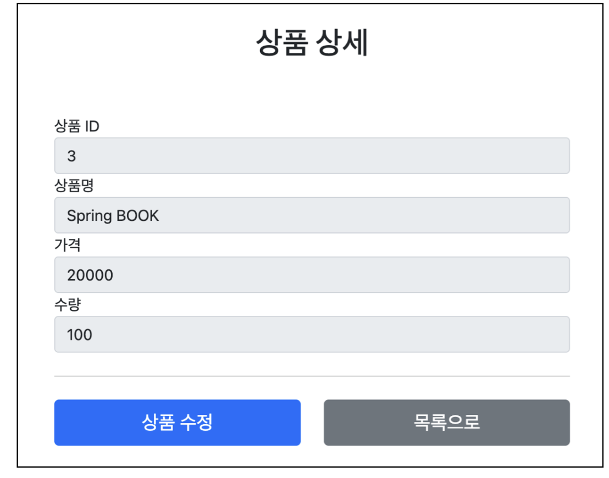
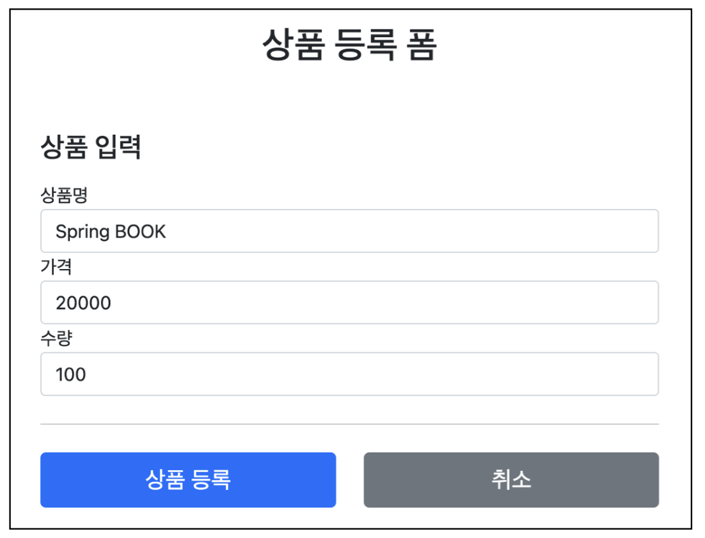
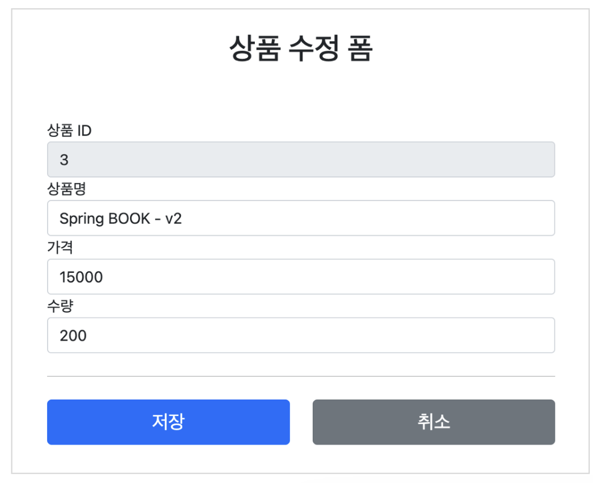
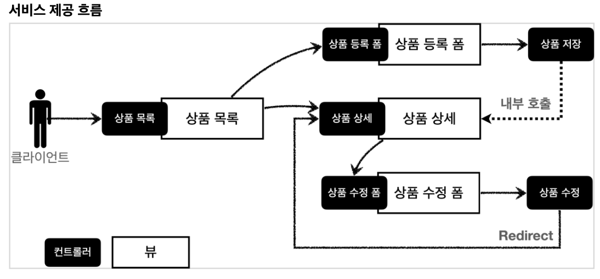
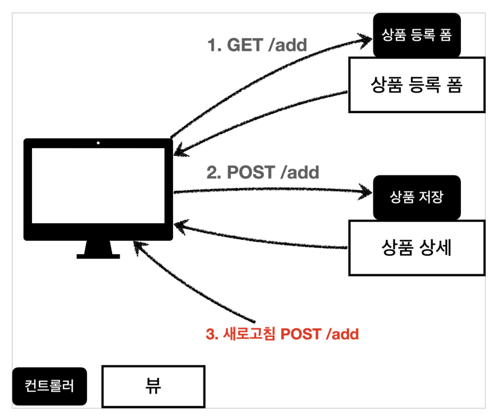
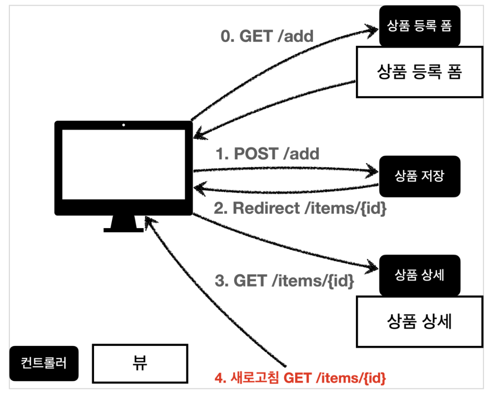

## Sect07. 스프링 MVC - 웹 페이지 만들기
- 상품을 관리할 수 있는 서비스를 예시로 만들 예정
- 서비스의 요구사항은 다음과 같음
    - **상품 도메인 모델**
        - 상품 ID
        - 상품명
        - 가격
        - 수량
    - **상품 관리 기능**
        - 상품 목록
            - 
        - 상품 상세
            - 
        - 상품 등록
            - 
        - 상품 수정
            - 
    - 서비스 제공 흐름은 다음과 같음
        - 검정색은 컨트롤러, 하얀색은 뷰임
        - 
- 요구사항이 정리된 후에는 디자이너, 웹 퍼블리셔, 백엔드 개발자가 업무를 나누어 진행함
    - 디자이너
        - 요구사항에 맞도록 디자인하고
        - 디자인 결과물을 웹 퍼블리셔에게 넘겨줌
    - 웹 퍼블리셔
        - 디자이너에서 받은 디자인을 기반으로 HTML, CSS를 만들어 개발자에게 제공함
    - 백엔드 개발자
        - 디자이너, 웹 퍼블리셔를 통해서 HTML 화면이 나오기 전까지 시스템을 설계하고
        - 핵심 비즈니스 모델을 개발함
        - 이후 HTML이 나오면 이 HTML을 뷰 템플릿으로 변환해서 동적으로 화면과 화면의 흐름을 제어함

> React, Vue.js 같은 웹 클라이언트 기술을 사용하고, 웹 프론트엔드 개발자가 별도로 있으면, 웹 프론트엔드 개발자가 웹 퍼블리셔 역할까지 포함해서 하는 경우도 있음

> 웹 클라이언트 기술을 사용하면, **웹 프론트엔드 개발자**가 **HTML을 동적으로 만드는 역할**과 **웹 화면의 흐름을 담당**함

> 이 경우 백엔드 개발자는 HTML 뷰 템플릿을 직접 만지는 대신에, **HTTP API**를 통해 웹 클라이언트가 필요로 하는 **데이터와 기능을 제공**하면 됨

### 타임리프 사용
- **타임리프** 사용은 다음 선언으로 시작함
    - `<html xmlns:th="http://www.thymeleaf.org">`
- `th:` 표현 방식은 다음과 같음
    - `th:each="item : ${items}"` 
        - **반복 출력**
    - `th:text="|...|"`, `th:href="|...|"`, ...
        - **`th:`와 한 짝**
        - 일반 속성의 `"..."`가 `"|...|"`에 대응함
        - `"|${...}|"` 단일이면 `"${...}"` 로도 가능
    - `${...}` 
        - **모델, 또는 변수 표현식**
        - JSP `<%=item.id%>`처럼 삽입할 수 있음
    - `@{...}` 
        - **URL 링크 표현식**, URL이면 웬만해서 사용을 권장
        1. **소괄호** 표현, `@{ ... (...)}`
            - `@{...}` 내부에 `|` 가 들어가지 않음
            - 소괄호 `()` 내부는 `key=value, ...` 쌍으로 되어 있음
                - 모델 등 데이터를 삽입할 때 새 변수로 만듦
                    - `@{items/{itemId}}`로, 이떄 `{itemId}`는 소괄호에서 정의되어야 함
                    - `@{ ... (itemId=${item.id}, ...)}`
                - `key`가 앞서 선언한 변수 이름이 아니라면 쿼리 쪽으로 붙음
            - 예시. `@{/items/{itemId}(itemId=${item.id}, key=test)}`
                - URL: `/items/12?key=test`
        2. [Deprecated] 모델 직접 삽입, `@{|/items/${item.id}|}`
            - URL 링크 표현식에서의 모델 삽입 방법

### @ModelAttribute 사용
- `@ModelAttribute`에는 두 가지 용도가 있음
    1. Request로부터 param을 받아와 **모델 객체를 가져옴** 
        - param key를 키워드로 모델 객체의 setXXX를 호출하여 할당
    2. 받아온 모델 객체와 동일한 이름의 **모델을 뷰 리졸버에 넘김**
        - 따라서, `Model model`, `model.addAttribute("item", item)` 생략 가능
- `redirect:/basic/items/{itemId}`
    1. `{itemId}`
        - `@PathVariable`을 그대로 가져옴
    2. `redirect:...`
        - 뷰 리졸버를 호출하는 대신, 해당 경로로 `302 redirect`함
        - 실제 경로가 어떤 지가 중요!
1. `return "basic/item";`
    - **뷰 리졸버** 호출
    - `application.properties`의 prefix, suffix가 관여
2. `return "redirect:/basic/items/{itemId}";`
    - **실제 URL 경로**로 호출
    - 내가 미리 설정해둔 경로로 연결해야 함

            
### Post, Redirect, Get 패턴
- `새로고침` 은 내가 마지막에 했던 행위를 반복하는 것
    - 마지막 요청이 `POST`면, 데이터도 동일하게 제출됨
        - 
        - `POST` 요청을 여러 번 보내게 구성하는 건 좋지 않은 설계 방식
- **Post, Redirect Get 패턴** 적용
    - 
    - 새로고침 문제를 해결하려면 상품 저장 후에 뷰 템플릿으로 이동하는 것 대신, 상품 상세 화면으로 리다이렉트 호출해주면 됨
    - `return "redirect:/basic/items/" + item.getId()`
        - 웹브라우저는 리다이렉트의 영향으로 상품 저장 후에 실제 상품 상세 화면으로 다시 이동함
        - 새로고침 하면 `GET /items/{itemId}`를 요청하게 됨
    - `+ item.getId()`처럼 URL에 직접 변수를 더해 사용하는 것은 URL 인코딩이 안되기 때문에 위험함
        - `RedirectAttributes` 로 해결

### RedirectAttributes
- `RedirectAttributes redirectAttributes`
- `Redirect URL`에 삽입할 데이터, URL에 붙일 쿼리를 설정함
    ```java
        @PostMapping("/add")
        public String addItemV6(Item item, RedirectAttributes redirectAttributes) {
            Item savedItem = itemRepository.save(item);
            redirectAttributes.addAttribute("itemId", savedItem.getId());
            redirectAttributes.addAttribute("status", true);
            return "redirect:/basic/items/{itemId}";
        }
    ```
    - return URL 문자열에 직접 삽입되는 `itemId`는 값이 할당됨
    - return에 들어가지 않는 나머지 key들은 쿼리로 치환됨
    - -> `/basic/items/9?status=true` 
- `item.html`에서는 다음처럼 받아 쓸 수 있음
    ```html
        <!-- 저장 완료 start -->
        <h2 th:if="${param.status}" th:text="|저장 완료|"></h2>
        <!-- 저장 완료 end -->
    ```
    - `${param}`은 예약어
        - 멤버 데이터로 key를 호출하면 value가 나옴 

---
