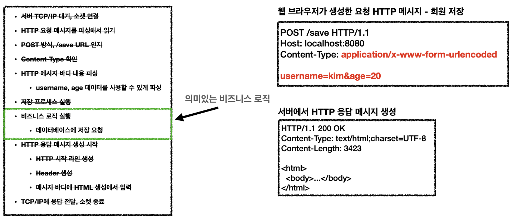
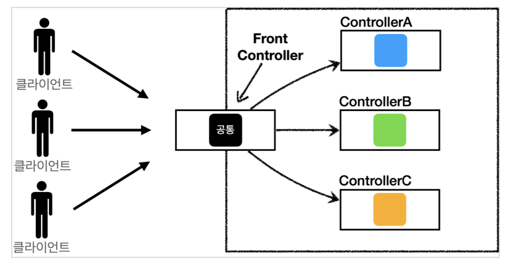
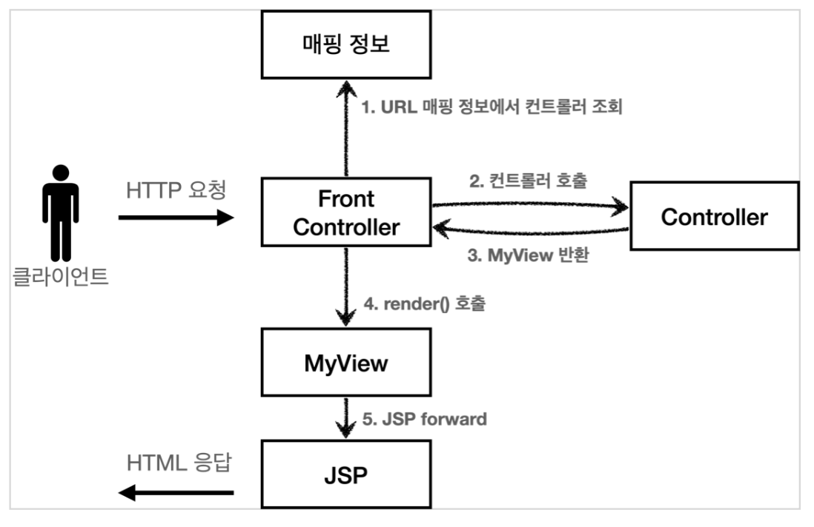
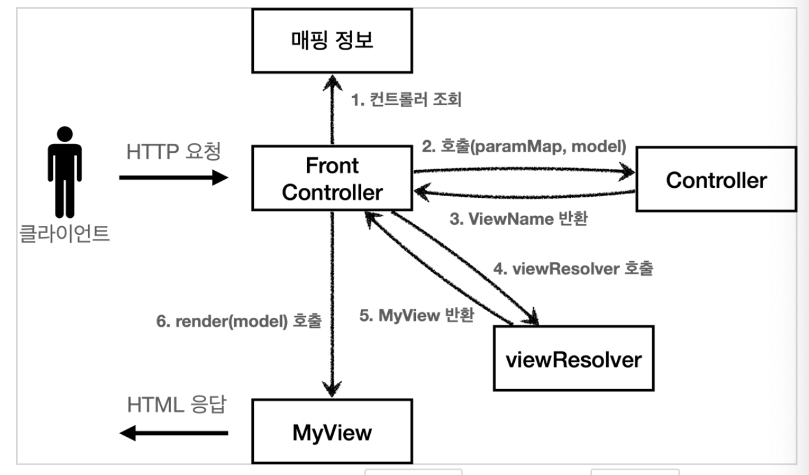

## 목차

1. 웹 애플리케이션 이해
2. 서블릿
3. 서블릿, JSP, MVC 패턴
4. MVC 프레임워크 만들기
5. 스프링 MVC - 구조 이해
6. 스프링 MVC - 기본 기능
7. 스프링 MVC - 웹 페이지 만들기
8. 다음으로

---

## Sect01. 웹 애플리케이션 이해

### 웹 서버와 웹 애플리케이션 서버
- 웹 서버
    - HTTP 기반으로 동작
    - 정적 리소스 제공, 기타 부가기능을 가짐
    - 정적(파일) HTML, CSS, JS, 이미지, 영상
    - 예시. `NGINX`, `APACHE`
- 웹 애플리케이션 서버(WAS, Web Application Server)
    - HTTP 기반으로 동작(동일)
    - 웹 서버 기능을 포함함(정적 리소스 제공)
    - **프로그램 코드**를 실행해서 애플리케이션 로직을 수행함
        - 동적 HTML, RestAPI(JSON)
        - 서블릿, JSP, 스프링 MVP
    - 예시. `Tomcat`, `Jetty`, `Undertow`
- 두 용어의 경계는 모호함
    - 웹 서버도 프로그램을 실행하는 기능을 포함하기도 함
    - WAS도 웹 서버 기능을 제공함
- **WAS**는 **애플리케이션 코드를 실행**하는 데에 특화되어 있음

### 웹 시스템 구성
- WAS, DB만으로 시스템을 구성할 수 있음
    - WAS는 정적 리소스, 애플리케이션 로직을 모두 제공하기 때문
- 예상되는 문제
    - 하지만, WAS가 너무 많은 역할을 하면 **서버 과부하**가 우려됨
        1. **애플리케이션 로직**은 정적 리소스에 비해 **cost가 높음** 
        2. WAS에 장애가 나면 오류 화면도 노출할 수 없음
- 해결 방안
    - 따라서, 웹 서버와 WAS를 리소스에 따라 분리함
        - **웹 서버**는 **정적 리소스**를 처리
        - **WAS**는 **애플리케이션 로직**을 처리 
        - 정적 리소스, 애플리케이션 로직 요구량에 따라 분리 증설도 가능
    - 클라이언트 쪽에서 동적인 처리를 요구받으면 WAS로 요청을 위임
    - 웹 서버는 안정적이므로 WAS, DB 오류 화면 HTML을 제공할 수 있음

### 서블릿

- 서블릿은 **비즈니스 로직을 제외한 모든 WAS 로직**을 담당해줌

```java
@WebServlet(name = "helloServlet", urlPatterns = "/hello")
public class HelloServlet extends HttpServlet {
    @Override
    protected void service(HttpServletRequest request, HttpServletResponse response){
        //애플리케이션 로직
    } 
}
```
- urlPatterns(/hello)의 URL이 호출되면 서블릿 코드가 실행
- request.get parameter username 을 하면 해당 쿼리 값을 뽑아주는 등 기능을 가짐
- 서블릿 덕분에 개발자는 HTTP 스펙을 매우 편리하게 사용함

### 서블릿 컨테이너

- 톰캣처럼 서블릿을 지원하는 WAS를 서블릿 컨테이너라고 함
- 서블릿 컨테이너는 서블릿 객체를 생성, 호출, 생명주기를 관리해줌
- **서블릿 객체**는 **싱글톤**으로 관리됨
    - 객체를 하나 생성해놓고 static으로 공유, 재사용하는 디자인 패턴
    - 싱글톤이기 때문에 **공유 변수 사용을 주의**해야 함
- JSP도 서블릿으로 변환되어서 사용
- 제일 큰 특징: 동시 요청을 위한 **멀티쓰레드 처리를 지원**함

### 동시 요청과 멀티 쓰레드
> 백엔드 개발자는 해당 개념이 매우 중요함, 트래픽 관리를 해야 하기 때문
- 쓰레드
    - 애플리케이션 코드를 하나하나 순차적으로 실행하는 것은 쓰레드
    - 예시. 자바 메인 메서드는 main이라는 이름의 쓰레드를 실행하는 것임
    - 쓰레드는 한 번에 하나의 코드 라인만을 수행함
    - 동시 처리가 필요한 상황에는 쓰레드를 추가로 생성함

### 요청 마다 쓰레드를 생성하는 방법

- 쓰레드 생성
    - 요청이 오면 쓰레드를 할당하고, 쓰레드로 서블릿 코드를 호출함
    - 요청이 올 때마다 신규 쓰레드를 생성해서 서블릿 호출, 응답을 넘기고 쓰레드를 날림
- 장점
    - 동시 요청을 처리할 수 있음
    - 리소스가 허용할 때 까지는 처리 가능
- 단점
    - 쓰레드는 **생성 비용**이 굉장히 비쌈
    - 쓰레드가 많아지면 컨텍스트 스위칭 비용이 발생함
    - 쓰레드 생성에 제한이 없어 과부하로 서버가 죽을 수 있음
### 해결: 쓰레드 풀 도입
- 쓰레드 풀 작동 원리
    - 클라이언트의 요청은 서블릿이 아닌, 쓰레드 풀로 감
    - 사용이 끝나면 쓰레드 풀에 반납함
    - 쓰레드의 최대치를 개수를 넘었을 때 요청이 오는 상황에는 
        1. 일정 연결까지 대기하도록 지시하거나
        2. 연결을 거절할 수 있음
- 쓰레드 풀(Thread **Pool**)
    - 요청마다 쓰레드를 생성하는 방법의 단점을 보완함
    - 필요한 쓰레드를 쓰레드 풀에 보관하고 관리함
    - 쓰레드 풀은 생성 가능한 쓰레드의 최대치를 관리함, 톰캣의 경우 기본 최대치 설정이 200개
    - 장점
        - 쓰레드가 미리 생성되어 있어, 쓰레드를 생성하고 종료하는 비용이 절약됨
        - 쓰레드 생성 최대치가 있어, 진행 중인 요청은 안전하게 처리할 수 있음
- 쓰레드 풀 **튜닝** 실무 팁
    - WAS의 주요 튜닝 포인트는 최대 쓰레드(max thread) 수임
    - max thread가 너무 낮은 경우
        - 동시 요청이 많으면 **서버 리소스는 여유롭지만**, 클라이언트는 **금방 응답 지연**
    - max thread가 너무 높은 경우
        - 동시 요청이 많으면 CPU, 메모리 **리소스 임계점 초과로 서버 다운**
- 쓰레드 풀 튜닝 최적해를 찾는 법
    - 적정 숫자는 리소스 상황에 따라 모두 다름
        - 애플리케이션 로직의 복잡도
        - CPU, 메모리, IO 리소스
    - **성능 테스트**를 해야 함
        - 최대한 실제 서비스와 유사하게 성능 테스트 시도해야 함
        - 아파치 ab, 제이미터, **nGrinder**

#### 멀티 쓰레드 부분은 WAS가 처리해줌 
- **개발자는 멀티 쓰레드 코드를 신경쓰지 않아도 됨**
- WAS 덕분에 싱글 쓰레드 프로그래밍을 하듯이 편하게 개발할 수 있음
- 단, 멀티 쓰레드 환경임을 인지할 것
    - 싱글톤 객체(서블릿, 스프링 빈)는 주의해서 사용해야 함

### HTML, HTTP API
> 백엔드 개발을 위해 어떤 점들을 알아야 할까?
- 정적 리소스
    - 웹 서버 관할, 그냥 뿌리면 됨
- HTML 동적 페이지
    - WAS 관할, 주문 정보를 DB에서 조회한 후 
    - 동적으로 HTML을 생성함
    - 웹 브라우저는 동적으로 생성된 HTML을 받아 출력함
- HTTP API
    - WAS 관할, 주문 정보를 DB에서 조회한 후 
    - 주로 JSON 형태로 데이터를 통신
    - 기본적으로 HTTP API는 데이터만 주고 받음 
    - UI 화면이 필요하면 클라이언트가 별도 처리해야 함
    - `서버 to 서버`, `웹 클라이언트 to 서버`, `앱 클라이언트 to 서버` 등등에 사용
        - 앱 클라이언트(아이폰, 안드로이드, PC 앱)
        - 웹 브라우저에 JS를 통한 HTTP API 호출
        - React Vue.js 같은 웹 클라이언트
        - 주문 서버 -> 결제 서버
        - 기업간 데이터 통신
- **서버 개발자가 고려해야 할 세 가지 부분**
    1. **정적 리소스**를 어떻게 제공할 것인가?
    2. 동적 HTML 페이지를 어떻게 제공할 것인가?
    3. HTTP API를 어떻게 제공할 것인가?

### 서버 사이드 렌더링, 클라이언트 사이트 렌더링
- **SSR**: **서버 사이드** 렌더링
    - 동적으로 **HTML을 완전히 생성하**여 웹 브라우저에 **보냄**
    - **정적인 화면**에 주로 사용함
    - 기술: JSP, Thymeleaf -> 백엔드 개발자
- **CSR**: **클라이언트 사이드** 렌더링
    - HTML 결과를 JS를 이용하여 **웹 브라우저에서 동적으로 생성함**
    - **웹 환경을 마치 앱 처럼 부분부분 변경**할 수 있음
    - 기술: React, Vue.js -> 프론트엔드 개발자
    - 구현
        1. HTML 요청
            - 내용 없음
        2. 자바스크립트 요청
            - 클라이언트 로직, HTML 렌더링 코드 포함함
        3. HTTP API - 데이터 요청
            - json을 받아 동적으로 화면을 변경함
- 참고: React, Vue.js를 CSR + SSR 동시에 지원하는 웹 프레임워크도 있음

### UI 기술, 어디까지 알아야 하는가?

- 백엔드 개발자의 웹 프론트엔드 기술 학습은 **옵션**
- 백엔드 개발자는 서버, DB, 인프라 등등 수 많은 백엔드 기술을 공부해야 함
- 백엔드: 서버 사이드 렌더링 기술
    - **백엔드 개발자는 서버 사이드 렌더링 기술 학습 필수**
- 웹 프론트엔드: 클라이언트 사이드 렌더링 기술
    - 복잡하고 동적인 UI를 사용함
    - 웹 프론트엔드 개발자의 전문 분야

### 자바 웹 기술의 역사
- 과거 기술
    - 서블릿 (1997)
        - HTML 생성이 어려움
    - JSP (1999)
        - HTML 생성은 편리하지만, 비즈니스 로직까지 담당해서 너무 역할이 많았음
    - 서블릿, JSP 조합 MVC 패턴 사용
        - 모델, 뷰, 컨트롤러로 역할을 나누어 개발
    - MVC 프레임워크 춘추 전국 시대 (2000s~2010s)
        - MVC 패턴 자동화, 복잡한 웹 기술을 편리하게 사용하게 함
        - 스트럿츠, 웹어크, 스프링 MVC(과거 버전)
- **애노테이션 기반의 스프링 MVC 등장**
    - `@Controller`
    - MVC 프레임워크의 춘추 전국 시대를 마무리함 
        - 단점이 없었음
- **스프링 부트의 등장**
    - 스프링 부트는 톰캣 등 서버를 내장함
    - 과거에는 서버에 WAS를 직접 설치하고, 소스는 War 파일로 WAS에 배포했었는데,
    - **스프링 부트**는 **빌드 결과 Jar 파일에 WAS 서버를 포함**시킴
        - 빌드 배포 단순화
- 스프링 웹 최신 기술
- **Web Reactive - Spring WebFlux**
    - 특징
        - **비동기 non-blocking** 처리
        - **최소 쓰레드**로 최대 성능
            - 쓰레드 컨텍스트 스위칭 비용 효율화
        - **함수형 스타일**로 개발함
            - 동시처리 코드 효율화
        - 서블릿 기술이 아닌, Netty 등을 사용
    - 한계점
        - WebFlux는 너무 어려움
            - 비동기 non-blocking 이해
            - 함수형 프로그래밍
        - 관계형 데이터베이스 지원이 미흡함
        - 일반 MVC도 충분히 빠름
        - 실무에서는 점유율 1% 미만
- 자바 뷰 템플릿의 역사
    1. JSP
        - 속도가 느림, 기능이 부족함
    2. 프리마커, 벨로시티
        - 속도가 빠르고 기능이 다양함
    3. **타임리프(Thymeleaf)**
        - 네추럴 템플릿: HTML 모양을 유지하면서 뷰 템플릿을 적용 가능
        - **스프링 MVC와 강력한 기능을 통합함**
        - **최선의 선택**, 단 성능은 프리마커, 벨로시티가 빠름

--- 
## Sect02. 서블릿

> 스프링 부트가 설정 자체가 편리하기 때문에 스프링 부트로 서블릿을 등록해보자

- JSP를 실행하기 위해 `Packaging: War` 선택하여 패키지 생성
- Lombok 사용 시 `/Settings/Build/Compiler/Annotation Processors` - `Enable annotation processing` 활성화

- `@ServletComponentScan` 추가
    - `@SpringBootApplication` 위치에 같이 붙이면 자동으로 서블릿을 찾아 등록해 줌


### [req] HttpServletRequest 개요
- `HttpServletRequest` 개요
    - 서블릿은 개발자가 HTTP 요청 메시지를 편리하게 사용하도록 HTTP 요청 메시지를 파싱함
    - 그리고 그 결과를 `HttpServletRequest` 객체에 담아서 제공함
    - `HttpServletRequest` 를 사용하면 HTTP 요청 메시지를 편리하게 조회할 수 있음
    - 예시. HTTP 요청 메시지
        ```http
        POST /save HTTP/1.1
        Host: localhost:8080
        Content-Type: application/x-www-form-urlencoded
        
        username=kim&age=20
        ```
    - 구조는 다음과 같음 
        - START LINE
            - HTTP 메서드
            - URL
            - 쿼리스트링
            - 스키마, 프로토콜
        - 헤더
            - 헤더 조회
        - 바디
            - form 파라미터 형식 조회
            - message body 직접 조회

### [req] HttpServletRequest 수용 가능한 3가지 데이터
1. **GET, 쿼리 파라미터**
    - /url?**username=hello&age=20**
    - **메시지 바디가 없음**, URL의 쿼리 파라미터에 데이터를 포함해서 전달
2. **POST, HTML Form**
    - `content-type: application/x-www-form-urlencoded`
    - **메시지 바디에 쿼리 파라미터 형식**으로 전달
        - 쿼리 파라미터의 형식은 같음. `user=hello&age=20`
    - 예시. 회원 가입, 상품 주문, HTML Form 사용
3. **HTTP message body**에 데이터를 직접 담음
    - HTTP API에서 주로 사용, `JSON`, XML, TEXT
    - POST, PUT, PATCH 등을 사용

### [req] HttpServletRequest 기본 사용법
1. GET by query parameter
    - 전달할 데이터는 다음과 같음
        - `username=hello`
        - `age=20`
    - 서버에서는 `HttpServletRequest` 제공 메서드로 쿼리 파라미터를 편하게 조회할 수 있음
        ```java
        @Override
        protected void service(HttpServletRequest req, HttpServletResponse res) throws ServletException, IOException {
            // 전체 파라미터 조회
            Enumeration<String> names = req.getParameterNames(); 
            names.asIterator()
                    .forEachRemaining(name -> System.out.println(name +" = "+ req.getParameter(name)));

            // 이름이 같은 복수 파라미터 조회
            String[] usernames = req.getParameterValues("username");
            Arrays.stream(usernames)
                    .forEach(username -> System.out.println("username = " + username));
        }
        ```
    - 단, 중복으로 보내는 경우는 거의 없음
2. POST by HTML Form
    - `hello-form.html`을 통해 POST를 요청 예정
    - 또는 `Postman`으로 POST를 쏴줌
    - GET 파라미터 조회 방식과 동일하게 조회 가능
        - `Enumeration<String> req.getParameterNames()`
        - `String req.getParameter(str)`
        - `String[] req.getParameterValues(str)`
3. API message body
    - text/plain
        ```java
            ServletInputStream inputStream = request.getInputStream();
            String messageBody = StreamUtils.copyToString(inputStream, StandardCharsets.UTF_8);
        ```
    - text/json
        - Jackson 라이브러리의 `ObjectMapper`를 사용함 (스프링 내장)
        - `objectMapper.readValue(messageBody, HelloData.class)`로 파싱
            ```java
            private ObjectMapper objectMapper = new ObjectMapper(); // jackson 라이브러리, json 파싱

            @Override
            protected void service(HttpServletRequest req, HttpServletResponse res) throws ServletException, IOException {
                ServletInputStream inputStream = req.getInputStream();
                String messageBody = StreamUtils.copyToString(inputStream, StandardCharsets.UTF_8);

                HelloData helloData = objectMapper.readValue(messageBody, HelloData.class); // json 파싱, variables in HelloData.class
                System.out.println("username = " + helloData.getUsername());
                System.out.println("ge = " + helloData.getAge());

                res.getWriter().write("OK");
            }
            ```
        - 스프링 MVC를 사용하면은 `void service(HelloData hellodata)` 로 추상화됨

### [res] HttpServletResponse 기본 사용법
- 직접 Http res 메시지를 만드는 것임
    - HTTP 응답 코드 직접 지정
    - 헤더 생성
    - 바디 생성
    - 또한, 편의 기능 제공
        - Content-Type, 쿠키, Redirect
```java
    @Override
    protected void service(HttpServletRequest req, HttpServletResponse res) throws ServletException, IOException {
        // [status-line]
        res.setStatus(HttpServletResponse.SC_OK); // 직접 적는 것보다 Enum 이 편함
        // [res header]
        res.setHeader("Content-Type", "text/plain;charset=utf-8");
        res.setHeader("Cache-Control", "no-cache");
        res.setHeader("Pragma", "no-cache");
        res.setHeader("my-header", "hello");
        // [res body]
        PrintWriter writer = res.getWriter();
        writer.write("OK");
    }
``` 

### [res] body를 채우는 두 가지 방법
1. text
    - text/plain
        ```java
            response.setHeader("Content-Type", "text/plain;charset=utf-8");
            PrintWriter writer = response.getWriter();
            writer.println("hello");
        ```
    - text/html
        ```java
            response.setHeader("Content-Type", "text/html;charset=utf-8");
            PrintWriter writer = response.getWriter();
            writer.println("<html/>");
        ```
2. API JSON
    - 똑같이 `Jackson` 라이브러리의 `ObjectMapper`가 필요함 (data -> object 변환 툴)
    - application/json
        ```java
            ObjectMapper objectMapper = new ObjectMapper();
            @Override
            protected void service(HttpServletRequest req, HttpServletResponse res) throws ServletException, IOException {
                res.setHeader("content-type", "application/json"); // json은 utf-8 필요 없음
                HelloData data = new HelloData();
                data.setUsername("kim");
                data.setAge(20);
                String result = objectMapper.writeValueAsString(data);
                res.getWriter().write(result);
            }
        ```


--- 
## Sect03. 서블릿, JSP, MVC 패턴
- 간단한 **회원 관리 웹 애플리케이션**을 만들어보면서 내용을 배울 것임
- 다음 순서로 진행
    1. **서블릿**으로 제작
    2. 서블릿의 불편한 점을 개선하여 템플릿 엔진, **JSP**로 제작
    3. JSP의 한계점을 보완한 **MVC 패턴** 도입
- 기능 요구사항


### 서블릿을 이용한 req.getWriter()
- 자바 코드에 HTML을 넣어, 매우 폼이 조작해 보임
- 반면 템플릿 엔진은 HTML에 자바 코드를 삽입하는 방식
    - 템플릿 엔진을 사용하면 HTML 문서에서 필요한 곳만 코드를 적용해서 동적으로 변경할 수 있음
    - 템플릿 엔진에는 JSP, Thymeleaf, Freemarker, Velocity 등이 있음

### JSP, 고전적인 템플릿 엔진
- HTML 폼에 자바 코드를 삽입하는 방식의 템플릿 엔진임
- `<%@ page contentType="text/html;charset=UTF-8" language="java" %>` 붙여야 JSP로 인식
- `request`, `response` 예약어를 `HttpServletRequest/Response` 에서와 동일하게 사용할 수 있음
    ```html
    <%@ page contentType="text/html;charset=UTF-8" language="java" %>
    <%@ page import="hello.servlet.domain.member.MemberRepository" %>
    <%@ page import="hello.servlet.domain.member.Member" %>
    <%
        // request, response 사용 가능
        MemberRepository memberRepository = MemberRepository.getInstance();
        Member member = new Member(
                request.getParameter("username"),
                Integer.parseInt(request.getParameter("age")
                )
        );
        memberRepository.save(member);
    %>
    <html>
    <head>
        <meta charset="UTF-8">
        <title>JSP Save</title>
    </head>
    <body> 
    <h2>성공</h2>
    <ul>
        <li>id=<%=member.getId()%></li>
        <li>username=<%=member.getUsername()%></li>
        <li>age=<%=member.getAge()%></li>
    </ul>
    <a href="/index.html">메인</a>
    </body>
    </html>

    ```
- 한계점이 있음
    - 비즈니스 로직을 처리하는 부분과, 뷰 렌더링을 하는 부분이 한 페이지에 모여 있음
        - 개발실에서는 `head.jsp`를 분리해서 세션을 따로 처리했음
    - 즉, JSP가 너무 많은 역할을 하고, 데이터를 조회하는 리포지토리 등등 다양한 코드가 모두 JSP에 노출되어 있음
    - 수백 수천줄이 넘어가는 JSP는 유지보수가 지옥임
- **MVC 패턴**은 **화면(View)**, **조종(Controller)** 을 분리하여 유지보수에 용이하게 도와줌

### MVC 패턴 with 서비스 계층
- **비즈니스 로직과 뷰 렌더링을 분리**하기 위해 패턴을 도입함
    1. 하나의 파일에 수천 줄의 자바 코드가 있으면 유지보수가 힘듦
    2. 비즈니스 로직 수정과 UI 수정의 라이프사이클이 다름
- **Model View Controller**
    - 웹 애플리케이션은 보통 이 MVC 패턴을 사용함
        - **컨트롤러**(req)
            1. HTTP 요청을 받아서 **파라미터를 검증**하고, **비즈니스 로직을 실행**함 
            2. 이후 뷰에 **전달할 결과 데이터를 조회해서 모델에 담음**
        - **모델**
            - **뷰에 출력할 데이터**를 담음
            - 모델 덕분에 뷰는 비즈니스 로직, 데이터 접근을 몰라도 됨
        - **뷰**(res)
            - **모델**에 담겨있는 **데이터를 사용해서 화면을 그리는 일**에 집중 
            - 여기서는 HTML을 생성하는 부분을 말함
        
    - 하지만, 컨트롤러에 비즈니스 로직을 두면 너무 역할이 많아짐
        - 컨트롤러는 데이터를 조종하는 역할에 집중하게 함
        - 일반적으로 **비즈니스 로직은 서비스(Service) 계층에 분리**하여 처리함
        

### MVC 패턴 적용
- **서블릿을 컨트롤러**로, **JSP를 뷰**로 사용할 것
- **모델은 HttpServletRequest 객체 request**를 사용함
    - 저장소에 `request.setAttribute(String)`로 등록, `request.getAttribute(String)`로 조회 가능
- Dispatcher `forward(req, res)`로 서버 내에서 **JSP 뷰를 호출**함
    ```java
        protected void service(HttpServletRequest req, HttpServletResponse res) throws ServletException, IOException {
            // go to JSP
            String viewPath = "/WEB-INF/views/new-form.jsp";
            RequestDispatcher dispatcher = req.getRequestDispatcher(viewPath);
            dispatcher.forward(req, res); // 다른 서블릿이나 JSP 로 이동할 수 있는 기능
            // 서버 내부에서 다시 호출이 발생함, 클라이언트 redirect 가 아님
        }
    ```
- **redirect vs forward**
    - **리다이렉트**는 클라이언트에 응답이 나갔다가, **클라이언트가 경로로 다시 요청**하는 기능
        - 클라이언트가 인지할 수 있고, URL 경로도 실제로 변경됨
    - **forward**는 **서버 내부에서 일어나는 호출**임
        - `RequestDispatcher.forward(req, res)`
        - 클라이언트가 전혀 인지할 수 없음
- **WEB-INF 경로**
    - 직접 부르지 않고, 컨트롤을 거쳐서 부르고 싶을 때 `WEB-INF` 경로를 활용함 
    - WAS 룰, 디자인 패턴

- 또한, JSP에서는 모델 데이터를 **프로퍼티 접근법**으로 간단히 다룰 수 있음
    ```html
    <ul>
        <li>id=${member.id}</li>
        <li>username=${member.username}</li>
        <li>age=${member.age}</li>
    </ul>
    ```
    - 코드는 다음과 동일함
    ```html
    <ul>
        <li>id=<%(Member)request.getAttribute("member").getId()%></li>
        <li>username=<%(Member)request.getAttribute("member").getUsername()%><</li>
        <li>age=<%(Member)request.getAttribute("member").getAge()%></li>
    </ul>
    ```
### 정리: 모델, 뷰, 컨트롤러
1. 모델 by **request** in `HttpServletRequest`
2. 뷰 by **JSP 페이지**
    - 표출에만 집중함, 모델에 프로퍼티 접근법 사용, 굉장히 깔끔해짐
    ```html
    <%@ page contentType="text/html;charset=UTF-8" language="java" %>
    <html>
    <head>
        <meta charset="UTF-8">
        <title>MVC View(JSP) Save</title>
    </head>
    <body>
    <h2>성공</h2>
    <ul>
        <li>id=${member.id}</li>
        <li>username=${member.username}</li>
        <li>age=${member.age}</li>
    </ul>
    <a href="/index.html">메인</a>
    </body>
    </html>
    ```
3. 컨트롤러 by **Servlet**
    - 비즈니스 로직에만 집중함
    ```java
        protected void service(HttpServletRequest req, HttpServletResponse res) throws ServletException, IOException {
            Member member = new Member(
                    req.getParameter("username"),
                    Integer.parseInt(req.getParameter("age"))
            );
            req.setAttribute("member", memberRepository.save(member));
            String viewPath = "/WEB-INF/views/save-result.jsp";
            RequestDispatcher dispatcher = req.getRequestDispatcher(viewPath);
            dispatcher.forward(req, res);
        }
    ```

### MVC 패턴 한계
- 컨트롤러에 필요하지 않은 코드가 많아 보임
    1. view로 이동하는 코드가 항상 중복 호출됨
        ```java      
        RequestDispatcher dispatcher = request.getRequestDispatcher(viewPath);
        dispatcher.forward(request, response);
        ```
    2. viewPath에 중복이 있음
        - prefix: `/WEB-INF/views/`
        - suffix: `.jsp`
    3. 공통 처리가 어려움
        - 공통 기능을 메서드로 뽑는다 하더라도, 실수로 호출하지 않으면 문제가 됨
        - 호출 자체도 중복임

-  문제를 해결하려면 컨트롤러 호출 전에 먼저 공통 기능을 처리해야 함, 즉 수문장 역할이 필요함
- **프론트 컨트롤러(Front Controller) 패턴**을 도입하면 이런 문제를 깔끔하게 해결할 수 있음
- **스프링 MVC의 핵심도 프론트 컨트롤러**임

---
## Sect04. MVC 프레임워크 만들기
- 강의에서는 V1 -> V2 -> V3 -> V4 -> V5 단계별로 프레임워크를 만들어 갈 것임
    - V5는 스프링 MVC 프레임워크의 구조와 유사함

### 프론트 컨트롤러 패턴

- 특징
    - **프론트 컨트롤러 서블릿** 하나로 **클라이언트의 요청**을 받음
        - 입구를 하나로!
    - 프론트 컨트롤러가 **요청에 맞는 컨트롤러를 찾아서 호출**
        - 공통 처리 가능
    - 프론트 컨트롤러를 제외한 **나머지 컨트롤러는 서블릿을 사용하지 않아도 됨**
- 스프링 웹 MVC와 프론트 컨트롤러
    - **스프링 웹 MVC의 핵심**도 바로 FrontController
    - 스프링 웹 MVC의 `DispatcherServlet`이 **FrontController 패턴**으로 구현되어 있음

### 프론트 컨트롤러 도입 - v1
- 구조를 다음과 같이 변경할 예정
    
        1. 프론트 컨트롤러가 클라이언트의 요청을 받음
        2. 프론트 컨트롤러는 매핑 정보를 보고 컨트롤러를 호출함
        3. 컨트롤러에서 JSP forward로 JSP 뷰를 호출
        4. 뷰로 HTML 응답을 보냄
- 다형성 활용함 
    - 인터페이스 `ControllerV1`
- 하위를 전부 매핑하는, **서블릿을 사용**하는 **프론트 컨트롤러를 도입**함
    ```java
    @WebServlet(name = "frontControllerServletV1", urlPatterns = "/front-controller/v1/*") // 하위 전부 매핑
    public class FrontControllerServletV1 extends HttpServlet {
        private Map<String, ControllerV1> controllerMap = new HashMap<>();
        // 서블릿 생성 시점에 uri에 Controller를 대응시킴
        public FrontControllerServletV1() { 
            controllerMap.put("/front-controller/v1/members/new-form", new MemberFormControllerV1());
            controllerMap.put("/front-controller/v1/members/save", new MemberSaveControllerV1());
            controllerMap.put("/front-controller/v1/members", new MemberListControllerV1());
        }

        @Override
        protected void service(HttpServletRequest req, HttpServletResponse res) throws ServletException, IOException {

            ControllerV1 controller = controllerMap.get(req.getRequestURI());
            if (controller == null) {
                res.setStatus(HttpServletResponse.SC_NOT_FOUND); // 404 not found
                return;
            } // if exists
            controller.process(req, res);
        }
    }
    ```
- V1 리팩토링 핵심
    1. **프론트 컨트롤러**
        - 서블릿은 프론트 컨트롤러만 다룸, 나머지 컨트롤러는 서블릿을 몰라도 됨
    2. **인터페이스 도입**
        - uri에 대응하여 유연하게 컨트롤러를 호출하기 위해 인터페이스, Map 사용
        ```java
        public interface ControllerV1 {
            void process(HttpServletRequest req, HttpServletResponse res) throws ServletException, IOException;
        }
        ```

> 리팩토링 중 다른 문제점이 눈에 밟혀도, 한 번에 비슷한 레벨끼리만 개선해야 함 (큰 그림, 작은 그림끼리)

### View 처리부 분리 - V2
- 컨트롤러의 다음 코드가 중복이었음
    ```java
      String viewPath = "/WEB-INF/views/new-form.jsp";
      RequestDispatcher dispatcher = request.getRequestDispatcher(viewPath);
      dispatcher.forward(request, response);
    ```
- 중복 부분을 분리하기 위해 **별도의 뷰 처리부 클래스 MyView**를 만듦
    - **컨트롤러**는 MyView를 반환
    - `MyView.render()`를 호출하여 JSP 뷰로 넘어감
- 구조는 다음과 같음
    
- **V2 구현**
    - **render를 담당**하는 `MyView` 클래스를 생성
        ```java
        public class MyView {
            private final String viewPath;
            public MyView(String viewPath) {
                this.viewPath = viewPath;
            }
            public void render(HttpServletRequest req, HttpServletResponse res) throws ServletException, IOException {
                RequestDispatcher dispatcher = req.getRequestDispatcher(viewPath);
                dispatcher.forward(req, res);
            }
        }
        ```
    - `FrontController`에서 render 부분을 `MyView`가 담당하게 함
        ```java
           protected void service(HttpServletRequest req, HttpServletResponse res) throws ServletException, IOException {
              System.out.println("FrontControllerServletV2.service: " + req.getRequestURI());
              String requestURI = req.getRequestURI();
              ControllerV2 controller = controllerMap.get(requestURI);
              if (controller == null) {
                  res.setStatus(HttpServletResponse.SC_NOT_FOUND); // 404 not found
                  return;
              } // if exists
              MyView view = controller.process(req, res);
              view.render(req, res);
          }
        ```

### Model 추가 - V3

> 이번 내용은 변화가 많음, 완전 체화하면 스프링 웹 MVC도 쉽게 이해 가능

- 두 가지 요소를 개선할 예정
    1. **HttpServlet 종속성 제거**
        - 컨트롤러가 HttpServlet 파라미터를 필요로 하지 않음
        - **\{ username, age \}**와 **모델**이 필요할 뿐, HttpServlet은 필요하지 않음
            ```java
                @Override
                public MyView process(HttpServletRequest req, HttpServletResponse res) throws ServletException, IOException {
                    Member member = new Member(
                            req.getParameter("username"),
                            Integer.parseInt(req.getParameter("age"))
                    );
                    req.setAttribute("member", memberRepository.save(member));
                    return new MyView("/WEB-INF/views/save-result.jsp");
                }
            ```
            - 모델을 `ModelView`로 받아와 `MyView`에서 `HttpServletRequest` 통합 처리
        - 파라미터를 분리하면 서블릿 기술을 몰라도 동작할 수 있음
            - 컨트롤러가 서블릿 기술을 전혀 사용하지 않도록 리팩토링하면 테스트 코드 작성이 쉬워짐
    2. **뷰 이름 중복 제거**
        - **컨트롤러는 뷰의 논리 이름만을 반환**함 
        - **프론트 컨트롤러**는 논리 이름을 받아 **실제 물리 위치를 처리**함
            - **핵심 로직 컨트롤러는 간단하게 분리**, 프론트 컨트롤러는 지저분한 일을 담당
            - 논리 이름을 받아 물리 위치로 처리해주는 `viewResolver` 도입
        - 리팩토링 덕분에, 뷰 폴더 위치가 함께 이동해도 프론트 컨트롤러만 고치면 됨
            - 구조 변경을 코드 한 군데를 수정하여 처리할 수 있다면, 이는 좋은 설계
- V3 구조는 다음과 같음
    
- **V3 구현**
    - **ModelView**
        - 모델을 `ModelView`로 받아와 `MyView`에서 `HttpServletRequest` 통합 처리
        - ModelView는 modelMap과 viewName을 모두 담음
            ```java
            @Getter @Setter // Lombok
            public class ModelView {
                private Map<String, Object> model = new HashMap<>();
                private String viewName;

                public ModelView(String viewName) {
                    this.viewName = viewName;
                }
            }
            ```

### 단순하고 실용적인 컨트롤러 - V4
- 개발자가 **단순하고 편리하게 사용**할 수 있게 리팩토링
    - **컨트롤러**에서, 모델을 외부에서 받아오게 함
- V4 구조는 다음과 같음
    
    - **컨트롤러의 parameter, return 구조를 변경**함
        1. param을 `Map<String, String> paramMap`에서 `Map<String, Object> model`을 추가 
        2. return을 `ModelView("new-form")` 대신, ViewName `"new-form"` 타입을 사용


```java
public class MemberSaveControllerV4 implements ControllerV4 {
    MemberRepository memberRepository = MemberRepository.getInstance();
    @Override
    public String process(Map<String, String> paramMap, Map<String, Object> model) {
        Member member = new Member(paramMap.get("username"), Integer.parseInt(paramMap.get("age")));
        memberRepository.save(member);

        model.put("member", member);
        return "save-result";
    }
}
```

```java
    Map<String, String> paramMap = createParamMap(req); // gets all parameter
    Map<String, Object> model = new HashMap<>();
    String viewName = controller.process(paramMap, model);
    MyView view = viewResolver(viewName); // param: 논리 이름, returns: 실제 주소와 Dispatcher 처리 로직
    view.render(model, req, res); // ModelView에 넘어온 모델을 HttpServletRequest에 attribute함

```

### 유연한 컨트롤러 - V5

- 하나의 프로젝트 안에서 다양한 컨트롤러 인터페이스를 사용하고 싶은 상황
    - V4 말고 V3 컨트롤러를 사용하고 싶으면?
    - **어댑터 패턴**을 사용해서 프론트 컨트롤러가 다양한 방식의 컨트롤러를 처리할 수 있도록 변경
        - **핸들러 어댑터** 도입
- **어댑터 패턴**
    - 두 타입이 맞지 않을 때, 중간에 **핸들러 어댑터를 끼워 호환시키는 패턴**
    - **핸들러 어댑터**
        - 중간에 어댑터 역할을 하는 어댑터
        - 여기서 어댑터 역할을 해주는 덕분에 다양한 종류의 컨트롤러를 호출할 수 있음
    - 이름: **컨트롤러 -> 핸들러**
        - 컨트롤러의 이름을 더 넓은 범위인 핸들러로 변경함
        - 이제 **어댑터가 있기 때문에** 꼭 컨트롤러의 개념 뿐만 아니라 어떠한 것이든 해당하는 종류의 어댑터만 있으면 다 처리할 수 있기 때문
- 구조는 다음과 같음
    

- 코드를 확장하는 상황이 오더라도, Adapter만 양식 맞춰 추가하면 될 정도로 유연해짐
- `ControllerV4` 는 원래 뷰의 이름을 반환했지만, 어댑터는 이것을 ModelView로 만들어서 형식을 맞추어 반환함
    - 마치 110v 전기 콘센트를 220v 전기 콘센트로 변경하듯이!

- **역할과 구현이 인터페이스 기반으로 잘 분리된, MVC 컨트롤러를 설계함!**

--- 
## Sect05. 스프링 MVC - 구조 이해

- SpringMVC의 구조는 다음과 같음
    
    - FrontController는 스프링 MVC에서 `DispatcherServlet`이라는 이름의 서블릿으로 다루어짐


- 직접 만든 프레임워크와 스프링 MVC 비교 

|직접 만든 프레임워크|스프링 MVC|
|--|--|
|FrontController|**DispatcherServlet**|
|handlerMappingMap|HandlerMapping|
|MyHandlerAdapter|HandlerAdapter|
|ModelView|ModelAndView|
|viewResolver|ViewResolver|
|MyView|View|

### DispatcherServlet, 스프링 MVC의 핵심
- 스프링 MVC에서의 프론트 컨트롤러가 `DispatcherServlet`임
- `DispatcherServlet` 도 부모 클래스에서 `HttpServlet` 을 상속 받아서 사용하고, 서블릿으로 동작함
- 스프링 부트는 `DispatcherServlet` 을 서블릿으로 **자동으로 등록**함
    - 서블릿은 **모든 경로**`(urlPatterns="/")`에 대해서 매핑함
- 서블릿이 호출되면 `HttpServlet` 이 제공하는 `service()` 가 호출됨
    - 스프링 MVC는 `DispatcherServlet` 의 부모인 `FrameworkServlet` 에서 `service()` 를 override 해둠
    - `FrameworkServlet.service()` 를 시작으로 여러 메서드가 호출되며 `DispacherServlet.doDispatch()`도 호출됨
        ```java
        public class DispatcherServlet extends FrameworkServlet {
            // ...
	        @Override
            protected void doService(HttpServletRequest request, HttpServletResponse response) throws Exception {
                // ...
			    doDispatch(request, response);
                // ...
            }
            
        }
        // ...
        ```
- **doDispatch(req, res) 분석**
    - doDispatch 코드를 간략화하면 다음과 같음
        ```java
        protected void doDispatch(HttpServletRequest request, HttpServletResponse response) throws Exception {
            HttpServletRequest processedRequest = request;
            HandlerExecutionChain mappedHandler = null;
            ModelAndView mv = null;

            // 1. 핸들러 조회
            mappedHandler = getHandler(processedRequest); 
            if (mappedHandler == null) {
                noHandlerFound(processedRequest, response);
                return; 
            }

            // 2. 핸들러 어댑터 조회 - 핸들러를 처리할 수 있는 어댑터
            HandlerAdapter ha = getHandlerAdapter(mappedHandler.getHandler());

            // 3. 핸들러 어댑터 실행 -> 4. 핸들러 어댑터를 통해 핸들러 실행 -> 5. ModelAndView 반환 
            mv = ha.handle(processedRequest, response, mappedHandler.getHandler());

            processDispatchResult(processedRequest, response, mappedHandler, mv, dispatchException);
        }

        private void processDispatchResult(HttpServletRequest request, HttpServletResponse response, HandlerExecutionChain mappedHandler, ModelAndView mv, Exception exception) throws Exception {
            // 뷰 렌더링 호출
            render(mv, request, response); 
        }

        protected void render(ModelAndView mv, HttpServletRequest request,HttpServletResponse response) throws Exception {
            View view;
            String viewName = mv.getViewName(); 
            
            // 6. 뷰 리졸버를 통해서 뷰 찾기, 7. View 반환
            view = resolveViewName(viewName, mv.getModelInternal(), locale, request);

            // 8. 뷰 렌더링
            view.render(mv.getModelInternal(), request, response);
        }
        ```
    - 참고: SpringMVC 구조 순서도
        
- 스프링 MVC는 코드 분량도 매우 많고, 복잡해서 내부 구조를 다 파악하는 것은 쉽지 않음
- 또한, 웹 애플리케이션을 만들 때 필요로 하는 대부분의 기능이 이미 다 구현되어 있음
- 따라서, 핵심 동작방식을 알아두어야 향후 문제가 발생했을 때 어떤 부분에서 문제가 발생했는지 쉽게 파악하고, 문제를 해결할 수 있음


### 핸들러 매핑과 핸들러 어댑터

- 목표: **핸들러 매핑**과 **핸들러 어댑터**의 이해
    - 과거에 주로 사용했던 스프링이 제공하는 간단한 **컨트롤러**(=핸들러)를 통해 이해해 봄
- Controller 인터페이스 `org.springframework.web.servlet.mvc.Controller`
    - 과거 버전 스프링 컨트롤러
    ```java
      public interface Controller {
          ModelAndView handleRequest(HttpServletRequest request, HttpServletResponse
        response) throws Exception;
    }
    ```
    > 참고: @Controller 애노테이션과는 전혀 다름


- 이 컨트롤러가 호출되려면 다음 2가지가 필요함
    - **HandlerMapping(핸들러 매핑)**
        - 핸들러 매핑에서 이 컨트롤러를 찾을 수 있어야 함
        - 예시. 스프링 빈의 이름으로 핸들러를 찾을 수 있는 핸들러 매핑이 필요함
    - **HandlerAdapter(핸들러 어댑터)**
        - 핸들러 매핑을 통해서 찾은 핸들러를 실행할 수 있는 핸들러 어댑터가 필요함
        - 예시. `Controller` 인터페이스를 실행할 수 있는 핸들러 어댑터를 찾고 실행해야 함
- 스프링은 이미 핸들러 매핑과 핸들러 어댑터를 대부분 구현해두었음
    - 따라서 개발자가 직접 핸들러 매핑, 핸들러 어댑터를 만들 일은 거의 없음
- 스프링 부트가 자동 등록하는 핸들러 매핑과 핸들러 어댑터는 다음과 같음
    - 현대 SpringMVC 에서는 99% **@RequestMapping** 관련 애노테이션 사용
- **HandlerMapping**

|우선 순위|이름|기능|
|--|--|--|
|0|RequestMappingHandlerMapping|**@RequestMapping**에서 사용 (애노테이션 기반의 컨트롤러)
|1|BeanNameUrlHandlerMapping|**스프링 빈의 이름**으로 핸들러를 찾음

- **HandlerAdapter**

|우선 순위|이름|기능|
|--|--|--|
|0|RequestMappingHandlerAdapter|**@RequestMapping**에서 사용 (애노테이션 기반의 컨트롤러)
|1|HttpRequestHandlerAdapter|HttpRequestHandler 처리
|2|SimpleControllerHandlerAdapter| Controller 인터페이스(**애노테이션 X**, 과거에 사용) 처리

- **@RequestMapping**
    - 조금 뒤에서 설명하겠지만, 가장 우선순위가 높은 핸들러 매핑과 핸들러 어댑터는 @RequestMapping 기반임
    - 지금 스프링에서 주로 사용하는 애노테이션 기반의 컨트롤러를 지원하는 매핑과 어댑터임
    - 실무에서는 99.9% 이 방식의 컨트롤러를 사용함

### 뷰 리졸버
- `viewResolver`는 논리 이름을 실제 경로로 바꾸어주는 역할을 함
    ```java
    @Component("/springmvc/old-controller") // bin 이름을 urlPatterns로 맞추었음
    public class OldController implements Controller {

        @Override
        public ModelAndView handleRequest(HttpServletRequest request, HttpServletResponse response) throws Exception {

            return new ModelAndView("new-form");
        }
    }
    ```
- 다음과 같이 핸들러(컨트롤러)가 `ModelAndView`를 반환하면 스프링 부트의 `viewResolver`는 prefix와 suffix를 맞추어 줌
    - `application.properties`
        ```properties
        # viewResolver properties 추가
        spring.mvc.view.prefix=/WEB-INF/views/
        spring.mvc.view.suffix=.jsp
        ```
- 스프링 부트가 자동 등록하는 뷰 리졸버는 다음과 같음
    - 실제로는 더 많지만, 중요한 부분 위주로 설명

|우선순위|이름|기능|
|--|--|--|
|1|BeanNameViewResolver|빈 이름으로 뷰를 찾아서 반환함 (예: 엑셀 파일 생성 기능에 사용)|
|2|**InternalResourceViewResolver**|JSP를 처리할 수 있는 뷰를 반환함|
- 뷰 리졸버 로직의 실행 순서는 다음과 같음
    1. 핸들러 어댑터 호출
        - 핸들러 어댑터로 `new-form` 논리 이름을 받아냄
    2. ViewResolver 호출
        - `new-form` 뷰 이름을 가지고 `viewResolver`를 순서대로 호출함
        - `BeanNameViewResolver`는 `new-form` 이름의 스프링 빈을 찾음
            - 없으므로 2순위 `InternalResourceViewResolver`로 넘어감
        - `InternalResourceViewResolver` 호출
    3. InternalResourceViewResolver 호출
        - `InternalResourceView`를 반환함
    4. InternalResourceView 호출
        - `InternalResourceView` 는 JSP처럼 `forward()` 를 호출해서 처리할 수 있는 경우에 사용
    5. view.render() 호출
        - `InternalResourceView` 는  `forward()`를 사용해서 JSP를 실행함
- **여기까지가 스프링 MVC의 핵심 구조의 서술임**

### 스프링 MVC 시작하기
- 스프링이 제공하는 **컨트롤러**는 **애노테이션 기반**으로 동작함 
    - 매우 유연하고 실용적
- **@RequestMapping**
    - 최신 스프링 프레임워크 MVC의 모든 것
    - 핸들러 매핑: `RequestMappingHandlerMapping`
    - 핸들러 어댑터: `RequestMappingHandlerAdapter`

### 스프링 MVC 전환 - SpringMemberXXXControllerV1
- `@Controller`
    - 스프링이 자동으로 스프린 빈으로 등록함
        - 내부에 `@Component` 애노테이션이 있어서 컴포넌트 스캔의 대상이 됨
    - 스프링 MVC에서 애노테이션 기반 컨트롤러로 인식함
        - `RequestMappingHandlerMapping`의 대상이 된다는 의미
    - **스프링 3.0 이상**: 스프링 컨트롤러로 인식시키기 위해선 **필수**로 붙여야 함
- `@RequestMapping`
    - 요청 정보를 매핑함, 파라미터의 URL이 호출되면 해당 메서드가 호출됨
    - 애노테이션 기반 동작이기 때문에, **메서드 이름을 임의로 지어도 OK**
        - 그래도, `process()`가 관례인듯?
- return `ModelAndView`
    - 모델과 뷰 정보를 담아서 반환함
        - 모델: `mv.addObject("members", members)`
        - 뷰: `new ModelAndView("members")`
- `ModelAndView`에서 Model을 넘기지 않는 경우
    - 모델을 받지 않는 뷰: `new-form` 페이지
    ```java
    @Controller
    public class SpringMemberFormControllerV1 {

        @RequestMapping("/springmvc/v1/members/new-form")
        public ModelAndView processWhat() { // 애노테이션 기반이기 때문에 이름 무작위
            return new ModelAndView("new-form"); // 1. 뷰 논리 이름 세팅, 2. 넘길 모델이 없으니 생략, 반환
        }
    }
    ```
- `Model`과 `View` 모두 설정해주는 경우 
    - 뷰: `members`, 모델: `members` 인 페이지
    ```java
    @Controller
    public class SpringMemberListControllerV1 {

        MemberRepository memberRepository = MemberRepository.getInstance();

        @RequestMapping("/springmvc/v1/members")
        public ModelAndView process() {
            List<Member> members = memberRepository.findAll();
            ModelAndView mv = new ModelAndView("members"); // 1. 뷰 논리 이름 설정
            mv.addObject("members", members); // 2. 넘길 모델 세팅
            // mv.getModel().put("members", members); // 와 동일
            return mv; // 뷰 & 모델 세팅한 대로 반환
        }
    }
    ```
- `HttpServletRequest`가 필요한 경우
    - 파라미터로 `req`, `res`를 받고, 뷰:`member`, 모델:`member`인 페이지
    ```java
    @Controller
    public class SpringMemberSaveControllerV1 {
        MemberRepository memberRepository = MemberRepository.getInstance();

        @RequestMapping("/springmvc/v1/members/save")
        public ModelAndView process(HttpServletRequest req, HttpServletResponse res) {
            String username = req.getParameter("username");
            int age = Integer.parseInt(req.getParameter("age"));
            Member member = new Member(username, age);
            memberRepository.save(member);

            ModelAndView mv = new ModelAndView("save-result"); // 1. 뷰 논리 이름 설정
            mv.addObject("member", member); // 2. 넘길 모델 세팅
            return mv; // 뷰 & 모델 세팅한 대로 반환
        }
    }
    ```
- 다음 시간에는, 컨트롤러에 **분리된 클래스들을 통합**하여 MVC 컨트롤러를 꾸려볼 예정!

### 클래스 단위 컨트롤러 통합 - SpringMemberControllerV2
- `@RequestMapping`을 메서드 단위가 아닌, 클래스 단위로도 추가로 묶어볼 것
- 메서드 이름은 뷰 논리 이름을 따르는 게 관례인듯
    ```java
    @Controller
    @RequestMapping("springmvc/v2/members")
    public class SpringMemberControllerV2 {
        MemberRepository memberRepository = MemberRepository.getInstance();

        @RequestMapping("/new-form")
        ModelAndView newForm() {
            return new ModelAndView("new-form"); // set view
        }

        @RequestMapping("")
        ModelAndView members() {
            List<Member> members = memberRepository.findAll();
            ModelAndView mv = new ModelAndView("members"); // set view
            mv.addObject("members", members); // set model
            return mv;
        }

        @RequestMapping("/save")
        ModelAndView save(HttpServletRequest req, HttpServletResponse res) {
            Member member = new Member(req.getParameter("username"), Integer.parseInt(req.getParameter("age")));
            memberRepository.save(member);

            ModelAndView mv = new ModelAndView("save-result"); // set view
            mv.addObject("member", member); // set model
            return mv;

        }
    }
    ```
- 개선해보고 나니, 개발자가 직접 `ModelAndView`를 생성하여 반환하는 방식이 불편함임
    - `ModelAndView` 부분만 개선하면 실무에서 사용하는 방식까지 현대화가 끝남
### 실용적인 방식 - SpringMemberControllerV3

1. `@RequestMapping` 를 `@GetMapping`, `@PostMapping` 등으로 분리
    - `@RequestMapping`은 모든 method를 받음 
        - `GET`, `POST`, `PUT`, `PATCH`, ... 
    - `@GetMapping`은 GET인 경우에만 호출, 이외의 요청에는 `405 Method Not Allowed` 내보냄
        - `@GetMapping("save")`는 `@RequestMapping(value = "save", method = RequestMethod.GET)`과 동일
        - `@GetMapping` 애노테이션의 구조는 다음과 같이 투명함
            ```java
            @Target(ElementType.METHOD)
            @Retention(RetentionPolicy.RUNTIME)
            @Documented
            @RequestMapping(method = RequestMethod.GET)
            public @interface GetMapping {
                // ...
            }
            ```
2. **모델을 파라미터**로, **리턴 스트링을 뷰**로 분리
    - `String process(Model model)`
        - `model.addAttribute("members", members)` : 모델 설정
        - `return "members"` : 뷰 논리 이름 반환
3. Request로 넘어온 쿼리 파라미터를 `@RequestParam`으로 처리
    - `String process (@RequestParam("username") String username, @RequestParam("age") int age)`
- 구현 코드는 다음과 같음
    ```java
    @Controller
    @RequestMapping("springmvc/v3/members")
    public class SpringMemberControllerV3 {
        MemberRepository memberRepository = MemberRepository.getInstance();

        @GetMapping("/new-form")
        String newForm() {
            return "new-form"; // return view
        }

        @GetMapping
        String members(Model model) {
            List<Member> members = memberRepository.findAll();
            model.addAttribute("members", members); // set model
            return "members"; // return view
        }

        @PostMapping("/save")
        String save(@RequestParam("username") String username, @RequestParam("age") int age, Model model) {
            Member member = new Member(username, age);
            memberRepository.save(member);

            model.addAttribute("member", member); // set model
            return "save-result"; // return view
        }
    }
    ```
- **알 수 있는 사실**
    - `@RequestMapping`이 붙은 메서드의 반환 타입 String은 뷰 논리 이름의 반환을 의미했음
    - 메서드의 파라미터 `Model model`은 뷰를 렌더할 때 같이 넘기는 모델이었음
    - 메서드의 파라미터 `@RequestParam("age") int age`는 `req.getParameter("age")`의 `Integer` 변환이었음

---
## Sect06. 스프링 MVC - 기본 기능

### 로깅 알아보기 - slf4j
- 운영 시스템에서는 `System.out.println()` 같은 시스템 콘솔을 사용해서 필요한 정보를 출력하지 않고, 별도의 로깅 라이브러리를 사용해서 로그를 출력함
- 스프링 부트 라이브러리를 사용하면 스프링 부트 로깅 라이브러리 `spring-boot-starter-logging` 가 함께 포함됨
    - 스프링 부트 로깅 라이브러리는 기본으로 다음 로깅 라이브러리를 사용함
        - SLF4J
        - Logback
    - 로그 라이브러리는 Logback, Log4J, Log4J2 등등 수 많은 라이브러리가 있는데, 그것을 통합해서 인터페이스로 제공하는 것이 바로 SLF4J 라이브러리임
    - 쉽게 이야기해서 SLF4J는 인터페이스이고, 그 구현체로 Logback 같은 로그 라이브러리를 선택하면 됨
    - 실무에서는 스프링 부트가 기본으로 제공하는 Logback을 대부분 사용함
- 로그 테스트 코드는 다음과 같음
    ```java
    @RestController
    public class LogTestController {

        private final Logger log = LoggerFactory.getLogger(getClass());

        @RequestMapping("/log-test")
        public String logTest() {
            String name = "Spring";
            log.trace("trace log={}", name);
            log.debug("debug log={}", name);
            log.info(" info log={}", name);
            log.warn(" warn log={}", name);
            log.error("error log={}", name);
            return "ok";
        }
    }
    ```
    - 또한 컨트롤러에 **Lombok 라이브러리** `@Slf4j`를 붙이면 `Logger log`를 가져오지 않아도 `log` 메시지 사용 가능
    - `@RestController` vs `@Controller`
        - 두 컨트롤러의 매핑 메서드는 **모두 반환 타입이 String**
            - `@Restcontroller`는 **반환된 문자열을 원본 그대로 클라이언트에 전달**함
                - RestAPI 만들 때 핵심이 됨, 나중에 설명
            - `@Controller`는 **반환된 문자열에 맞는 뷰 이름를 탐색**함 ~ `ViewResolver`
                - 찾은 뷰는 렌더링됨
- `http://localhost:8080/log-test` 접속시 다음과 같이 로그가 찍힘
    ```log
    2023-08-04 19:53:58.470  INFO 7755 --- [nio-8080-exec-1] hello.springmvc.basic.LogTestController  :  info log=Spring
    2023-08-04 19:53:58.471  WARN 7755 --- [nio-8080-exec-1] hello.springmvc.basic.LogTestController  :  warn log=Spring
    2023-08-04 19:53:58.471 ERROR 7755 --- [nio-8080-exec-1] hello.springmvc.basic.LogTestController  : error log=Spring
    ```
    - [시간] [로그 레벨] [프로세스 ID] --- [쓰레드 이름] [클래스 이름] : **[입력한 로그 메시지]** 
- 왜 하위 `TRACE`, `DEBUG` 로그는 찍히지 않는가?
    - 로그 표시 레벨 기본 설정값이 `INFO`이기 때문
    - `application.properties`를 에서 로그 레벨을 최하위인 `TRACE` 로 설정해주면 모든 레벨 확인 가능
    ```properties
    # 전체 로그 레벨 설정(기본 info) 
    logging.level.root=info

    # hello.springmvc 패키지와 그 하위 로그 레벨 설정
    logging.level.hello.springmvc=trace
    ```
    ```log
    2023-08-04 20:04:39.395 TRACE 8385 --- [nio-8080-exec-1] hello.springmvc.basic.LogTestController  : trace log=Spring
    2023-08-04 20:04:39.396 DEBUG 8385 --- [nio-8080-exec-1] hello.springmvc.basic.LogTestController  : debug log=Spring
    2023-08-04 20:04:39.396  INFO 8385 --- [nio-8080-exec-1] hello.springmvc.basic.LogTestController  :  info log=Spring
    2023-08-04 20:04:39.396  WARN 8385 --- [nio-8080-exec-1] hello.springmvc.basic.LogTestController  :  warn log=Spring
    2023-08-04 20:04:39.396 ERROR 8385 --- [nio-8080-exec-1] hello.springmvc.basic.LogTestController  : error log=Spring
    ```
- 개발 서버는 `DEBUG`, 운영 서버는 `INFO` 레벨로 많이 설정함
    - 배포하여 실제 서비스하는 서버는, 중요한 정보만 붙게끔
- 또한, 로그 메시지에서 **문자열에 덧셈 연산을 붙이지 말 것**
    - **사용하지 않은 레벨의 로그**도 **연산이 생겨 메모리 누수, 속도 저하**가 생김
    ```java
    log.trace("trace log with operator=" + name); // X
    log.trace("trace log={}", name); // O
    ```
- **로그의 장점**
    - 쓰레드 정보, 클래스 이름 같은 **부가 정보를 함께 볼 수 있고**, 출력 모양을 조정할 수 있음
    - **로그 레벨을 상황에 맞게 조절**할 수 있음
        - 개발 서버에서는 모든 로그를 출력하고, 운영 서버에서는 `INFO` 미만은 출력하지 않게 조정
    - 로그를 별도의 위치에 남길 수 있음
        - 시스템 아웃 콘솔에만 출력하는 것이 아니라, 파일이나 네트워크 등에도 가능
        - 특히 **파일로 남길 때는 일별, 특정 용량에 따라 로그를 분할**하는 것도 가능함
    - **성능**도 `sout`보다 수십 배 좋음 (내부 버퍼링, 멀티 쓰레드 등등 최적화) 
        - 그래서 실무에서는 꼭 로그를 사용해야 함

### Request Mapping
- `/hello`, `/hello/` 매핑 구분
    - `@RequestMapping("/hello-basic")`
        - **스프링 3.0 이후**로는 `/hello-basic`, `/hello-basic/` 를 구분하여 매핑해줘야 함
            - 3.0 이전은 `/hello-basic` 로 매핑해도 `/hello-basic/` 요청까지 받아옴
- `@PathVariable`
    - 요새 RestAPI에서 많이 사용하는 PathVariable(경로 변수) 방식 매핑임
     - 최근 HTTP API는 리소스 경로에 식별자를 넣는 스타일을 선호함
        ```java
            @GetMapping("/mapping/{userId}")
            public String mappingPath(@PathVariable("userId") String data) {
                log.info("mappingPath userId={}", data);
                return "ok";
            }
        ```
        - `/mapping/userA`
        - `/users/143`
    - 식별자와 파라미터 이름이 같으면 `@PathVariable` 이름을 생략할 수 있음
        ```java
            @GetMapping("/mapping/{userId}")
            public String mappingPath(@PathVariable String userId) {
                log.info("mappingPath userId={}", userId);
                return "ok";
            }
        ```
    - **`PathVariable` 식별자 다중 사용**
        - 식별자를 여러 개 쓸 수도 있음
            ```java
                @GetMapping("/mapping/users/{userId}/orders/{orderId}")
                public String mappingPath(@PathVariable String userId, @PathVariable Long orderId) {
                    log.info("mappingPath userId={}, orderId={}", userId, orderId);
                    return "ok";
                }
            ```
        - **요새 자주 사용함**
    - 쿼리 파라미터 조건 제한
        - 잘 사용하지 않음
        - 파라미터가 특정 조건을 만족해야 매핑되어 200 HTTP 정상 응답을 보냄
        ```java
            @GetMapping(value = "/mapping-param", params = "mode=debug")
            public String mappingParam() {
                log.info("mappingParam");
                return "ok";
            }
        ```
    - `content-type` 제한
        - consume 파라미터를 사용함, 맞지 않으면 `HTTP 415 Unsupported Media Type` 반환
        ```java
            @PostMapping(value = "/mapping-consume", consumes = "application/json")
            public String mappingConsumes() {
                log.info("mappingConsumes");
                return "ok";
            }
        ```
    - 미디어 타입 제한
        - Http 요청 Accept에 대응
        - produces 파라미터를 사용함, 맞지 않으면 `HTTP 406 Not Acceptable` 반환
        ```java
            @PostMapping(value = "/mapping-produce", produces = "text/html")
            public String mappingProduces() {
                log.info("mappingProduces");
                return "ok";
            }
        ```
### HTTP 요청 - 기본, 헤더 조회
- 아주 다양한 HTTP 요청 정보를 받을 수 있음
    - **기본 HTTP 요청 정보**
        - `HttpServletRequest` req
        - `HttpServletResponse` res
        - `HttpMethod`: 메소드, 예시. GET, PUT, PATCH, ...
        - `Locale`: 지역 정보
        - `@RequestHeader MultiValueMap<String, String>`
            - 같은 키에 여러 밸류가 있을 때 출력시키는 방법임  
                - `?keyA=3&keyB=4&keyA=6`
                - 키에 여러 밸류를 넣는 방법은 권장하지 않음
        - `@RequestHeader("host") String`
            - 헤더 key name을 인수로 넣어 value를 조회할 수 있음
        - `@CookieValue(value = "myCookie", required = false) String`
- 코드는 다음과 같음
    ```java
    @Slf4j
    @RestController
    public class RequestHeaderController {

        @RequestMapping("/headers")
        public String headers(
                HttpServletRequest request,
                HttpServletResponse response,
                HttpMethod httpMethod,
                Locale locale,
                @RequestHeader MultiValueMap<String, String> headerMap,
                @RequestHeader("host") String host,
                @CookieValue(value = "myCookie", required = false) String cookie
        ) {
            log.info("request={}", request);
            log.info("response={}", response);
            log.info("httpMethod={}", httpMethod);
            log.info("locale={}", locale);
            log.info("headerMap={}", headerMap);
            log.info("header host={}", host);
            log.info("myCookie={}", cookie);
            return "OK";
        }
    }
    ```
- 로그는 다음과 같이 출력됨
    ```log
    2023-08-05 16:16:02.374  INFO 14667 --- [nio-8080-exec-3] h.s.b.request.RequestHeaderController    : httpMethod=GET
    2023-08-05 16:16:02.375  INFO 14667 --- [nio-8080-exec-3] h.s.b.request.RequestHeaderController    : locale=ko
    2023-08-05 16:16:02.375  INFO 14667 --- [nio-8080-exec-3] h.s.b.request.RequestHeaderController    : headerMap={host=[localhost:8080], connection=[keep-alive], sec-ch-ua=["Not.A/Brand";v="8", "Chromium";v="114", "Google Chrome";v="114"], sec-ch-ua-mobile=[?0], sec-ch-ua-platform=["macOS"], upgrade-insecure-requests=[1], user-agent=[Mozilla/5.0 (Macintosh; Intel Mac OS X 10_15_7) AppleWebKit/537.36 (KHTML, like Gecko) Chrome/114.0.0.0 Safari/537.36], accept=[text/html,application/xhtml+xml,application/xml;q=0.9,image/avif,image/webp,image/apng,*/*;q=0.8,application/signed-exchange;v=b3;q=0.7], sec-fetch-site=[none], sec-fetch-mode=[navigate], sec-fetch-user=[?1], sec-fetch-dest=[document], accept-encoding=[gzip, deflate, br], accept-language=[ko,en-US;q=0.9,en;q=0.8]}
    2023-08-05 16:16:02.375  INFO 14667 --- [nio-8080-exec-3] h.s.b.request.RequestHeaderController    : header host=localhost:8080
    2023-08-05 16:16:02.375  INFO 14667 --- [nio-8080-exec-3] h.s.b.request.RequestHeaderController    : myCookie=null
    ```
### HTTP 요청 파라미터 - 쿼리 파라미터, HTML Form
- Recall. 클라이언트에서 서버로 **요청 데이터를 전달**하는 3가지 방법
    1. **GET & 쿼리 파라미터**
        - `/url?username=hello&age=20`
        - 예시. 검색, 필터, 페이징
    2. **POST & HTML Form**
        - `content-type: application/x-www-form-urlencoded`
        - **메시지 바디**에 쿼리 파리미터 형식으로 전달 `username=hello&age=20`
        - 예시. 회원 가입, 상품 주문,
    3. **HTTP message body**에 데이터를 직접 담아 요청
        - **HTTP API**에서 주로 사용
        - 타입: JSON, XML, TEXT

### HTTP 요청 파라미터 - @RequestParam
- 스프링이 제공하는 `@RequestParam` 을 사용하면 요청 파라미터를 매우 편리하게 사용할 수 있음
- `@RequestMapping("request-param-v1")` 메서드 개선
    ```java
        @ResponseBody
        @RequestMapping("/request-param-v2")
        public String requestParamV2(@RequestParam("username") String username, @RequestParam("age") int age) {
            log.info("username={}, age={}", username, age);
            return "OK";
        }
    ```
- 메서드에 `@ResponseBody`를 붙이면 return String이 뷰 리졸버를 호출하지 않음
    - 동시에 응답 바디에 문자열을 그대로 넣어 응답을 보냄
    - 마치, `@Controller`를 `@RestController`로 변환한 느낌
- `@RequestMapping("/request-param-v2")` 개선
    - 변수 이름을 HTTP 파라미터 이름과 일치시키고, `@RequestParam` 인수 제거
    ```java
        @ResponseBody
        @RequestMapping("/request-param-v3")
        public String requestParamV3(@RequestParam String username, @RequestParam int age) {
            log.info("username={}, age={}", username, age);
            return "OK";
        }
    ```
- `@RequestMapping("/request-param-v3")` 개선
    - 변수가 단순 타입이면, `@RequestParam` 애노테이션 마저도 생략 가능
        - 단순 타입: `String`, `int`, `Integer` 등등
            - `int`는 기본형, `Integer`는 Object를 상속받음, null 받을 수 있음
        - 이렇게 애노테이션을 완전히 생략해도 되는데, 너무 없는 것도 약간 과하다는 의견도 있음
        - `@RequestParam` 이 있으면 명확하게 요청 파리미터에서 데이터를 읽는다는 것을 알 수 있음
    ```java
        @ResponseBody
        @RequestMapping("/request-param-v4")
        public String requestParamV4(String username, int age) {
            log.info("username={}, age={}", username, age);
            return "OK";
        }
    ```
- 파라미터 필수 여부 체크 : `@RequestParam(required = true)`
    - 파라미터 필수 여부를 설정할 수 있음
        - 클라이언트와의 약속으로 필수 여부를 협약지음
        - 만약 필수 파라미터를 보내지 않으면 `400 Bad Request`를 내보냄
        - `int age = null`이 들어가면 `500 Internal Server Error`를 내보냄
            - int의 객체형인 `Integer age = null`로 처리할 것
            - 아니면 `Optional<Integer> age; age.orElse(99);`
    ```java
        @ResponseBody
        @RequestMapping("/request-param-required")
        public String requestParamRequired(
                @RequestParam(required = true) String username,
                @RequestParam(required = false) Integer age) {
            log.info("username={}, age={}", username, age);
            return "OK";
        }
    ```
- `@RequestParam(defaultValue = "guest")`
    - `defaultValue`를 설정해주면 `""`, `null`인 상황에서 **기본 값**을 설정해줄 수 있음
    -**빈 문자 `""`도 defaultValue로 치환**됨을 주의
    - `defaultValue` 인수가 들어가면 required의 참/거짓 여부가 상관 없어짐
    ```java
        @ResponseBody
        @RequestMapping("/request-param-default")
        public String requestParamDefault(
                @RequestParam(required = true, defaultValue = "guest") String username,
                @RequestParam(required = false, defaultValue = "-1") int age) {

            log.info("username={}, age={}", username, age);
            return "OK";

        }
    ```
- `@RequestParam Map<String, Object> paramMap`
    - `Map<String, Object>`단일 파라미터로 모든 쿼리를 꺼낼 수도 있음
        - 쿼리 key에 대응하는 값이 여러 개면 `MultiValueMap`으로 사용 가능
            - 파라미터 값이 1개인 것이 확실하면 `Map` 사용(주류)
    ```java
        @ResponseBody
        @RequestMapping("/request-param-map")
        public String requestParamMap(@RequestParam Map<String, Object> paramMap) {
            log.info("username={}, age={}", 
            paramMap.get("username"), paramMap.get("age"));
            return "ok";
        }
    ```
### HTTP 요청 파라미터 - @ModelAttribute
- @RequestParam을 받아 모델로 바꾸려면 다음과 같은 과정이 필요함
    ```java
    // ...
        @RequestParam String username;
        @RequestParam int age;
        HelloData data = new HelloData(username, age);
    // ...
    ```
- 스프링의 기능인 `@ModelAttribute`는 이 과정을 완전히 자동화해줌
    1. 모델에 Getter, Setter, toString 등을 제작
        - Lombok `@Data`를 모델 클래스에 추가하면, 필수 메서드 생략 가능(**자동 제작**)
            - `@Getter`, `@Setter`, `@ToString`, `@EqualsAndHashCode`, `@RequiredArgsConstructor`를 만들어줌
            ```java
            @Data
            public class HelloData {
                private String username;
                private int age;
            }
            ```
    2. **메서드**에 모델을 직접 파라미터로 설정, `@ModelAttribute Hellodata helloData`
        - 파라미터에 `@ModelAttribute HelloData helloData` 모델을 받게 함
        ```java
            @ResponseBody
            @RequestMapping("/model-attribute-v1")
            public String modelAttributeV1(@ModelAttribute HelloData helloData) {
                log.info("username={}, age={}", helloData.getUsername(), helloData.getAge());
                log.info("helloData={}", helloData); // helloData.toString() 호출
                return "OK";
            }
        ```
- 스프링 MVC는 `@ModelAttribute`가 있으면 다음을 실행함
    1. `HelloData` 객체를 생성
    2. **요청 파라미터의 이름**으로 `HelloData` 객체의 **프로퍼티를 탐색**함
    3. 이후 해당 **프로퍼티의 setter를 호출**해서 파라미터의 **값을 입력(바인딩)**함
        - 예시. 파라미터 이름이 `username` 이면 Model의 `setUsername()` 메서드를 찾아 호출하여 값을 입력함
- **바인딩 오류 처리**
    - `age=XYZ` 처럼 숫자가 들어가야 할 곳에 문자를 넣으면 `BindException` 이 발생함
        > 이런 바인딩 오류를 처리하는 방법은 **검증 부분**에서 다룰 예정
- **@ModelAttribute 생략 - modelAttributeV2**
    - `@RequestParam` 처럼, `@ModelAttribute` 또한 생략 가능함
        - `@RequestParam` 생략 시의 단점도 공유함
    ```java
        @ResponseBody
        @RequestMapping("/model-attribute-v2")
        public String modelAttributeV2(HelloData helloData) {
            log.info("username={}, age={}", helloData.getUsername(), helloData.getAge());
            return "ok";
        }
    ```
    - 생략 시 `@RequestParam`과의 충돌 해결
        - 스프링은 생략 시에 다음과 같은 규칙을 적용함
            1. `String` , `int` , `Integer` 같은 단순 타입 -> `@RequestParam` 처리
            2. 나머지 -> `@ModelAttribute` 처리
                - 단, `argument resolver`로 지정해둔 타입은 예외
                    - argument resolver 지정 예시. `HttpServletRequest`, ...
                    - 직접 지정도 가능

### HTTP 요청 메시지 - 단순 텍스트
- HTTP 메시지 바디의 텍스트 데이터를 읽어보자
    - 스프링의 `HttpMessageConverter`가 요청, 응답 메시지의 변환을 도와줌
        - 뒤에서 자세히 설명 
- 스트링은 바이트코드이기 때문에, 어떤 **인코딩**으로 문자를 받을 지를 설정해줘야 함
    - `StreamUtils.copyToString(inputStream, StandardCharsets.UTF_8)`
    - 설정하지 않으면 OS나 Java의 기본값을 따름
- 기본 코드 - V1
    - 코드는 다음과 같음
        ```java
            @PostMapping("/request-body-string-v1")
            public void requestBodyString(HttpServletRequest req, HttpServletResponse res) throws IOException {
                ServletInputStream inputStream = req.getInputStream();
                String messageBody = StreamUtils.copyToString(inputStream, StandardCharsets.UTF_8);
                log.info("messageBody = {}", messageBody);
                res.getWriter().write("OK");
            }
        ```
- **필요한 부분만 호출** - requestBodyStringV2
    - 우리는 지금 `HttpServletRequest`의 `InputStream`과 `HttpServletResponse`의 `Writer`만 필요로 함
    - 필요한 부분만 메서드의 인수로 들어오도록 코드를 수정
    - 코드는 다음과 같음
        ```java
            @PostMapping("/request-body-string-v2")
            public void requestBodyStringV2(InputStream inputStream, Writer resWriter) throws IOException {
                String messageBody = StreamUtils.copyToString(inputStream, StandardCharsets.UTF_8);
                log.info("messageBody = {}", messageBody);
                resWriter.write("OK");
            }
        ```
- `HttpEntity` - requestBodyStringV3
    - `HttpEntity<String>`으로 request, response 모두 다룸
        - `httpEntity.getBody()` : 바디 조회, `httpEntity.getHeaders()` : 헤더 조회
            - 유의. GET, POST의 요청 쿼리 파라미터는 `@RequestParam` or `@ModelAttribute` 사용
        - 반환 또한 `HttpEntity<>`로 다룸
            - `new HttpEntity<>("messageBody")`
    - 코드는 다음과 같음
        ```java
            @PostMapping("/request-body-string-v3")
            public HttpEntity<String> requestBodyStringV3(HttpEntity<String> httpEntity) {
                String messageBody = httpEntity.getBody();
                log.info("messageBody = {}", messageBody);
                return new HttpEntity<>("OK");
            }
        ```
    - `HttpEntity`를 상속받은 다음 객체들도 같은 기능을 제공함
        - `RequestEntity`
            - HttpMethod, url 정보가 추가됨
        - `ResponseEntity`
            - HTTP 상태 코드 설정 가능
- 애노테이션 `@RequestBody`, `@ResponseBody` - requestBodyStringV4
    - 파라미터에서 `@RequestBody String messageBody`로 받아옴
        - 헤더 정보가 필요하면 `HttpEntity`나 `@RequestHeader`를 사용
            `@RequestHeader String requestHeader`
    - 메서드에 `@ResponseBody`를 붙여 반환 스트링을 그대로 응답 바디로 보냄
        - 우리가 자주 쓰던 그것
    - 코드는 다음과 같음
        ```java
            @ResponseBody
            @PostMapping("/request-body-string-v4")
            public String requestBodyStringV4(@RequestBody String messageBody) {
                log.info("messageBody = {}", messageBody);
                return "OK";
            }
        ```

### HTTP 요청 메시지 - JSON
- HTTP 메시지 바디의 데이터를 `JSON`으로 변환하여 읽어보자
- 요청 메시지와 요청의 content-type은 다음과 같음
    - `{"username":"hello", "age":20}`
    - `content-type: application/json`
- `ObjectMapper`를 이용한 기본적인 JSON -> 모델 변환 - V1
    - 서블릿에서 다루어보았던 내용
    - 코드는 다음과 같음
        ```java
            @RequestMapping("/request-body-json-v1")
            public void requestBodyJsonV1(HttpServletRequest req, HttpServletResponse res) throws IOException {
                ServletInputStream inputStream = req.getInputStream();
                String messageBody = StreamUtils.copyToString(inputStream, StandardCharsets.UTF_8);
                log.info("messageBody={}", messageBody);
                HelloData data = objectMapper.readValue(messageBody, HelloData.class);
                log.info("username={}, age={}", data.getUsername(), data.getAge());
            }
        ```
    - V2: `@ResponseBody`추가
- `@RequestBody` 사용 - **V3**
    - `@RequestBody` 를 사용하면 `HTTP 메시지 컨버터`가 HTTP 메시지 바디의 내용을 우리가 원하는 문자나 객체 등으로 변환해줌
    - HTTP 메시지 컨버터는 문자 뿐만 아니라 JSON도 객체로 변환해줌
        - 이때 우리가 방금 V2에서 `ObjectMapper`로 다루었던 작업을 처리
    - `@ModelAttribute`로 쿼리를 받는 것과 유사하게 동작함
        - **애노테이션 생략 불가!!** 생략하면 모델을 `@ModelAttribute`으로 간주하려 처리됨
            - 생략하면 HTTP 메시지 바디가 아니라 요청 파라미터를 처리하게 됨
    - 코드는 다음과 같음
        ```java
            @ResponseBody
            @RequestMapping("/request-body-json-v3")
            public String requestBodyJsonV3(@RequestBody HelloData helloData) {
                log.info("username={}, age={}", helloData.getUsername(), helloData.getAge());
                return "OK";
            }
        ```
    > 주의. HTTP 요청시에 content-type이 application/json인지 꼭! 확인해야 한다. 
    > 그래야 JSON을 처리할 수 있는 HTTP 메시지 컨버터가 실행된다.

- `HttpEntity<>`로 처리 - V4
    - V3의 상위호환은 아님
    - `HttpEntity<>`, `httpEntity.getBody()`로 꺼내 쓸 수 있음
    - 코드는 다음과 같음
        ```java
            @ResponseBody
            @RequestMapping("/request-body-json-v4")
            public String requestBodyJsonV4(HttpEntity<HelloData> httpEntity) {
                HelloData helloData = httpEntity.getBody();
                log.info("username={}, age={}", helloData.getUsername(), helloData.getAge());
                return "OK";
            }
        ```
- **response를 JSON으로 처리** - V5
    - **반환 타입**을 String이 아닌, Model로 설정 가능
    - 응답 바디도 `text`가 아닌, `applicaton/json`으로 옴
    - 코드는 다음과 같음
        ```java
            @ResponseBody
            @RequestMapping("/request-body-json-v5")
            public HelloData requestBodyJsonV5(@RequestBody HelloData data) {
                log.info("username={}, age={}", data.getUsername(), data.getAge());
                return data;
            }
        ```
### HTTP 응답 메시지 - 정적 리소스, 뷰 템플릿
- 응답 부분에 초점을 맞추어 다룰 예정
- 스프링 서버에서 응답 데이터를 만드는 방법은 크게 3가지임
    1. 정적 리소스
        - 예시. 정적 HTML, css, js
    2. 뷰 템플릿 사용
        - 예시. 사용자마다 이름이 달라지는, 동적인 HTML
    3. HTTP 메시지 사용
        - HTML이 아닌, response message body에 JSON같은 형식으로 전달하는 경우
    4. (번외) 메시지 바디에 직접 입력

1. 정적 리소스
    - 스프링 부트는 웹앱 경로를 따로 제공하지 않음
    - 대신, 클래스패스의 다음 디렉토리에 있는 정적 리소스를 제공함
        - `/resources`, `/static`, `/public`, `/META-INF/resources`
    - `src/main/resources/static/basic/hello-form.html` 경로는
        - `/basic/hello-form.html`로 호출 가능
    - 정적 리소스는 해당 파일을 **변경 없이 그대로 서비스**하는 것임
2. **뷰 템플릿**
    - 뷰 템플릿을 거쳐 HTML이 생성되고, 뷰가 응답을 만들어 전달함
    - 일반적으로 동적 HTML을 만드는 용도로 사용하지만, 이외에도 다양한 것를 만들 수 있음
    - 모던 스프링에서는 타임리프를 뷰 템플릿에서 활용함
    - `ModelAndView` 활용 기본 뷰 템플릿 - V1
        - 코드는 다음과 같음
            ```java
                @RequestMapping("/response-view-v1")
                public ModelAndView responseViewV1() {
                    ModelAndView mv = new ModelAndView("response/hello")
                            .addObject("data", "hello!v1");
                    return mv;
                }
            ```
    - 모델 분리, 뷰 논리 이름 `String` 반환 - V2
        - `Model`을 파라미터 쪽으로 분리함
        - 또한 `View` 논리 이름을 반환하여 렌더링을 준비함
        - 코드는 다음과 같음
            ```java
                @RequestMapping("/response-view-v2")
                public String responseViewV2(Model model) {
                    model.addAttribute("data", "hello!!v2");
                    return "response/hello";
                }
            ```
    - `void`를 반환하는 경우 - V3
        - `RequestMapping` 파라미터와 논리 이름이 동일하면 생략 가능
        - 권장하지 않음
- 왜 `prefix=classpath:/templates/` 자동으로 들어가는가?
    - 스프링 부트가 `Thymeleaf`를 확인하면 `application.properties`에 다음과 같이 등록함
        ```properties    
        spring.thymeleaf.prefix=classpath:/templates/
        spring.thymeleaf.suffix=.html
        ```
        -또한, `ThymeleafViewResolver`와 필요한 스프링 빈들을 등록함

### HTTP 응답 - HTTP API, 메시지 바디에 직접 입력
- 코드를 정리하면 다음과 같음
    ```java
        @GetMapping("/response-body-string-v1")
        public void responseBodyV1(HttpServletResponse res) throws IOException {
            res.getWriter().write("ok");
        }

        @GetMapping("/response-body-string-v2")
        public ResponseEntity<String> responseBodyV2() {
            return new ResponseEntity<>("ok", HttpStatus.OK);
        }

        @ResponseBody
        @GetMapping("/response-body-string-v3")
        public String responseBodyV3() {
            return "OK";
        }

        @GetMapping("/response-body-json-v1")
        public ResponseEntity<HelloData> responseBodyJsonV1() {
            HelloData helloData = new HelloData();
            helloData.setUsername("userA");
            helloData.setAge(20);
            return new ResponseEntity<>(helloData, HttpStatus.OK);
        }

        @ResponseStatus(HttpStatus.OK)
        @ResponseBody
        @GetMapping("/response-body-json-v2")
        public HelloData responseBodyJsonV2() {
            HelloData helloData = new HelloData();
            helloData.setUsername("userA");
            helloData.setAge(20);
            return helloData;
        }
    ```
- 또한, 클래스 레벨에 `@ResponseBody`를 붙이면 클래스 내부 메서드들이 붙인 셈 적용됨
    - 참고: `@RestController` = `@ResponseBody` + `@Controller`
        - `application/json`으로 응답하는 RestAPI는 body를 직접 입력할 필요가 있기 때문
    

### HTTP 메시지 컨버터
- 


--- 

